> 原文地址 [https://juejin.cn/post/7204806134935306301](https://juejin.cn/post/7204806134935306301)

hello 大家好，我是 superZidan，这篇文章想跟大家聊聊 `浏览器工作原理`​，如果大家遇到任何问题，欢迎[联系我](https://juejin.cn/user/1275089217142663/pins "https://juejin.cn/user/1275089217142663/pins") 或者直接微信添加 `superZidan41`​

> 浏览器（也称为网络浏览器或互联网浏览器）是安装在我们设备上的软件应用程序，使我们能够访问万维网。在阅读这篇文字时，你实际上正在使用一个浏览器。

有许多浏览器正在被使用，截至 2022 年，使用最多的是：谷歌浏览器、苹果的 Safari、微软的 Edge 和火狐。

但是，它们实际上是如何工作的，从我们在地址栏中键入网络地址开始，到我们试图访问的页面显示在屏幕上，会发生什么？

关于这个问题的答案，一个极其简化的版本是：

> 当我们从一个特定的网站请求一个网页时，浏览器从网络服务器检索必要的内容，然后在我们的设备上显示该网页。

很直接，对吗？是的，但在这个看似超级简单的过程中还涉及更多的内容。在这个系列中，我们将讨论`导航`​、`获取数据`​、`解析`​和`渲染`​等步骤，并希望能使你对这些概念更清晰。

# 1. 导航

导航是加载网页的第一步。它指的是当用户通过`点击一个链接`​、`在浏览器地址栏中写下一个网址`​、`提交一个表格`​等方式请求一个网页时发生的过程。

## DNS 查询（解决网址问题）

导航到一个网页的第一步是找到该网页的静态资源位置（HTML、CSS、Javascript 和其他类型的文件）。如果我们导航到 [](https://link.juejin.cn?target=https%3A%2F%2Fwww.notion.so%2F842e8b33708648c687b9e744d68d1f8b "https://www.notion.so/842e8b33708648c687b9e744d68d1f8b")[example.com](https://link.juejin.cn?target=https%3A%2F%2Fexample.com "https://example.com") ，HTML 页面位于 IP 地址为 93.184.216.34 的服务器上（对我们来说，网站是域名，但对计算机来说，它们是 IP 地址）。如果我们以前从未访问过这个网站，就必须进行域名系统（DNS）查询。

> DNS 服务器是包含公共 IP 地址及其相关主机名数据库的计算机服务器（这通常被比作电话簿，因为人们的名字与一个特定的电话号码相关联）。在大多数情况下，这些服务器按照要求将这些名字解析或翻译成 IP 地址（现在有 600 多个不同的 DNS 根服务器分布在世界各地）。

​​

因此，当我们请求进行 DNS 查询时，我们实际做的是与这些服务器中的一个进行对话，要求找出与 [example.com](https://link.juejin.cn?target=https%3A%2F%2Fexample.com "https://example.com") 名称相对应的 IP 地址。如果找到了一个对应的 IP，就会返回。如果发生了一些情况，查找不成功，我们会在浏览器中看到一些错误信息。

​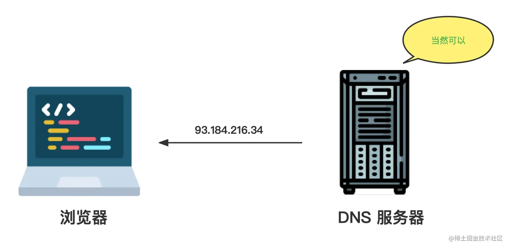​

在这个最初的查询之后，IP 地址可能会被缓存一段时间，所以下次访问同一个网站会更快，因为不需要进行 DNS 查询（记住，DNS 查询只发生在我们第一次访问一个网站时）。

## TCP (Transmission Control Protocol) 握手

一旦浏览器知道了网站的 IP 地址，它将尝试通过 TCP 三次握手（也称为 SYN-SYN-ACK，或者更准确的说是 SYN、SYN-ACK、ACK，因为 TCP 有三个消息传输，用于协商和启动两台计算机之间的 TCP 会话），与持有资源的服务器建立连接。

> TCP 是传输控制协议的缩写，是一种通信标准，使应用程序和计算设备能够在网络上交换信息。它被设计用来在互联网上发送数据包，并确保数据和信息在网络上成功传递。

TCP 握手是一种机制，旨在让两个想要相互传递信息的实体（在我们的例子中是浏览器和服务器）在传输数据之前协商好连接的参数。

因此，如果浏览器和服务器是两个人，他们之间的对话会是这样的：

​​

浏览器向服务器发送一个 **SYNC** 消息，要求进行同步（同步意味着连接）

​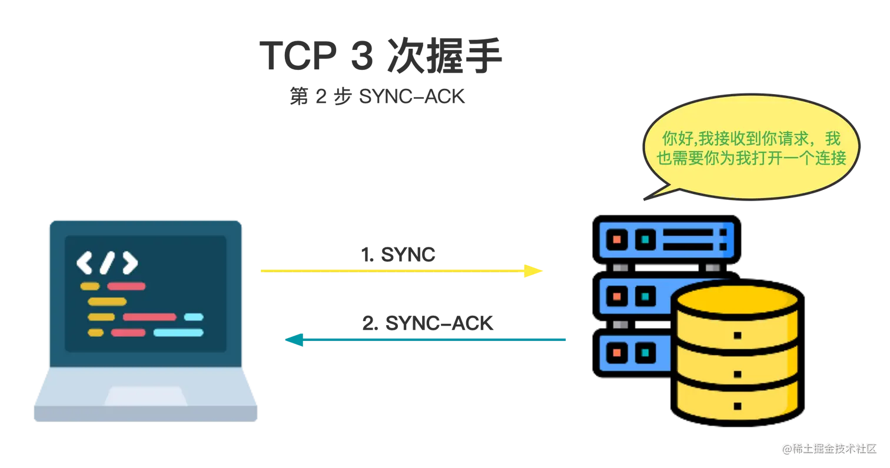​

然后，服务器将回复一个 **SYNC-ACK** 消息（ SYNChronization 和 ACKnowledgement）

​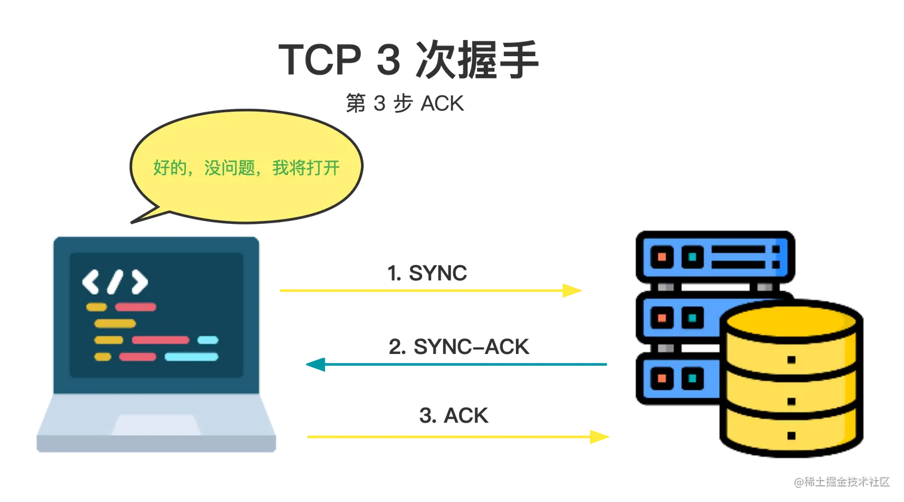​

在最后一步，浏览器将回复一个 **ACK** 信息

现在，TCP 连接（双向连接）已经通过 3 次握手建立，TLS 协商可以开始。

## TLS 协商

对于通过 HTTPS 建立的安全连接，需要进行另一次握手。这种握手（TLS 协商）决定了哪个密码将被用于加密通信，验证服务器，并在开始实际的数据传输之前建立一个安全的连接。

> 传输层安全（TLS）是现已废弃的安全套接字层（SSL）的继任者，是一种加密协议，旨在通过计算机网络提供通信安全。该协议被广泛用于电子邮件和即时通讯等应用，但它在确保 HTTPS 安全方面的应用仍然是最公开的。由于应用程序可以使用或不使用 TLS（或 SSL）进行通信，因此客户（浏览器）有必要要求服务器建立 TLS 连接。

​​

在这一步骤中，浏览器和服务器之间还交换了一些信息

1. **客户端 hello**。浏览器向服务器发送一条信息，其中包括它所支持的 TLS 版本和密码套件，以及一串随机字节，称为 `客户端随机数`​。
2. **服务器 hello 和证书**。服务器发回一条信息，其中包括服务器的 SSL 证书、服务器选择的密码套件和`服务器随机数`​，这是服务器生成的另一个随机字节串。
3. **认证**。浏览器会向颁发证书的机构核实服务器的 SSL 证书。这样，浏览器就可以确定服务器就是它所说的那个人。
4. **预主密码**。浏览器会再发送一串随机的字节，称为主密钥，用浏览器从服务器的 `SSL 证书`​上获取的`公钥`​进行加密。主密码只能由服务器用`私钥`​解密。
5. **使用私钥**。服务器解密`预主密码`​。
6. **创建会话密钥**。浏览器和服务器从客户端随机数、服务器随机数和预主密码中生成会话密钥。
7. **客户端完成**。浏览器向服务器发送一个消息，说它已经完成。
8. **服务器完成**。服务器向浏览器发送一个消息，表示它也完成了。
9. **安全对称加密实现**。握手完成，通信可以继续使用会话密钥。

现在可以开始从服务器请求和接收数据了

# 2. 获取数据

在上一节中，我们谈到了`导航`​，这是浏览器显示网站的第一步。现在，我们将进入下一个步骤，看看如何`获取资源`​。

## **HTTP 请求**

在我们与服务器建立安全连接后，浏览器将发送一个初始的 HTTP GET 请求。首先，浏览器将请求页面的 HTML 文件。它将使用 HTTP 协议来做这件事。

> HTTP（超文本传输协议）是一个获取资源的协议，如 HTML 文件。它是网络上任何数据交换的基础，它是一个客户 - 服务器协议，这意味着请求是由接收者发起的，通常是网络浏览器。

​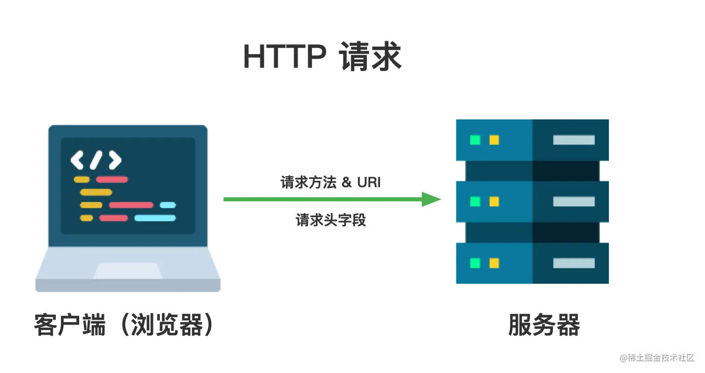​

**请求方法 -**  POST, GET, PUT, PATCH, DELETE 等

**URI -**  是统一资源识别符的缩写。URIs 用于识别互联网上的抽象或物理资源，如网站或电子邮件地址等资源。一个 URI 最多可以有 5 个部分

scheme：用于说明使用的是什么协议

authority：用于识别域名

path：用于显示资源的确切路径

query：用于表示一个请求动作

fragment：用来指代资源的一部分

```
// URI parts
scheme :// authority path ? query # fragment

//URI example
<https://example.com/users/user?name=Alice#address>

https: // scheme name
example.com // authority
users/user // path
name=Alice // query
address // fragment


```

**HTTP 头字段 -**  是浏览器和服务器在每个 HTTP 请求和响应中发送和接收的字符串列表（它们通常对终端用户是不可见的）。在请求的情况下，它们包含关于要获取的资源或请求资源的浏览器的更多信息。

如果你想看看这些请求头字段是什么样子的，请进入 Chrome 浏览器并打开开发者工具（F12）。进入 **Network** 标签，选择 `FETCH/XHR`​。在下面的屏幕截图中，我刚刚在搜索引擎上搜索了`Palm Springs`​，这就是请求头的样子。

​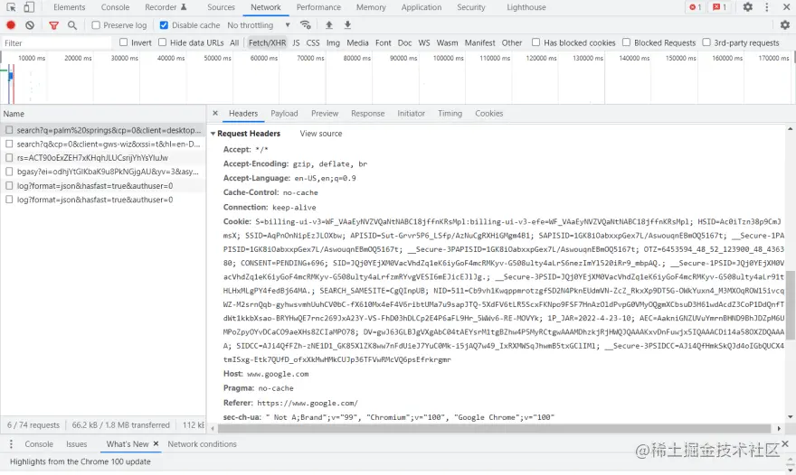​

## **HTTP 响应**

一旦服务器收到请求，它将对其进行处理并回复一个 `HTTP 响应`​。在响应的正文中，我们可以找到所有相关的响应头和我们请求的 HTML 文档的内容

​​

**状态代码 -**  例如：200、400、401、504 网关超时等（我们的目标是 200 状态代码，因为它告诉我们一切正常，请求是成功的）

**响应头字段 -**  保存关于响应的额外信息，如它的位置或提供它的服务器。

一个 **HTML** 文档的例子可以是这样的

```
<!doctype HTML>
<html>
 <head>
  <meta charset="UTF-8">
    <meta name="viewport" content="width=device-width, initial-scale=1.0">
  <meta http-equiv="X-UA-Compatible" content="ie=edge">
  <title>我的页面</title>
  <link rel="stylesheet" src="styles.css"/>
  <script src="mainScripts.js"></script>
</head>
<body>
  <h1 class="heading">这个是我的页面</h1>
  <p>一个段落和一个 <a href="<https://example.com/about>">链接</a></p>
  <div>
    
  </div>
  <script src="sideEffectsScripts.js"></script>
</body>
</html>


```

对于我前面提到的同一个搜索，响应头是这样的

​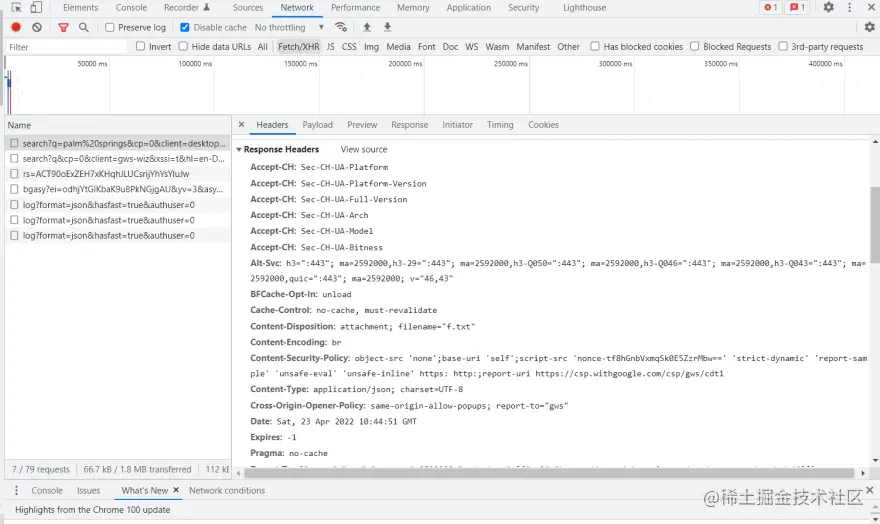​

如果我们看一下 HTML 文档，我们会发现它引用了不同的 CSS 和 Javascript 文件。这些文件不会被请求。在这个时候，只有 HTML 被请求并从服务器接收。

这个初始请求的响应包含收到的第一个字节的数据。第一个字节的时间（TTFB）是指从用户提出请求（在地址栏中输入网站名称）到收到第一个 HTML 数据包（通常为 14kb）的时间。

## TCP 慢启动和拥塞算法

​`TCP 慢启动`​ 是一种平衡网络连接速度的算法。 第一个数据包将是 14kb（或更小），其工作方式是逐渐增加传输的数据量，直到达到预定的阈值。 从服务器接收到每个数据包后，客户端以 `ACK 消息`​响应。 由于连接容量有限，如果服务器发送太多数据包太快，它们将被丢弃。 客户端不会发送任何 ACK 消息，因此服务器会将此解释为拥塞。 这就是`拥塞算法`​发挥作用的地方。 他们监控发送的数据包和 ACK 消息的流，以确定流量的最佳速率并创建稳定的流量流。

# 3.HTML 解析

到目前为止，我们讨论了导航和数据获取。 今天我们将讨论解析，特别是 `HTML 解析`​。

我们看到在向服务器发出初始请求后，浏览器如何收到包含我们尝试访问的网页的 HTML 资源（第一块数据）的响应。 现在浏览器的工作就是开始解析数据。

> 解析是指将程序分析并转换为运行时环境实际可以运行的内部格式

换句话说，解析意味着将我们编写的代码作为文本（HTML、CSS）并将其转换为浏览器可以使用的内容。 解析将由浏览器引擎完成（不要与浏览器的 Javascript 引擎混淆）。

浏览器引擎是每个主要浏览器的核心组件，它的主要作用是结合结构 (HTML) 和样式 (CSS)，以便它可以在我们的屏幕上绘制网页。 它还负责找出哪些代码片段是交互式的。 我们不应将其视为一个单独的软件，而应将其视为更大软件（在我们的例子中为浏览器）的一部分。

有许多浏览器引擎，但大多数浏览器使用这三个活跃且完整引擎之一：

**Gecko** 它是由 Mozilla 为 Firefox 开发的。 过去，它曾为其他几种浏览器提供支持，但目前，除了 Firefox，Tor 和 Waterfox 是唯一仍在使用 Gecko 的浏览器。 它是用 C++ 和 JavaScript 编写的，自 2016 年起，还用 Rust 编写。

**WebKit** 它主要由 Apple 为 Safari 开发。 它还为 GNOME Web (Epiphany) 和 Otter 提供支持。 （令人惊讶的是，在 iOS 上，包括 Firefox 和 Chrome 在内的所有浏览器也由 WebKit 提供支持）。 它是用 C++ 编写的。

**Blink，Chromium 的一部分** 它最初是 WebKit 的一个分支，主要由 Google 为 Chrome 开发。 它还为 Edge、Brave、Silk、Vivaldi、Opera 和大多数其他浏览器项目（一些通过 QtWebEngine）提供支持。 它是用 C++ 编写的。

现在我们了解了谁将进行解析，让我们看看在从服务器接收到第一个 HTML 文档后到底发生了什么。 让我们假设文档如下所示：

```
<!doctype HTML>
<html>
 <head>
  <title>This is my page</title>
  <meta charset="UTF-8">
  <meta name="viewport" content="width=device-width, initial-scale=1.0">
</head>
<body>
  <h1>This is my page</h1>
  <h3>This is a H3 header.</h3>
  <p>This is a paragraph.</p>
  <p>This is another paragraph,</p>
</body>
</html>


```

即使请求页面的 HTML 大于初始的 14KB 数据包，浏览器也会开始解析并尝试根据其拥有的数据呈现体验。 HTML 解析涉及两个步骤：**词法分析** 和 **树构造**（构建称为 DOM 树的东西）。

## **词法分析**

> 它将一些输入转换为标签（源代码的基本组件）。 想象一下，我们将一段英文文本分解成单词，其中单词就是标签。

词法分析过程结束时的结果是一系列 0 个或多个以下标签：DOCTYPE、开始标签 (`<tag>`​)、结束标签 (`</tag>`​)、自闭合标签 (`<tag/>`​) 、属性名称、值、注释、字符、文件结尾或元素中的纯文本内容。

​​

## **构建 DOM**

创建第一个 token 后，`树构建`​开始。 这实质上是基于先前解析的标签创建`树状结构`​（称为文档对象模型）。

DOM 树描述了 HTML 文档的内容。 `<html>`​ 元素是文档树的第一个标签和根节点。 树反映了不同标签之间的关系和层次结构。 我们有`父节点`​，嵌套在其他标签中的标签是`子节点`​。 节点数越多，构建 DOM 树所需的时间就越长。 下面是我们从服务器获得的 HTML 文档示例的 DOM 树：

​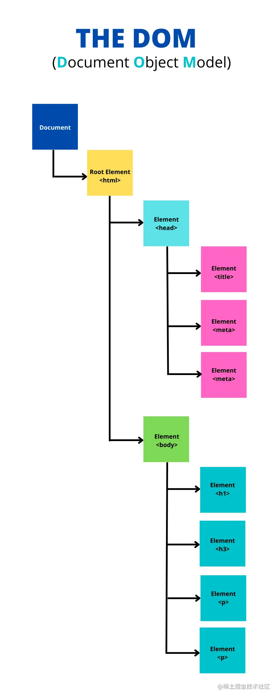​

实际上，DOM 比我们在该模式中看到的更复杂，但我保持简单以便更好地理解（另外，我们将在以后的文章中更详细地讨论 DOM 及其重要性）。

此构建阶段是`可重入的`​，这意味着在处理一个 token 时，分词器可能会恢复，导致在第一个 token 处理完成之前触发并处理更多 token。 从字节到创建 DOM，整个过程如下所示：

​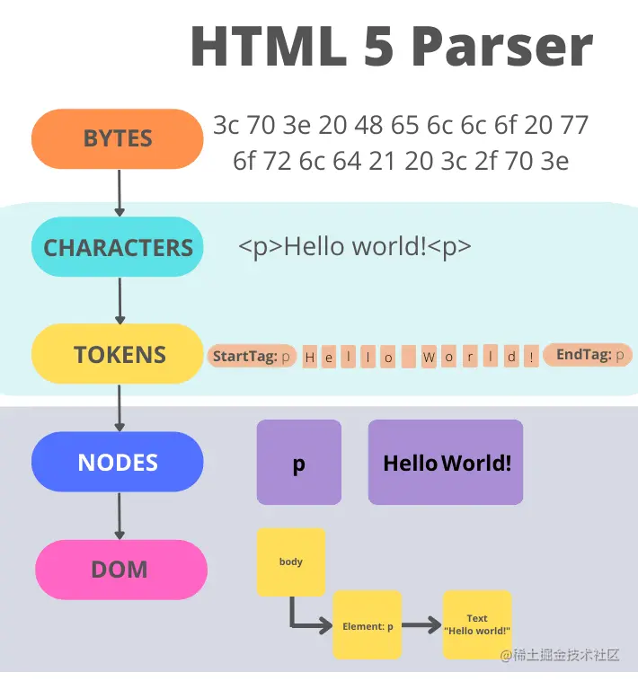​

解析器从上到下逐行工作。 当解析器遇到非阻塞资源（例如图像）时，浏览器会向服务器请求这些图像并继续解析。 另一方面，如果它遇到阻塞资源（CSS 样式表、在 HTML 的 `<head>`​ 部分添加的 Javascrpt 文件或从 CDN 添加的字体），解析器将停止执行，直到所有这些阻塞资源都被下载。 这就是为什么，如果你正在使用 Javascript，建议在 HTML 文件的末尾添加 `<script>`​ 标签，或者如果你想将它们保留在 `<head>`​ 标签中，你应该向它们添加 defer 或 async 属性（ async 允许在下载脚本后立即执行异步操作，而 defer 只允许在整个文档被解析后执行。）。

## 预加载器 & 使页面更快

Internet Explorer、WebKit 和 Mozilla 都在 2008 年实现了预加载器，作为处理阻塞资源的一种方式，尤其是脚本（我们之前说过，当遇到脚本标签时，HTML 解析将停止，直到脚本被下载并执行）。

使用预加载器，当浏览器卡在脚本上时，第二个较轻的解析器会扫描 HTML 以查找需要检索的资源（样式表、脚本等）。 然后预加载器开始在后台检索这些资源，目的是在主 HTML 解析器到达它们时它们可能已经被下载（如果这些资源已经被缓存，则跳过此步骤）。

# 4. 解析 CSS

解析完 HTML 之后，就该解析 CSS（在外部 CSS 文件和样式元素中找到）并构建 CSSOM 树（CSS 对象模型）。

当浏览器遇到 CSS 样式表时，无论是外部样式表还是嵌入式样式表，它都需要将文本解析为可用于设置布局样式的内容。 浏览器将 CSS 变成的数据结构称为 CSSOM。 DOM 和 CSSOM 遵循相似的概念，因为它们都是树，但它们是`不同的数据结构`​。 就像从我们的 HTML 构建 DOM 一样，从 CSS 构建 CSSOM 被认为是一个「渲染阻塞 」过程。

## 词法分析和构建 CSSOM

与 HTML 解析类似，CSS 解析从词法分析开始。 CSS 解析器获取字节并将它们转换为字符，然后是标签，然后是节点，最后它们被链接到 CSSOM 中。 浏览器会执行一些称为`选择器匹配`​的操作，这意味着每组样式都将与页面上的所有节点（元素）匹配。

​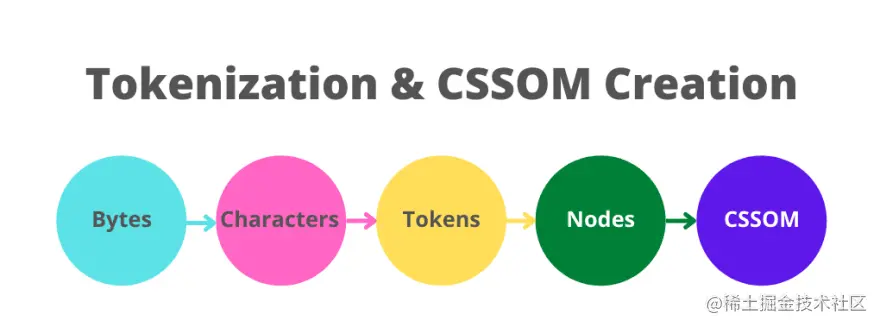​

浏览器从适用于节点的最通用规则开始（例如：如果节点是 body 元素的子节点，则所有 body 样式都由该节点继承），然后通过应用更具体的规则递归地优化计算出的样式。 这就是为什么我们说样式规则是级联的。

假设我们有下面的 HTML 和 CSS：

```
body {
  font-size: 16px;
  color: white;
} 

h1 {
  font-size: 32px;
}

section {
  color: tomato;
}

section .mainTitle {
  margin-left: 5px
}

div {
  font-size: 20px;
}

div p {
  font-size:  8px;
  color: yellow;
}


```

这段代码的 CSSOM 看起来像这样：

​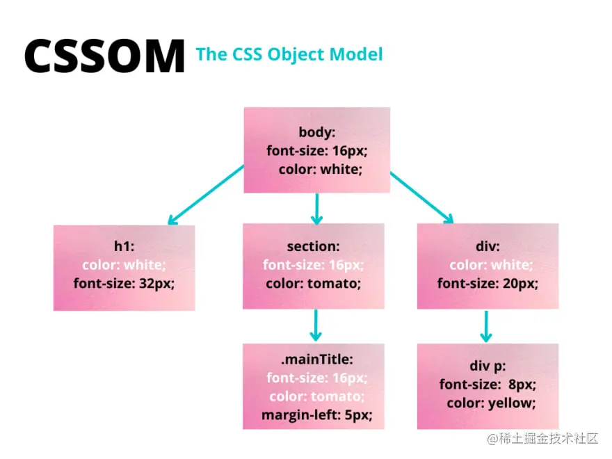​

请注意，在上面的模式中，嵌套元素既有`继承的样式`​（来自父级 - 例如：h1 从 body 继承其颜色，section 从 body 继承其字体大小）和它们自己的样式（可以覆盖继承的规则 是否来自父节点 - 例如：p 覆盖了从 div 继承的颜色和字体大小，而 mainTitle 没有从父节点获得其左边距）。

由于我们的 CSS 可以有多个来源，并且它们可以包含适用于同一节点的规则，因此浏览器必须决定最终应用哪个规则。 这就是`优先级`​发挥作用的时候，如果您想了解更多相关信息，可以访问此[页面](https://link.juejin.cn?target=https%3A%2F%2Fdeveloper.mozilla.org%2Fzh-CN%2Fdocs%2FWeb%2FCSS%2FSpecificity "https://developer.mozilla.org/zh-CN/docs/Web/CSS/Specificity")。

想象一下，您在机场寻找您的朋友 John。 如果你想通过喊他的名字找到他，你可以喊 “John”。 可能不止一个 John 会同时出现在机场，所以他们可能都会做出回应。 更好的方法是用他的全名打电话给你的朋友，这样当你喊 “John Doe” 时，你就有更好的机会找到他，因为 “ John Doe ” 比“ John ”更具体。

同样，假设我们有这个元素：

```
<p>
  <a href="<https://dev.to/>">This is just a link!</a>
</p>


```

以及这些 CSS 样式：

```
a {
   color: red;
}

p  a {
   color: blue;
}


```

您认为浏览器会应用哪条规则？ 答案是第二条规则，因为 p 标签中的所有 a 标签选择器比所有 a 标签选择器都具有更高的优先级。 如果你想玩玩优先级，你可以使用这个 [优先级计算器](https://link.juejin.cn?target=https%3A%2F%2Fspecificity.keegan.st%2F "https://specificity.keegan.st/")。

## **重点**

CSS 规则是从右到左阅读的，这意味着如果我们有这样的代码： `section p { color: blue; }`​, 浏览器将首先查找页面上的所有 p 标签，然后它会查看这些 p 标签中是否有一个 section 标签作为父标签。 如果查找能够命中，它将应用这个 CSS 规则

# 5. 执行 Javascript

在解析 CSS 并创建 CSSOM 的同时，还会下载其他资产，包括 JavaScript 文件。 这要归功于我们在之前文章中提到的预加载器。

> 预加载器就像一个解析器，它在主解析器处理 HTML 代码时扫描 HTML 文件。 它的作用是查找样式表、脚本或图片（也需要从服务器检索）等资源并请求它们。 希望在解析 HTML 时，这些资源已经下载并准备好进行处理。

所以，当我们从服务器获取 Javascript 文件后，代码被解释、编译、解析和执行。 计算机无法理解 Javascript 代码，只有浏览器可以。 JS 代码需要被翻译成计算机可以使用的东西，这是 Javascript 浏览器引擎的工作（不要与浏览器引擎混淆）。 根据浏览器的不同，JS 引擎可以有不同的名称和不同的工作方式。

## Javascript 引擎

javascript 引擎（有时也称为 ECMAScript 引擎）是一种在浏览器中执行（运行）Javascript 代码的软件，而不仅仅是零部件（例如，V8 引擎是 Node.js 环境的核心组件）。

JavaScript 引擎通常由 Web 浏览器供应商开发，每个主要浏览器都有一个。 我们说过，目前使用最多的浏览器是 Chrome、Safari、Edge 和 Firefox。 每个都使用不同的 Javascript 引擎，它们是：

**V8** V8 是 Google 的高性能 JavaScript 引擎。 它是用 C++ 编写的，用于 Chrome 和 Node.js 等。 它实现了 ECMAScript（一种 JavaScript 标准，旨在确保网页在不同 Web 浏览器之间的互操作性）和 WebAssembley。 它实现了 ECMA-262。

**JavaScriptCore** JavaScriptCore 是 WebKit 的内置 JavaScript 引擎，它为 Safari 浏览器、邮件和 macOS 上使用的其他应用程序提供支持。 它目前按照 ECMA-262 规范实现 ECMAScript。 它也被称为 SquirrelFish 或 SquirrelFish Extreme。

**Chakra** Chakra 是微软为其 Microsoft Edge 网络浏览器和其他 Windows 应用程序开发的 Javascript 引擎。 它实现了 ECMAScript 5.1，并且对 ECMAScript 6 有部分（不断增加的）支持。它是用 C++ 编写的。

**SpiderMonkey** SpiderMonkey 是 Mozilla 的 Javascript 和 WebAssembly 引擎。 它是用 C++、Javascript 和 Rust 编写的，用于为 Firefox、Servo 和其他项目提供支持。

一开始，Javascript 引擎只是简单的解释器。 我们今天使用的现代浏览器能够执行称为即时 (JIT) 编译的功能，这是编译和解释的混合体。

**编译**

在编译过程中，一个称为`编译器`​的软件将用高级语言编写的代码一次性转换为机器代码。 创建一个`目标文件`​，该文件可以在任何机器上运行。 采取这些步骤后，就可以执行代码了。

​​

**解释**

在解释过程中，解释器逐行检查 Javascript 代码并立即执行。 没有进行编译，因此没有创建目标代码（代码的输出由解释器本身使用其内部机制创建）。 旧版本的 Javascript 使用这种类型的代码执行。

​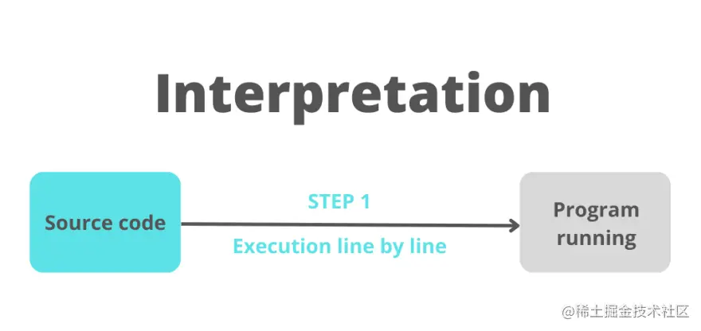​

**即时编译 (**  JIT Compilation  **)**

即时编译是给定语言的解释器的一个特性，它试图同时利用编译和解释。 是在纯编译期间，代码是在执行之前被编译，然而在 JIT 编译中，代码在执行时（在运行时）被编译。 所以我们可以说源代码是动态转换为机器代码的。 较新版本的 Javascript 使用这种类型的代码执行。

​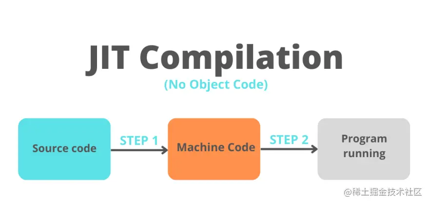​

JIT 编译的一个很重要的方面就是将源代码编译成当前正在运行的机器的机器码指令。 这意味着生成的机器代码是针对正在运行的机器的 CPU 架构进行了优化。

简而言之，这三个过程可以总结为：

* 编译器：编译代码
* 解释器：运行代码
* JIT 编译器：在运行代码时进行编译

今天，`编译`​和`解释`​这两个术语之间的界限已经变得非常模糊，因此这个主题可以进行广泛的辩论。 如果你想了解更多关于这些过程的信息，你可以阅读这篇关于 [Mozilla Hacks for starters](https://link.juejin.cn?target=https%3A%2F%2Fhacks.mozilla.org%2F2017%2F02%2Fa-crash-course-in-just-in-time-jit-compilers%2F "https://hacks.mozilla.org/2017/02/a-crash-course-in-just-in-time-jit-compilers/") 的文章。

请注意，我提到了旧版本和新版本的 Javascript。 不支持较新版本语言的浏览器将解释代码，而支持的浏览器将使用某些版本的 JIT 来执行代码（V8、Chakra JavaScriptCore 和 SpiderMonkey 引擎都使用 JIT）。 事实上，尽管 Javascript 是一种解释型语言（它不需要编译），但如今大多数浏览器都会使用 JIT 编译来运行代码，而不是纯粹的解释型语言。

## Javascript 代码是如何处理的

当 Javascript 代码进入 Javascript 引擎时，它首先被解析。 这意味着代码被读取，并且在这种情况下，代码被转换为称为`抽象语法树`​ (AST) 的数据结构。 代码将被拆分成与语言相关的部分（如 `function`​ 或 `const`​ 关键字），然后所有这些部分将构建抽象语法树。

假设我们有一个文件，其中包含一个只做一件事的程序，那就是定义一个变量：

```
const age = 25;


```

这就是这行非常简单的代码看起来像抽象语法树的方式（我正在使用 @babel/parser-7.16.12）：

​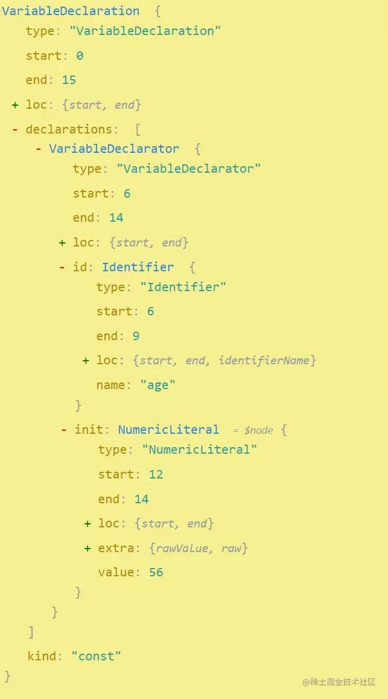​

如果你想将一些 Javascript 转换为抽象语法树，你可以使用这个[工具](https://link.juejin.cn?target=https%3A%2F%2Fastexplorer.net%2F "https://astexplorer.net/")。 编写变量后得到的 AST 实际上要大得多，在屏幕截图中隐藏了更多节点。

构建 AST 后，它会被翻译成机器代码并立即执行，因为现代 Javascript 使用即时编译。 这段代码的执行将由 Javascript 引擎完成，利用称为 “调用堆栈” 的东西。

> 调用堆栈是解释器（如 Web 浏览器中的 JavaScript 解释器）跟踪其在调用多个函数的脚本中的位置的机制——当前正在运行的函数以及从该函数中调用的函数等。

# 6. 创建可访问（无障碍）树

除了我们一直在讨论的所有这些树（DOM、CSSOM 和 AST）之外，浏览器还构建了一种称为`可访问（无障碍）树`​的东西。

> Web 开发中的可访问性（通常缩写为 A11y — 如 “a”，然后是 11 个字符，然后是 “y”）意味着让尽可能多的人能够使用网站，即使这些人的能力在某种程度上受到限制。 对很多人来说，技术让事情变得更容易。 对于残障人士，技术使事情成为可能。 可访问性意味着开发尽可能易于访问的内容，无论个人的身体和认知能力以及他们如何访问网络 (ACT)。

一般而言，残疾用户可以并且确实在使用具有各种辅助技术的网页。 他们使用屏幕阅读器、放大镜、眼动追踪、语音命令等。 为了让这些技术发挥作用，它们需要能够访问页面的内容。 由于他们无法直接读取 DOM，因此 ACT 开始发挥作用。

可访问性树是使用 DOM 构建的，稍后辅助设备将使用它来解析和解释我们正在访问的网页的内容。 ACT 就像 DOM 的语义版本，每次 DOM 更新时它都会更新。 每个需要暴露给辅助技术的 DOM 元素都会在 ACT 中有一个对应节点。 在未构建 ACT 之前，屏幕阅读器无法访问内容。

​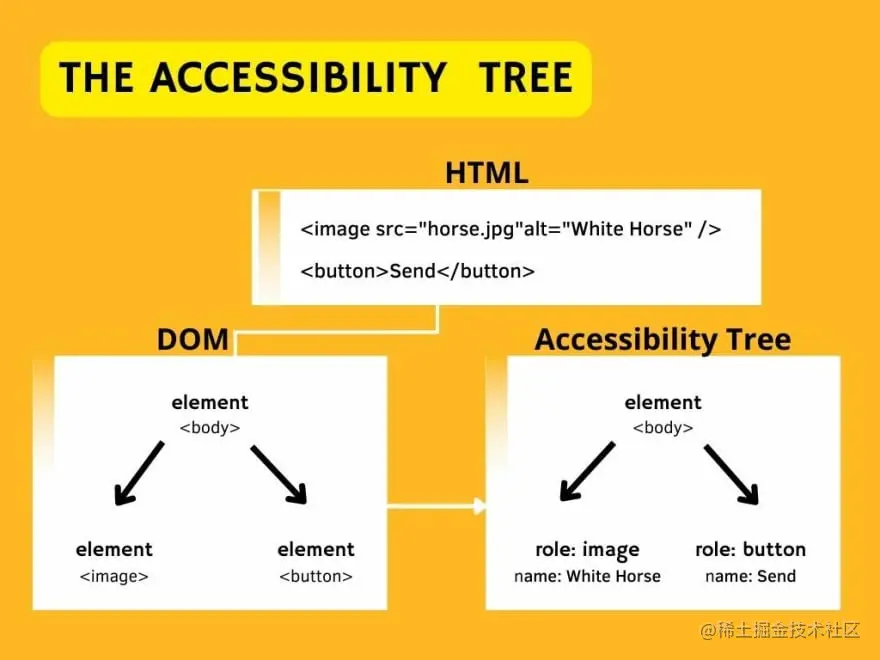​

要查看可访问性树的实际的样子，您可以通过 Google Chrome 浏览器。 打开调试器 (F12) 并转到 “元素” 选项卡。 从那里，你可以在右侧选择 “辅助功能” 窗格。

​​

我去 Google 并检查了搜索输入，这是我在 “计算” 属性下的 “辅助功能” 窗格中得到的：

​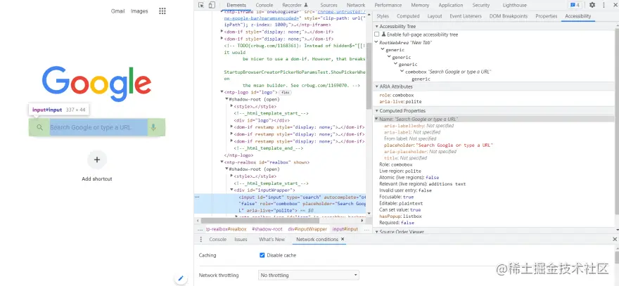​

使用语义 HTML 的重要性超出了本文的范围，但作为开发人员，我们都应该记住，我们构建的网站应该可供所有希望使用它们的人使用。 如果您想阅读有关该主题的更多信息，可以在[此处](https://link.juejin.cn?target=https%3A%2F%2Fwww.w3.org%2FWAI%2Ffundamentals%2Faccessibility-intro%2Fzh-hans "https://www.w3.org/WAI/fundamentals/accessibility-intro/zh-hans")找到一篇关于 Web 可访问性的很好的介绍性文章。 据[互联网协会无障碍访问特别兴趣小组](https://link.juejin.cn?target=https%3A%2F%2Fwww.a11ysig.org%2F "https://www.a11ysig.org/")称，目前全世界有超过 13 亿人（约占世界人口的 15%）患有某种形式的残疾。

# 7. 渲染树

在解析阶段构建的树（DOM、CSSOM）被组合成一种叫做`渲染树`​的东西。 这用于计算最终将绘制到屏幕上的所有可见元素的布局。 渲染树的目的是确保页面内容以正确的顺序绘制元素。 它将作为在屏幕上显示像素的绘画过程的输入。

DOM 和 CSSOM 是使用 HTML 和 CSS 文件创建的。 这两个文件包含不同类型的信息，树的结构也不同，那么渲染树是如何创建的呢？

## 结合 DOM 和 CSSOM

* 浏览器将开始在 `DOM 树的根部`​施展魔法并遍历每个可见节点。 一些节点，如脚本或元标记是不可见的，因此它们被忽略。 还有一些节点会被 CSS 隐藏（例如 `display: "none"`​ 属性），它们也会被忽略。 我们只对可见节点感兴趣，因为只有它们对屏幕上的输入有影响。
* 对于在 DOM 中找到的每个可见节点，将在 CSSOM 中找到相应的规则并应用它们。

以上步骤的结果将是一个包含所有可见节点、内容和样式的`渲染树`​。

​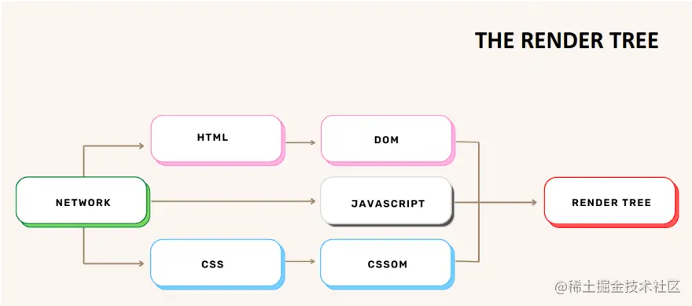​

## 布局（回流）阶段

渲染树包含有关显示哪些节点及其计算样式的信息，但不包含每个节点的尺寸或位置。

接下来需要做的是计算这些节点在设备视口（浏览器窗口内）内的确切位置及其大小。 这个阶段称为布局（在 Chrome、Opera、Safari 和 Internet Explorer 中）或重排（在 Firefox 中），但它们的意思相同。 浏览器在渲染树的根部开始这个过程并遍历它。

​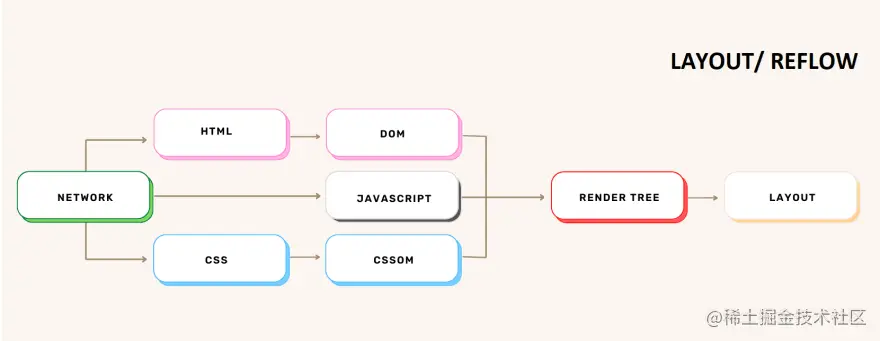​

回流步骤不会只发生一次，而是每次我们更改 DOM 中影响页面布局的某些内容时，即使是部分更改，都会触发回流。 重新计算元素位置的情况示例如下：

* 在 DOM 中添加或删除元素
* 调整浏览器窗口大小
* 更改元素的宽度、位置或使其浮动

让我们来看一个非常基本的 HTML 示例，其中内嵌了一些 CSS：

```
<!DOCTYPE html>
<html>
  <head>
    <meta name="viewport" content="width=device-width,initial-scale=1" />
    <title>Reflow</title>
  </head>
  <body>
    <div style="width: 100%; height: 50%">
      <div style="width: 50%; height: 50%">This is the reflow stage!</div>
    </div>
  </body>
</html>


```

上面的代码只是说在视口内我们应该有两个 div，其中第二个嵌套在第一个里面。 父 div 占据视口宽度的 100% 和高度的 50%。第二个 div 占据父 div 的 50% 这看起来像这样：

​​

这个过程的输出是一个`类似盒子的模型`​，它准确地捕获了每个元素需要在屏幕上的位置及其大小。 完成此步骤后，输出就可以传递到下一步，称为`绘画阶段`​。

## 绘画（重绘）阶段

在浏览器决定哪些节点需要可见并计算出它们在视口中的位置后，就可以在屏幕上绘制它们（渲染像素）了。 这个阶段也被称为`光栅化阶段`​，浏览器将在布局阶段计算的每个盒子转换为屏幕上的实际像素。

​​

就像布局阶段一样，绘画阶段不会只发生一次，而是每次我们改变屏幕上元素的外观时。 这些情况的例子是：

* 改变元素的轮廓
* 改变背景颜色
* 改变不透明度或可见性

绘画意味着浏览器需要将元素的每个视觉部分绘制到屏幕上，包括文本、颜色、边框、阴影和替换元素（如按钮和图像），并且需要超快地完成。 为了确保重绘可以比初始绘制更快地完成，屏幕上的绘图通常被分解成几层。 如果发生这种情况，则需要进行合成。

## 分层和合成

传统意义上，网络浏览器完全依赖 CPU 来呈现网页内容。 但现在即使是最小的设备也有高性能的 GPU，所有大部分实现方案都围绕着 GPU 来寻求更好的体验。

​​

> 合成是一种将页面的各个部分分成层的技术，分别绘制它们并在称为合成器线程的单独线程中合成为页面。 当文档的各个部分绘制在不同的层中并相互重叠时，合成是必要的，以确保它们以正确的顺序绘制到屏幕上并且内容被正确呈现。

通常，只有特定的任务会被重定向到 GPU，而这些任务可以由合成器线程单独处理。

为了找出哪些元素需要在哪一层，主线程遍历布局树并创建层树。 默认情况下，只有一层（这些层的实现方式因浏览器而异），但我们可以找到会触发重绘的元素，并为每个元素创建一个单独的层。 这样，重绘不应应用于整个页面，而且此过程将可以使用到 GPU

​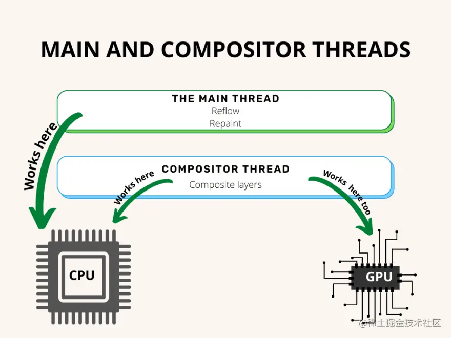​

如果我们想向浏览器提示某些元素应该在一个单独的层上，我们可以使用 `will-change`​ CSS 属性。 实际上有一些特定的属性和元素表示新层的创建。 其中一些是 `<video>`​、`<canvas>`​ 和任何具有 CSS `opacity`​ 属性、3D `transform`​、`will-change`​ 和其他一些属性的元素。 这些节点连同它们的后代将被绘制到它们自己的图层上。

## 谨记

上面讨论的两种操作，回流和重绘，都是昂贵的，尤其是在像手机这样处理能力低的设备上。 这就是为什么在处理 DOM 更改时我们应该尝试优化它们（我将在我的 DOM 系列的未来一篇文章中详细讨论这一点）。 有些动作只会触发重绘，有些动作会同时触发回流和重绘。

# 总结

以上包含了浏览器的核心工作原理，希望对正在学习前端的你有所帮助。当然，这并不是所有的内容，后续我还会一直更新这篇文章，从更多方面去探讨浏览器的工作原理。最后感谢大家对本文的支持～欢迎点赞收藏，在评论区留下你的高见 🌹🌹🌹

> 本文为翻译文，[原文地址](https://link.juejin.cn?target=https%3A%2F%2Fdev.to%2Farikaturika%2Fhow-web-browsers-work-part-1-with-illustrations-1nid "https://dev.to/arikaturika/how-web-browsers-work-part-1-with-illustrations-1nid")

# 联系作者

​​
