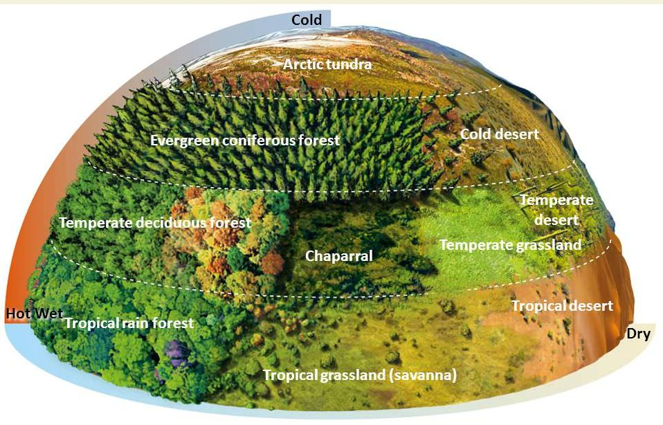
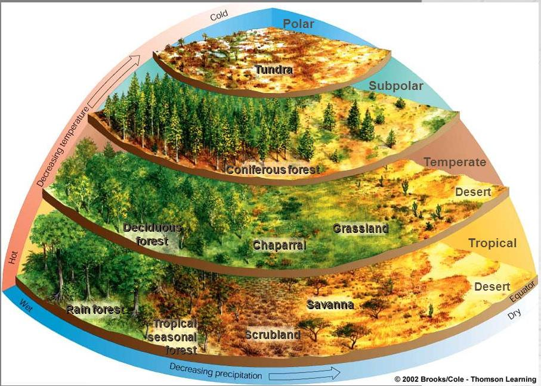

### 生物群落图

​​

​​

### [Simplified Fantasy Map Guide](https://homebrewery.naturalcrit.com/share/H1W1oVKvNm)

[基础地质知识](https://www.reddit.com/r/worldbuilding/comments/1atjp8/i_think_yall_guys_could_profit_from_a_little/)

https://mythcreants.com/blog/how-to-color-your-map-using-science/

https://citybuildingcrashcourse.wordpress.com

‍

https://archive.org/details/principlesofcart0000rais/page/n9/mode/2up 老地图绘制

https://bookauthority.org/books/best-cartography-books  制图学书籍
