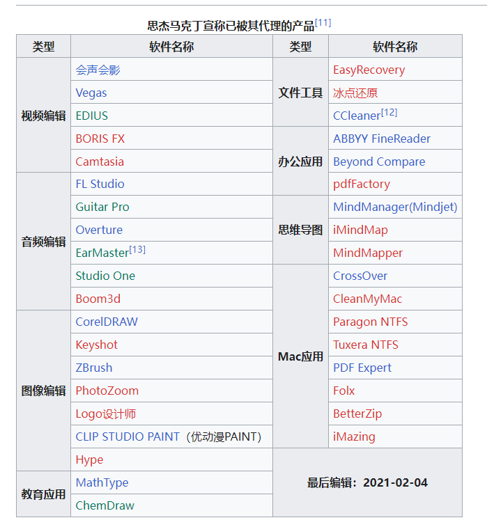

## GIS：

* Arcgis：推荐试试ArcgisPro，不过现在实习应该也会教吧，如果还是ArcgisDesktop的话，建议试试新的，毕竟新的制图好看。
* QGIS：制图实际比Arcgis强，但是分析差的挺远的，可以试试。

## 遥感：

* Envi：没啥好说的，除了这个就是erdas，这两实习用啥你就学啥，差不多
* Erdas：同上

## 比较工具

不要用BeyondCompare，网上下的全是假的，而且有很多钓鱼网站。想知道的自己看下[思杰马克丁](https://www.sohu.com/a/343227431_120166973)，正版的最好也别买。

* [meld](https://meldmerge.org)

* [Diffinity](https://www.truehumandesign.se/s_diffinity.php)

* [WinMerge](https://winmerge.org/downloads/?lang=zh_cn):可加插件比较word之类的,比较方便,下面界面不一样,自己摸一下吧。算是比较好的替代品了。

## 白板

[excalidraw](https://excalidraw.com) 这东西好就好在上网就能用，比画图简单方便

[Scapple](https://www.literatureandlatte.com/scapple/overview)：这个是收费软件，不贵，是一个简单的线索板，挺好用的

## 硬件工具箱

[图吧工具箱](https://www.tbtool.cn)：硬件该有的监测软件基本都有

## 卸载

[Geek](https://geekuninstaller.com) 干净，快

## 网络分析

[wireshark](https://www.wireshark.org) 其实大部分时候F12可以,但是必要的时候还是上wireshark吧，具体使用可以参见：["wireshark 简明教程"](./推荐软件/wireshark%20简明教程，新手专用，挑实在的讲，不搞花里胡哨_51CTO%20博客_wireshark%20详细教程.md)

## 视频转码

[HandBrake](https://handbrake.fr) 视频压缩转码用的

## 看图

[Picview](https://picview.org) Picview，轻量级，可用，其实直接扔qgis里也能看图，太麻烦了。

[PureRef](https://www.pureref.com)  本来是用于设计师贴参考图之类用的，不过正常当作高级的图片剪切板也挺好用的

## 文本编辑器

vscode：万能工具

everedit：该有的功能都有，可以买，也可以白嫖，反正挺好用的

cudatext：同上，但是开源的

notepad3：没有多标签页，但是可以直接替换windows记事本，还是挺爽的，方便

## 远程

[MobaXterm](https://mobaxterm.mobatek.net)：免费的ssh软件，挺好用的，xShell我知道好用，但是不能商用，要钱的。

[TightVNC](https://www.tightvnc.com/download.phpk:%22MCFvdmVydmlldyFvdmVydmlldyE2MWIxOTQ0Zi02MWMxLTM5NTUtNDE3OS1kYmYyMDJhMjcyZDk%3d%22+sid:%2261b1944f-61c1-3955-4179-dbf202a272d9%22+tphint:%22f%22&amp;FORM=DEPNAV "TightVNC远程控制类软件")：远程管理工具，vnc其实还是挺好用的。

## 原型设计

蓝湖或者墨刀。蓝湖重协作，墨刀重设计，国内反正一般用这个，其实挺简单的，自己找点教程摸索半天就明白了，这个是给产品用的，想做个啥功能，设计个界面，方便沟通。

## 打包工具

打包工具应该是公司测试或者it提供，不过小工具可以自己打包，就是把开发的工具打包成exe或者msi安装包。

[Advanced Installer](https://www.advancedinstaller.com)：要钱的，但是界面简单，可以打msi包

[WixToolset](https://wixtoolset.org)：可以打msi包

[Inno Setup](https://jrsoftware.org/ishelp.php)：简单的可以直接用界面工具，不需要写脚本，复杂的跟wixToolset一样要写

[Enigma Virtual Box](https://www.enigmaprotector.com/en/aboutvb.html)：加密压缩用，不完全算是打包，单文件的或者绿色包基本都是这玩意

[upx](https://upx.github.io)：二进制压缩工具，也算是著名的[加壳](https://www.cnblogs.com/cainiao-chuanqi/p/14763537.html)工具，有概率会被报毒，upx可以压缩dll

## 数据同步

有时候想把数据同步到其他磁盘文件夹或者其他机子上，就需要同步软件
[Synching](https://syncthing.net) 开源的,不要钱,够用,有中文
[Dsynchronize](http://www.dimio.altervista.org/eng/dsynchronize/dsynchronize.html#:~:text=Syncs%20your%20data%20daily%20in%20lan,%20wan,%20ftp,)作者挺好玩,开发了一大堆免费的软件,也一样,够用

## 数据恢复

有时候脑子不清醒删错了，或者硬盘u盘坏了，希望抢救一下的话，可以试试下面几个

[DMDE](https://dmde.com) 免费版可以一次恢复4000个文件,无限重复,但是不能批量选,订阅一年20刀或者一个月八刀。免费版除了用起来不方便其实也还行。
[diskgenius](https://www.diskgenius.cn/download.php) 现在免费版好像不太行,分区倒是好用,但是恢复只能恢复几十K的文本,88倒是也不贵，数据无价。

## 不推荐软件

​​

以上软件建议不要下载盗版，也不建议买正版，可能会有问题。(这个图可能过时了，可能也漏了一些东西，总之，自己注意看看，如果是[思杰马克丁](https://www.sohu.com/a/343227431_120166973)代理的，最好别买)

coreldraw学校里学的时候用可以，外面的别随便下载。

notepad++：这玩意吧，主要是开发者是个台独有点恶心，也能用。不过我放弃这玩意主要原因是开不了大文件，有特别长的行可能会卡死（json经常是一行），Scintilla套壳的基本这样，现在其实可以vscode一把梭就完了，你要觉得这玩意好也可以用nodepad--，Qt重新套壳实现的，还跨平台...

‍
