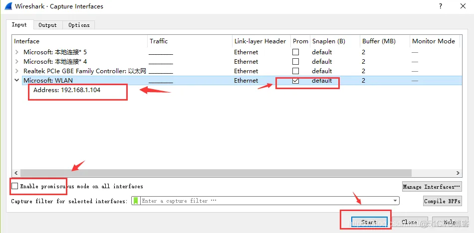
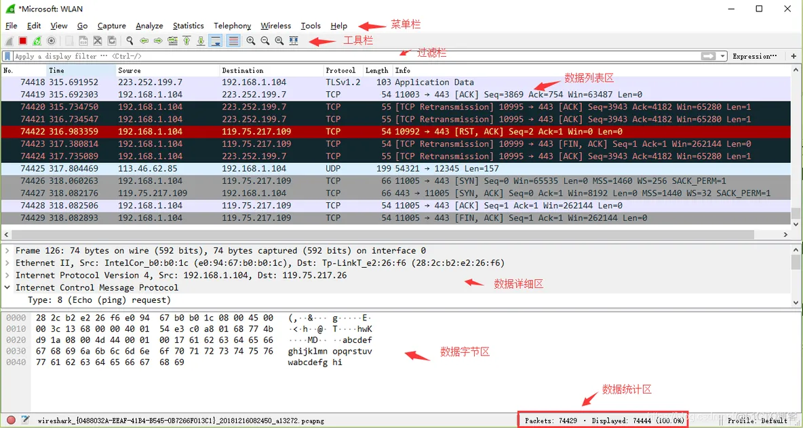
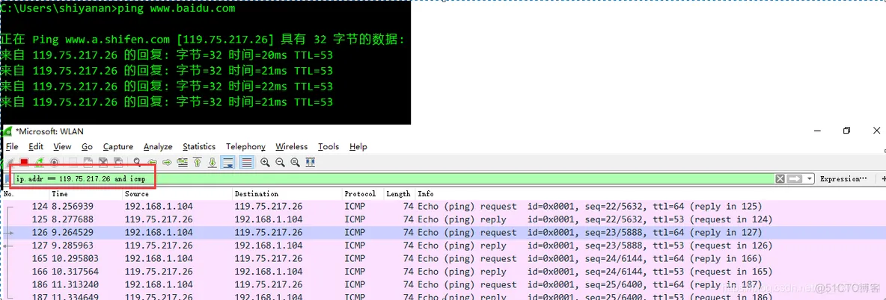
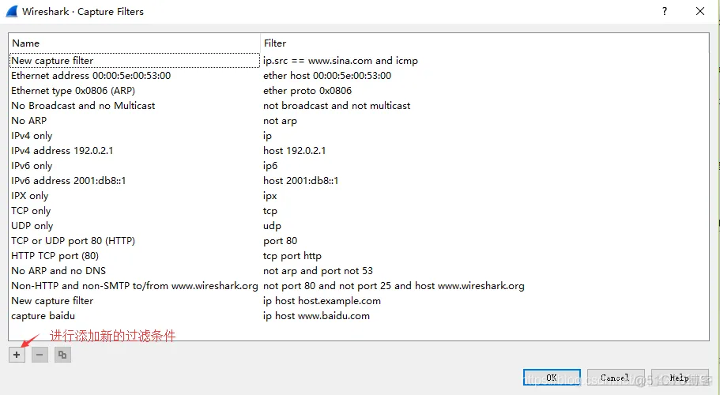
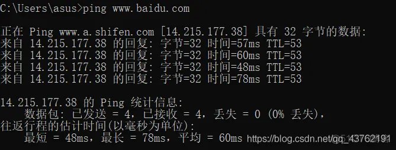
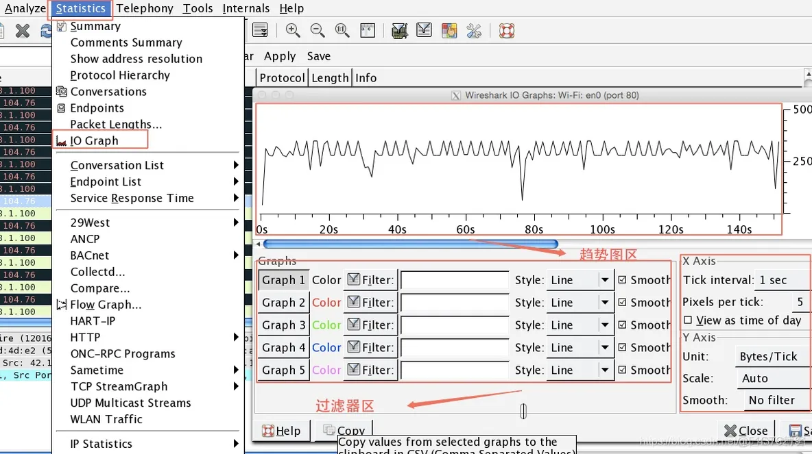
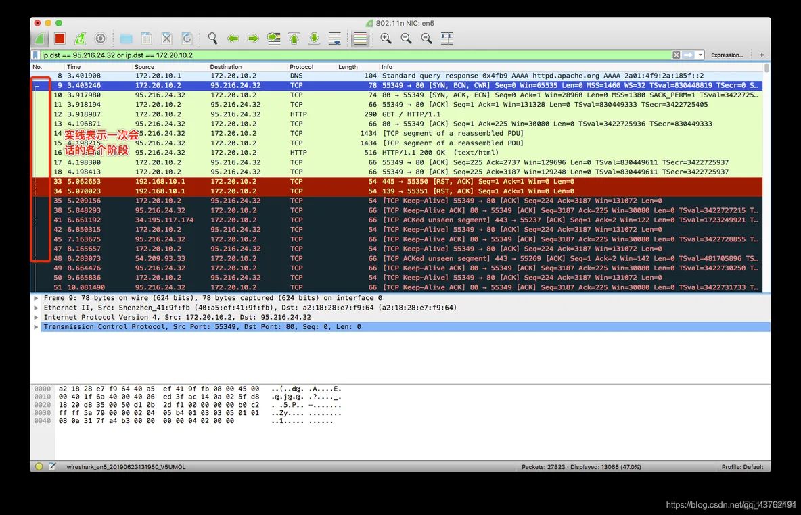
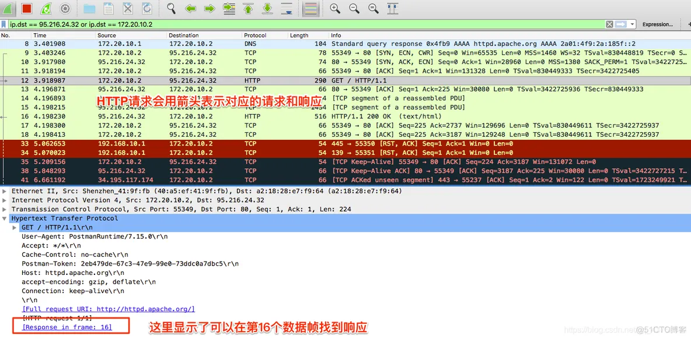
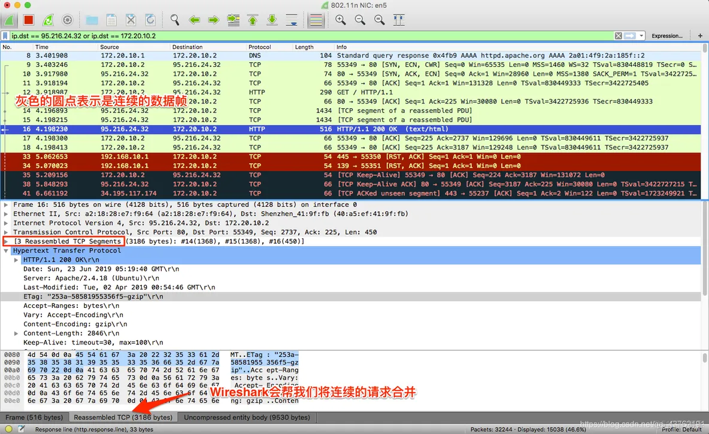

> 原文地址 [https://blog.51cto.com/u_15197573/3161294](https://blog.51cto.com/u_15197573/3161294)

‍

### 文章目录

*  

  * 下载与安装
  * 选择接口（网卡）
  * wireshark 抓包界面介绍
  * Wireshark 过滤器
  *  

    * 1）捕获过滤器
    * 显示过滤器
    * 过滤器语法
    *  

      * 1）协议过滤
      * 2）IP 过滤
      * 3）端口过滤
      * 4）逻辑运算符 && 与、|| 或、！非
      * 一些实例
      * 5）Http 模式过滤
      * 6）数据包内容过滤
  * 实例：wireshark 分析 TCP 包
  * 其他
  *  

    * 使用图表
    * 页面小 tips

## 下载与安装

如果一切正常，那安装就很快，去 wireshark 官网下载一个。

如果安装过程中出现了问题，不妨看一下我昨晚写的问题解决教程：问题解决：wireshark 之 npcap 无法安装、winpcap 无法安装问题解决

因为我是用两台电脑的，所以，嗯。

第二台安装的时候就是一步到位很快的。

---

我也是新手上来的，在学的过程中看到很多教程，要么千篇一律，要么罗里吧嗦的千篇一律。我只想会用，不想看什么英语是什么意思，什么按键是什么意思，我看得懂英语好吗？！！

甚至还有什么，七八万字的教程，我的天哪。搞得这么复杂干嘛？人气？流量？

---

## 选择接口（网卡）

打开 wireshark 之后，正常情况下会有好多个接口：

​​

还有的版本，就需要一波操作才能打开这个界面了：

​​

点击。

或者还有个办法，就双击 Traffic 那个线。

不同的版本可能表面上不一样，不要被事物的表面现象所迷惑，我们现在讲的是思维。

它可能默认会给你全勾上，没事儿，不用管它，你只要确认你想监听的那个接口被选中，高亮，注意，是高亮，不是打勾，勾肯定是勾上了，看上面的图，蓝色高亮，然后开始。

不然你可能会发现什么都抓不出来。
当然，上面这个图也什么都抓不出来，因为根本没有网络波动，不难猜那条 Traffic 下面的横线代表的是网络波动，就像心电图一样。

好，不管它，选好之后打开。

---

## wireshark 抓包界面介绍

​​

说明：数据包列表区中不同的协议使用了不同的颜色区分。协议颜色标识定位在菜单栏 View --> Coloring Rules，反正我是没那兴趣去改来改去的。

---

## Wireshark 过滤器

开始之后，会看到一堆有一堆的包开始刷刷刷的，快得很：

​​

那我们怎么找我们想要的呢？过滤嘛。

为避免其他无用的数据包影响分析，可以通过在过滤栏设置过滤条件进行数据包列表过滤，获取结果如下。
说明：ip.addr == 192.168.76.26 and icmp 表示只显示 ICPM 协议且源主机 IP 或者目的主机 IP 为 192.168.76.26 的数据包。

​​

### 1）捕获过滤器

捕获过滤器的菜单栏路径为 Capture --> Capture Filters。用于在抓取数据包前设置。

​​

当然，还不了解抓包语法的情况下，这只是先说一声儿这里有个设置罢了。

---

### 显示过滤器

显示过滤器是用于在抓取数据包后设置过滤条件进行过滤数据包。通常是在抓取数据包时设置条件相对宽泛，抓取的数据包内容较多时使用显示过滤器设置条件顾虑以方便分析。

​​

---

### 过滤器语法

不同版本可能语法会有点不一样，但是差别不大，可以自行摸索出来，所以我就放一份儿。

#### 1）协议过滤

比较简单，直接在抓包过滤框中直接输入协议名即可。

（注意：协议名称需要输入小写）

```
  TCP，只显示TCP协议的数据包列表

  HTTP，只查看HTTP协议的数据包列表

  ICMP，只显示ICMP协议的数据包列表 


```

以及其他协议，可以在抓包窗口中看到其他协议的协议名。至于想要深入了解这些协议，请移步：《TCP/IP 卷一》，书可以自己找，也可以私信我拿，或者下面评论。

#### 2）IP 过滤

请带上 ip.

```
 host 192.168.1.104

  src host 192.168.1.104

  dst host 192.168.1.104


```

ip. 完之后会有很多选项，上面这些只是常用的，而且具体怎么写，看软件的提示。

#### 3）端口过滤

请带上 tcp. 或者 udp.

```
  port 80

  src port 80

  dst port 80


```

同样的，点完会有很多选项出来，请服从软件提示。

#### 4）逻辑运算符 && 与、|| 或、！非

```
  src host 192.168.1.104 && dst port 80 抓取主机地址为192.168.1.80、目的端口为80的数据包

  host 192.168.1.104 || host 192.168.1.102 抓取主机为192.168.1.104或者192.168.1.102的数据包

  ！broadcast 不抓取广播数据包


```

---

#### 一些实例

```
 tcp，只显示TCP协议的数据包列表

  http，只查看HTTP协议的数据包列表

  icmp，只显示ICMP协议的数据包列表


```

```
  ip.src ==192.168.104.10 显示源地址为192.168.104.10的数据包列表

   ip.dst==192.168.104.10, 显示目标地址为192.168.104.10的数据包列表

   ip.addr == 192.168.104.10 显示源IP地址或目标IP地址为192.168.104.10的数据包列表


```

```
  tcp.port ==80,  显示源主机或者目的主机端口为80的数据包列表。

  tcp.srcport == 80,  只显示TCP协议的源主机端口为80的数据包列表。

  tcp.dstport == 80，只显示TCP协议的目的主机端口为80的数据包列表。


```

---

#### 5）Http 模式过滤

http.request.method==“GET”, 只显示 HTTP GET 方法的。

注意，这里 GET 要大写。

#### 6）数据包内容过滤

比方说：

​​

---

## 实例：wireshark 分析 TCP 包

1、启动 wireshark 抓包工具
2、浏览器访问一个网站，比方说：www.baidu.com
3、打开终端，ping 这个网址，找到它的 IP 地址

​​

接着，进入抓包工具，过滤出这个网址的包

​​

可以看到啊，这里握手了有分手，分手了又握手，看来是短连接。

---

至于握手分手细节，想了解的话：详解 TCP 三次握手与四次挥手

---

## 其他

### 使用图表

图形分析是数据分析中必不可少的一部分。也是 wireshark 的一大亮点。wireshark 有不同的图形展现功能，以帮助你了解捕获的数据包。下面我们对经常使用的 IO 图，双向时间图做下介绍。
IO 图

wireshark 的 IO 图让你可以对网络上的吞吐量绘图。让你了解网络数据传输过程中的峰值和波动情况。通过 “Statistics” 菜单中的 “IO Graphs” 选项可以打开这个 IO 图对话框。如下图：

​​

参数都可以调的。

---

### 页面小 tips

左边的实线连起来的表示同一次会话发生的各个阶段。

​​

HTTP 请求选中后，能够看到对应的请求和响应。

​​

Wireshark 会帮我们将多次请求合并。

​​

在选中的项目上右键选择 Follow->HTTP Stream 可以将这次请求的所有相关的请求列出，帮助我们快速过滤。

and so on.

期待后期再探索吧！！！
