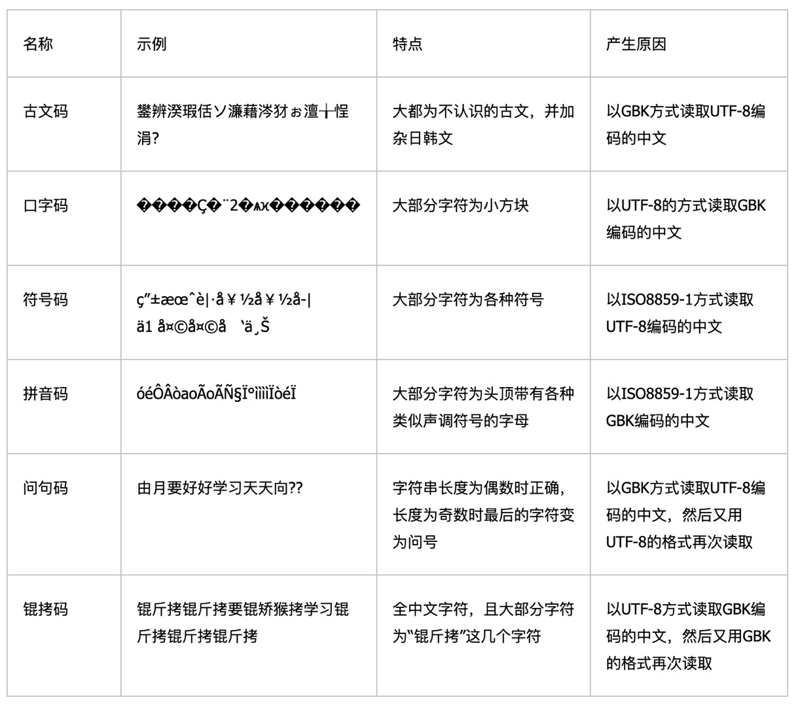
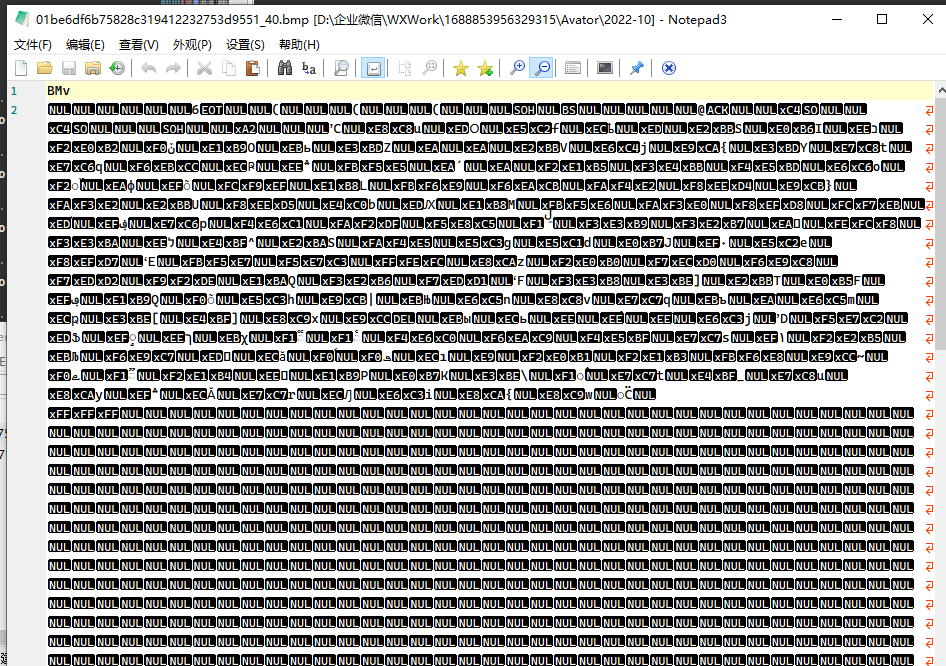
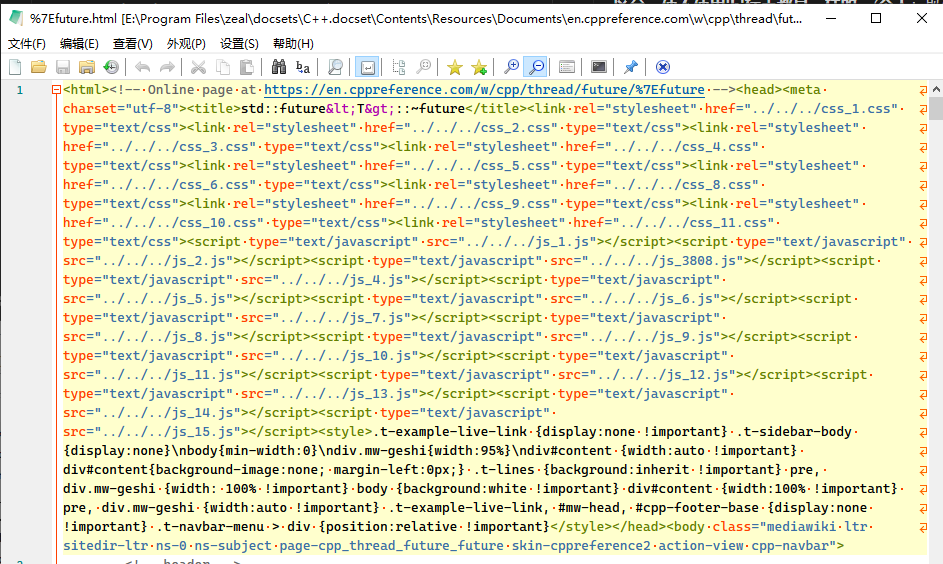
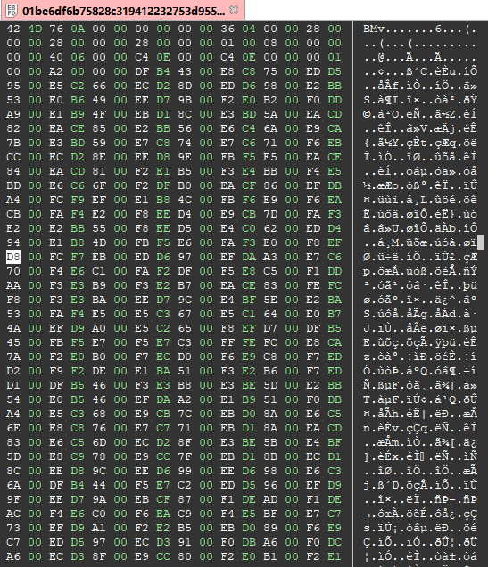

前置知识点：c语言入门，至少了解各种数据类型。

## 区别

我们知道，在计算机里所有文件都是以01存的，啥叫文本文件，啥叫二进制文件呢，简单来说，能直接用记事本，看得到正常内容的，就是文本文件，打开后是一堆空白或者乱码的，就是二进制文件。

那么他们具体有什么区别呢？

* 从物理上讲，其实没有区别，都是以二进制的形式存放在磁盘中。
* 组织形式上不一样：

  * 二进制一般来说，有文件头，用于记录文件信息，以BMP为例，前两字节表示本位件为BMP格式，后面八个字节记录文件长度，接下来4字节记录文件头长度，然后文件头中记录长宽，波段等信息，后面跟着的二进制内容记录数据
  * 文本文件一般没有文件头（utf8-bom编码文件以 EF BB BF 开头），直接存显示的内容
  * 文本文件是基于字符编码的，常见编码方式有ASCII，GBK，UTF8，UTF16等等，具体可以参见["字符集和字符编码（Charset & Encoding）"](./文本文件和二进制文件/字符集和字符编码（Charset%20&%20Encoding）.md)，只要知道文件编码，即可正确读取，当然也可能会出现乱码，乱码问题可以参见下图:
  * ​​
  * 二进制文件实际上是自定义编码的，也就是按照规定，多少字节是代表什么意思，例如，**A 程序是**图像编辑器，**指定** 01001111 代表红色，**B 程序是**视频播放器，它把 01001111 **理解为**快进。所以，**字符文件是通用的，任何程序只要按照对应的编码方式打开都可以正确显示，二进制文件只有特定的程序才能处理**。

## C语言中的文本读取方式和二进制读取区别:

**在 C 语言中，二进制方式很简单**，

* 读文件时，**会原封不动的****读出文件的全部內容**，(**个人**：文件中的内容也就是 01 序列)
* 写的時候，也是把**內存缓冲区的內容**​******原封不动的******​**写到文件中**。(**个人**：内存缓冲区的内容也是 01 序列)

**而对文本方式的处理就不一样了，**

* **Windows 和 DOS 下的文本文件以'\r\n'(0X0D 0X0A) 作为换行符**，而 **C 语言本身以'\n'(0X0A) 作为换行符**，(0x0D（asc 码是 13） **即'\r'，指的是 “回车” ，是把光标置于本行行首**。 0x0A（asc 码是 10） **即'\n'，指的是 “换行”    \n 是把光标置于下一行的同一列**。 0x0D + 0x0A ，**即'\r\n'，回车换行，把光标置于下一行行首** 。 \n 是换行，英文是 linefeed，ASCII 码是 0xA。\r 是回车，英文是 carriage return ,ASCII 码是 0xD)，所以，

  * 以文本方式写入数据时，**会将'\n'(0X0A) 替换为'\r\n'(0X0D 0X0A)** ，
  * **而读取数据时又会替换回来**。
* **在 Linux 和其他一些系统中，文本文件的换行符就是'\n'(0X0A)，与 C 语言的换行符一样。所以也就沒有了文本方式和二进制方式的区分，使不使用'b'标志都是一样的**。(**个人**：既然 Linux 下二者没有区别，那么读取或者写入的行为应该是相同的)，这是由于不同操作系统对文本文件换行符的定义，和 C 语言中换行符的定义有所不同而造成的。**在 Windows 下，C 语言的输入输出函数会自动进行 '\r\n'和 '\n'的转换，而 Linux 等就不必了**。(**个人**：例如 printf 函数，会将内存中的'\n'转换为'\r\n'，然后打印到屏幕上)
* 另外，**以文本方式打开时，遇到结束符 CTRLZ(0x1A) 就认为文件已经结束。所以，若使用文本方式打开二进制文件，就很容易出现文件读不完整，或內容不对的错误。即使是用文本方式打开文本文件，也要谨慎使用，比如复制文件，就不应该使用文本方式**。

## 实例

文本文件和二进制文件不要看后缀，比如md，rst都是文本文件，最简单的判断是直接拖到记事本打开看看，例如下面就是一个二进制的bmp文件：

​​

而下面是一个html的文本文件

​​

### 二进制文件解析：

以bmp文件为例：

BMP（Bitmap）文件是Windows操作系统中使用的一种标准图像文件格式。BMP文件通常以`.bmp`​或`.dib`​为文件扩展名。BMP文件结构由多个部分组成，主要包括文件头、信息头和像素数据。

1. **位图文件头（Bitmap File Header）**  - 通常为14字节，包含以下信息：

    * ​`bfType`​（2字节）：文件类型标志，必须是字符"BM"，表示这是Windows支持的BMP格式。
    * ​`bfSize`​（4字节）：文件大小，即整个文件的字节数。
    * ​`bfReserved1`​（2字节）：保留位，必须设置为0。
    * ​`bfReserved2`​（2字节）：保留位，必须设置为0。
    * ​`bfOffBits`​（4字节）：从文件头到像素数据的偏移量，即位图数据开始的相对位置。
2. **位图信息头（Bitmap Information Header）**  - 通常为40字节（对于Windows BMP），包含以下信息：

    * ​`biSize`​（4字节）：信息头的大小。
    * ​`biWidth`​（4字节）：位图的宽度，以像素为单位。
    * ​`biHeight`​（4字节）：位图的高度，以像素为单位。如果是正数，表示位图的底边是朝向上的；如果是负数，表示底边是朝向下的。
    * ​`biPlanes`​（2字节）：目标设备的平面数，必须设置为1。
    * ​`biBitCount`​（2字节）：每个像素的位数，常见的值有1（单色）、4（16色）、8（256色）、16（高彩色）、24（真彩色）和32（真彩色带Alpha通道）。
    * ​`biCompression`​（4字节）：压缩类型，如BI\_RGB（无压缩）、BI\_BITFIELDS（位域压缩）等。
    * ​`biSizeImage`​（4字节）：图像的大小，以字节为单位。如果压缩类型为BI\_RGB，则通常为0。
    * ​`biXPelsPerMeter`​（4字节）：水平分辨率，每米像素数。
    * ​`biYPelsPerMeter`​（4字节）：垂直分辨率，每米像素数。
    * ​`biClrUsed`​（4字节）：用于位图的彩色表中颜色数。如果为0，则表示使用所有可能的颜色。
    * ​`biClrImportant`​（4字节）：对于显示或打印图像时重要的颜色数。如果为0，则表示所有颜色都重要。
3. **颜色表（Color Table）**  - 对于小于24位的颜色深度，颜色表是必需的。颜色表定义了位图中使用的颜色。每个颜色表条目通常是4字节（RGB值），但对于1位和4位的位图，可能需要更多的颜色表条目。
4. **像素数据（Pixel Data）**  - 这部分是位图的主体，包含了图像的像素数据。像素数据的存储方式取决于`biCompression`​字段的值。对于无压缩的BMP，像素数据通常是从左到右、从上到下存储的，每个像素的位按照`biBitCount`​字段的值进行排列。

​​

上图即是一个常规的bmp数据，以十六进制显示，头两位即为BM，后面的76 0A 00 00 实际上是一个unsigned int，即A67，2678个字节，剩下的以此类推。下面是C语言读取bmp的代码，仅作为示例，不一定完全对：

```c
#include <stdio.h>
#include <stdlib.h>

#pragma pack(push, 1)
typedef struct {
    unsigned short type;
    unsigned int size;
    unsigned short reserved1;
    unsigned short reserved2;
    unsigned int offset;
} BMPFileHeader;

typedef struct {
    unsigned int size;
    int width;
    int height;
    unsigned short planes;
    unsigned short bitCount;
    unsigned int compression;
    unsigned int imageSize;
    int xPelsPerMeter;
    int yPelsPerMeter;
    unsigned int clrUsed;
    unsigned int clrImportant;
} BMPInfoHeader;
#pragma pack(pop)

void ReadBMP(const char* filename) {
    FILE* file = fopen(filename, "rb");
    if (!file) {
        perror("Failed to open file");
        return;
    }

    BMPFileHeader fileHeader;
    BMPInfoHeader infoHeader;

    // Read file header
    fread(&fileHeader, sizeof(BMPFileHeader), 1, file);
    // Read info header
    fread(&infoHeader, sizeof(BMPInfoHeader), 1, file);

    // Check if it's a BMP file
    if (fileHeader.type != 0x4D42) {
        printf("Not a valid BMP file.\n");
        fclose(file);
        return;
    }

    // Output BMP info
    printf("Width: %d\n", infoHeader.width);
    printf("Height: %d\n", abs(infoHeader.height));
    printf("Bit depth: %d\n", infoHeader.bitCount);

    // Read pixel data (optional)
    if (infoHeader.bitCount == 24) { // Example for 24-bit BMP
        unsigned int padding = (4 - (infoHeader.width * 3) % 4) % 4;
        unsigned char* pixels = (unsigned char*)malloc(infoHeader.width * infoHeader.height * 3 + padding * infoHeader.height);
        fseek(file, fileHeader.offset, SEEK_SET);
        fread(pixels, infoHeader.width * infoHeader.height * 3 + padding * infoHeader.height, 1, file);

        // Process pixels (e.g., for display or manipulation)
        // ...

        free(pixels);
    }

    fclose(file);
}

int main() {
    const char* filename = "path_to_your_bmp_file.bmp";
    ReadBMP(filename);
    return 0;
}
```

## 文本文件处理

其实我们处理时经常会碰到文本文件的，比如各种POI点，统计数据，地磁数据等，都可能是文本文件，所以，需要学一下 ["正则表达式"](./正则表达式/正则表达式30分钟入门.md)，用python或者其他脚本提取字段，其实也可以用excel取，但是手动太麻烦了，特别是做论文或者做数据，成千上万的文件，手动不知道提取到猴年马月去了。

下面是一个简单的perl脚本提取示例（不建议学perl，用的太少，没必要，这里示例主要是单行perl方便显示）：

```perl
# 提取以tab分割的文件中第1 2 列,以逗号分割
 perl -F'\t' -lane'print join ",", @F[1,2]' inputfile

输入文件:
chr1    1   10  el1
chr1    13  20  el2
chr1    50  55  el3

输出:
1,10
13,20
50,55
```

这种需求其实就可以把需求扔到AI里，ChatGPT，文心一言，kimi等都行，写python脚本跑比较准确，python脚本正确率还可以。
