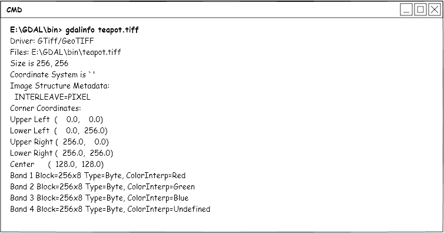
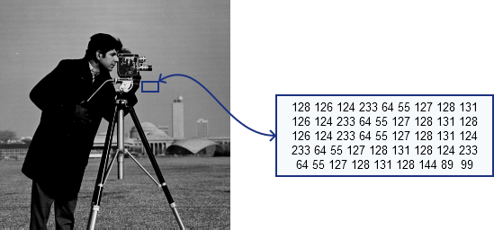
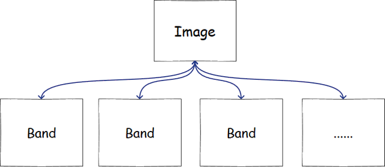
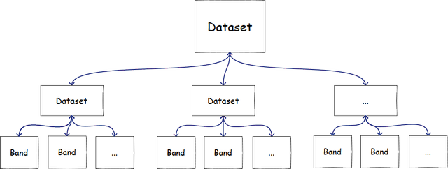

可以先看看 [影像是什么](https://headfirst-gdal.readthedocs.io/en/latest/formats.html)

栅格数据一般由元数据，影像数据组成，其实挺简单的。

## 元数据

影像元数据是指影像中除了信息矩阵以外的一些参考数据。例如影像的长、宽、波段数、数据类型、存储方式、投影坐标、太阳高度角、获取时间、传感器信息等内容。使用 [gdalinfo文件信息工具](https://headfirst-gdal.readthedocs.io/en/latest/gdal-utilities.html#gdalinfo) ，我们就可以看到影像的元数据信息：

​​

这种是地理数据的信息，其实照片也有信息，比如长宽，拍摄时间，一般的照片也有exif信息。

我们需要这些信息，主要是获取其投影，长宽（构建矩阵），存储格式（波段存储方式）等，方便读取数据，然后做处理。

## 影像内容

先来介绍下栅格数据信息，因为正常的栅格数据，比如Tiff，PNG，JPEG，都差不多：

​​

如上图，放大影像后，你会看到一个个小格子，每个格子代表一个数值，这个数值在渲染到屏幕的时候，会被拉伸到0~255，然后在屏幕上展示给你看。想到什么了么，对，就是矩阵。简单来说，栅格就是矩阵。

栅格会有单波段，多波段，也就是你看到的灰度图和彩色影像，遥感课上会讲真彩色，伪彩色，实际上真彩色就是把红绿蓝三个波段对应渲染，伪彩色就是不对应。一张影像对应的数据模型如下，简单理解就是，一张影像是由多个大小相同的矩阵组成的，矩阵的宽度就是影像宽度，矩阵高度就是影像高度。

​​

还有一种数据遥感影像中也比较常见，例如hdf格式、he5格式、netcdf格式等。这些数据与上文介绍的多波段数据不同，里面会有很多不同分辨率，不同波段数的栅格，其实这种你就把它当成一个文件夹，文件夹里包含一堆栅格或者其他文件夹，栅格跟上面的描述是一样的，由波段组成。

​​

因此，一般我们读栅格，处理栅格的时候，都是用gdal、opencv之类的库，或者用matlab，python，把数据读成矩阵，然后对矩阵进行处理。

遥感数据有些很大，所以要注意内存使用，很多时候我们是分块处理的。

注意一个问题，地理数据中，存的数据一般不会是0~255的，可能是float的，可能是double的，可能是二值或者其他类型的。要渲染的时候，需要拉伸！因为显示器一般只能渲染0~255的数据。

## 其他相关知识:

* 金字塔：用于快速显示，快速读取的，原始数据太大，金字塔就是把原始数据缩小一层层存，你放大到哪层就从哪层金字塔去读数据，这样快
* 视频：音视频开发本身是很大一块内容，这里也讲不完。但是单独视频的话，可以看做是一整段有时序的图片组成的，拆解出来是每秒24帧或者30帧（看帧率）的连续图像，然后即可用图像（矩阵）的方式去处理。视频流格式可以看看["相机色彩格式及其转换"](./栅格数据模型/相机色彩格式及其转换.md)
* 普通的图像与遥感图像其实区别不大，所以遥感处理大部分都来源于数字图像处理，要搞研究的话可以去扒ICCV、ECCV、CVPR的论文了解前沿科技，而不是去遥感找。
* 遥感数据最大的问题是来源广，数据质量不统一，长时序的分析多，影像大。图像处理里1000\*1000的示例数据经常用，遥感里大部分起手就是5000\*5000的，注意数据量的区别。

## 常见数据格式：

### GeoTiff

最常用的，因为通用，而且可以无损压缩，压缩率挺高的。记住创建金字塔，否则读大数据很慢。

### Image

这种其实不一定是啥数据，可能是geotiff，可能是envi的数据，也是单波段或多波段的正常数据。

### NetCDF、HDF4、HDF5

一起说吧，这几种都是一样的，你就把他们当成文件夹，需要的其实是文件夹里的某个文件，不管是拖到QGIS里导出来，还是用python或者matlab处理，都是类似的，找到数据集，把数据集当成单波段或者多波段数据进行处理。

### jpeg、heic

这种一般是倾斜摄影的原始数据，或者无人机飞出来的数据，数据小，但是实际上解出来还是矩阵。

### dds, ktx, ktx2

这些数据是纹理数据，不完全算是地理数据，但是实际上解出来也是矩阵，这么多格式主要是压缩算法，平台等的区别。可以看看这个：[纹理优化三-KTX纹理压缩](https://zhuanlan.zhihu.com/p/629204473)，理解一下纹理压缩和文件压缩有什么区别。

‍
