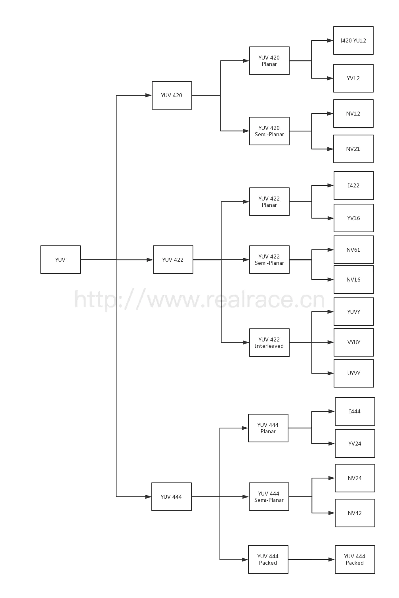

> 原文地址 [https://www.cnblogs.com/qi-xmu/p/17289389.html](https://www.cnblogs.com/qi-xmu/p/17289389.html)

# 2023 年 04 月 05 日 相机色彩格式及其转换

> 参考文章
>
> [YUV 格式详解，只看这一篇就够了 - 简书 (jianshu.com)](https://www.jianshu.com/p/538ee63f4c1c)
>
> [RAW、RGB、YUV 图像格式区别 - 知乎 (zhihu.com)](https://zhuanlan.zhihu.com/p/559189793 "RAW、RGB、YUV 图像格式区别 - 知乎 (zhihu.com)")
>
> [YUV - 维基百科，自由的百科全书 (wikipedia.org)](https://zh.wikipedia.org/wiki/YUV "YUV - 维基百科，自由的百科全书 (wikipedia.org)")

# YUV 格式

## YUV 的发展历史

YUV 的发明是彩色电视和黑白电视的过渡时期，黑白视频只有 Y（Luma， Luminance，明度）视频，也就是灰阶值。到了彩色电视规格的制定，是以 YUV/[YIQ](https://zh.wikipedia.org/wiki/YIQ "YIQ")（NTSC，National Television Standards Committee）的格式来处理彩色电视图像，把 UV 视作表示彩度的 C（Chrominance 或 Chroma），如果忽略 C 信号，那么剩下的 Y（Luma）信号就跟之前的黑白电视频号相同，这样一来便解决彩色电视机与黑白电视机的兼容问题。Y'UV 最大的优点在于只需占用极少的带宽。

因为 UV 分别代表不同颜色信号，所以直接使用 R 与 B 信号表示色度的 UV。 也就是说 UV 信号告诉了电视要偏移某象素的的颜色，而不改变其亮度。 或者 UV 信号告诉了显示器使得某个颜色亮度依某个基准偏移。 UV 的值越高，代表该像素会有更饱和的颜色。

彩色图像记录的格式，常见的有 [RGB](https://zh.wikipedia.org/wiki/RGB "RGB")、YUV、[CMYK](https://zh.wikipedia.org/wiki/CMYK "CMYK") 等。彩色电视最早的构想是使用 RGB 三原色来同时传输。这种设计方式是原来黑白带宽的 3 倍，在当时并不是很好的设计。RGB 诉求于人眼对色彩的感应，YUV 则着重于视觉对于亮度的敏感程度，Y 代表的是亮度，UV 代表的是彩度（因此黑白电影可省略 UV，相近于 RGB），分别用 Cr 和 Cb 来表示，因此 YUV 的记录通常以 Y:UV 的格式呈现。

** 来自 wiki

我们常说的 YUV，通常是指 YCbCr， 其中 Y 指的是明度，Cb 指蓝色色度分量，Cr 指红色色度分量。

## YUV 格式分类

​[https://img2023.cnblogs.com/blog/2820663/202304/2820663-20230405142225628-177010495.png](https://img2023.cnblogs.com/blog/2820663/202304/2820663-20230405142225628-177010495.png)

## 分类依据

### 数据采样方式

根据 Y 和 UV 数据量的占（为了节省带宽，对数据抽样），可以将 YUV 格式分成一下几类：

1. 4:4:4 表示完全采样。

    每一个像素分别对应一个 Y，U，V 分量。
2. 4:2:2 表示水平 2:1 取样，垂直完全采样。

    每一个像素对应一个 Y 分量，在图像的每一行中，相邻两个像素共用一个 U 分量和一个 V 分量。数据压缩到原来的 2/3。
3. 4:2:0 表示水平 2:1 取样，垂直 2:1 取样。（android 设置默认格式）

    每一个像素对应一个 Y 分量，在 2x2 的像素格子中，（4 个像素）共用一个 U 分量和一个 V 分量。数据压缩到原来的 1/2。
4. 4:1:1 表示水平 4:1 取样，垂直完全采样。（这类格式不常用）

    每一个像素对应一个 Y 分量，在图像的每一行中，相邻四个像素共用一个 U 分量和一个 V 分量。数据压缩到原来的 1/2。

### 数据在内存中的分布方式

根据 YUV 在内存不同的排列方式不同，可以主要分成下面三种类型：

* Packed Formats: 将 Y，U，V 值存储为 Macro Pixels（宏像素）数组，类似 RGB 的存放方式。
* Planner Formats: 将 Y，U，V 三个分量分别存储在不用的矩阵中。
* Semi-Planner Formats: 将 Y 分量单独存储在一个矩阵中，UV 分量存储为 Macro Pixels 数组。（Andorid 采用这种模式）

### 具体类型（4x4 像素为例）

#### YUV 格式

<table><thead><tr><th>标题</th><th>类型</th><th>说明</th><th>采样</th></tr></thead><tbody><tr><td><a href="https://www.wolai.com/uvDy46Y7JynvKzASXziU6L" title="I420 YU12" target="_blank" rel="noopener nofollow">I420 YU12</a></td><td>Planner Formats</td><td>三个分量分开存储，按照 Y, U, V 顺序存放在内存中。</td><td>420</td></tr><tr><td><a href="https://www.wolai.com/4iAFpeZ6debQuNqbMWM5Y2" title="YV12" target="_blank" rel="noopener nofollow">YV12</a></td><td>Planner Formats</td><td>三个分量分开存储，按照 Y, V, U 顺序在存放内存中。</td><td>420</td></tr><tr><td><a href="https://www.wolai.com/wTaxWcM3e7GjWvbnFEzUpx" title="NV12" target="_blank" rel="noopener nofollow">NV12</a></td><td>Semi-Planner Formats</td><td>Y 分量单独存放，UV 分量交错存放，UV 在排列的时候，从 U 开始。</td><td>420</td></tr><tr><td><a href="https://www.wolai.com/wt644eAkC3i6op5bWfww9x" title="NV21" target="_blank" rel="noopener nofollow">NV21</a></td><td>Semi-Planner Formats</td><td>Y 分量单独存放，UV 分量交错存放，UV 在排列的时候，从 V 开始。（Android 默认格式）</td><td>420</td></tr><tr><td><a href="https://www.wolai.com/qP9bmfLkLpE3raNeqSfHhf" title="I422" target="_blank" rel="noopener nofollow">I422</a></td><td>Planner Formats</td><td>三个分量分开存储，按照 Y, U, V 顺序在存放内存中。</td><td>422</td></tr><tr><td><a href="https://www.wolai.com/9J7ijhF2bdfYfnsUMXZAno" title="YV16" target="_blank" rel="noopener nofollow">YV16</a></td><td>Planner Formats</td><td>三个分量分开存储，按照 Y, V, U 顺序在存放内存中。</td><td>422</td></tr><tr><td><a href="https://www.wolai.com/s8FQ7GLtKLGvYwDRWUe2oK" title="NV16" target="_blank" rel="noopener nofollow">NV16</a></td><td>Semi-Planner Formats</td><td>Y 分量单独存放，UV 分量交错存放，UV 在排列的时候，从 U 开始。</td><td>422</td></tr><tr><td><a href="https://www.wolai.com/rA4rRxteKTMT892tWNtinT" title="NV61" target="_blank" rel="noopener nofollow">NV61</a></td><td>Semi-Planner Formats</td><td>Y 分量单独存放，UV 分量交错存放，UV 在排列的时候，从 V 开始。</td><td>422</td></tr><tr><td><a href="https://www.wolai.com/hn23t4ahRwtbFLrNrQJRCo" title="YUVY" target="_blank" rel="noopener nofollow">YUVY</a></td><td>Packed Formats</td><td>在 Packed 内部，YUV 的排列顺序是 Y U V Y，两个 Y 共用一组 UV。</td><td>422</td></tr><tr><td><a href="https://www.wolai.com/aMSeXuFdr4DXiqJTDjosvf" title="VYUY" target="_blank" rel="noopener nofollow">VYUY</a></td><td>Packed Formats</td><td>在 Packed 内部，YUV 的排列顺序是 V Y U Y，两个 Y 共用一组 UV。</td><td>422</td></tr><tr><td><a href="https://www.wolai.com/cXKZzX6ffBqk1JTWURGBgu" title="UYVY" target="_blank" rel="noopener nofollow">UYVY</a></td><td>Packed Formats</td><td>在 Packed 内部，YUV 的排列顺序是 U Y V Y，两个 Y 共用一组 UV。</td><td>422</td></tr><tr><td><a href="https://www.wolai.com/pz2seaFRvCLe8jAPrPN2wx" title="I444" target="_blank" rel="noopener nofollow">I444</a></td><td>Planner Formats</td><td>三个分量分开存储，按照 Y, U, V 顺序存放在内存中。</td><td>444</td></tr><tr><td><a href="https://www.wolai.com/uk8FeRYgAzqTAS1RJfSmRd" title="YV24" target="_blank" rel="noopener nofollow">YV24</a></td><td>Planner Formats</td><td>三个分量分开存储，按照 Y, V, U 顺序在存放内存中。</td><td>444</td></tr><tr><td><a href="https://www.wolai.com/aXmaeFGRAFBzVQKyU1es1p" title="NV24" target="_blank" rel="noopener nofollow">NV24</a></td><td>Semi-Planner Formats</td><td>Y 分量单独存放，UV 分量交错存放，UV 在排列的时候，从 U 开始。</td><td>444</td></tr><tr><td><a href="https://www.wolai.com/fo99pkVeyXdj2TTxxW7Pko" title="NV42" target="_blank" rel="noopener nofollow">NV42</a></td><td>Semi-Planner Formats</td><td>Y 分量单独存放，UV 分量交错存放，UV 在排列的时候，从 V 开始。</td><td>444</td></tr><tr><td><a href="https://www.wolai.com/x54Y1nfE2WfNMGU8et3JPo" title="YUV444" target="_blank" rel="noopener nofollow">YUV444</a></td><td>Packed Formats</td><td>在 Packed 内部，YUV 的排列顺序是 Y U V，每一个像素对应一组 Y，U，V 分量。</td><td>444</td></tr></tbody></table>

# RGB 格式

使用宏像素（Micro pixels）模式排列，每一个分量占用 8bit，也称为 24 比特模式。RGBA 中加入了透明度分量（Alpha）。

# RAW 格式

RAW 图像就是图像感应器将捕捉到的光源信号转化为数字信号的原始数据，是无损的，包含了物体原始的颜色信息等。RAW 数据格式一般采用的是 Bayer 排列方式，通过滤波光片，产生彩色滤波阵列（CFA），鉴于人眼对绿色波段的色彩比较敏感，Bayer 数据格式中包含了 50% 的绿色信息，以及各 25% 的红色和蓝色信息。 Bayer 排列格式有以下 4 种：

1. | R | G | | G | B |
2. | B | G | | G | R |
3. | G | R | | B | G |
4. | G | B | | R | G |

# 补充内容

YUV 格式和 RGB 格式互换。

Y=0.299∗R+0.587∗G+0.114∗BU=−0.169∗R−0.331∗G+0.5∗B+128V=0.5∗R−0.419∗G−0.081∗B+128

$$
\begin{array}{rll} Y &= 0.299 * R + 0.587 * G + 0.114 * B \\ U &= -0.169 * R - 0.331 * G + 0.5 * B + 128 \\ V &= 0.5 * R - 0.419 * G - 0.081 * B + 128 \end{array}
$$

R=Y+1.13983∗(V−128)G=Y−0.39465∗(U−128)−0.58060∗(V−128)B=Y+2.03211∗(U−128)

$$
\begin{array}{rll} R & = Y + 1.13983 * (V - 128) \\ G & = Y - 0.39465 * (U - 128) - 0.58060 * (V - 128) \\ B & = Y + 2.03211 * (U - 128) \end{array}
$$

矩阵形式

⎡⎢⎣YUV⎤⎥⎦=⎡⎢⎣0.2990.5870.114−0.169−0.3310.50.5−0.419−0.081⎤⎥⎦⎡⎢⎣RGB⎤⎥⎦+⎡⎢⎣0128128⎤⎥⎦

$$
\begin{bmatrix} Y \\ U \\ V \end{bmatrix} = \begin{bmatrix} 0.299 & 0.587 & 0.114 \\ -0.169 & -0.331 & 0.5 \\ 0.5 & -0.419 & -0.081 \end{bmatrix} \begin{bmatrix} R \\ G \\ B \end{bmatrix} + \begin{bmatrix} 0 \\ 128 \\ 128 \end{bmatrix}
$$

⎡⎢⎣RGB⎤⎥⎦=⎡⎢⎣1−0.000931.4016871−0.3437−0.7141711.772160.00099⎤⎥⎦⎡⎢⎣YU−128V−128⎤⎥⎦

$$
\begin{bmatrix} R \\ G \\ B \end{bmatrix} = \begin{bmatrix} 1 & -0.00093 & 1.401687 \\ 1 & -0.3437 & -0.71417 \\ 1 & 1.77216 & 0.00099 \end{bmatrix} \begin{bmatrix} Y \\ U - 128 \\ V - 128 \end{bmatrix}
$$
