> 原文地址 [https://blog.csdn.net/forever_008/article/details/104203895](https://blog.csdn.net/forever_008/article/details/104203895)

## （一）TortoiseHg 简介

> TortoiseHg 是[分布式](https://so.csdn.net/so/search?q=%E5%88%86%E5%B8%83%E5%BC%8F&spm=1001.2101.3001.7020)的源码管理工具 Mercurial 的 GUI 客户端。Mercurial 作为三大主流的分布式的源码管理工具，已经被广泛地使用。例如 googlecode.com 和 codeplex.com 都支持 Mercurial 作为源码管理工具；

## （二）TortoiseHg 下载

[下载地址](https://www.cr173.com/soft/48257.html)

###### 注意：安装以后，在桌面的任意地方，鼠标右键出现如下，表示安装成功：点击【Hg Workbench】启动程序

​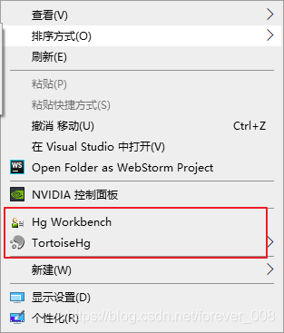​

## （三）简单使用

> * ###### 基本使用流程：当你在本地修改好，想要推送到远程仓库的时候，需要【拉取更新】-----【提交本地代码】-----【合并代码】-----【推送到远程仓库】

#### 1) 拉取代码

1. 点击【文件】—【克隆仓库】；

    ​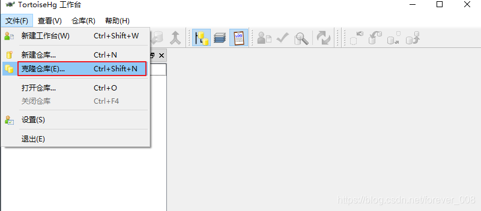​
2. 在【源】中填写远程代码仓库的地址；在【目标】中填写本地地址；点击克隆即可

    ​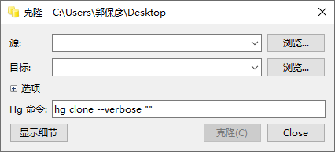​

#### 2) 拉取更新

> * 当团队共同完成项目，我们需要随时拉取别人的修改；这样我们在本地也能看到别人的修改；

* 点击 1 处，会寻找修订集，如果有修订集，会有提醒，直接点击【更新】即可

​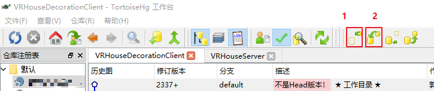​

* 注意：拉取更新以后可以进行合并

#### 3）提交修改【本地代码】

> * 提交修改的步骤如下：
>
>   ​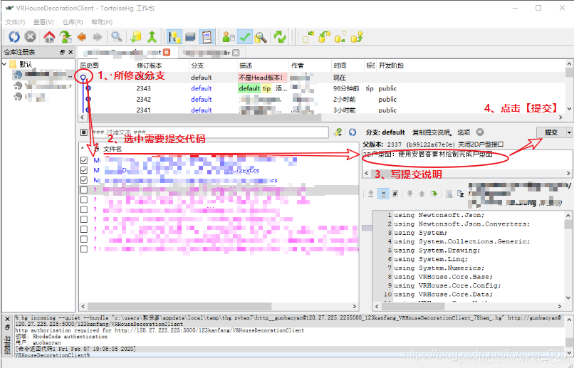​

#### 4）合并代码

> * 1、拉取代码以后会显示几个分支，下图中 1 是自己的分支，2 中两个是别人的分支；
>
>   ​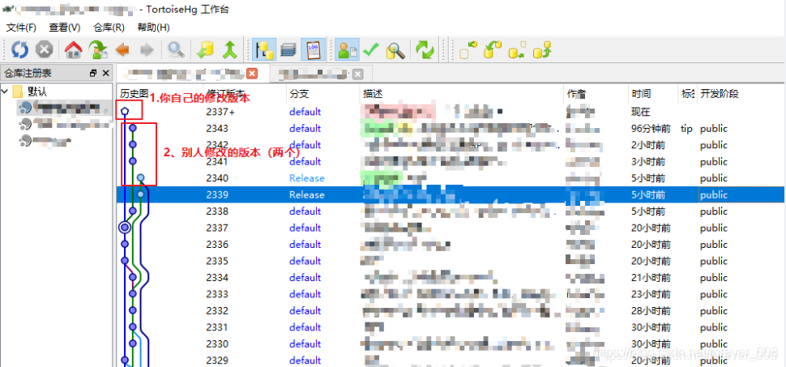​

> * 2、选定想要合并的分支，右键，选择【与本地合并】
>
>   ​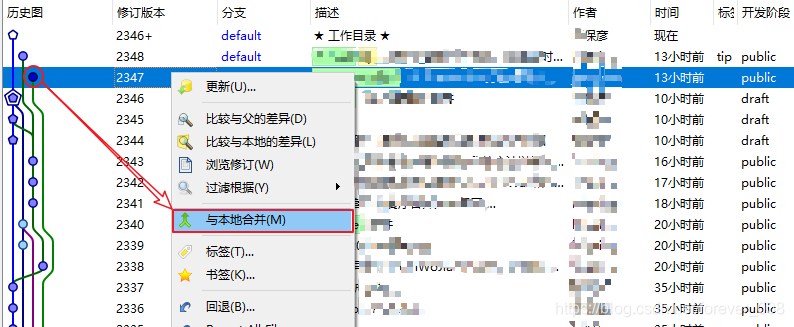​

> * 3、点击【下一步】即可
>
>   ​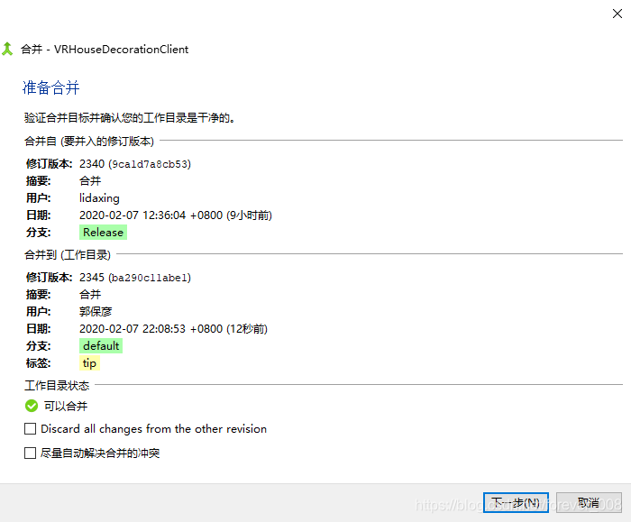​
> * 在合并的过程中可能遇到冲突，这时候需要点击【解决合并冲突】
>
>   ​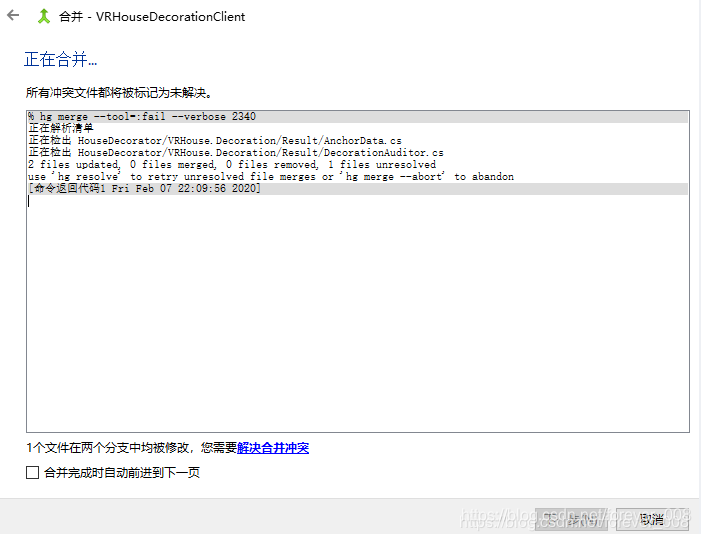​
> * 点击【工具解决】；一般情况下可以自动解决冲突，但是有时候需要因为改动的地方冲突，不能自动解决的时候，需要手动解决，见下面关于手动解决冲突的详细过程
>
>   ​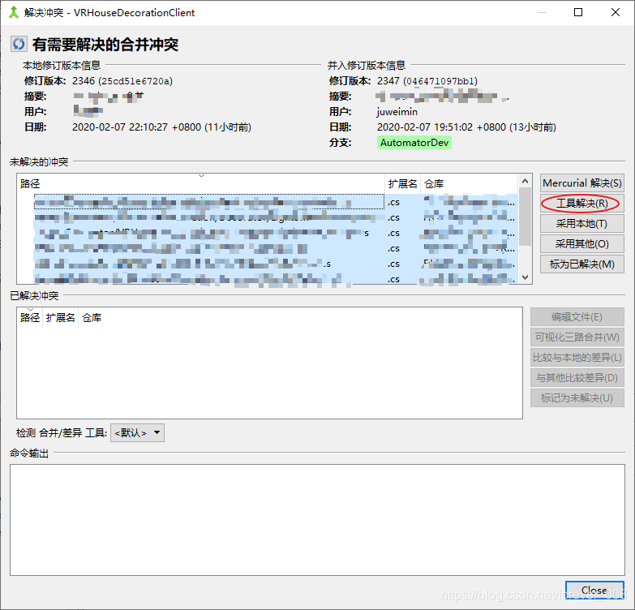​

#### 5）推送代码到远程仓库 【合并之后一定要推送】

* 完成上述步骤之后，可以推送代码到远程服务器；点击 1 处，点击【全部更新】即可；

  ​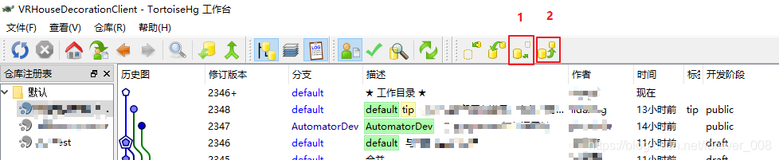​

#### 6）更新到指定历史版本

* 如果不想在本地执行最新的代码，想要转到指定历史版本，只需要右键该版本，点击【更新】即可

  ​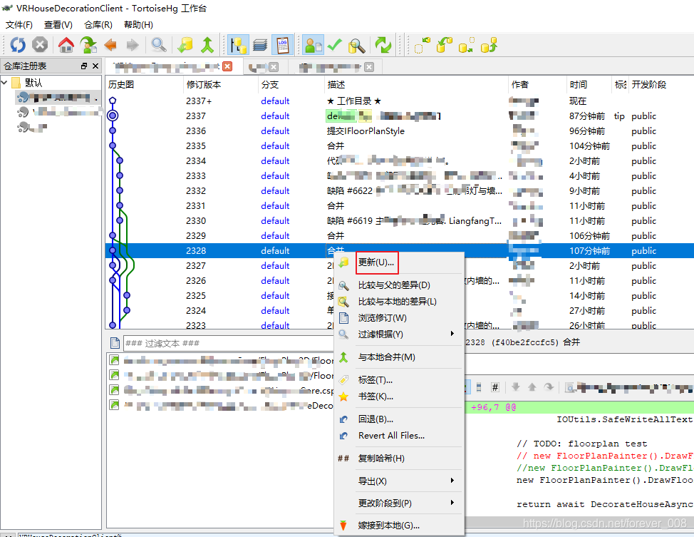​

  ​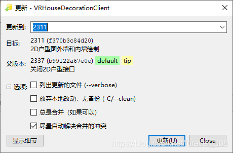​
* 注意：【描述】一栏中的粗体，表示本地的当前版本

## （四）详细笔记

> 之前的知识，让我们能够简单的使用，是基本的技能；下面的详细说明 tortoiseHg；

#### 1）基本概念

1. 【Init】是指初始化, 也就是创建一个空的仓库；
2. 【Clone】是指创建仓库的复本, 创建的的来源可以是一个 http 或 ssh 链接表示的仓库, 也可以是本地仓库；
3. 【Commit】是指提交，即接受所有的改动，将当前版本作为最新版本（也叫 tip）。注意这个提交和集中式 SCM 不同，它只提交本地仓库，而且本地仓库会详细记录所有的变动（陈伟变更集或改动集）。因此多提交几次没有关系，不影响别人的仓库。如果怕影响自己的话，可以克隆一个副本，再对副本进行改写和提交；
4. 【Revert】是指恢复，即撤销所有的改动，恢复到未更改的状态；
5. 【Update】意思是更新，当获取了其他变更集，且需要更改以保持和其他仓库一致时，可以执行更新操作；
6. 【Pull】是指拉取，将远端仓库有而当前仓库没有的变更集 “下载” 到本地仓库。不过这只是添加了变更集，本地文件并不会改动；
7. 【Push】是指推送，将当前仓库的变更集 “上传” 到其他仓库去。其他的仓库必须支持该操作，且可能需要经过验证。如果从本地仓库 A push 到本地仓库 B，相当于用 B pull A，push 也不会更新仓库的版本，因为它是共享的，需要的人直接选择想要的版本或者进行合并操作即可；
8. 【Merge】是指合并，当一个文件同时被多次修改，并存放在多个仓库时，要获得一个统一的版本就需要合并。一个文本可能同时分给多个人，于是合并时只需要接受每个人的改动即可；

#### 2）创建仓库

1. 在该文件所在目录，右键，选择【TortoiseHg】-----【CreateRepository Here】----- 点击【创建】

    ​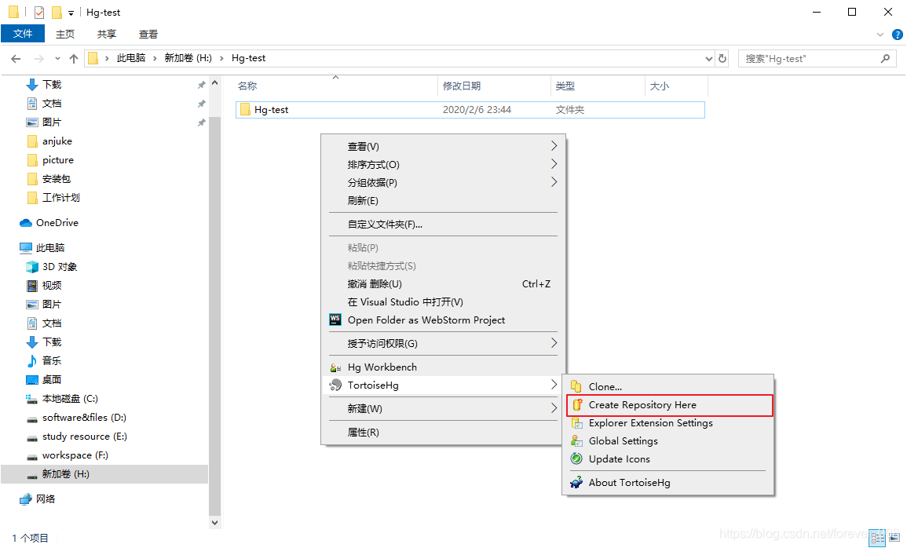​

    ​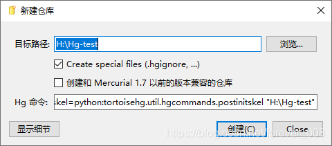​

#### 3）首次提交（[参考链接](https://blog.csdn.net/xukai871105/article/details/25649331)）

​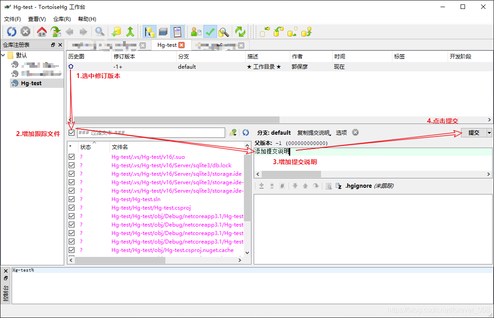​

#### 4）手动解决冲突

> * 当【工具解决】不能自动解决冲突的时候，需要手动完成；

###### <1> 下载解决问题的工具：(原文是BeyondCompare,别下,一般要么有毒要么会找你要钱,下面几个都可以,自己试试那个好用,界面差不多)

[meld](https://meldmerge.org)

[Diffinity](https://www.truehumandesign.se/s_diffinity.php)

[WinMerge](https://winmerge.org/downloads/?lang=zh_cn):可加插件比较word之类的,比较方便,下面界面不一样,自己摸一下吧.

###### <2> 解决冲突界面

* 上半部分是三个版本；下半部分，根据自己的需要（最好和另一个修改的同事沟通）选择需要保留的【红色感叹号表示没有自动解决的冲突】，一一选择即可

  ​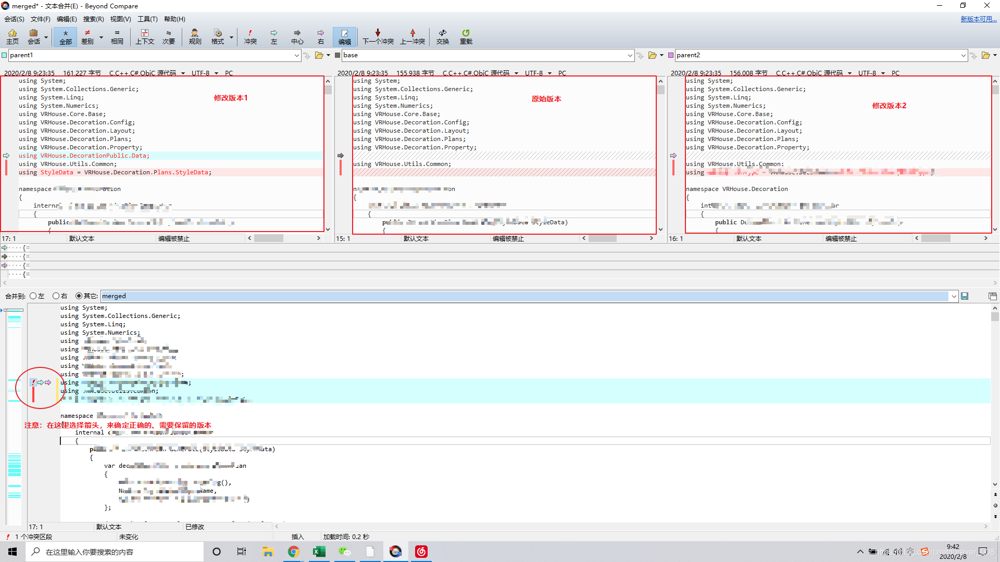​

#### 5）服务器修改设置【[参考链接](https://blog.csdn.net/xukai871105/article/details/25649331)】【搭建服务器时候用，个人一般用不到】

> * 选择 server 选项，修改全局参数和该仓库参数；其中**取消 SSL 加密推送**，**并允许他人推送**；
> * 为了简单说明问题，全局参数和该仓库设置相同。在该项设置中默认的端口号位 8000，也可以使用其他端口号，请一定要避免知名端口号。
>
>   ​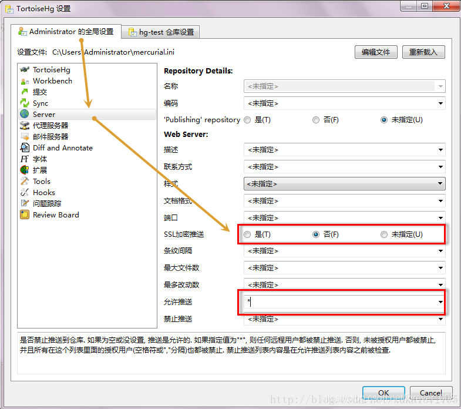​
>
>   ​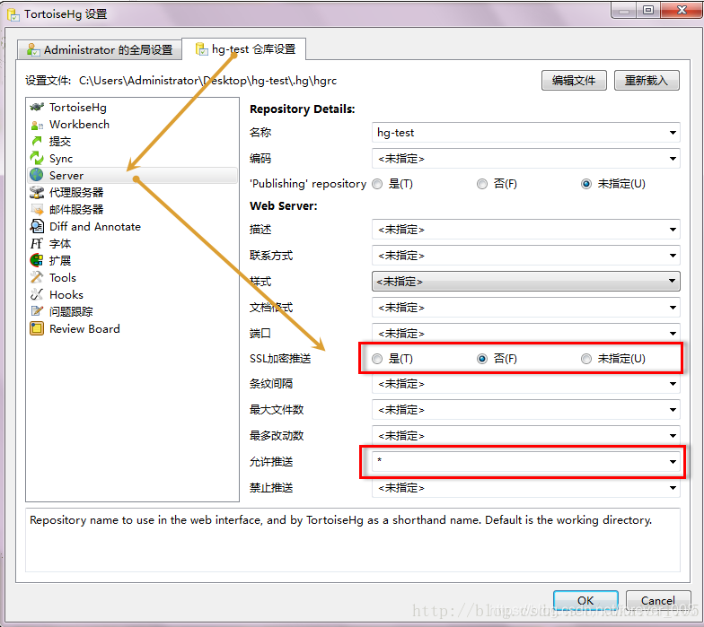​

#### 6）启动服务器

> 在 tortoiseHg 中选择【仓库】->【web server】
>
> ​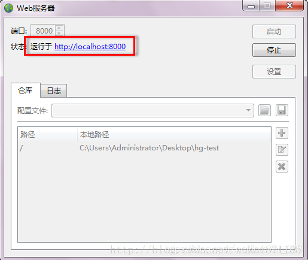​

###### 编写不易，感觉不错的点个赞呀！

> 原文地址 [https://blog.csdn.net/forever_008/article/details/104203895](https://blog.csdn.net/forever_008/article/details/104203895)

‍
