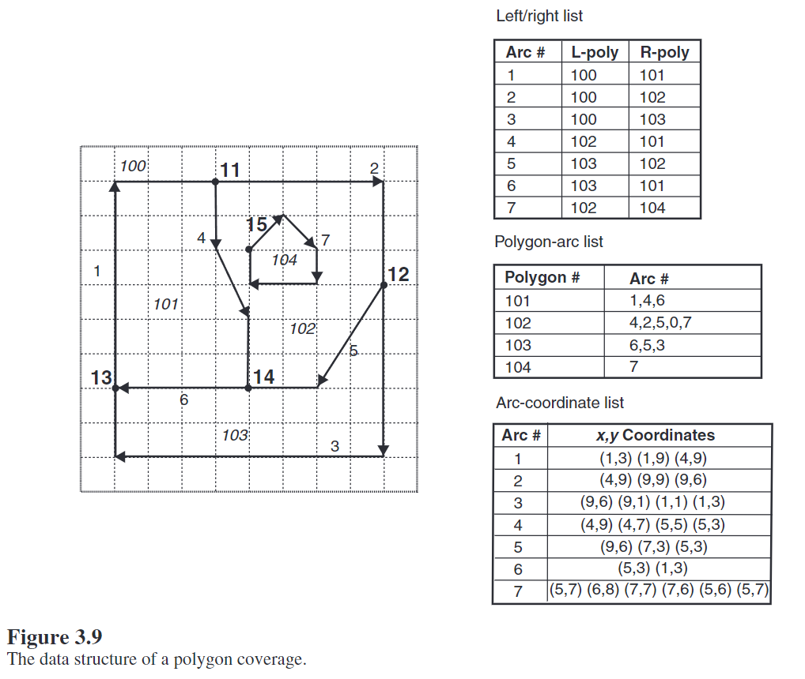

前置知识点：矢量数据，拓扑数据。

## 拓扑数据模型：

书上应该讲过，大致总结如下：

* spaghetti model：意大利面条式，这名字有点怪，不过课本上讲拓扑应该都按这个来讲的，基本的存储如下图，看图应该就记起来了。arcgis早期的coverage格式，海图中S57格式都用这个，Topojson也基本是类似的结构。后来不用是因为这种格式很难进行分析处理，Topojson，海图都主要是为了展示，因而还在用，而且这么存数据量其实比正常的点线面会小一些，有传输优势。  
  ​​
* 新版本的基本都是基于面向对象模型加规则了，如果做过实际项目的话，就应该知道拓扑检查那一大堆的条条框框。基本就是基于正常的数据，加上拓扑规则，然后进行处理，这样方便进行空间分析和进一步的处理。

## 面向对象数据模型：

简单来说，就是几何对象作为属性存到要素里，就叫面向对象数据模型，大部分我们接触到的都是这类数据。比如最常用到的Shapefile，PG库中的数据，mapgis，geoway等各家自己的矢量都算。类似下图：

​​

大部分公司的软件对这类数据的操作都遵循["SFS 简单要素模型标准"](./矢量数据模型/SFS%20简单要素模型标准.md) ，不论原来数据时怎么存的，到处理的时候，基本统一都是按照SFS标准进行处理的，这个课本上一般没有说。

所以务必要认真学一下这个标准，翻译的这个版本进行了部分简化，建议去啃一下原文，原文有两部分，至少要过一遍第一部分的所有概念

* [Simple Feature Access – Part 1: Common Architecture](https://www.ogc.org/standard/sfa/)
* [Simple Feature Access – Part 2: SQL Option](https://www.ogc.org/standard/sfs/)

简单要素模型主要定义有几个：

* 几何对象
* 对象操作
* WKB、WKT几何对象描述
* WKT空间参考描述
* 空间关系判断
* 几何运算

大部分软件不是完整支持，但是基本的点线面，多点多线多面，几何对象操作，wkb存储，空间关系判断等都是按标准走的，也就是大部分软件，包括ArcGIS，QGIS都是按照此标准来读写、处理矢量的。

## 常见数据的介绍

### Shapefile：

shapefile是比较常见的数据格式了，有很多文件：

必须的文件:

* .shp — 图形格式，用于保存元素的几何实体。
* .shx — 图形索引格式。几何体位置索引，记录每一个几何体在shp文件之中的位置，能够加快向前或向后搜索一个几何体的效率。
* .dbf — 属性数据格式，以dBase III+ 的数据表格式存储每个几何形状的属性数据。

其他可选的文件：

* .prj — 投帧式，用于保存地理坐标系统与投影信息，是一个存储[well-known text](https://zh.wikipedia.org/w/index.php?title=Well-known_text&action=edit&redlink=1 "Well-known text（页面不存在）")投影描述符的文本文件。
* .sbn and .sbx — 几何体的空间索引
* .fbn and .fbx — 只读的Shapefiles的几何体的空间索引
* .ain and .aih — 列表中活动字段的属性索引。
* .ixs — 可读写Shapefile文件的地理编码索引
* .mxs — 可读写Shapefile文件的地理编码索引(ODB格式)
* .atx — .dbf文件的属性索引，其文件名格式为*shapefile*.*columnname*.atx (ArcGIS 8及之后的版本)
* .shp.xml — 以XML格式保存元数据。
* .cpg — 用于描述.dbf文件的[代码页](https://zh.wikipedia.org/wiki/%E4%BB%A3%E7%A0%81%E9%A1%B5 "代码页")，指明其使用的[字符编码](https://zh.wikipedia.org/wiki/%E5%AD%97%E7%AC%A6%E7%BC%96%E7%A0%81 "字符编码")。

在每个.shp, .shx与.dbf文件之中，图形在每个文件的排序是一致的。也就是说，.shp的第一条记录与.shx及.dbf之中的第一条记录相对应，如此类推。此外，在.shp与.shx之中，有许多字段的[字节序](https://zh.wikipedia.org/wiki/%E5%AD%97%E8%8A%82%E5%BA%8F "字节序")是不一样的。因此用户在编写读取这些文件格式的程序时，必须十分小心地处理不同文件的不同字节序。

Shapefile通常以X与Y的方式来处理地理坐标，一般X对应经度，Y对应纬度，用户必须注意X，Y的顺序。

#### Shapefile数据限制

[ArcMap文档](https://desktop.arcgis.com/zh-cn/arcmap/latest/manage-data/shapefiles/geoprocessing-considerations-for-shapefile-output.htm#GUID-B845DF9F-78C9-439F-9674-2BFEEFF8D58E)中有Shapefile输出的注意事项，我知道你们懒得看，总结一下：

* 不能超过2GB
* 字段名最长为10个字符（4个汉字）
* 无法在日期中存时间
* 属性的最大记录长度为 4000 字节。记录长度是用于定义全部字段的字节数，而非用于存储实际值的字节数。
* 最大字段数为 255。若超出此上限，当转换为 shapefile 时会转换前 255 个字段。
* 字段宽度是固定的，如下表所示，所以文本型不超过254个字符
* |地理数据库数据类型|dBASE 字段类型|dBASE 字段宽度（字符数）|
  | --------------------| ----------------| --------------------------|
  |Object ID|数值|9|
  |短整型|数值|4|
  |长整型|数值|9|
  |浮点型|浮点型|13|
  |双精度型|浮点型|13|
  |文本型|字符|254|
  |日期型|日期型|8|

### **PersonalGeodatabase**

就是MDB，这玩意挺坑的，用的实际是MicroSoft Access数据库，可以直接用Access打开，现在建议都是用**FileGeoDatabase而不是这个，因为这个比Shapefile还要坑。**

|属性|最大|
| -------------------------------------------------------------------| --------------------------------------------------------------------------------------------------------------------------------------------------------------------------------------------------------|
|Access 数据库（.accdb 或 .mdb）的总大小，包括所有数据库对象和数据|2 GB 减去系统对象所需的空间。  注意:可通过链接到其他 Access 数据库中的表来解决此大小限制。 可链接到多个数据库文件中的表，每个数据库文件大小可达 2GB。  提示:有关减少数据库大小的详细信息，请参阅[使用 “压缩和修复” 帮助防止并更正数据库文件问题](https://support.microsoft.com/zh-cn/topic/%E9%80%9A%E8%BF%87%E4%BD%BF%E7%94%A8-%E5%8E%8B%E7%BC%A9%E5%92%8C%E4%BF%AE%E5%A4%8D%E6%95%B0%E6%8D%AE%E5%BA%93-%E5%B8%AE%E5%8A%A9%E9%98%B2%E6%AD%A2%E5%92%8C%E6%9B%B4%E6%AD%A3%E6%95%B0%E6%8D%AE%E5%BA%93%E6%96%87%E4%BB%B6%E9%97%AE%E9%A2%98-6ee60f16-aed0-40ac-bf22-85fa9f4005b2)。|
|数据库中对象的总数|32,768|
|模块数量（包括将 HasModule 属性设置为 True 的窗体和报表）|1,000|
|对象名中的字符数|64|
|密码中的字符数|14|
|用户名或组名中的字符数|20|
|并发用户数|255|

‍

### **FileGeoDatabase**

除了注意一下字段的编码，其他问题不大

文件地理数据库的大小和名称限制如下：

文件地理数据库的大小 - 无限制

表或要素类大小 - 1 TB（默认值）、4 GB 或 256 TB（带关键字）

要素类和表的数量 - 2,147,483,647

要素类或表中的字段数 - 65,534

要素类或表中的行数 - 2,147,483,647

地理数据库名称长度 - 操作系统所允许的文件夹名的字符数

要素数据集名称长度 - 160 个字符

要素类或表名的长度 - 160 个字符

字段名称长度 - 64 个字符

文本字段的宽度 - 2,147,483,647 个字符

### PostGIS

没啥限制，好用，文档也全，各种操作文档里很详细，推荐过的PostGIS in Action可以看看。不过注意，[pg库查询要素数量很慢](https://wiki.postgresql.org/wiki/Slow_Counting)，这是一个已知问题，非常慢，建议是自己写sql查，虽然不准，但是快。

### Geojson

Geojson因为没有索引，查询很慢，所以大数据量（超过10兆，或者超过200条）就不要上geojson。其实除了webGIS里客户端临时采编的数据可以用，哪里最好都别用这玩意，效率问题太大了（KML，GML之类基于文本的数据类型同理，非必要不使用）。正常情况老老实实上数据库。

### GPKG

GPKG中实际是一个sqlite库，可以直接用sqlitespy之类的工具打开查看，非海量数据（千万级以下）其实挺好用的。日常使用或者自己造数据可以用Gpkg存，一个是单文件，二来sqlite稳定性和兼容性都比shpfile要好得多。

### DXF/DGW

这两都得转格式，FME或者其他软件转，直接用不太行，不好做分析和后处理。我们不是搞土木的，需要地理数据，而非cad数据。

### FlatGeobuf

其实这种数据用的很少，这个问题在于它不支持空Geometry，而实际使用时碰到空Geometry的情况还不少，虽然它自己说要取代shapefile，但实际应用中因为这个几乎没人用，尽量别用吧。

### WFS

wfs实际也是纯数据,而且可以通过接口对数据进行修改,详细可以看看wfs协议内容。不过实际上使用较少，它并不是看的，而是实际数据！

‍
