# SFS 简单要素模型标准

# 

本文由 [简悦 SimpRead](http://ksria.com/simpread/) 转码， 原文地址 [www.osgeo.cn](https://www.osgeo.cn/gis-booklet/ogc-standard-02.html)

SFS（OpenGIS® Simple Features Interface Standard）的当前版本是 1.2.0。

## 2.2.1. 概述 [¶](#id1 "Permalink to this heading")

SFS（OpenGIS® Simple Features Interface Standard）的当前版本是 1.2.0。 事实上 SFS 中包括两部分内容，第一部分是描述简单要素的通用模型（ [Part1: Common architecture](http://www.opengeospatial.org/standards/sfa) ）、 另一部分是描述前一部分模型在 SQL 中的实现（ [Part 2: SQL option](http://www.opengeospatial.org/standards/sfs) ） 2(#id3) 。 我们平时所熟知的 WKT、WKB 等就在第一部分中叙述，而在空间 SQL 语句中常见的 AsText 、 Intersects 操作等则在第二部分中有定义。

下面就 SFS 中比较重要的内容进行详细的说明，包括第一部分中的几何对象模型、WKT 描述的几何对象、 WKB 描述的几何对象、WKT 描述的空间参考和第二部分中的 SQL 预定义 schema、SQL 几何类型、SQL 空间操作。

## 2.2.2. 几何对象模型 [¶](#id4 "Permalink to this heading")

​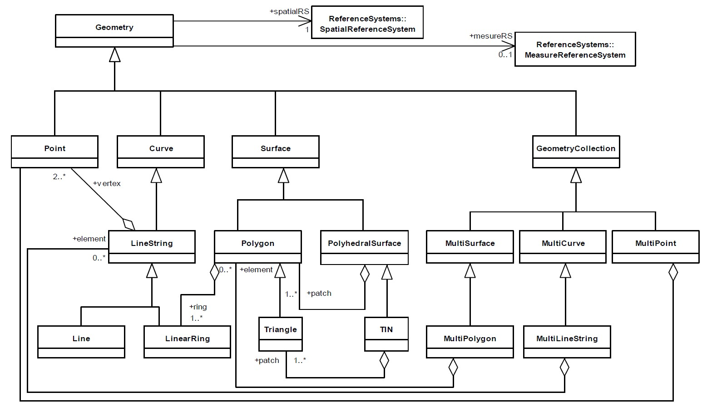​

图 1 SFS 中定义的几何对象模型

图 1 显示的是 SFS 中几何对象的关系结构，简单要素中的几何对象主要就是定义了点、线、面和多点、多线、多面。另外，几何对象还涉及一系列的操作，如图 2 所示。

​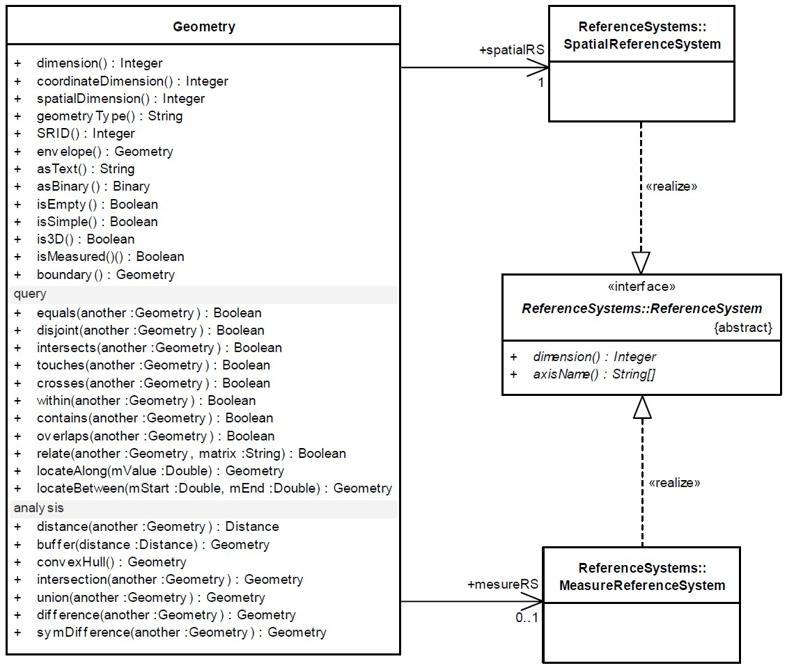​

图 2 Geometry 的操作

## 2.2.3. WKT 描述的几何对象 [¶](#wkt "Permalink to this heading")

WKT（Well-known Text）可以通过文本来描述几何对象。 下面的例子可以比较快速、直观地说明什么是 WKT：

|几何类型|WKT 例子|说明|
| --------------------| ------------------------------------------------------------------------------------------------------------------------------------------------------------------------------------------------------------------------------------------------------------------| ---------------------------|
|Point|Point (10 10)|点|
|LineString|LineString ( 10 10, 20 20, 30 40)|有 3 个节点的线|
|Polygon|Polygon ((10 10, 10 20, 20 20, 20 15, 10 10))|叧有 1 个外环的多边形|
|MultiPoint|MultiPoint ((10 10), (20 20) )|多点|
|MultiLineString|MultiLineString ((10 10, 20 20), (15 15, 30 15) )|多线|
|MultiPolygon|MultiPolygon ( ((10 10, 10 20, 20 20, 20 15, 10 10)), ((60 60, 70 70, 80 60, 60 60 )) )|多面|
|GeometryCollection|GeometryCollection (POINT (10 10), POINT (30 30), LINESTRING (15 15, 20 20) )|几何集合|
|PolyhedralSurface|PolyhedralSurface Z ( ((0 0 0, 0 0 1, 0 1 1, 0 1 0, 0 0 0)), ((0 0 0, 0 1 0, 1 1 0, 1 0 0, 0 0 0)), ((0 0 0, 1 0 0, 1 0 1, 0 0 1, 0 0 0)), ((1 1 0, 1 1 1, 1 0 1, 1 0 0, 1 1 0)), ((0 1 0, 0 1 1, 1 1 1, 1 1 0, 0 1 0)), ((0 0 1, 1 0 1, 1 1 1, 0 1 1. 0 0 1)) )|多个表面构成的立方体|
|Tin|Tin Z ( ((0 0 0, 0 0 1, 0 1 0, 0 0 0)), ((0 0 0, 0 1 0, 1 0 0, 0 0 0)), ((0 0 0, 1 0 0, 0 0 1, 0 0 0)), ((1 0 0, 0 1 0, 0 0 1, 1 0 0)), )|4 个三角形构成的 TIN 网格|
|Point|Point Z (10 10 5)|三维点|
|Point|Point ZM (10 10 5 40)|带 M 值的三维点|
|Point|Point M (10 10 40)|带 M 值的二维点|

表 2 WKT 描述几何对象示例

## 2.2.4. WKB 描述的几何对象 [¶](#wkb "Permalink to this heading")

WKB（Well-known Binary）通过序列化的字节对象来描述几何对象。 在 WKB 中主要涉及两种数值类型：一种是 uint32 ， 占 4 个字节，用以存储节点数、几何对象类型等信息； 另一种是 double ，占 8 个字节，用以存储节点坐标值。 其中的几何对象类型对应的整数可以参考下表：

​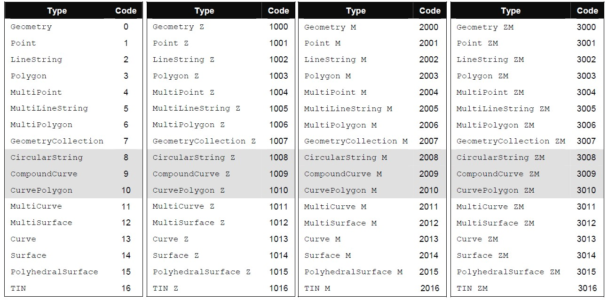​

图 3 WKB 中几何类型对应的整数值

除此之外，WKB 在第一位还存储了一个额外的字节用来标识字节序 3(#id6) （ 0\=Big-Indian ， 1\=Little-Indian ）。 因此，对于一个点（不带 M 值的二维点）来说，它的 WKB 描述应该类似下面的结构，总共占据 21 个字节：

​​

图 4 WKB 描述点的字节结构

对于有 2 个节点的线来说，WKB 描述应该 包括 41 个字节：

​​

图 5 WKB 描述线的字节结构

对于仅有 1 个外环，由 3 个节点构成的多边形来说，WKB 描述则应该 包括 77 个字节：

​​

图 6 WKB 描述多边形的字节结构

## 2.2.5. WKT 描述的空间参考 [¶](#id7 "Permalink to this heading")

WKT 除了可以描述几何对象，也可以描述空间参考。通过两个例子可以很直观地看到如何通过文本来描述空间参考。

对于一个地理坐标系，比如最常见的 WGS84 坐标系统，WKT 描述是这样的：

GEOGCS

[

"GCS\_WGS\_1984",

DATUM["D\_WGS\_1984",SPHEROID["WGS\_1984",6378137.0,298.257223563]],

PRIMEM["Greenwich",0.0],

UNIT["Degree",0.0174532925199433],

AUTHORITY["EPSG",4326]

]

“GEOGCS” 表明其后紧随的 “ [] ” 中描述的是一个地理坐标系统。 该坐标系统名称为 GCS\_WGS\_1984 ； 采用的大地基准面为 D\_WGS\_1984 ， 该基准面近似椭球体的长轴为 6378137.0 米、扁率为 298.257223563； 以格林威治 0 度经线为起始经线；地图单位为度，该单位的转换因子 4(#id10) 为 0.0174532925199433（π/180）； 最后，该坐标系统在 EPSG 5(#id11) 中的编码为 4326 。

对于一个投影坐标系，比如 WGS84 Web Mercator（Auxiliary Sphere） 坐标系统， WKT 描述是这样的：

PROJCS

[

"WGS\_1984\_Web\_Mercator\_Auxiliary\_Sphere",

GEOGCS

[

"GCS\_WGS\_1984",

DATUM["D\_WGS\_1984",SPHEROID["WGS\_1984",6378137.0,298.257223563]],

PRIMEM["Greenwich",0.0],

UNIT["Degree",0.0174532925199433]

],

PROJECTION["Mercator\_Auxiliary\_Sphere"],

PARAMETER["False\_Easting",0.0],

PARAMETER["False\_Northing",0.0],

PARAMETER["Central\_Meridian",0.0],

PARAMETER["Standard\_Parallel\_1",0.0],

PARAMETER["Auxiliary\_Sphere\_Type",0.0],

UNIT["Meter",1.0],

AUTHORITY["EPSG",3857]

]

类似的，“PROJCS” 代表这是一个投影坐标系。投影坐标系中必然会包括一个地理坐标系， 这里的地理坐标系就是 GCS\_WGS\_1984 ，这个地理坐标系的定义和上面的类似。

下面紧跟着的是投影的相关参数， Mercator\_Auxiliary\_Sphere 是采用投影的名称， 这个投影坐标系以 0 度经线为中央经线进行投影； 坐标系的单位为米（显然，转换因子就为 1.0）， 而该坐标系的 EPSG 编码为 3857 。

## 2.2.6. SQL 预定义 schema[¶](#sql-schema "Permalink to this heading")

在空间数据库中，需要一些表来存储和管理几何字段、空间参考等信息，因此 OGC 首先规定了在数据库中需要的 Schema 对象 6(#id13) ：

​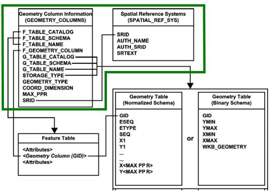​

图 7 OGC 空间数据库中需要预定义的 schema

可见，数据库中必须要有一个记录几何字段信息的 GEOMETRY\_COLUMNS 表和一个记录空间参考信息的 SPATIAL\_REF\_SYS 表。 从支持 OGC 标准的空间数据库中，我们都可以找到这两张表。 当然，有些空间数据库直接使用 GEOMETRY\_COLUMNS\`\`和 \`\`SPATIAL\_REF\_SYS 作为这两张表的名称， 比如 PostGIS ； 有些则采用其它名字，比如 Oracle Spatial 采用 OGIS\_GEOMETRY\_COLUMNS 和 OGIS\_SPATIAL\_REFERENCE\_SYSTEMS 、 ArcSDE for Oracle 则采用 GEOMETRY\_COLUMNS 和 SPATIAL\_REFERENCES，不一而同。

## 2.2.7. SQL 几何对象存储 [¶](#sql "Permalink to this heading")

图 7 中显示在 OGC 标准中几何信息存储在一个 Geometry 表中， 这个表可以用常规字段或 WKB 两种方式存储几何对象，Geometry 表通过 GID 字段关联到 Feature 表的几何字段。 事实上，OGC 标准中还有一种定义，Feature 表的几何字段也可以是 SQL UDT（自定义类型）， 也就是不需要额外的 Geometry 表来存储几何信息，而直接存储在 Feature 表的几何字段中。 大多数数据库都是采用这种自定义类型的方式存储几何信息，比如 ArcSDE 中的 ST\_Geometry 类型、 PostGIS 中的 Geometry 和 ST\_Geometry 类型。

自定义类型可以采用 SFS 标准中定义的几何类型，也可以采用 SQL/MM 7(#id15) 的定义， 比如 PostGIS 对这两种定义都进行了支持，下图是 SFS 和 SQL/MM 几何类型定义的一个对应关系：

​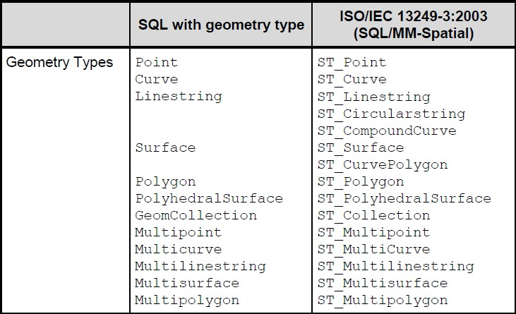​

图 8 SFS 和 SQL/MM 几何类型的对应关系

用户既可以遵循 SFS 的定义，使用类似 “Geometry”、“Point” 这样的命名；也可以遵循 SQL/MM 定义，采用 ST\_ 作为前缀进行命名，如 ST\_Geometry 、 ST\_Point 。

SQL 几何类型的继承关系可参考图 9， 可以发现 SQL 中实现的几何对象模型和图 1 所示的通用几何对象模型非常类似。

​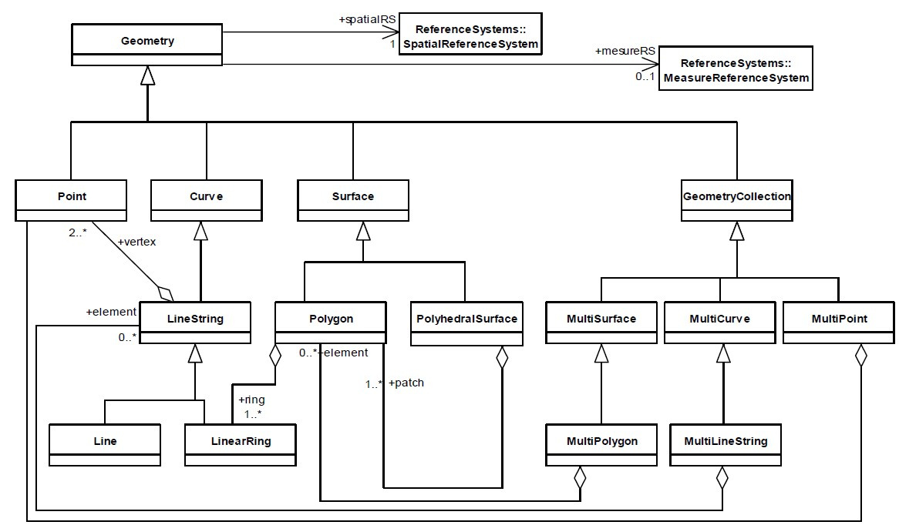​

图 9 SQL 几何对象模型

## 2.2.8. SQL 空间操作 [¶](#id16 "Permalink to this heading")

以 SQL/MM 定义为例，在 SFS 中规定了以下的操作。

### 1. 所有几何对象支持 [¶](#id17 "Permalink to this heading")

|几何对象构造|说明|
| -----------------| ---------------------|
|ST\_WKTToSQL|从 WKT 构造几何对象|
|ST\_WKBToSQL|从 WKB 构造几何对象|

|几何信息获取|说明|
| ---------------------| -----------------|
|ST\_AsText|获取 WKT 描述|
|ST\_AsBinary|获取 WKB 描述|
|ST\_Dimension|获取维数|
|ST\_GeometryType|获取几何类型|
|ST\_SRID|获取空间参考 ID|
|ST\_IsEmpty|是否为空|
|ST\_IsSimple|是否是简单对象|
|ST\_Boundary|获取边界|
|ST\_Envelope|获取矩形范围|

|空间关系判断|说明|
| -------------------| ------------------------------------------------------------------------------------------------------------------------------------------------------------------------------------------------------------------------------------------------------------|
|ST\_Equals|​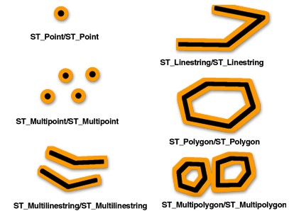​|
|ST\_Disjoint|​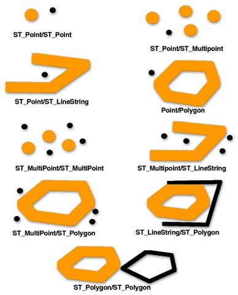​|
|ST\_Intersects|任意部分有相交，等价于判断空间关系的 DE-9IM 字符串表达是否是以下之一：  T\*\*\*\*\*\*\*\*  \*T\*\*\*\*\*\*\*  \*\*\*T\*\*\*\*\*  \*\*\*\*T\*\*\*\*|
|ST\_Touches|​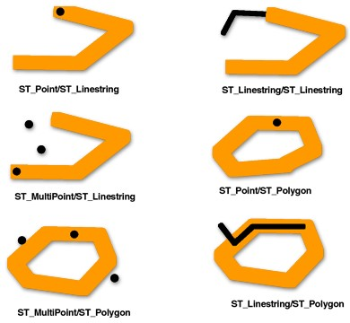​|
|ST\_Crosses|​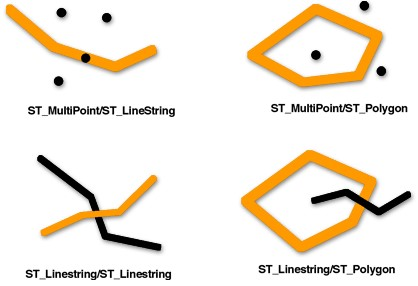​|
|ST\_Within|​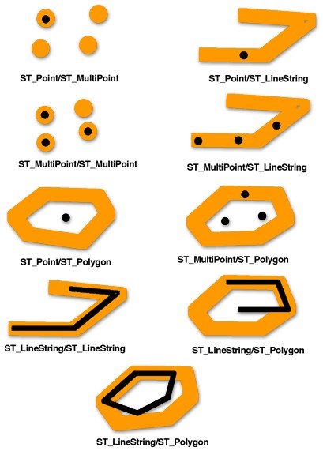​|
|ST\_Contains|​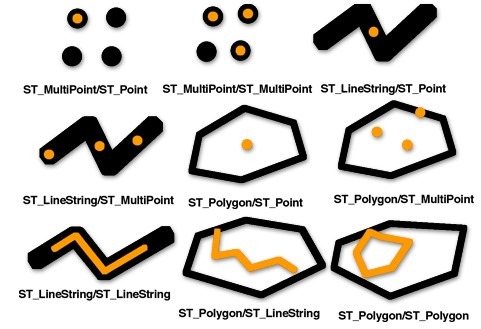​|
|ST\_Overlaps|​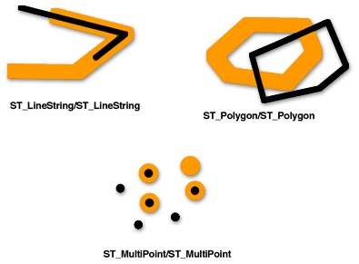​|
|ST\_Relate|判断是否满足 DE-9IM 字符串表达关系|

|距离计算|说明|
| -----------------| ----------------------|
|ST\_Distance|几何对象间的最短距离|

|几何运算|说明|
| ----------------------| ------------------------------------------------------------------------------------------------------|
|ST\_Intersection|​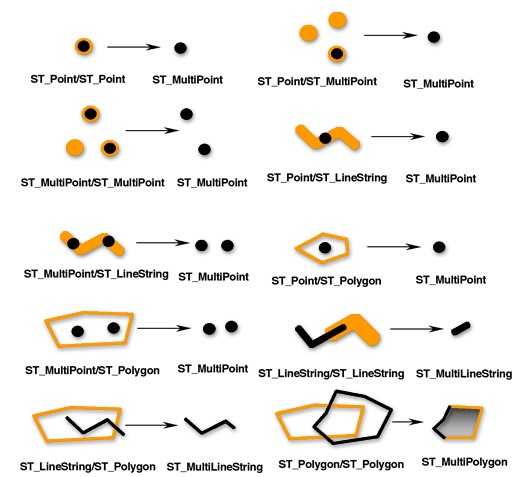​|
|ST\_Difference|​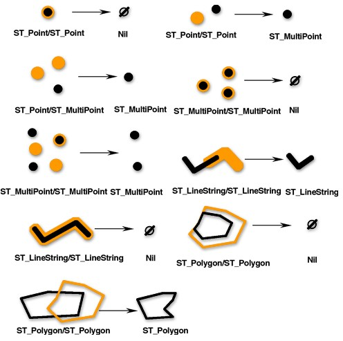​|
|ST\_Union|​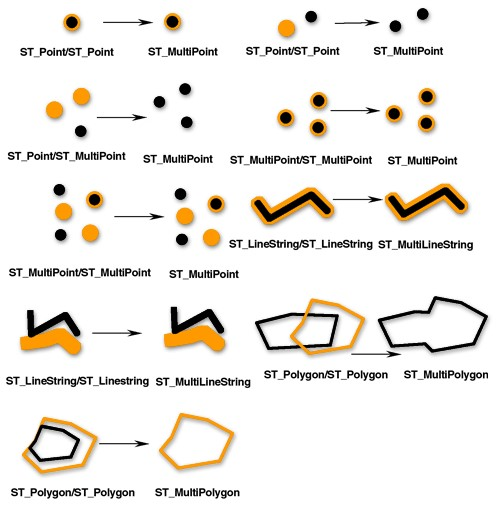​|
|ST\_SymDifference|​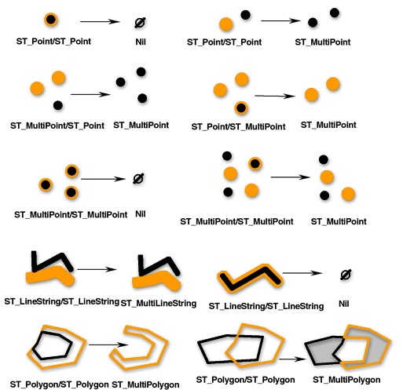​|
|ST\_Buffer|​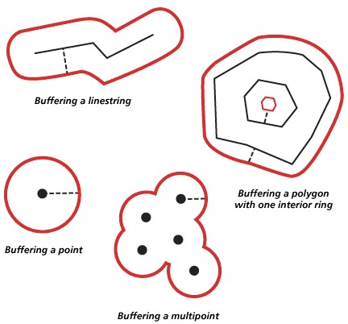​|
|ST\_ConvexHull|​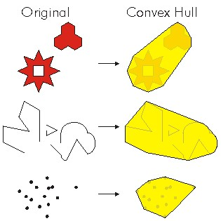​|

### 2. Point 对象支持 [¶](#point "Permalink to this heading")

|SQL 操作|说明|
| ----------| -----------|
|ST\_X|获取 X 值|
|ST\_Y|获取 Y 值|
|ST\_Z|获取 Z 值|
|ST\_M|获取 M 值|

### 3. Curve 对象支持 [¶](#curve "Permalink to this heading")

|SQL 操作|说明|
| -------------------| ------------|
|ST\_StartPoint|获取起始点|
|ST\_EndPoint|获取终点|
|ST\_IsRing|是否是环|
|ST\_Length|获取长度|

### 4. LineString 对象支持 [¶](#linestring "Permalink to this heading")

|SQL 操作|说明|
| ------------------| -----------------|
|ST\_NumPoints|节点数|
|ST\_PointN|获取第 n 个节点|

### 5. Surface 对象支持 [¶](#surface "Permalink to this heading")

|SQL 操作|说明|
| -----------------------| --------------|
|ST\_Centroid|获取中心点|
|ST\_PointOnSurface|获取面上一点|
|ST\_Area|获取面积|

### 6. Polygon 对象支持 [¶](#polygon "Permalink to this heading")

|SQL 操作|说明|
| ------------------------| -----------------|
|ST\_ExteriorRing|获取外环|
|ST\_NumInteriorRing|获取内环数|
|ST\_InteriorRingN|获取第 n 个内环|

### 7. GeomCollection 对象支持 [¶](#geomcollection "Permalink to this heading")

|SQL 操作|说明|
| ----------------------| ---------------------|
|ST\_NumGeometries|获取几何对象数|
|ST\_GeometryN|获取第 n 个几何对象|

### 8. MultiCurve 对象支持 [¶](#multicurve "Permalink to this heading")

|SQL 操作|说明|
| -----------------| ----------|
|ST\_IsClosed|是否闭合|
|ST\_Length|获取长度|

### 9. MultiSurface 对象支持 [¶](#multisurface "Permalink to this heading")

|SQL 操作|说明|
| -----------------------| --------------|
|ST\_Centroid|获取中心点|
|ST\_PointOnSurface|获取面上一点|
|ST\_Area|获取面积|

## 2.2.9. ArcGIS 对 SFS 的支持 [¶](#arcgis-sfs "Permalink to this heading")

ArcGIS 10 之前的全系列产品都支持 SFS 标准，版本为 1.1。下面通过几个 ArcSDE（Oracle）的空间 SQL 操作看一下：

select st\_astext(st\_geometry('POINT(116 39)',0)) from dual;

select shape from TEST where st\_envintersects(shape,40251885,4019516,40255159,4021607)\=1;

select shape from TEST where st\_intersects(shape, st\_geometry('POLYGON((0 0,180 -90,180 90,0 0))',2))\=1;

select st\_relate (g1, g2, 'T\*F\*\*FFF\*') equals, st\_relate (g1, g3, 'T\*F\*\*FFF\*') not\_equals from RELATE\_TEST;

select sum (st\_area (st\_difference (lot, footprint))) from FOOTPRINTS bf, LOTS where bf.building\_id \= lots.lot\_id;
