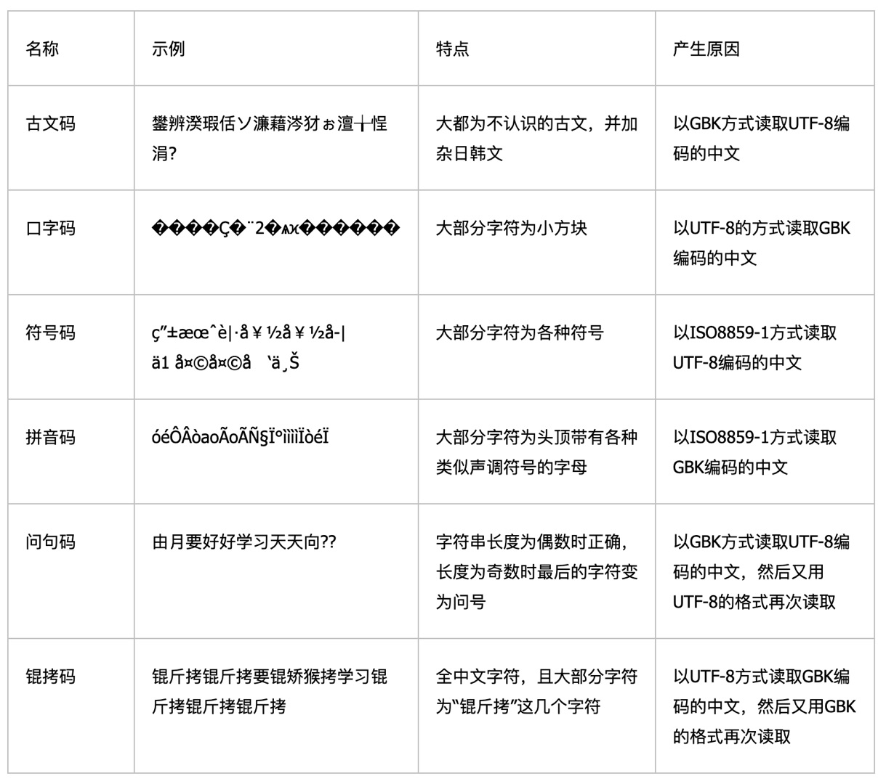

======================================
文本文件
======================================

文本文件：计算机的"人类语言"与编码世界
======================================

第一部分：文本文件的基本概念
------------------------------------

1.1 什么是文本文件？
~~~~~~~~~~~~~~~~~~~~

想象计算机世界有两种居民：

- **二进制文件** ：计算机的"母语"，用 0 和 1 直接对话
- **文本文件** ：人类的"翻译版"，用我们看得懂的字母、数字、符号书写

**通俗比喻** ：
- 文本文件就像 **写给人类的情书** ，用大家都能懂的语言表达
- 二进制文件就像 **机器人的内部通讯代码** ，只有机器人自己能理解

1.2 文本文件的核心特点
~~~~~~~~~~~~~~~~~~~~~~

1. **人类可读** ：用文本编辑器打开就能看懂内容
2. **纯字符组成** ：只包含字母、数字、标点符号等可打印字符
3. **结构简单** ：通常是线性结构（一行一行），不像二进制文件有复杂头部
4. **可编辑性强** ：任何文本编辑器都能修改，无需特殊工具

1.3 常见文本文件类型
~~~~~~~~~~~~~~~~~~~~

.. csv-table:: 常见文本文件类型
   :header: "文件类型", "扩展名", "主要用途"
   :widths: 25, 30, 45
   
   "纯文本文件", "`.txt`", "笔记、配置文件、日志、源代码"
   "源代码文件", "`.py`, `.java`, `.cpp`", "编写计算机程序"
   "标记语言文件", "`.html`, `.xml`, `.md`", "网页、数据交换、文档"
   "配置文件", "`.ini`, `.conf`, `.json`", "软件设置、数据存储"
   "脚本文件", "`.sh`, `.bat`, `.ps1`", "自动化任务、系统管理"

1.4 文本文件 vs. 二进制文件的直观对比
~~~~~~~~~~~~~~~~~~~~~~~~~~~~~~~~~~~~~~

**场景** ：存储 "Hello, 世界！" 这句话

**文本文件（UTF-8 编码）** :

::

   Hello, 世界！

- 人类：一眼就能看懂
- 计算机：需要先解码才能理解
- 文件大小：约 14 字节（取决于编码）

**二进制文件** :

- 可能存储为： ``48 65 6C 6C 6F 2C 20 E4 B8 96 E7 95 8C EF BC 81``
- 人类：完全看不懂
- 计算机：可以直接处理（如果知道编码）
- 文件大小：同样约 14 字节

**关键区别** ：文本文件是 **给人看的** ，二进制文件是 **给机器直接用的** 。

---

第二部分：Windows 和 Linux 下的文本文件异同
-------------------------------------------

2.1 最明显的差异：换行符
~~~~~~~~~~~~~~~~~~~~~~~~

这是两个系统之间最著名的"文化差异"。

2.1.1 历史渊源
^^^^^^^^^^^^^^

.. csv-table:: 换行符的历史
   :header: "系统", "历史背景"
   :widths: 30, 70
   
   "**早期打字机/电传机**", "需要两个动作：回车(CR, 0x0D)回到行首 + 换行(LF, 0x0A)到下一行"
   "**Windows**", "继承了 DOS，而 DOS 继承了 CP/M 系统，使用 CR+LF"
   "**Unix/Linux/macOS(现代)**", "简化设计，只用 LF 表示新行（因为 Unix 设计时认为 CR 已经隐含在 LF 中）"

2.1.2 技术对比
^^^^^^^^^^^^^^

.. csv-table:: 换行符技术对比
   :header: "系统", "换行符表示", "十六进制", "ASCII 字符", "人类读法"
   
   "**Windows**", "CR+LF", "0x0D 0x0A", "`\\r\\n`", "回车换行"
   "**Unix/Linux/macOS**", "LF", "0x0A", "`\\n`", "换行"
   "**经典 Mac OS (OS X 之前)**", "CR", "0x0D", "`\\r`", "回车"

2.1.3 实际影响
^^^^^^^^^^^^^^

**问题场景** ：在 Windows 创建的文件，在 Linux 下打开会看到奇怪字符

**Windows 文件（记事本创建）** ::

   第一行
   第二行

**在 Linux 的 `cat -A` 查看（显示特殊字符）** ::

   第一行^M$
   第二行^M$

这里的 ``^M`` 就是 Windows 的 CR 字符（ ``\\r`` ），Linux 不认识，显示为特殊符号。

2.1.4 解决换行符问题
^^^^^^^^^^^^^^^^^^^^

1. **现代编辑器的自动识别** ：
   - VSCode、Sublime、Notepad++ 等都能自动检测和转换
   - 通常状态栏会显示当前换行符类型（LF 或 CRLF）

2. **转换工具** ：

   **Linux/Unix** :

   .. code-block:: bash

      # 将 Windows 换行符转换为 Unix 换行符
      dos2unix windows_file.txt

      # 将 Unix 换行符转换为 Windows 换行符
      unix2dos unix_file.txt

   **使用 sed 命令** :

   .. code-block:: bash

      # 删除 CR 字符（Windows -> Unix）
      sed -i 's/\\r$//' windows_file.txt

      # 添加 CR 字符（Unix -> Windows）
      sed -i 's/$/\\r/' unix_file.txt

3. **Git 的智能处理** ：
   - Git 可以配置自动转换换行符

   .. code-block:: bash

      # Windows 用户：检出时转为 CRLF，提交时转为 LF
      git config --global core.autocrlf true

      # Linux/macOS 用户：不转换
      git config --global core.autocrlf input

2.2 编码默认值的差异
~~~~~~~~~~~~~~~~~~~~

2.2.1 历史默认编码
^^^^^^^^^^^^^^^^^^

.. csv-table:: 系统默认编码
   :header: "系统", "区域", "历史默认编码", "现代默认编码"
   
   "**Windows 中文版**", "中国大陆", "GBK", "UTF-8（较新系统）"
   "**Windows 英文版**", "英语国家", "Windows-1252", "UTF-8（较新系统）"
   "**Linux/macOS**", "全球", "UTF-8", "UTF-8"

2.2.2 Windows 记事本的编码问题
^^^^^^^^^^^^^^^^^^^^^^^^^^^^^^

Windows 记事本有个著名问题： **不保存编码信息** 。

**经典的"乱码"场景** ：

1. 用 Windows 记事本保存中文文本，默认使用 ANSI 编码（在中国就是 GBK）
2. 在 Linux 下用 UTF-8 编码打开 → 乱码！
3. 在 Linux 下用 GBK 编码打开 → 正常显示

**Windows 记事本如何区分编码？** 

.. csv-table:: Windows 记事本的编码检测机制
   :header: "文件开头", "记事本认为的编码"
   :widths: 40, 60
   
   "无特殊标记", "ANSI（系统默认编码，如 GBK）"
   "有 UTF-8 BOM ( `EF BB BF` )", "UTF-8"
   "有 UTF-16 LE BOM ( `FF FE` )", "UTF-16 LE"
   "有 UTF-16 BE BOM ( `FE FF` )", "UTF-16 BE"

2.2.3 Linux 的编码处理
^^^^^^^^^^^^^^^^^^^^^^

Linux 通常更"纯粹"：
- 默认假设文件是 UTF-8 编码
- 无 BOM 概念（实际上 BOM 在 UTF-8 中是可选的，Linux 程序通常不添加）
- 使用 `file` 命令检测文件编码

.. code-block:: bash

   # 检测文件编码和类型
   file myfile.txt
   # 输出可能：myfile.txt: UTF-8 Unicode text

   # 查看文件十六进制（看是否有 BOM）
   head -c 10 myfile.txt | xxd

2.3 文件扩展名处理差异
~~~~~~~~~~~~~~~~~~~~~~

2.3.1 Windows：强依赖扩展名
^^^^^^^^^^^^^^^^^^^^^^^^^^^

Windows 通过扩展名关联：
- ``.txt`` → 记事本打开
- ``.py`` → Python 相关程序打开
- 双击文件时根据扩展名选择程序

2.3.2 Linux：内容重于扩展名
^^^^^^^^^^^^^^^^^^^^^^^^^^^

Linux 更关注文件 **内容** 和 **权限** ：
- 可执行文件需要有 `x` 权限
- 通过"shebang"（ ``#!/path/to/interpreter`` ）指定解释器
- 扩展名主要给人类参考

**Linux 执行脚本的例子** :

.. code-block:: bash

   # 文件内容开头有 shebang
   #!/bin/bash
   echo "Hello World"

   # 赋予执行权限后可直接运行
   chmod +x myscript
   ./myscript

2.4 路径和文件名的差异
~~~~~~~~~~~~~~~~~~~~~~

.. csv-table:: 路径和文件名的差异
   :header: "特性", "Windows", "Linux"
   
   "**路径分隔符**", "反斜杠 `\\`", "正斜杠 `/`"
   "**大小写敏感**", "不敏感（默认）", "敏感"
   "**非法字符**", "`\\ / : * ? \"" < > \\|`", "只有 `/` 和空字符"
   "**根目录**", "盘符：`C:\\`  `D:\\`", "统一根：`/`"

**跨平台开发建议** ：

1. 始终使用正斜杠 ``/`` 作为路径分隔符（Windows 也支持）
2. 假设文件名大小写敏感
3. 避免使用特殊字符
4. 使用 Python 的 `os.path.join()` 等跨平台函数

第三部分：字符集与字符编码的深度解析
----------------------------------------

引言：计算机字符编码的发展历史
~~~~~~~~~~~~~~~~~~~~~~~~~~~~~~~

计算机字符编码的发展，是一部人类语言与计算机二进制世界的"翻译史"。为了让计算机能处理人类文字，工程师们发明了各种编码方案，大致经历了三个阶段：

.. mermaid::

   timeline
        title 计算机字符编码发展史
        section 第一阶段 (1960s-1980s)
            ASCII编码 : 只支持128个英文字符 奠定编码基础
        section 第二阶段 (1980s-1990s)
            字符编码本地化 : 各国制定自己的编码 ANSI系列编码
            混乱时期 : 编码不互通 "乱码"问题频发
        section 第三阶段 (1990s-现在)
            Unicode诞生 : 统一全球字符编码
            UTF-8普及 : 成为互联网标准 解决编码混乱

让我们深入这三个阶段，理解为什么需要从ASCII走向Unicode。

3.1 字符集与字符编码的基本概念
~~~~~~~~~~~~~~~~~~~~~~~~~~~~~~

3.1.1 为什么需要区分这两个概念？
^^^^^^^^^^^^^^^^^^^^^^^^^^^^^^^^^

想象你要写一本 **多语言字典**：

1. **字符集 (Character Set)**：这本字典的 **词条列表** - 收录了哪些字符
   - 如：收录了"A"、"中"、"😀"这些字符
   - 告诉你有多少字符，每个字符叫什么名字
   - **关键问题**：有哪些字符？

2. **字符编码 (Character Encoding)**：这本字典的 **索引系统** - 如何找到每个字符
   - 如：A在第65页，中在第20001页，😀在第128512页
   - 制定规则：按什么顺序排列？如何快速查找？
   - **关键问题**：字符怎么存储和查找？

**实际类比**:

- **字符集** 就像 **电话本**: 记录了人名和电话号码的对应关系
- **字符编码** 就像 **电话号码的格式**: 是写成"(010)12345678"还是"+861012345678"

3.1.2 严格的计算机科学定义
^^^^^^^^^^^^^^^^^^^^^^^^^^^

.. csv-table:: 字符集与字符编码的正式定义
   :header: "概念", "计算机科学定义"
   :widths: 40, 60
   
   "**字符集 (Charset)**", "一个系统支持的所有抽象字符的集合，每个字符被赋予一个唯一的标识符（码点，Code Point）。它定义了'有哪些字符'。"
   "**字符编码 (Encoding)**", "将字符的码点映射到二进制序列（字节序列）的算法或规则。它定义了'字符如何存储在计算机中'。"

3.1.3 两者的关系：一对一 vs. 一对多
^^^^^^^^^^^^^^^^^^^^^^^^^^^^^^^^^^^^

**情况一：字符集 = 字符编码（早期编码）**

在早期简单系统中，字符集和编码通常是 **一对一** 关系：

.. mermaid::

   graph LR
    A[ASCII字符集 128个字符] --> B[ASCII编码 1字节/字符]
    
    C[GB2312字符集 6763个汉字] --> D[GB2312编码 2字节/汉字]
    
    E[ISO-8859-1字符集 256个字符] --> F[ISO-8859-1编码 1字节/字符]

这些编码的设计相对简单：每个字符直接对应固定的字节表示。

**情况二：一个字符集，多种编码（现代编码）**

Unicode字符集设计了 **一对多** 的编码方式：

.. mermaid::

   graph TD
    Unicode[Unicode字符集 全球所有字符] --> UTF8[UTF-8编码 变长1-4字节]
    
    Unicode --> UTF16[UTF-16编码 变长2/4字节]
    
    Unicode --> UTF32[UTF-32编码 固定4字节]

同一个字符 "中" （U+4E2D）在不同的编码中:
- UTF-8： ``0xE4 0xB8 0xAD`` （3字节）
- UTF-16： ``0x4E 0x2D`` （2字节，小端序）
- UTF-32： ``0x00 0x00 0x4E 0x2D`` （4字节，小端序）

3.1.4 码点：字符的"身份证号"
^^^^^^^^^^^^^^^^^^^^^^^^^^^^

**码点（Code Point）** 是字符在字符集中的唯一数字编号。

.. csv-table:: 码点表示方式示例
   :header: "字符", "Unicode码点", "码点格式", "说明"
   :widths: 25, 25, 25, 25
   
   "A", "U+0041", "十六进制，4位", "前缀U+表示Unicode"
   "中", "U+4E2D", "十六进制，4位", "中日韩统一表意文字"
   "😀", "U+1F600", "十六进制，5位", "表情符号（需要更多位）"

**重要概念**:
- 码点只是 **编号**，不是存储方式
- 编码负责将码点转换为 **字节序列**
- 同一个码点在不同编码中可能有不同的字节表示

3.2 第一阶段：ASCII编码 - 计算机字符编码的起点
~~~~~~~~~~~~~~~~~~~~~~~~~~~~~~~~~~~~~~~~~~~~~~

3.2.1 ASCII的历史背景与设计理念
^^^^^^^^^^^^^^^^^^^^^^^^^^^^^^^^

**ASCII（American Standard Code for Information Interchange）** 诞生于1963年，由美国标准协会制定。

.. csv-table:: ASCII诞生的技术背景
   :header: "时代背景", "技术限制与影响"
   :widths: 40, 60
   
   "**早期计算机内存昂贵**", "7位设计（128字符）节省内存"
   "**美国中心主义**", "只为英语设计，忽略其他语言"
   "**电传打字机传统**", "包含大量控制字符（CR、LF等）"
   "**8位字节未普及**", "设计为7位，留1位用于奇偶校验"

ASCII的设计哲学： **最小化、实用化**。只包含:
- 英文字母（大小写各26个）
- 数字（0-9）
- 标点符号
- 控制字符（换行、回车、响铃等）

3.2.2 ASCII字符集的结构解析
^^^^^^^^^^^^^^^^^^^^^^^^^^^^

ASCII字符集共128个字符，分为两大区域：

.. mermaid::

   graph TB
    subgraph "ASCII字符集 (7位, 128个字符)"
        A[0-31区: 控制字符] --> A1[不可打印 用于设备控制]
        B[32-126区: 可打印字符] --> B1[字母、数字、标点]
        C[127区: 删除字符] --> C1[DEL 0x7F]
    end

**详细分区**:

1. **控制字符区（0-31，0x00-0x1F）**
   - 设计初衷：控制电传打字机等设备
   - 重要控制字符:
     - ``0x0A`` (LF): 换行（Line Feed）- 移到下一行
     - ``0x0D`` (CR): 回车（Carriage Return）- 回到行首
     - ``0x07`` (BEL): 响铃（Bell）- 发出声音提示
     - ``0x1B`` (ESC): 退出（Escape）- 控制序列开始

2. **可打印字符区（32-126，0x20-0x7E）**
   - 包含所有可见字符
   - 起始于空格（0x20）
   - 包含:
     - 数字：0x30-0x39（'0'-'9'）
     - 大写字母：0x41-0x5A（'A'-'Z'）
     - 小写字母：0x61-0x7A（'a'-'z'）
     - 标点符号：各种常用标点

3. **删除字符（127，0x7F）**
   - DEL：删除上一个字符

3.2.3 ASCII编码的规则与示例
^^^^^^^^^^^^^^^^^^^^^^^^^^^^

在ASCII中，字符集和编码是 **一体** 的：

**编码规则**：每个字符直接对应一个7位的二进制数

.. csv-table:: ASCII编码示例
   :header: "字符", "十进制", "十六进制", "二进制", "存储字节", "说明"
   :widths: 15, 15, 15, 15, 20, 20
   
   "'A'", "65", "0x41", "1000001", "01000001", "大写字母A"
   "'a'", "97", "0x61", "1100001", "01100001", "小写字母a"
   "'0'", "48", "0x30", "0110000", "00110000", "数字0"
   "LF", "10", "0x0A", "0001010", "00001010", "换行符"
   "空格", "32", "0x20", "0100000", "00100000", "空格字符"

**重要细节**:
- ASCII本应是7位，但实际存储使用8位（1字节）
- 最高位（第8位）通常为0，或用于奇偶校验
- 这为后来的扩展留下了空间

3.2.4 ASCII的局限性
^^^^^^^^^^^^^^^^^^^

ASCII很快暴露出严重问题：

.. csv-table:: ASCII的局限性
   :header: "用户群体", "遇到的问题"
   :widths: 30, 70
   
   "**欧洲用户**", "无法表示重音字符：é, ñ, ç, ü, ø 无法表示货币符号：£, €"
   "**希腊用户**", "无法表示希腊字母：α, β, γ, Δ, Σ"
   "**俄语用户**", "无法表示西里尔字母：А, Б, В, Я"
   "**亚洲用户**", "完全无法表示汉字、日文、韩文"
   "**所有用户**", "无法表示数学符号：≠, ≤, ∞ 无法表示箭头：→, ⇔ 无法表示表情符号"

**根本问题**：128个字符位置太少，无法容纳全球文字。

3.3 第二阶段：字符编码本地化 - ANSI系列编码
~~~~~~~~~~~~~~~~~~~~~~~~~~~~~~~~~~~~~~~~~~~

3.3.1 扩展ASCII：从7位到8位
^^^^^^^^^^^^^^^^^^^^^^^^^^^^

解决ASCII局限性的最直接方法： **使用第8位**。

**技术方案**:
- ASCII使用7位（0-127）
- 8位字节可以表示256个值（0-255）
- 利用128-255这额外的128个位置添加新字符

**但新问题出现**：如何分配这128个新增位置？

.. mermaid::

   graph LR
    A[128个新增位置] --> B[欧洲方案]
    A --> C[俄语方案]
    A --> D[希腊语方案]
    A --> E[中文方案]
    
    B --> B1[ISO-8859-1 西欧语言]
    C --> C1[ISO-8859-5 西里尔字母]
    D --> D1[ISO-8859-7 希腊语]
    E --> E1[GB2312 双字节编码]

于是， **编码本地化** 时代开始了。

3.3.2 ANSI编码与代码页系统
^^^^^^^^^^^^^^^^^^^^^^^^^^^

**ANSI编码** 不是单一编码，而是 **基于区域的编码家族**。

**Windows的解决方案**：代码页（Code Page）系统

.. csv-table:: 常见Windows代码页
   :header: "代码页", "编码名称", "适用地区/语言"
   :widths: 25, 25, 50
   
   "CP437", "OEM美国", "原始IBM PC字符集"
   "CP850", "OEM多语言", "西欧语言（DOS）"
   "CP1252", "Windows-1252", "西欧语言（Windows）"
   "CP936", "GBK", "简体中文"
   "CP950", "Big5", "繁体中文"
   "CP932", "Shift-JIS", "日文"
   "CP949", "EUC-KR", "韩文"

**工作原理**:
1. 操作系统根据区域设置选择默认代码页
2. 文本文件不存储编码信息
3. 读取时使用系统默认代码页解释字节
4. 如果编码不匹配 → **乱码**

3.3.3 ISO-8859系列：欧洲的解决方案
^^^^^^^^^^^^^^^^^^^^^^^^^^^^^^^^^^^

ISO-8859是国际标准化组织的解决方案，包含16个子集：

.. csv-table:: ISO-8859主要子集
   :header: "子集", "支持的语种与字符"
   :widths: 25, 75
   
   "**ISO-8859-1** (Latin-1)", "西欧语言：法语é, ç；德语ä, ö, ü；西班牙语ñ"
   "**ISO-8859-2** (Latin-2)", "中欧语言：波兰语ł, ń；捷克语č, ř, ů"
   "**ISO-8859-5**", "西里尔字母：俄语、保加利亚语、塞尔维亚语"
   "**ISO-8859-7**", "希腊语：α, β, γ, Δ, Σ, Ω"
   "**ISO-8859-8**", "希伯来语：א, ב, ג, ש"
   "**ISO-8859-9** (Latin-5)", "土耳其语：ı, İ, ğ, ş"

**ISO-8859-1（Latin-1）结构示例**：

.. csv-table:: ISO-8859-1编码结构
   :header: "范围", "字符类型", "示例字符", "十六进制", "说明"
   :widths: 20, 20, 20, 20, 20
   
   "0x00-0x7F", "ASCII兼容", "A, 0, !", "与ASCII完全相同", "前128字符不变"
   "0x80-0x9F", "控制字符", "预留", "很少使用", "不同系统实现不一"
   "0xA0-0xFF", "扩展字符", "é, ñ, ç, £, ¥", "0xE9, 0xF1, 0xE7", "欧洲语言补充字符"

**致命缺陷**： **无法混合语言**
- ISO-8859-1不能显示希腊字母
- ISO-8859-7不能显示西里尔字母
- 更不可能显示汉字

3.3.4 中文编码：从GB2312到GB18030
^^^^^^^^^^^^^^^^^^^^^^^^^^^^^^^^^^

中文面临的挑战更大： **汉字数量庞大**。

**中文编码发展历程**：

.. mermaid::

   timeline
        title 中文编码发展史
        section 1980年
            GB2312 : 6763个汉字 兼容ASCII
        section 1984年
            Big5 : 繁体中文标准 台湾香港使用
        section 1995年
            GBK : 扩展至21886字 兼容GB2312
        section 2000年
            GB18030 : 强制国家标准 70244汉字 变长编码

**GB2312编码详解**

**设计思路**： **双字节编码**

.. csv-table:: GB2312编码结构
   :header: "组成部分", "字节范围", "说明"
   :widths: 20, 40, 40
   
   "单字节区", "0x00-0x7F", "完全兼容ASCII"
   "双字节区", "第一字节：0xA1-0xFE (94个) 第二字节：0xA1-0xFE (94个)", "94×94=8836个位置"

**区位码概念**:
- 每个汉字有"区号"和"位号"
- 如"中"字在第54区第48位 → 区位码5448
- 转换为国标码：区号+0xA0，位号+0xA0
- "中"字：54+0xA0=0xD6，48+0xA0=0xD0 → 0xD6D0

**GB2312的局限性**:
1. 仅包含简体字，不含繁体字
2. 字数有限（6763个），许多生僻字没有
3. 与台湾的Big5编码不兼容

**GBK编码：扩展与兼容**

GBK（汉字内码扩展规范）解决GB2312的局限：

.. csv-table:: GBK对GB2312的扩展
   :header: "扩展方面", "具体内容"
   :widths: 40, 60
   
   "**编码范围扩展**", "第一字节：0x81-0xFE 第二字节：0x40-0xFE（去掉0x7F）"
   "**字符数量增加**", "21886个汉字字符"
   "**包含繁体字**", "收录大量繁体字和生僻字"
   "**兼容性**", "完全兼容GB2312"

**GB18030：中国的强制标准**

GB18030是中国国家标准，具有法律强制性：

**主要特点**:
1. **变长编码**：1、2或4字节
2. **覆盖全面**：收录70244个汉字，覆盖所有Unicode字符
3. **强制实施**：在中国大陆销售的所有软件必须支持

.. csv-table:: GB18030编码结构
   :header: "字节数", "编码范围", "说明"
   :widths: 20, 30, 50
   
   "1字节", "0x00-0x7F", "兼容ASCII"
   "2字节", "第一字节0x81-0xFE 第二字节0x40-0xFE（除0x7F）", "兼容GBK"
   "4字节", "第一字节0x81-0xFE 第二字节0x30-0x39 第三字节0x81-0xFE 第四字节0x30-0x39", "扩展区"

3.3.5 本地化编码的根本问题
^^^^^^^^^^^^^^^^^^^^^^^^^^

**"编码混乱"时代** 的特征:

1. **互不兼容**:
   - 日语Shift-JIS文件在中文系统打开 → 乱码
   - 中文GBK文件在俄语系统打开 → 乱码
   - 法语ISO-8859-1文件在希腊语系统打开 → 乱码

2. **无自标识**:
   - 文件本身不包含编码信息
   - 依赖系统区域设置猜测编码
   - 猜错就乱码

3. **混合文本困难**:
   - 无法在同一文档中混合多语言
   - 如：中文+日文+俄文的文档不可能

**典型的"乱码"场景**:

.. code-block:: text
   
   # 原始中文文本（GBK编码）：
   你好，世界！
   
   # 被错误地用ISO-8859-1打开：
   ä½ å¥½ï¼Œä¸–ç•Œï¼
   
   # 被错误地用UTF-8打开（显示为�或奇怪字符）：
   ����

**根本原因**：本地化编码是 **零散解决方案**，缺乏 **统一规划**。

3.4 第三阶段：字符编码国际化 - Unicode
~~~~~~~~~~~~~~~~~~~~~~~~~~~~~~~~~~~~~~~

3.4.1 Unicode的设计哲学
^^^^^^^^^^^^^^^^^^^^^^^

**Unicode的诞生背景**:
- 1991年，Unicode 1.0发布
- 目标： **为全球所有文字系统的每个字符分配唯一编号**
- 口号："Universal, Unique, Uniform"（通用、唯一、统一）

**核心设计原则**:

1. **通用性**：包含全球所有语言的字符
2. **唯一性**：每个字符只有一个码点，没有歧义
3. **统一性**：同一字符在不同语言中只有一个编码（如中文"一"和日文"一"统一编码）
4. **可扩展性**：可以不断添加新字符

3.4.2 Unicode字符集的结构
^^^^^^^^^^^^^^^^^^^^^^^^^^

Unicode将编码空间分为17个 **平面（Plane）**，每个平面65,536个码点：

.. csv-table:: Unicode平面划分
   :header: "平面", "码点范围", "主要内容"
   :widths: 20, 30, 50
   
   "**0: 基本多文种平面**", "U+0000 - U+FFFF", "几乎所有现代语言的字符，包括汉字"
   "**1: 辅助多文种平面**", "U+10000 - U+1FFFF", "历史文字、表情符号、数学符号"
   "**2: 辅助表意文字平面**", "U+20000 - U+2FFFF", "罕见汉字、扩展汉字"
   "**3-13: 未分配**", "U+30000 - U+DFFFF", "保留未来使用"
   "**14: 特殊用途平面**", "U+E0000 - U+EFFFF", "标签、变异序列"
   "**15-16: 私人使用区**", "U+F0000 - U+10FFFF", "用户自定义字符"

**重要概念**:

- **码点**：U+XXXX或U+XXXXX格式的唯一编号
- **编码空间**：共1,114,112个码点（17×65,536）
- **已分配**：目前约14万个字符被分配

3.4.3 Unicode与字符编码的分离
^^^^^^^^^^^^^^^^^^^^^^^^^^^^^^

Unicode的关键创新： **字符集与编码分离**。

.. mermaid::

   graph TD
    Unicode[Unicode字符集 全球所有字符] --> Encoding1[UTF-8编码 网络、Linux首选]
    Unicode --> Encoding2[UTF-16编码 Windows、Java内部]
    Unicode --> Encoding3[UTF-32编码 简化处理]
    
    Encoding1 --> Rules1[变长1-4字节 兼容ASCII 无字节序问题]
    Encoding2 --> Rules2[变长2/4字节 有字节序问题 需BOM标记]
    Encoding3 --> Rules3[固定4字节 空间浪费 处理简单]

**这意味着**:

- Unicode定义字符和码点（字符集）
- UTF-8/16/32定义如何存储这些码点（编码）
- 应用程序可以内部使用Unicode，外部选择合适编码

3.4.4 UTF-8编码深度解析
^^^^^^^^^^^^^^^^^^^^^^^

**UTF-8的设计目标**:

1. 兼容ASCII：ASCII文件直接是有效的UTF-8文件
2. 自同步：可以从任意字节开始识别字符边界
3. 无字节序问题：单字节流，没有大小端问题
4. 空间高效：常用字符占用空间少

**UTF-8编码规则表**:

.. csv-table:: UTF-8编码规则
   :header: "Unicode码点范围", "UTF-8编码（二进制）", "字节数", "码点二进制位分配"
   :widths: 25, 25, 20, 30
   
   "U+0000 - U+007F", "``0xxxxxxx``", "1字节", "7位：``0xxxxxxx``"
   "U+0080 - U+07FF", "``110xxxxx 10xxxxxx``", "2字节", "11位：``xxx xxxxxxxx``"
   "U+0800 - U+FFFF", "``1110xxxx 10xxxxxx 10xxxxxx``", "3字节", "16位：``xxxx xxxxxxxx xxxxxxxx``"
   "U+10000 - U+10FFFF", "``11110xxx 10xxxxxx 10xxxxxx 10xxxxxx``", "4字节", "21位：``xxx xxxxxxxx xxxxxxxx xxxxxxxx``"

**编码过程示例**:

**示例1**：字符"A"（U+0041）

1. 码点：U+0041（十六进制0x41，二进制01000001）
2. 属于U+0000-U+007F范围 → 使用1字节编码
3. 编码：直接使用0x41（二进制01000001）
4. 存储：``0x41``

**示例2**：字符"中"（U+4E2D）

1. 码点：U+4E2D（十六进制0x4E2D，二进制0100111000101101）
2. 属于U+0800-U+FFFF范围 → 使用3字节编码
3. 编码步骤:
   - 取二进制：0100 1110 0010 1101
   - 分配位：``1110xxxx 10xxxxxx 10xxxxxx``
   - 填充：``11100100 10111000 10101101``
4. 存储：``0xE4 0xB8 0xAD``

**示例3**：表情😀（U+1F600）

1. 码点：U+1F600（二进制0001 1111 0110 0000 0000）
2. 属于U+10000-U+10FFFF范围 → 使用4字节编码
3. 编码：``11110000 10011111 10011000 10000000``
4. 存储：``0xF0 0x9F 0x98 0x80``

3.4.5 UTF-16编码详解
^^^^^^^^^^^^^^^^^^^^

**设计理念**：平衡空间和效率

- 基本多文种平面字符（U+0000-U+FFFF）：2字节
- 补充平面字符（U+10000-U+10FFFF）：4字节（代理对）

**编码规则**:

1. **U+0000到U+D7FF，U+E000到U+FFFF**
   
   - 直接使用16位表示
   - 如"中"（U+4E2D）→ ``0x4E2D``

2. **U+10000到U+10FFFF（使用代理对）**
   
   - 计算过程：
  
     a. 码点减去0x10000 → 得到20位的值
     b. 高10位加0xD800 → 高代理
     c. 低10位加0xDC00 → 低代理

**示例**：😀（U+1F600）

1. 码点：0x1F600
2. 减0x10000：0xF600
3. 高10位：0x03D8 → 加0xD800 → 0xD83D（高代理）
4. 低10位：0x0200 → 加0xDC00 → 0xDE00（低代理）
5. 结果：``0xD83D 0xDE00``

**字节序问题**:

- UTF-16有大小端两种存储方式
- 需要BOM标记区分：
  
  - 小端序：``0xFF 0xFE``（BOM）+ 数据
  - 大端序：``0xFE 0xFF``（BOM）+ 数据

3.4.6 UTF-32编码详解
^^^^^^^^^^^^^^^^^^^^

**最简单的方案**：每个码点固定4字节

**编码规则**:
- 直接使用码点的32位表示
- 如"A"（U+0041）→ ``0x00000041``
- 如"中"（U+4E2D）→ ``0x00004E2D``

**优点**:
1. **处理简单**：固定长度，随机访问方便
2. **转换直接**：码点直接就是编码值
3. **无代理对**：不需要复杂计算

**缺点**:
1. **空间浪费**：英文文本膨胀4倍
2. **字节序问题**：需要BOM标记
3. **兼容性差**：与ASCII不兼容

3.4.7 BOM（字节序标记）深度解析
^^^^^^^^^^^^^^^^^^^^^^^^^^^^^^^^

**为什么需要BOM？**
- 多字节编码（UTF-16/32）有大小端问题
- 文件传输时不知道字节序会导致乱码
- BOM作为"文件开头签名"标识编码和字节序

.. csv-table:: 常见编码的BOM
   :header: "编码", "BOM（十六进制）", "说明与用途"
   :widths: 25, 25, 50
   
   "**UTF-8**", "``EF BB BF``", "可选，用于明确标识UTF-8文件"
   "**UTF-16 LE**", "``FF FE``", "小端序UTF-16（Windows默认）"
   "**UTF-16 BE**", "``FE FF``", "大端序UTF-16（网络、某些Unix系统）"
   "**UTF-32 LE**", "``FF FE 00 00``", "小端序UTF-32"
   "**UTF-32 BE**", "``00 00 FE FF``", "大端序UTF-32"

**BOM的争议**:
- **支持方**：明确标识编码，避免猜测错误
- **反对方**：

  - UTF-8 BOM破坏脚本文件（如 ``#!/bin/bash`` ）
  - 增加文件大小
  - 某些程序不识别BOM
  - Unix传统：纯文本文件不应有"魔法字节"

**现代最佳实践**:
1. **UTF-8文件**：建议 **不带BOM**
2. **UTF-16/32文件**： **必须带BOM**
3. **跨平台交换**：明确约定是否使用BOM

3.5 编码识别与转换实战
~~~~~~~~~~~~~~~~~~~~~~

3.5.1 如何识别文件编码？
^^^^^^^^^^^^^^^^^^^^^^^^

**方法一：使用file命令（Linux/macOS）**

.. code-block:: bash
   
   # 检测文件编码和类型
   file -I example.txt
   # 输出：example.txt: text/plain; charset=utf-8
   
   file -i example.txt
   # 输出：example.txt: text/plain; charset=iso-8859-1
   
   # 查看是否有BOM
   head -c 4 example.txt | xxd
   # 如果输出 EF BB BF，则是带BOM的UTF-8

**方法二：使用Python检测**

.. code-block:: python
   :linenos:
   
   import chardet
   
   def detect_encoding(filename):
       """自动检测文件编码"""
       with open(filename, 'rb') as f:
           raw_data = f.read()
       
       result = chardet.detect(raw_data)
       
       print(f"检测结果:")
       print(f"  编码: {result['encoding']}")
       print(f"  置信度: {result['confidence']:.2%}")
       print(f"  语言: {result.get('language', '未知')}")
       
       # 检查是否有BOM
       if raw_data.startswith(b'\xef\xbb\xbf'):
           print("  有UTF-8 BOM")
       elif raw_data.startswith(b'\xff\xfe'):
           print("  有UTF-16 LE BOM")
       elif raw_data.startswith(b'\xfe\xff'):
           print("  有UTF-16 BE BOM")
       
       return result['encoding']

3.5.2 编码转换示例
^^^^^^^^^^^^^^^^^^

**使用iconv（Linux/macOS）**

.. code-block:: bash
   
   # GBK转UTF-8
   iconv -f GBK -t UTF-8 gbk_file.txt -o utf8_file.txt
   
   # UTF-8转GBK，忽略无法转换的字符
   iconv -f UTF-8 -t GBK//IGNORE utf8_file.txt -o gbk_file.txt
   
   # 批量转换目录下所有txt文件
   find . -name "*.txt" -exec iconv -f GBK -t UTF-8 {} -o {}.utf8 \;

**使用Python进行编码转换**

.. code-block:: python
   :linenos:
   
   import codecs
   
   def convert_encoding(input_file, output_file, 
                        from_encoding, to_encoding):
       """转换文件编码"""
       
       # 方法1：一次性读取转换
       with open(input_file, 'r', encoding=from_encoding) as f:
           content = f.read()
       
       with open(output_file, 'w', encoding=to_encoding) as f:
           f.write(content)
       
       print(f"转换完成: {from_encoding} -> {to_encoding}")
       
       # 方法2：使用codecs模块（更底层控制）
       with codecs.open(input_file, 'r', from_encoding) as f_in:
           with codecs.open(output_file, 'w', to_encoding) as f_out:
               for line in f_in:
                   f_out.write(line)

3.5.3 处理混合编码文件
^^^^^^^^^^^^^^^^^^^^^^

有时文件中可能包含多种编码的内容：

.. code-block:: python
   :linenos:
   
   def decode_mixed_encoding(data):
       """尝试解码可能包含多种编码的数据"""
       
       encodings_to_try = ['utf-8', 'gbk', 'gb2312', 
                          'big5', 'shift_jis', 'euc-kr',
                          'iso-8859-1', 'windows-1252']
       
       for enc in encodings_to_try:
           try:
               decoded = data.decode(enc)
               # 检查解码后是否包含大量替换字符
               if '�' not in decoded or decoded.count('�')/len(decoded) < 0.1:
                   print(f"成功解码: {enc}")
                   return decoded, enc
           except UnicodeDecodeError:
               continue
       
       print("无法解码数据")
       return None, None

3.6 现代文本编码的最佳实践
~~~~~~~~~~~~~~~~~~~~~~~~~~

3.6.1 选择正确的编码
^^^^^^^^^^^^^^^^^^^^

.. csv-table:: 编码选择指南
   :header: "使用场景", "推荐编码"
   :widths: 30, 70
   
   "**Web开发**", "UTF-8（无BOM），HTML中声明``<meta charset=""utf-8"">``"
   "**Windows文本文件**", "UTF-8带BOM（兼容旧软件）或UTF-8无BOM（新开发）"
   "**Linux/Unix系统**", "UTF-8无BOM"
   "**数据库存储**", "UTF-8（MySQL的utf8mb4支持完整Unicode）"
   "**Java内部处理**", "UTF-16（Java内部使用）"
   "**跨平台交换**", "UTF-8无BOM，明确声明编码"
   "**遗留系统维护**", "保持原有编码，必要时转换"

3.6.2 在代码中处理编码
^^^^^^^^^^^^^^^^^^^^^^^

**Python示例**：

.. code-block:: python
   
   # 始终明确指定编码
   with open('file.txt', 'r', encoding='utf-8') as f:
       content = f.read()
   
   with open('file.txt', 'w', encoding='utf-8') as f:
       f.write(content)
   
   # 处理可能的不同编码
   import locale
   default_encoding = locale.getpreferredencoding()
   # Windows可能是'cp936'（GBK），Linux可能是'UTF-8'

**C语言示例**：

.. code-block:: c
   
   #include <stdio.h>
   #include <wchar.h>
   #include <locale.h>
   
   int main() {
       // 设置本地化，支持宽字符
       setlocale(LC_ALL, "en_US.UTF-8");
       
       // 使用宽字符处理Unicode
       wchar_t *chinese = L"中文";
       wprintf(L"%ls\n", chinese);
       
       return 0;
   }

3.6.3 项目中的编码规范
^^^^^^^^^^^^^^^^^^^^^^

1. **项目配置文件** （如`.editorconfig`）：

   .. code-block:: ini
      
      [*]
      charset = utf-8
      end_of_line = lf
      insert_final_newline = true
      trim_trailing_whitespace = true
      
      [*.py]
      indent_style = space
      indent_size = 4

2. **Git配置**：

   .. code-block:: bash
      
      # 跨平台开发时设置换行符
      git config --global core.autocrlf input
      
      # 或者在.gitattributes中指定
      # * text=auto eol=lf

3. **在文件头部声明编码**：

   .. code-block:: python
      
      # -*- coding: utf-8 -*-
      """
      这个Python文件使用UTF-8编码
      换行符使用LF
      """
      
   .. code-block:: bash
      
      #!/bin/bash
      # 这个脚本使用UTF-8编码

3.7 字符编码的未来趋势
~~~~~~~~~~~~~~~~~~~~~~

3.7.1 Unicode的持续发展
^^^^^^^^^^^^^^^^^^^^^^^

1. **新字符不断添加**：
   - 每年发布新版本（当前最新Unicode 15.0）
   - 新增表情符号、历史文字、专业符号
   - 如：更多肤色变化的表情、性别包容的表情

2. **扩展技术**：
   - 变异序列：基本字符+变异选择器
   - ZWJ序列：零宽连接符组合多个字符
   - 如：👨 + ZWJ + 🏫 = 👨‍🏫（男老师）

3.7.2 编码技术的演进
^^^^^^^^^^^^^^^^^^^^

1. **UTF-8的绝对主导**：
   - 互联网标准：W3C、IETF规定使用UTF-8
   - 操作系统：Linux、macOS、Android默认UTF-8
   - Windows：逐步转向UTF-8为默认

2. **性能优化**：
   - SIMD指令加速UTF-8处理
   - 新的验证和转码算法
   - 如：RapidJSON、simdjson等库的优化

3.7.3 挑战与解决方案
^^^^^^^^^^^^^^^^^^^^

1. **旧系统兼容**：
   - 编码探测算法改进
   - 渐进式迁移策略
   - 如：从GBK逐步迁移到UTF-8

2. **特殊需求**：
   - 压缩编码：SCSU（Standard Compression Scheme for Unicode）
   - 二进制友好：BOCU-1（Binary Ordered Compression for Unicode）
   - 这些用于特定场景（如短信、嵌入式系统）

总结：字符集与字符编码的核心要点
=================================

核心概念回顾
------------

1. **字符集**：有哪些字符
   - 定义字符的集合和编号（码点）
   - 如：ASCII（128字符）、Unicode（14万+字符）

2. **字符编码**：如何存储字符
   - 将码点映射到字节序列的规则
   - 如：ASCII编码（1字节）、UTF-8（1-4字节）、UTF-16（2/4字节）

3. **发展历程**：
   - 第一阶段：ASCII（英语中心）
   - 第二阶段：本地化编码（混乱时期）
   - 第三阶段：Unicode（统一标准）

实际应用建议
------------

1. **现代开发**：
   - 统一使用 **UTF-8无BOM** 编码
   - 明确在文件、协议、配置中声明编码
   - 测试不同编码环境下的兼容性

2. **处理遗留系统**：
   - 识别原始编码（使用file、chardet等工具）
   - 制定迁移计划（批量转换到UTF-8）
   - 保持向后兼容（必要时支持多编码）

3. **避免常见陷阱**：
   - 不要猜测编码（明确指定或自动检测）
   - 注意换行符差异（Windows CRLF vs Unix LF）
   - 小心BOM的影响（特别是UTF-8 BOM）

最终建议
--------

记住这句格言： **"明确优于隐晦，统一优于分散，标准优于自定义"**。

在文本编码的世界里：

- **明确**：始终知道文件的编码，不要依赖猜测
- **统一**：在项目和团队中使用统一的编码标准
- **标准**：优先使用行业标准（UTF-8），避免自定义方案

通过理解字符集和字符编码的原理，不仅能够解决乱码问题，还能设计出更健壮、更国际化的软件系统。在全球化时代，正确处理文本编码是每个开发者必备的基本功。