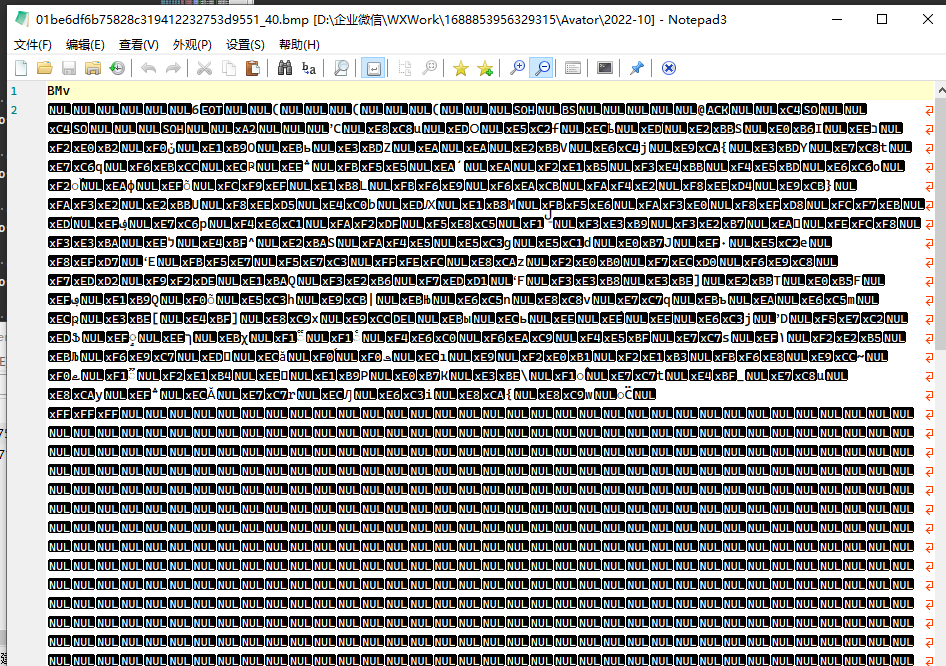
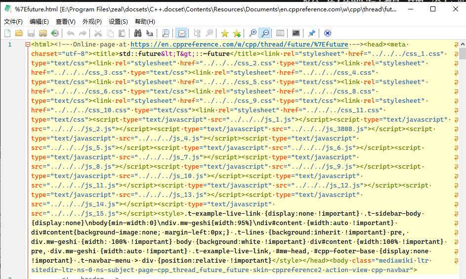
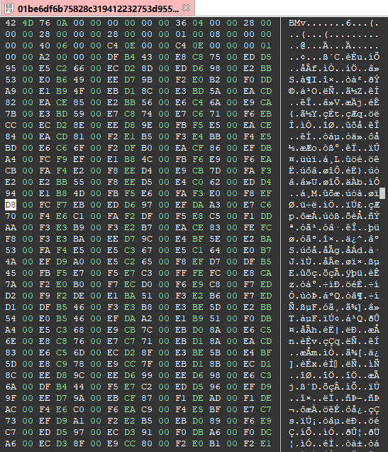
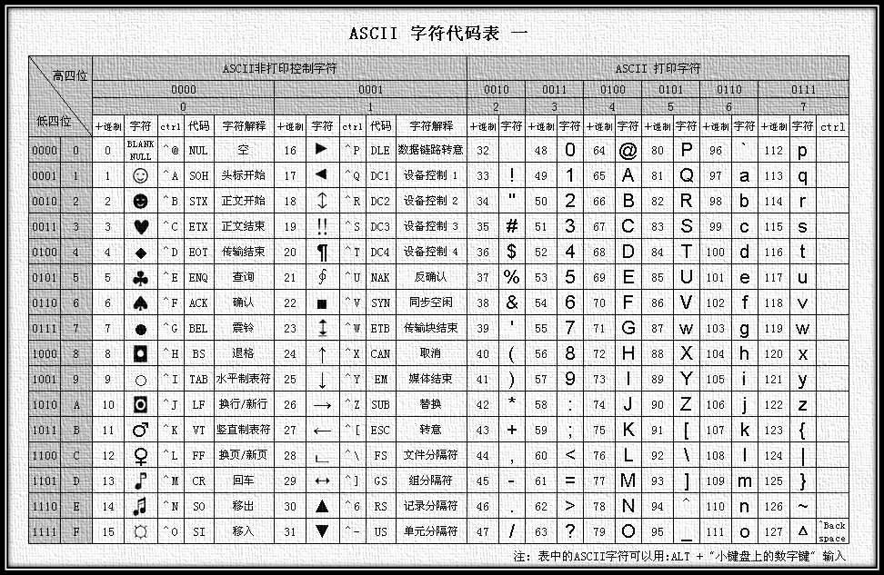
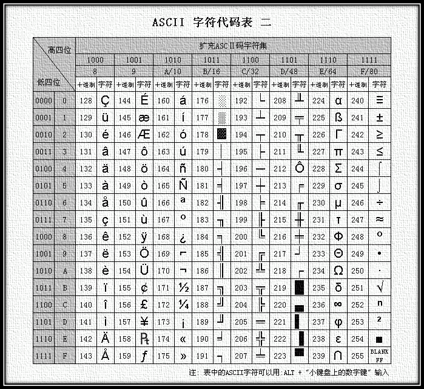

====================
文本文件和二进制文件
====================

文本文件和二进制文件
====================

前置知识点：c语言入门，至少了解各种数据类型。

前言
------

我们知道，在计算机里所有文件都是以01存的，那么什么叫文本文件，什么又叫二进制文件呢，一般来说，能直接用记事本，看得到正常内容的，就是文本文件，打开后是一堆空白或者乱码的，就是二进制文件。当然,有些文本文件用错误的编码打开后也是一堆乱码，我们将在后面的编码部分进行介绍。

文本文件
---------

.. index:: 文本文件

**文本文件** 是以字符编码形式存储的文件，内容由可读的字符组成。它们通常用于存储简单的文本数据，如配置文件、日志文件、源代码文件等。文本文件的特点是内容是人类可读的，文件大小通常较小，适合存储简单的数据。

文本文件的存储方式是基于字符编码的，常见的编码格式包括 ASCII 和 UTF-8。每个字符对应一个或多个字节，文件内容可以直接用文本编辑器打开和编辑。例如，一个包含 "Hello, World!" 的文本文件，其内容可以直接显示为可读的字符。

**示例**：

- 一个 `.txt` 文件，内容为：

::

  Hello, World!
  This is a text file.

- 一个 `.json` 文件，内容为：

::

  {
    "name": "Alice",
    "age": 25,
    "isStudent": true
  }

------

二进制文件
------------------

.. index:: 二进制文件

**二进制文件** 是以二进制数据形式存储的文件，内容由字节流组成。它们通常用于存储复杂的数据结构或多媒体数据，如图像、音频、视频、可执行程序等。二进制文件的特点是内容是人类不可读的，文件大小通常较大，适合存储复杂的数据。

二进制文件的存储方式是直接存储数据的字节表示，文件内容需要使用专门的工具或程序打开和编辑。例如，一个 `.png` 图像文件或一个 `.mp3` 音频文件，其内容是由二进制数据组成的，无法直接用文本编辑器查看。

**示例**：

- 一个 `.png` 图像文件，内容为二进制数据：

::
   
  89 50 4E 47 0D 0A 1A 0A 00 00 00 0D 49 48 44 52 ...

- 一个 `.exe` 可执行文件，内容为二进制数据：

::

  4D 5A 90 00 03 00 00 00 04 00 00 00 FF FF 00 00 ...

区别与联系
------------

那么他们具体有什么区别呢？

* 从物理上讲，其实没有区别，都是以二进制的形式存放在磁盘中。
* 组织形式上不一样：

  - 二进制一般来说，有文件头，用于记录文件信息，以BMP为例，前两字节表示本位件为BMP格式，后面八个字节记录文件长度，接下来4字节记录文件头长度，然后文件头中记录长宽，波段等信息，后面跟着的二进制内容记录数据
  - 文本文件一般没有文件头（utf8-bom编码文件以 EF BB BF 开头），直接存显示的内容
  - 文本文件是基于字符编码的，常见编码方式有ASCII，GBK，UTF8，UTF16等等，具体可以参见 :ref:`字符集和字符编码` 部分
  -  二进制文件实际上是自定义编码的，也就是按照规定，某些字节是代表什么意思，例如 A 程序是图像编辑器，指定 `01001111` 代表 *红色* ， B 程序是视频播放器，它把 `01001111` 理解为 *快进* 。所以，文本文件是通用的，任何程序只要按照对应的编码方式打开都可以正确显示，二进制文件只有特定的程序才能处理。

读取
------------

在 C 语言中，二进制方式很简单，读取时会 **原封不动** 的读取文件的全部内容,即原始的 01 序列；写二进制文件也是类似，将内存缓冲区中的内容， **原封不动** 的写入文件。

而文本方式则不同，主要有以下几个方面：
* 不同平台下的换行符不同，Windows下为 ``\r\n`` ，Linux下为 ``\n`` ，Mac下为 ``\r`` ，而在读取时，会自动将换行符转换为 ``\n`` ，写入时则相反。
* 以文本方式打开时，遇到结束字符 `CtrlZ(0x1A)` 时，会认为文件已经结束，因此如果使用文本方式打开二进制文件，很容易显示不全。即使是使用文本方式打开文本文件，也可能会出现截断。

实例
~~~~~~

文本文件和二进制文件不要看后缀，比如md，rst都是文本文件，最简单的判断是直接拖到记事本（我用的notepad3）打开看看，例如下面就是一个二进制的bmp文件：

而下面是一个html的文本文件：

二进制文件解析：
~~~~~~~~~~~~~~~~

以bmp文件为例：

BMP（Bitmap）文件是Windows操作系统中使用的一种标准图像文件格式。BMP文件通常以 `.bmp` ​或 `.dib` ​为文件扩展名。BMP文件结构由多个部分组成，主要包括文件头、信息头和像素数据。

1. **位图文件头（Bitmap File Header）** - 通常为14字节，包含以下信息：

   -  `bfType` ​（2字节）：文件类型标志，必须是字符"BM"，表示这是Windows支持的BMP格式。
   -  `bfSize` ​（4字节）：文件大小，即整个文件的字节数。
   -  `bfReserved1` ​（2字节）：保留位，必须设置为0。
   -  `bfReserved2` ​（2字节）：保留位，必须设置为0。
   -  `bfOffBits` ​（4字节）：从文件头到像素数据的偏移量，即位图数据开始的相对位置。
  
2. *位图信息头（Bitmap Information Header）* -
   通常为40字节（对于Windows BMP），包含以下信息：

   -   `biSize` （4字节）：信息头的大小。
   -   `biWidth` （4字节）：位图的宽度，以像素为单位。
   -   `biHeight` （4字节）：位图的高度，以像素为单位。如果是正数，表示位图的底边是朝向上的；如果是负数，表示底边是朝向下的。
   -   `biPlanes` （2字节）：目标设备的平面数，必须设置为1。
   -   `biBitCount` （2字节）：每个像素的位数，常见的值有1（单色）、4（16色）、8（256色）、16（高彩色）、24（真彩色）和32（真彩色带Alpha通道）。
   -   `biCompression` （4字节）：压缩类型，如BI_RGB（无压缩）、BI_BITFIELDS（位域压缩）等。
   -   `biSizeImage` （4字节）：图像的大小，以字节为单位。如果压缩类型为BI_RGB，则通常为0。
   -   `biXPelsPerMeter` （4字节）：水平分辨率，每米像素数。
   -   `biYPelsPerMeter` （4字节）：垂直分辨率，每米像素数。
   -   `biClrUsed` （4字节）：用于位图的彩色表中颜色数。如果为0，则表示使用所有可能的颜色。
   -   `biClrImportant` （4字节）：对于显示或打印图像时重要的颜色数。如果为0，则表示所有颜色都重要。

3. *颜色表（Color Table）* -
   对于小于24位的颜色深度，颜色表是必需的。颜色表定义了位图中使用的颜色。每个颜色表条目通常是4字节（RGB值），但对于1位和4位的位图，可能需要更多的颜色表条目。

4. *像素数据（Pixel Data）* -
   这部分是位图的主体，包含了图像的像素数据。像素数据的存储方式取决于`biCompression` 字段的值。对于无压缩的BMP，像素数据通常是从左到右、从上到下存储的，每个像素的位按照`biBitCount` 字段的值进行排列。

上图即是一个常规的bmp数据，以十六进制显示，头两位即为BM，后面的76 0A 00
00 实际上是一个unsigned int，即 A67，2678个字节，剩下的以此类推。下面是C语言读取bmp的代码，仅作为示例，不一定完全对：

.. code:: c

   #include <stdio.h>
   #include <stdlib.h>

   #pragma pack(push, 1)
   typedef struct {
       unsigned short type;
       unsigned int size;
       unsigned short reserved1;
       unsigned short reserved2;
       unsigned int offset;
   } BMPFileHeader;

   typedef struct {
       unsigned int size;
       int width;
       int height;
       unsigned short planes;
       unsigned short bitCount;
       unsigned int compression;
       unsigned int imageSize;
       int xPelsPerMeter;
       int yPelsPerMeter;
       unsigned int clrUsed;
       unsigned int clrImportant;
   } BMPInfoHeader;
   #pragma pack(pop)

   void ReadBMP(const char* filename) {
       FILE* file = fopen(filename, "rb");
       if (!file) {
           perror("Failed to open file");
           return;
       }

       BMPFileHeader fileHeader;
       BMPInfoHeader infoHeader;

       // Read file header
       fread(&fileHeader, sizeof(BMPFileHeader), 1, file);
       // Read info header
       fread(&infoHeader, sizeof(BMPInfoHeader), 1, file);

       // Check if it's a BMP file
       if (fileHeader.type != 0x4D42) {
           printf("Not a valid BMP file.\n");
           fclose(file);
           return;
       }

       // Output BMP info
       printf("Width: %d\n", infoHeader.width);
       printf("Height: %d\n", abs(infoHeader.height));
       printf("Bit depth: %d\n", infoHeader.bitCount);

       // Read pixel data (optional)
       if (infoHeader.bitCount == 24) { // Example for 24-bit BMP
           unsigned int padding = (4 - (infoHeader.width * 3) % 4) % 4;
           unsigned char* pixels = (unsigned char*)malloc(infoHeader.width * infoHeader.height * 3 + padding * infoHeader.height);
           fseek(file, fileHeader.offset, SEEK_SET);
           fread(pixels, infoHeader.width * infoHeader.height * 3 + padding * infoHeader.height, 1, file);

           // Process pixels (e.g., for display or manipulation)
           // ...

           free(pixels);
       }

       fclose(file);
   }

   int main() {
       const char* filename = "path_to_your_bmp_file.bmp";
       ReadBMP(filename);
       return 0;
   }

处理其他二进制也是这样，比如你拿到一个二进制文件，那么得去看说明如何读取，它的头里包含哪些信息，数据区域怎么读，都是类似的流程。

文本文件处理：
~~~~~~~~~~~~~~~~

其实我们处理时经常会碰到文本文件的，比如各种POI点，统计数据，地磁数据等，都可能是文本文件，所以，需要学一下 :ref:`regex` 。用python或者其他脚本提取字段，其实也可以用excel取，但是手动太麻烦了，特别是做论文或者做数据，成千上万的文件，手动不知道提取到猴年马月去了。

下面是一个简单的 perl 脚本提取示例（不建议学 perl ，用的太少，没必要，这里示例主要是单行 perl 方便显示）：

.. code:: perl

   # 提取以tab分割的文件中第1 2 列,以逗号分割
    perl -F'\t' -lane'print join ",", @F[1,2]' inputfile

   输入文件:
   chr1    1   10  el1
   chr1    13  20  el2
   chr1    50  55  el3

   输出:
   1,10
   13,20
   50,55

这种需求其实就可以把需求扔到AI里，ChatGPT，文心一言，kimi等都行，写python脚本跑比较准确，python脚本正确率还可以。

.. _字符集和字符编码:

字符集和字符编码
====================

源文章，这里只是摘抄引用部分内容,做一个简要介绍:

- `字符编码发展史 1 — ASCII 和 EASCII  <http://sunlogging.com/2024/09/15/sdk_dev_guide/charset_encoding_1/>`_ 
- `字符编码发展史2 — ISO-8859-N  <http://sunlogging.com/2024/09/16/sdk_dev_guide/charset_encoding_2/>`_ 
- `字符编码发展史3 — GB2312/Big5/GBK/GB18030  <http://sunlogging.com/2024/09/18/sdk_dev_guide/charset_encoding_3/>`_ 
- `字符编码发展史4 — Unicode与UTF-8 <http://sunlogging.com/2024/09/18/sdk_dev_guide/charset_encoding_4/>`_ 
- `字符编码发展史5 — UTF-16和UTF-32 <http://sunlogging.com/2024/09/18/sdk_dev_guide/charset_encoding_5/>`_ 
- `字符编码发展史6 — BOM字节序标记 <http://sunlogging.com/2024/09/18/sdk_dev_guide/charset_encoding_6/>`_ 

基础知识
-----------

计算机中储存的信息都是用二进制数表示的；而我们在屏幕上看到的英文、汉字等字符是二进制数转换之后的结果。通俗的说，按照何种规则将字符存储在计算机中，如'a'用什么表示，称为"编码"；反之，将存储在计算机中的二进制数解析显示出来，称为"解码"，如同密码学中的加密和解密。在解码过程中，如果使用了错误的解码规则，则导致'a'解析成'b'或者乱码。

字符集（Charcater Set 或 Charset）： 是一个系统支持的所有抽象字符的集合，也就是一系列字符的集合。字符是各种文字和符号的总称，包括各国家文字、标点符号、图形符号、数字等。常见的字符集有：ASCII 字符集、GB2312 字符集 (主要用于处理中文汉字)、GBK 字符集 (主要用于处理中文汉字)、Unicode 字符集等。

字符编码（Character Encoding）： 是一套法则，使用该法则能够对自然语言使用的字符集（如字母表或音节表），与计算机能识别的二进制数字进行配对。即它能在符号集合与数字系统之间建立对应关系，是信息处理的一项基本技术。通常人们用符号集合（一般情况下就是文字）来表达信息，而计算机系统则是以二进制的数字来存储和处理信息的。字符编码就是将符号转换为计算机能识别的二进制编码。

一般一个字符集等同于一种编码方式，如 ASCII、GB2312、GBK 等。一般我们说一种编码都是针对某一特定的字符集。

一个字符集上也可以有多种编码方式，如 Unicode 字符集有 UTF-8、UTF-16、UTF-32 等编码方式。所以字符集与字符编码是一对一或一对多的关系。

从计算机字符编码的发展历史来看，大概经历了三个阶段：

* 第一个阶段: ASCII 编码
* 第二个阶段: 字符编码本地化——ANSI 系列编码
* 第三个阶段: 字符编码国际化——Unicode 字符集和 Unicode 编码

ASCII 编码
----------------------

计算机最早诞生于美国，刚开始计算机只支持英语(即拉丁字符)，其它语言不能够在计算机上存储和显示。ASCII用一个字节(Byte)的7位(bit)表示一个字符，第一位(即最高位)置0，低7位用来编码字符集，共能表达2^7（即128）个字符。

ASCII的这种编码方式即为ASCII编码，ASCII编码的字符集即为ASCII字符集。ASCII字符集包含的内容有：26个小英文字母、26个大英文字母、英文标点符号，10个阿拉伯数字、以及非打印的（不能显示）控制符号。

   ASCII 编码表

用ASCII码表达英语基本上没什么问题，但是当英语中包含一些外来词（如naïve、café、élite等)时，ASCII码就没有办法表达了，所有重音符号都不得不去掉。

后来为了表示更多的欧洲常用字符又对ASCII进行了扩展，于是有了EASCII(Extended ASCII)，EASCII用8位表示一个字符，使它能多表示128个字符，支持了部分西欧字符。

   扩展 ASCII 编码表 

.. note:: EASCII码目前几乎不再使用了，很早就被废弃掉了，被更先进的ISO/IEC 8859-N字符编码方案替代了。

字符编码本地化
----------------------

计算机发明之初及后面很长一段时间，只用于美国及西方一些发达国家，ASCII能够很好满足用户的需求。后来，随着个人计算机的发展和普及，美国这些生产计算机的企业（如IBM、惠普）希望把计算机卖到世界上更多的国家，其他的国家也希望能在自己的国家发展和应用计算机这个新技术，比如我们中国。

但是早期计算机使用ASCII编码只能满足英语国家和少数欧洲国家的需求，计算机要在全世界范围推广应用，就要解决各个国家语言编码的问题。各个国家、地区为了用计算机记录并显示自己的语言字符，都在ASCII编码方案的基础上，设计了各自的编码方案，于是就出现了很多适配不同地区语言的字符编码标准，如ISO 8859-N、GB2312、GBK、BIG5等，这些编码方案被国际标准化组织收纳并将其标准化。

通过多套编码方式来适配不同地区语言的过程，也叫字符编码的本地化。所有这些各个国家和地区所独立制定的既兼容ASCII又互相之间不兼容的字符编码，微软统称为ANSI编码。

ANSI 其实有多个含义：

* ANSI: 全称是American National Standards Institute，即 美国国家标准协会。它是一个非营利组织，负责协调和制定美国国家标准，并代表美国参与国际标准化活动。
* ANSI: 微软的 ANSI 代码页。

计算机的普及是伴随着 Windows 操作系统的发展的，Windows 操作系统以其强大的图形化界面和优秀的人机交互迅速占领了个人计算机 90% 多的市场份额，占据了统治性地位。微软的 Windows 作为全球性的操作系统，为了能适配各个国家和地区的语言，制定了一套代码页，用于映射各个国家和地区的语言的字符编码，微软称之为 ANSI 代码页 (即ANSI Code Page，简称ACP)。

ISO/IEC 8859-N
~~~~~~~~~~~~~~~~~~

EASCII 虽然增加了欧洲常用字符，但是能表达的字符依然太少，甚至说远远不够，比如希腊语的字母表。

为了解决这个问题，ISO/IEC 8859-N 字符集和编码方案便应运而生。

什么是 ISO/IEC 8859-N?

* ISO： 全称International Organization for Standardization，即 国际标准化组织。它是一个全球性的非政府组织，负责制定和发布国际标准，以促进全球贸易和技术交流。
* IEC: 全称International Electrotechnical Commission，即 国际电工委员会。它是一个全球性的非政府组织，负责制定和发布与电气、电子和相关技术领域的国际标准。
* ISO/IEC 8859: 是国际标准化组织 (ISO) 和国际电工委员会 (IEC) 制定的一组字符编码标准。ISO/IEC 8859也经常简称ISO 8859，如 `ISO 8859-1` 。
* ISO 8859字符编码与EASCII字符编码的设计思路一样：同样是采用单个字节 (8 位) 的编码方式，在 ASCII 码的基础上，利用了 ASCII 没有用到的最高位(首位)，将编码范围从原先 ASCII 码的0x00~0x7F(十进制为0~127)，增加0x80~0xFF，扩展到了0x00~0xFF(十进制为0~255)。

与EASCII区别是：EASCII字符编码只包含了单个字符集（128 个 ASCII 字符 + 128 个扩展字符），而ISO 8859字符编码则包含一组字符集，每个字符集支持不同地区的语言。总共有 15 个子集，对应 15 种编码方式，从ISO 8859-1到ISO 8859-16，其中ISO 8859-12未定义，所以实际上是 15 个，这 15 个子集的区别如下：

 ============= ========== ================= =============================================== 
  ISO 8859-n    英文别名       表达的语种             中文解释                                           
 ============= ========== ================= =============================================== 
  ISO 8859-1    Latin-1    Western Europe    西欧语言                                           
  ISO 8859-2    Latin-2    Central Europe    中欧语言                                           
  ISO 8859-3    Latin-3    Southern Europe   南欧语言。世界语也可用此字符集显示。                             
  ISO 8859-4    Latin-4    Baltic            北欧语言                                           
  ISO 8859-5               Cyrillic          斯拉夫语言                                          
  ISO 8859-6               Arabic            阿拉伯语                                           
  ISO 8859-7               Greek             希腊语                                            
  ISO 8859-8               Hebrew            希伯来语                                           
  ISO 8859-9    Latin-5   Turkish           土耳其语，它把 Latin-1 的冰岛语字母换走，加入土耳其语字母              
  ISO 8859-10   Latin-6    Nordic            北欧的日耳曼语支，用来代替 Latin-4                          
  ISO 8859-11              Thai              泰国语，从泰国的 TIS620 标准字集演化而来                       
  ISO 8859-13   Latin-7    Estonian          爱沙尼亚语，或 Baltic Rim 波罗的语族                       
  ISO 8859-14   Latin-8    Celtic            凯尔特语族                                          
  ISO 8859-15   Latin-9    Western           西欧语言，加入 Latin-1 欠缺的芬兰语字母和大写法语重音字母，以及欧元（€）符号。   
  ISO 8859-16   Latin-10   Romanian          罗马尼亚语，东南欧语言，主要供罗马尼亚语使用，并加入欧元符号。                
 ============= ========== ================= =============================================== 

多字节编码
~~~~~~~~~~~~~~~~~~

ISO 8859-N系列的编码都是单字节编码，可收录最多 255 个字符，这对欧洲地区的拉丁语系的语言来说，已经能够满足他们的编码需求了。但是对于亚洲地区以汉字为基础的语系，如：中国的汉语，以及日语、韩语、越南语，256 个字符显然是不够的，单字节编码就无法完全表示了。于是就出现了很多由多个字节组成的多字节编码，如：GB2312、Big5、GBK、GB18030。

========  =========  ========  ====================================  =======================
字符编码  兼容ASCII  字节类型           收集的主要字符类型                    备注
========  =========  ========  ====================================  =======================
GB2312    兼容       单双字节  简体中文                              两个字节首位都是0
Big5      兼容       单双字节  繁体中文                              只保证第一个字节首位是0
GBK       兼容       单双字节  GB2312基础上增加繁体中文、日文、韩文  只保证第一个字节首位是0
GB18030   兼容       多字节    GBK基础上增加中国的少数名族语言字符   只保证第一个字节首位是0
========  =========  ========  ====================================  =======================

字符编码国际化
----------------------

前面提到的第二个阶段，各个国家和地区各自为政，纷纷制定了适用于自己国家语言的字符编码（统称为ANSI码），确实能解决该地区范围内语言文字的信息化处理。

随着互联网的普及和全球网络的互联互通，计算机的信息经常需要在全球范围内进行分享和传输。这时这些只兼容ASCII码互相之间却不兼容的字符编码就暴露了巨大的缺陷：编码混乱，这个混乱常体现在以下几点：

1. 文本信息是一个国际化的内容，包含了多种不同的语言时，根本找不到一个合适的编码。如：你的内容里既有西欧的法语又中国的汉字，包含西欧语言的ISO 8859-1不支持中国的汉字，包含中国汉字的GB 18030不支持西欧的字符。
2. 编码和解码使用的编码方式不一致时，会出现乱码。如以下两种场景：

   * 数据在网络传输时，数据发送用了A编码（假设是ISO 8859-1），数据接收时误用了B编码（假设是GB 18030）去解码，就会出现乱码。
   * 网上下载了一个纯文本的txt文档，里面保存内容的编码方式和本地计算机的默认编码不一致也会出现乱码。这时你可能还根本不知道这个文档采用的编码是什么，只能靠猜测，然后通过工具去手动转换编码格式。

为了解决ANSI系列编码的缺陷，使国际间信息交流更加方便，国际标准化组织（ISO）和统一码联盟（Unicode Consortium）共同制定的一个国际标准字符集：Unicode。Unicode为各种语言中的每一个字符设定了统一并且唯一的数字编号，以满足跨语言、跨平台进行文本转换、处理的要求。

历史上存在两个独立的尝试创立单一字符集的组织，即 国际标准化组织(ISO)和统一码联盟(Unicode Consortium)。

国际标准化组织 制定了UCS标准(全称Universal Character Set)，最初称为ISO/IEC 10646。
统一码联盟 制了Unicode标准，旨在解决不同字符编码之间的兼容性问题。
随着时间的推移，国际标准化组织和统一码联盟意识到各自的标准在目标上是一致的，因此决定合作，将UCS和Unicode合并为一个统一的标准。从Unicode 2.0开始，Unicode标准与ISO/IEC 10646标准保持同步，两者在字符集和编码方案上基本一致。

所以，你可以理解为：Unicode和UCS是同一个东西：国际标准字符集。现在几乎统一用Unicode一词，UCS用的越来越少了。

Unicode是一个字符集，不是编码方式，又称统一码、万国码、单一码、标准万国码（其实都是同一个东西，不同的叫法）。它收集了世界上几十种文字系统，几乎包含了世界上用到的所有字符。截止2024年9月，Unicode的最新的版本是16.0.0，发布于2024年9月10日，总共收录了154,998个字符。Unicode 16.0.0标准的官方文档参见：https://www.unicode.org/versions/Unicode16.0.0/

Unicode的编码方式有三种：UTF-8、UTF-16、UTF-32。其中UTF-16、UTF-32又分为大端和小端两种。UTF-16、UTF-32不兼容ASCII。UTF-8，UTF-16为变长，UTF-32为定长。

简单来说下，我们常用的是Utf8，因为

* 向后兼容ASCII编码；
* 没有字节序(大小端)的问题适合网络传输；
* 存储英文和拉丁文等字符非常节省存储空间。

乱码一图流
-----------------

.. figure:: assets/image-20230725103830-9tk5xvb.png

   乱码一图流