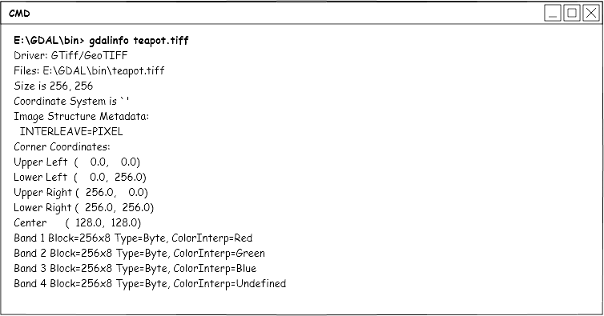
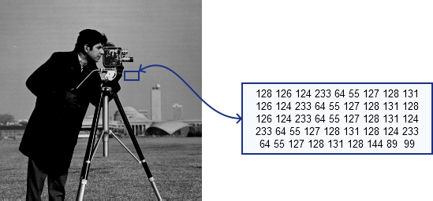
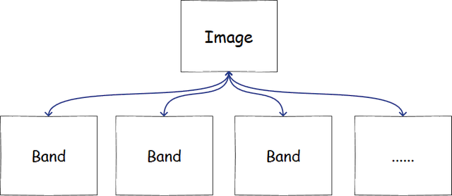
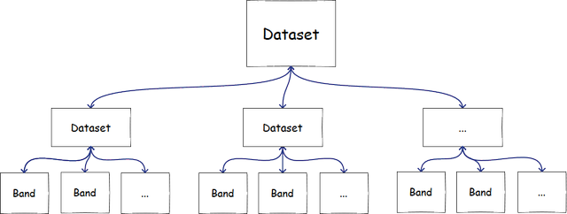

============
栅格数据模型
============

:Date: 2024-09-14T17:19:05Z

栅格数据模型
============

相对于矢量数据而言，栅格数据结构相对简单，可以先看看我写的
`影像是什么 <https://headfirst-gdal.readthedocs.io/en/latest/formats.html>`_ ，了解一下栅格数据结构，这篇基本也是搬过来的。

栅格数据一般由元数据，影像数据组成，其实挺简单的。

元数据
------------

影像元数据是指影像中除了信息矩阵以外的一些参考数据。例如影像的长、宽、波段数、数据类型、存储方式、投影坐标、太阳高度角、获取时间、传感器信息等内容。使用
`gdalinfo文件信息工具 <https://headfirst-gdal.readthedocs.io/en/latest/gdal-utilities.html#gdalinfo>`__
，我们就可以看到影像的元数据信息：

这种是地理数据的信息，其实照片也有信息，比如长宽，拍摄时间，一般的照片也有exif信息。

我们需要这些信息，主要是获取其投影，长宽（构建矩阵），存储格式（波段存储方式）等，方便读取数据，然后做处理。

影像内容
--------------

先来介绍下栅格数据信息，因为正常的栅格数据，比如Tiff，PNG，JPEG，都差不多：

如上图，放大影像后，你会看到一个个小格子，每个格子代表一个数值，这个数值在渲染到屏幕的时候，会被拉伸到0~255，然后在屏幕上展示给你看。想到什么了么，对，就是矩阵。简单来说，栅格就是矩阵。

栅格会有单波段，多波段，也就是你看到的灰度图和彩色影像，遥感课上会讲真彩色，伪彩色，实际上真彩色就是把红绿蓝三个波段对应渲染，伪彩色就是不对应。一张影像对应的数据模型如下，简单理解就是，一张影像是由多个大小相同的矩阵组成的，矩阵的宽度就是影像宽度，矩阵高度就是影像高度。

还有一种数据遥感影像中也比较常见，例如hdf格式、he5格式、netcdf格式等。这些数据与上文介绍的多波段数据不同，里面会有很多不同分辨率，不同波段数的栅格，其实这种你就把它当成一个文件夹，文件夹里包含一堆栅格或者其他文件夹，栅格跟上面的描述是一样的，由波段组成。

因此，一般我们读栅格，处理栅格的时候，都是用gdal、opencv之类的库，或者用matlab，python，把数据读成矩阵，然后对矩阵进行处理。

遥感数据有些很大，所以要注意内存使用，很多时候我们是分块处理的。

注意一个问题，地理数据中，存的数据一般不会是0~255的，可能是float的，可能是double的，可能是二值或者其他类型的。要渲染的时候，需要拉伸！因为显示器一般只能渲染0~255的数据。

其他相关知识:
-------------

-  金字塔：用于快速显示，快速读取的，原始数据太大，金字塔就是把原始数据缩小一层层存，你放大到哪层就从哪层金字塔去读数据，这样快
-  视频：音视频开发本身是很大一块内容，这里也讲不完。但是单独视频的话，可以看做是一整段有时序的图片组成的，拆解出来是每秒24帧或者30帧（看帧率）的连续图像，然后即可用图像（矩阵）的方式去处理。
-  普通的图像与遥感图像其实区别不大，所以遥感处理大部分都来源于数字图像处理，要搞研究的话可以去扒ICCV、ECCV、CVPR 的论文了解前沿科技，而不是去遥感找。
-  遥感数据最大的问题是来源广，数据质量不统一，长时序的分析多，影像大。图像处理里1000*1000的示例数据经常用，遥感里大部分起手就是5000*5000的，注意数据量的区别。

常见数据格式：
--------------

一般有单数据集格式和多数据集格式

* 单数据集格式支持多波段和多种数据类型，但只能存储统一大小统一数据类型的数据。
* 多数据集格式支持多个不同大小或不同数据类型的数据，部分数据集也支持矢量、科学数据等内容

单数据集主要有：

1. GeoTiff：通常以 .tif ， tiff  geotif 等结尾。支持多种数据压缩方式，包括有损压缩，地理数据存在tiff标签中，兼容性和灵活性都很好。
2. Envi hdr：由两个文件组成，以.hdr 结尾，里面包含了影像的元数据信息，.raw 或者.bin 结尾，里面包含了影像的数据，没有压缩，所以数据量可能很大。
3. IMG：Erdas Imagine格式，一般以 .img 结尾，不过有些 GeoTiff 数据也以 img 结尾,注意分辨。IMG也支持压缩，但是没那么多压缩方式，也支持金字塔。

多数据集常见的有：

1. NetCDF ： 以 .nc 结尾，支持多种数据类型和压缩方式，支持多维数据。
2. HDF4 ： 以.hdf 结尾，支持多种数据类型和压缩方式，支持多维数据。
3. HDF5 ： 以.h5 结尾，支持多种数据类型和压缩方式，支持多维数据。

另外无人机或者航片数据也有其他格式，这些数据本身不带地理信息，但是有纹理信息，可以配准后当做地理信息处理，比如：

1. JPEG： 以.jpg 结尾，有损压缩，通常是无人机，只有三波段，八位（0-255）。
2. heic： 以.heic 结尾，透明通道、16位颜色深度、动画图像，无损压缩。

另一些是三维纹理数据，这些数据就是纯粹的纹理图片信息，无法转换成地理信息数据，不过对 GPU 渲染有优化：

1. DDS（DirectDraw Surface）是一种用于存储纹理和图像的文件格式，广泛用于游戏和实时图形渲染中。它支持多种压缩格式（如DXT1、DXT5）和Mipmap层级，能够快速加载和渲染，适合高性能图形应用。
2.  `KTX <https://zhuanlan.zhihu.com/p/629204473>`_  是Khronos Group开发的纹理文件格式，专为高效存储和传输GPU纹理数据而设计。KTX格式支持多种压缩纹理格式（如ETC、ASTC）和Mipmap层级，适用于OpenGL和Vulkan等图形API。KTX2是其升级版本，引入了更高效的压缩技术（如Basis Universal），支持更广泛的平台和设备，同时优化了文件大小和加载性能，适合现代游戏和图形应用。

栅格格式其实是支持能力不同的容器，其数据模型没有区别，都是存储的矩阵。