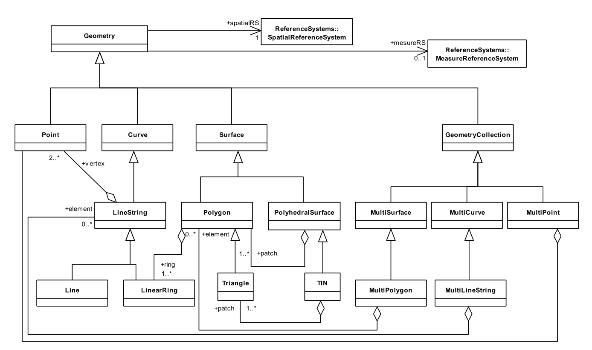

========================
简单要素模型 SFA
========================

.. contents:: 目录

本文档主要参考了原文：`简单要素模型 <https://www.osgeo.cn/gis-booklet/ogc-standard-02.html>`_ ，建议直接阅读原链接，这里仅作简单总结。

概述
------------------------

OGC 的 SFA（简单要素访问）标准第一部分定义了一个简单的地理空间数据模型和操作接口，主要用于描述和操作二维几何对象。其核心是定义了几何对象的类型（如点、线、面等）以及它们之间的空间关系（比如判断是否相交、是否包含、计算距离等）。

SFA 标准第一部分主要包括以下内容：

* **几何对象类型**：定义了基本的几何类型，例如点（Point）、线（LineString）、多边形（Polygon），以及它们的集合形式（如MultiPoint、MultiLineString、MultiPolygon）。
* **空间参考系统**：支持将几何对象与特定的空间参考系统（SRS）关联，确保几何数据具有明确的地理坐标信息。
* **空间操作**：提供了一组空间操作函数，用于计算几何对象的面积、长度，进行缓冲区分析，以及判断空间关系（如相交、包含、重叠等）。
* **数据格式**：定义了几何对象的文本和二进制表示形式。常用的文本格式是 WKT（熟知文本），二进制格式是 WKB（熟知二进制）。

SFA 标准的优点是简单易用，能满足大多数GIS应用的需求。它为不同系统之间的几何数据交换提供了统一的标准，大大增强了数据的互操作性。

几何对象模型
------------------------

SFA 定义的几何对象模型如上图所示，它是一个层次化的结构，用于表示二维空间中的各种几何图形。这个模型以几何类型为基础，能够描述从简单到复杂的几何对象。

所有几何对象的基类都是 **Geometry**，它是一个抽象类，具体的几何类型都继承自它。模型主要包括以下几种类型：

1. **点（Point）**：表示空间中的一个单一位置，由一对坐标 (x, y) 定义。它是最简单的几何类型。
2. **线（LineString）**：由一系列有序的点连接而成，表示一条线。它可以是直线或折线，至少需要两个点来定义。
3. **多边形（Polygon）**：由一个外部边界和零个或多个内部边界（孔洞）组成。外部边界和内部边界都是闭合的线（LineString），且内部边界必须完全位于外部边界之内。
4. **多点（MultiPoint）**：多个点的集合，这些点之间没有连接关系。
5. **多线（MultiLineString）**：多条线的集合，每条线是独立的。
6. **多面（MultiPolygon）**：多个多边形的集合，每个多边形是独立的。
7. **几何集合（GeometryCollection）**：可以包含任意类型几何对象（点、线、面等）的混合集合。

这个模型还定义了空间参考系统（SRS），用于将几何对象与地理坐标系关联起来，确保数据具有明确的空间位置。同时，模型支持几何对象的文本（WKT）和二进制（WKB）表示，便于数据的存储和交换。

这种层次化的模型既简单又灵活，能够满足大多数二维空间数据的表示需求，也为空间分析和操作打下了基础。

几何对象操作部分定义了一系列用于处理和分析几何对象的接口，主要可以分为以下几类：

1. **空间关系判断**：提供判断两个几何对象之间空间关系的函数。例如：
   * `Equals` ：判断两个几何对象是否相等。
   * `Disjoint` ：判断是否完全不相交。
   * `Intersects` ：判断是否相交。
   * `Touches` ：判断是否接触。
   * `Crosses` ：判断是否交叉。
   * `Within` ：判断一个是否在另一个内部。
   * `Contains` ：判断一个是否包含另一个。
   * `Overlaps` ：判断是否部分重叠。

2. **空间分析操作**：用于计算几何对象的属性或生成新的几何对象。例如：
   * `Distance` ：计算两个几何对象之间的最短距离。
   * `Buffer` ：生成几何对象周围指定距离的缓冲区。
   * `ConvexHull` ：生成几何对象的凸包。
   * `Intersection` ：计算两个几何对象的交集。
   * `Union` ：计算并集。
   * `Difference` ：计算差集。
   * `SymDifference` ：计算对称差集。

3. **几何属性计算**：提供计算几何对象基本属性的函数。例如：
   * `Area` ：计算面积（适用于面）。
   * `Length` ：计算长度（适用于线）。
   * `Centroid` ：计算几何中心。

4. **几何对象操作**：包括对几何对象进行修改或转换的函数。例如：
   * `Simplify` ：简化几何形状。
   * `Boundary` ：获取几何对象的边界。
   * `Envelope` ：获取几何对象的最小外接矩形。

这些标准化的接口为GIS和空间数据库等应用中的空间数据分析与处理提供了有力支持。

.. attention::
   需要注意的是，SFA标准本身没有定义曲线（如圆弧）类型，但很多GIS软件都对其进行了扩展支持。

WKT 描述的几何对象
------------------------

WKT（熟知文本）是一种用文本字符串描述几何对象的格式，非常直观易读。

.. csv-table:: WKT 几何对象描述
   :widths: 20, 80
   :header-rows: 1
   :delim: _

   几何类型, WKT 格式示例
   点 (Point)_ ``POINT (30 10)``
   点Z (PointZ)_ ``POINT Z (10 20 30)``
   点ZM (PointZM)_ ``POINT ZM (10 20 30 40)``
   线 (LineString)_ ``LINESTRING (30 10, 10 30, 40 40)``
   多边形 (Polygon)_ ``POLYGON ((30 10, 40 40, 20 40, 10 20, 30 10))``
   多点 (MultiPoint)_ ``MULTIPOINT ((10 40), (40 30), (20 20), (30 10))``
   多线 (MultiLineString)_ ``MULTILINESTRING ((10 10, 20 20, 10 40), (40 40, 30 30, 40 20, 30 10))``
   多面 (MultiPolygon)_ ``MULTIPOLYGON (((30 20, 45 40, 10 40, 30 20)), ((15 5, 40 10, 10 20, 5 10, 15 5)))``
   几何集合 (GeometryCollection)_ ``GEOMETRYCOLLECTION (POINT (40 10), LINESTRING (10 10, 20 20, 10 40))``
   多面体表面 (PolyhedralSurface)_ ``POLYHEDRALSURFACE Z (((0 0 0, 0 0 1, 0 1 1, 0 1 0, 0 0 0)), ((0 0 0, 0 1 0, 1 1 0, 1 0 0, 0 0 0)))``
   三角不规则网络 (TIN)_ ``TIN Z (((0 0 0, 0 0 1, 0 1 0, 0 0 0)), ((0 0 0, 0 1 0, 1 1 0, 0 0 0)))``

WKB 描述的几何对象
------------------------

WKB（熟知二进制）是一种用于描述几何对象的二进制格式，适合高效存储和传输。以下是各种几何类型在WKB中的基本结构说明。

.. csv-table:: WKB 几何对象描述
   :widths: 20, 80
   :header-rows: 1

   几何类型, WKB 格式说明
   点 (Point), 字节顺序（1字节） + 类型标识（4字节，值为1） + X坐标（8字节） + Y坐标（8字节）
   点Z (PointZ), 字节顺序（1字节） + 类型标识（4字节，值为1001） + X坐标（8字节） + Y坐标（8字节） + Z坐标（8字节）
   点ZM (PointZM), 字节顺序（1字节） + 类型标识（4字节，值为3001） + X坐标（8字节） + Y坐标（8字节） + Z坐标（8字节） + M坐标（8字节）
   线 (LineString), 字节顺序（1字节） + 类型标识（4字节，值为2） + 点数（4字节） + 点列表（每个点包含X和Y坐标，各8字节）
   多边形 (Polygon), 字节顺序（1字节） + 类型标识（4字节，值为3） + 环数（4字节） + 每个环的点列表（每个点包含X和Y坐标，各8字节）
   多点 (MultiPoint), 字节顺序（1字节） + 类型标识（4字节，值为4） + 点数（4字节） + 每个点的WKB表示
   多线 (MultiLineString), 字节顺序（1字节） + 类型标识（4字节，值为5） + 线数（4字节） + 每条线的WKB表示
   多面 (MultiPolygon), 字节顺序（1字节） + 类型标识（4字节，值为6） + 多边形数（4字节） + 每个多边形的WKB表示
   几何集合 (GeometryCollection), 字节顺序（1字节） + 类型标识（4字节，值为7） + 几何对象数（4字节） + 每个几何对象的WKB表示
   多面体表面 (PolyhedralSurface), 字节顺序（1字节） + 类型标识（4字节，值为15） + 多边形数（4字节） + 每个多边形的WKB表示
   三角不规则网络 (TIN), 字节顺序（1字节） + 类型标识（4字节，值为16） + 三角形数（4字节） + 每个三角形的WKB表示

说明：

1. **字节顺序**：1个字节，表示数据的字节序（0代表大端序，1代表小端序）。
2. **类型标识**：4个字节，用来标识几何对象的类型（如点、线、面等）。
3. **坐标值**：根据几何类型，可能包含X、Y、Z和M坐标，每个坐标值通常占用8字节（双精度浮点数）。
4. **WKB 格式的优势**：适合高效存储和网络传输，广泛应用于空间数据库和GIS系统。

WKT 描述的空间参考
------------------------

在 SFA 标准中，WKT（熟知文本）不仅可以描述几何对象，还可以用来描述空间参考系统（SRS）。

WKT 描述空间参考系统的基本结构
^^^^^^^^^^^^^^^^^^^^^^^^^^^^^^^^

描述地理坐标系的WKT格式如下：

.. code-block:: text

   GEOGCS["<地理坐标系名称>",
     DATUM["<基准面名称>",
       SPHEROID["<椭球体名称>", <长半轴>, <扁率>]
     ],
     PRIMEM["<本初子午线>", <经度>],
     UNIT["<单位名称>", <转换因子>],
     AXIS["<轴名称>", <方向>],
     AUTHORITY["<权威机构>", "<代码>"]
   ]

描述投影坐标系的WKT格式如下：

.. code-block:: text

   PROJCS["<投影坐标系名称>",
     GEOGCS["<地理坐标系名称>",
       DATUM["<基准面名称>",
         SPHEROID["<椭球体名称>", <长半轴>, <扁率>]
       ],
       PRIMEM["<本初子午线>", <经度>],
       UNIT["<单位名称>", <转换因子>]
     ],
     PROJECTION["<投影方法名称>"],
     PARAMETER["<参数名称>", <参数值>],
     UNIT["<单位名称>", <转换因子>],
     AXIS["<轴名称>", <方向>],
     AUTHORITY["<权威机构>", "<代码>"]
   ]

示例 1：地理坐标系（GEOGCS）
^^^^^^^^^^^^^^^^^^^^^^^^^^^^^

以下是一个描述 WGS84 地理坐标系的 WKT 示例：

.. code-block:: text

   GEOGCS["WGS 84",
     DATUM["WGS_1984",
       SPHEROID["WGS 84", 6378137, 298.257223563]
     ],
     PRIMEM["Greenwich", 0],
     UNIT["Degree", 0.0174532925199433],
     AUTHORITY["EPSG", "4326"]
   ]

* **GEOGCS**：表示这是一个地理坐标系。
* **DATUM**：定义基准面，包含椭球体信息。
* **SPHEROID**：定义椭球体的名称、长半轴和扁率。
* **PRIMEM**：定义本初子午线（通常是格林尼治）。
* **UNIT**：定义坐标的单位（这里是度）。
* **AUTHORITY**：定义权威机构和其分配的代码（例如 EPSG:4326）。

示例 2：投影坐标系（PROJCS）
^^^^^^^^^^^^^^^^^^^^^^^^^^^^^

以下是一个描述 UTM 50N 投影坐标系的 WKT 示例：

.. code-block:: text

   PROJCS["WGS 84 / UTM zone 50N",
     GEOGCS["WGS 84",
       DATUM["WGS_1984",
         SPHEROID["WGS 84", 6378137, 298.257223563]
       ],
       PRIMEM["Greenwich", 0],
       UNIT["Degree", 0.0174532925199433]
     ],
     PROJECTION["Transverse_Mercator"],
     PARAMETER["Latitude_of_origin", 0],
     PARAMETER["Central_Meridian", 117],
     PARAMETER["Scale_Factor", 0.9996],
     PARAMETER["False_Easting", 500000],
     PARAMETER["False_Northing", 0],
     UNIT["Meter", 1],
     AUTHORITY["EPSG", "32650"]
   ]

* **PROJCS**：表示这是一个投影坐标系。
* **PROJECTION**：定义所使用的投影方法（这里是横轴墨卡托）。
* **PARAMETER**：定义投影的各种参数（如中央经线、比例因子等）。
* **UNIT**：定义投影后坐标的单位（这里是米）。
* **AUTHORITY**：定义权威机构和代码（例如 EPSG:32650）。

总结
^^^^

* WKT 可以清晰地描述**地理坐标系（GEOGCS）**和**投影坐标系（PROJCS）**。
* 通过 WKT 能够完整定义基准面、椭球体、投影方法、单位等关键信息。
* WKT 格式在 GIS 系统和空间数据库中被广泛用于描述和交换空间参考信息。

SQL 预定义 Schema
------------------------

在 SFA 标准中，SQL 预定义 Schema 定义了几何数据在关系数据库中的标准存储结构和表设计，主要包含两张核心表。

SQL 预定义 Schema 的核心表结构
^^^^^^^^^^^^^^^^^^^^^^^^^^^^^^^

.. csv-table:: SQL 预定义 Schema 表结构
   :widths: 25, 35, 40
   :header-rows: 1

   表名, 字段名, 描述
   **GEOMETRY_COLUMNS** , F_TABLE_SCHEMA, 表所属的模式（数据库）名称
   , F_TABLE_NAME, 包含几何列的表名称
   , F_GEOMETRY_COLUMN, 几何列的名称
   , COORD_DIMENSION, 几何对象的坐标维度（如 2 表示2D，3 表示3D）
   , SRID, 空间参考系统标识符
   , TYPE, 几何对象的类型（如 POINT LINESTRING 等）
   **SPATIAL_REF_SYS** , SRID, 空间参考系统标识符
   , AUTH_NAME, 空间参考系统的权威机构名称（如 “EPSG”）
   , AUTH_SRID, 权威机构定义的空间参考系统标识符
   , SRTEXT, 空间参考系统的 WKT 描述
   , PROJ4TEXT, 空间参考系统的 PROJ.4 格式描述

说明：

1. **GEOMETRY_COLUMNS 表**：
   * 用来记录数据库中所有包含几何列的表的信息。
   * 包括表名、几何列名、坐标维度、空间参考（SRID）和几何类型。

2. **SPATIAL_REF_SYS 表**：
   * 用来存储空间参考系统的定义。
   * 包括 SRID、权威机构信息、WKT 描述和 PROJ.4 描述。

使用示例：

查询数据库中有哪些几何列：

.. code-block:: sql

   SELECT F_TABLE_SCHEMA, F_TABLE_NAME, F_GEOMETRY_COLUMN, SRID, TYPE
   FROM GEOMETRY_COLUMNS;

查询特定空间参考系统（如 EPSG:4326）的详细信息：

.. code-block:: sql

   SELECT SRID, AUTH_NAME, AUTH_SRID, SRTEXT
   FROM SPATIAL_REF_SYS
   WHERE SRID = 4326;

总结
^^^^

* SQL 预定义 Schema 提供了一种标准化的方式，在关系数据库中存储和管理几何数据及其空间参考。
* **GEOMETRY_COLUMNS** 表充当了数据库空间列的“目录”。
* **SPATIAL_REF_SYS** 表是空间参考系统的“字典”。
* 这套表结构被许多支持空间数据的数据库系统（如 PostGIS、MySQL Spatial 等）采用或借鉴。

SQL 几何对象存储
------------------------

在 OGC 标准中，几何信息可以存储在一个单独的 Geometry 表中，这个表可以通过常规字段或 WKB 二进制格式存储几何对象。Geometry 表通过一个唯一标识符（GID）字段与业务表（Feature 表）的几何字段关联。

实际上，OGC 标准还提供了另一种更常用的方式：将几何信息直接存储在业务表的字段中，并使用 SQL UDT（用户自定义类型）来定义这个字段的类型。现在大多数空间数据库都采用这种方式，比如 PostGIS 中的 ``geometry`` 类型、ArcSDE 中的 ``ST_Geometry`` 类型等。

SQL 几何对象存储的核心表结构（单独表方式示例）
^^^^^^^^^^^^^^^^^^^^^^^^^^^^^^^^^^^^^^^^^^^^^^^^

.. csv-table:: SQL 几何对象存储表结构（示例）
   :widths: 25, 35, 40
   :header-rows: 1

   表名, 字段名, 描述
   **GEOMETRY_TABLE**, ID, 几何对象的唯一标识符
   , GEOM, 几何对象数据（可以是 WKB 或特定类型的值）
   , SRID, 空间参考系统标识符

自定义类型可以采用 SFA 标准中定义的几何类型，也可以采用 SQL/MM 标准中定义的类型。例如 PostGIS 就同时支持这两种标准。下图展示了两种标准中几何类型的对应关系：

**SQL/MM** 是什么？
   它是 ISO《SQL Multimedia and Application Packages》标准的一部分，其中 **Part 3: Spatial** 专门定义了与空间数据相关的内容。

SFA 和 SQL/MM 类型对应关系
^^^^^^^^^^^^^^^^^^^^^^^^^^^

.. csv-table:: SFA 和 SQL/MM 类型对应关系
   :widths: 15, 15, 30, 40
   :header-rows: 1

   SFA 类型, SQL/MM 类型, SFA 描述, SQL/MM 描述
   **Point**, ST_Point, 点几何类型, 点几何类型
   **LineString**, ST_LineString, 线几何类型, 线几何类型
   **Polygon**, ST_Polygon, 多边形几何类型, 多边形几何类型
   **MultiPoint**, ST_MultiPoint, 多点几何类型, 多点几何类型
   **MultiLineString**, ST_MultiLineString, 多线几何类型, 多线几何类型
   **MultiPolygon**, ST_MultiPolygon, 多面几何类型, 多面几何类型
   **GeometryCollection**, ST_GeometryCollection, 几何集合类型, 几何集合类型
   , ST_CircularString, , 圆弧几何类型（SQL/MM扩展）
   , ST_CompoundCurve, , 复合曲线几何类型（SQL/MM扩展）
   , ST_CurvePolygon, , 曲线多边形几何类型（SQL/MM扩展）
   , ST_MultiCurve, , 多曲线几何类型（SQL/MM扩展）
   , ST_MultiSurface, , 多曲面几何类型（SQL/MM扩展）
   , ST_PolyhedralSurface, , 多面体表面几何类型（SQL/MM扩展）
   , ST_TIN, , 三角不规则网络几何类型（SQL/MM扩展）

* SFA 和 SQL/MM 在基本的几何对象类型（点、线、面等）上是完全兼容的。
* SQL/MM 标准扩展了 SFA，支持了更复杂的几何对象（如曲线、曲面），适用于更高级的空间分析与建模。
* 这些类型被 PostGIS、Oracle Spatial 等主流空间数据库广泛支持。

SQL 空间操作
------------------------

SFA 标准定义了一套用于对几何对象进行空间分析和操作的SQL函数。

SQL 空间操作概览
^^^^^^^^^^^^^^^^

.. csv-table:: SQL 空间操作概览
   :widths: 20, 25, 55
   :header-rows: 1

   操作类型, 函数名称, 描述
   **空间关系**, ST_Equals, 判断两个几何对象是否相等
   , ST_Disjoint, 判断两个几何对象是否完全不相交
   , ST_Intersects, 判断两个几何对象是否相交（接触也算）
   , ST_Touches, 判断两个几何对象是否接触
   , ST_Crosses, 判断两个几何对象是否交叉（例如线穿过面）
   , ST_Within, 判断几何对象A是否完全在几何对象B内部
   , ST_Contains, 判断几何对象A是否完全包含几何对象B
   , ST_Overlaps, 判断两个几何对象是否部分重叠
   **空间分析**, ST_Distance, 计算两个几何对象之间的最短距离
   , ST_Buffer, 生成几何对象周围指定距离的缓冲区
   , ST_ConvexHull, 生成几何对象的凸包
   , ST_Intersection, 计算两个几何对象相交的部分
   , ST_Union, 计算两个几何对象的合并结果
   , ST_Difference, 计算几何对象A减去与几何对象B相交的部分
   , ST_SymDifference, 计算两个几何对象不相交的部分（对称差）
   **几何属性**, ST_Area, 计算几何对象的面积（适用于面和体）
   , ST_Length, 计算几何对象的长度（适用于线和曲线）
   , ST_Centroid, 计算几何对象的质心（中心点）

不同类型几何对象的支持操作
^^^^^^^^^^^^^^^^^^^^^^^^^^

下面列出了一些特定几何类型常用的操作函数示例。

点（Point）支持的操作
~~~~~~~~~~~~~~~~~~~~~

.. csv-table:: 点支持的操作
   :widths: 20, 25, 55
   :header-rows: 1

   操作类型, 函数名称, 描述
   **空间关系**, ST_Equals, 判断两个点是否坐标相同
   , ST_Distance, 计算两个点之间的距离
   **几何属性**, ST_X, 获取点的 X 坐标
   , ST_Y, 获取点的 Y 坐标
   , ST_Z, 获取点的 Z 坐标（如果存在）

线（LineString）支持的操作
~~~~~~~~~~~~~~~~~~~~~~~~~~

.. csv-table:: 线支持的操作
   :widths: 20, 25, 55
   :header-rows: 1

   操作类型, 函数名称, 描述
   **空间关系**, ST_Intersects, 判断线是否与其他几何对象相交
   **几何属性**, ST_Length, 计算线的长度
   , ST_StartPoint, 获取线的起点
   , ST_EndPoint, 获取线的终点
   , ST_NumPoints, 获取线包含的点的数量

面（Polygon）支持的操作
~~~~~~~~~~~~~~~~~~~~~~~

.. csv-table:: 面支持的操作
   :widths: 20, 25, 55
   :header-rows: 1

   操作类型, 函数名称, 描述
   **空间关系**, ST_Contains, 判断面是否包含其他几何对象
   **几何属性**, ST_Area, 计算面的面积
   , ST_ExteriorRing, 获取面的外边界环（LineString）
   , ST_NumInteriorRings, 获取面内部的孔洞（内环）数量

曲线（Curve）支持的操作（SQL/MM扩展）
~~~~~~~~~~~~~~~~~~~~~~~~~~~~~~~~~~~~~~

.. csv-table:: 曲线支持的操作
   :widths: 20, 25, 55
   :header-rows: 1

   操作类型, 函数名称, 描述
   **空间关系**, ST_IsClosed, 判断曲线是否首尾相连（闭合）
   , ST_IsRing, 判断曲线是否是一个简单的环（闭合且不自交）
   **几何属性**, ST_CurveToLine, 将曲线转换为由线段近似的 LineString

GeometryCollection 支持的操作
~~~~~~~~~~~~~~~~~~~~~~~~~~~~~

.. csv-table:: GeometryCollection 支持的操作
   :widths: 20, 25, 55
   :header-rows: 1

   操作类型, 函数名称, 描述
   **空间关系**, ST_Equals, 判断两个几何集合是否相等
   , ST_Intersects, 判断几何集合是否与其他几何对象相交
   **几何属性**, ST_NumGeometries, 获取集合中包含的几何对象数量
   , ST_GeometryN, 获取集合中第 N 个几何对象（N从1开始）

MultiCurve 支持的操作（SQL/MM扩展）
~~~~~~~~~~~~~~~~~~~~~~~~~~~~~~~~~~~

.. csv-table:: MultiCurve 支持的操作
   :widths: 20, 25, 55
   :header-rows: 1

   操作类型, 函数名称, 描述
   **空间关系**, ST_Equals, 判断两个多曲线是否相等
   , ST_Intersects, 判断多曲线是否与其他几何对象相交
   **几何属性**, ST_IsClosed, 判断多曲线是否所有成员曲线都闭合
   , ST_Length, 计算多曲线的总长度
   , ST_NumCurves, 获取多曲线中包含的曲线数量
   , ST_CurveN, 获取多曲线中第 N 条曲线

MultiSurface 支持的操作（SQL/MM扩展）
~~~~~~~~~~~~~~~~~~~~~~~~~~~~~~~~~~~~~

.. csv-table:: MultiSurface 支持的操作
   :widths: 20, 25, 55
   :header-rows: 1

   操作类型, 函数名称, 描述
   **空间关系**, ST_Equals, 判断两个多曲面是否相等
   , ST_Intersects, 判断多曲面是否与其他几何对象相交
   **几何属性**, ST_Area, 计算多曲面的总面积
   , ST_NumSurfaces, 获取多曲面中包含的曲面数量
   , ST_SurfaceN, 获取多曲面中第 N 个曲面

总结
^^^^

* SQL 空间操作提供了丰富的函数，用于空间关系判断、空间分析和几何属性计算。
* 不同类型的几何对象支持的操作各有侧重，但基本关系判断（如相交、包含）适用于所有类型。
* 这些标准化的操作函数是 PostGIS、Oracle Spatial 等空间数据库的核心功能，极大地便利了空间数据处理。

------------

文档总结
^^^^^^^^^^

SFA（简单要素访问）标准为地理空间数据提供了一个核心、通用的模型和操作接口。它通过定义标准的几何类型（点、线、面等）、空间参考系统描述方法（WKT-SRS）、数据交换格式（WKT/WKB）以及数据库存储和操作规范（SQL Schema/MM），成功地在不同的GIS软件和空间数据库之间架起了桥梁，是实现空间数据互操作性的重要基石。
