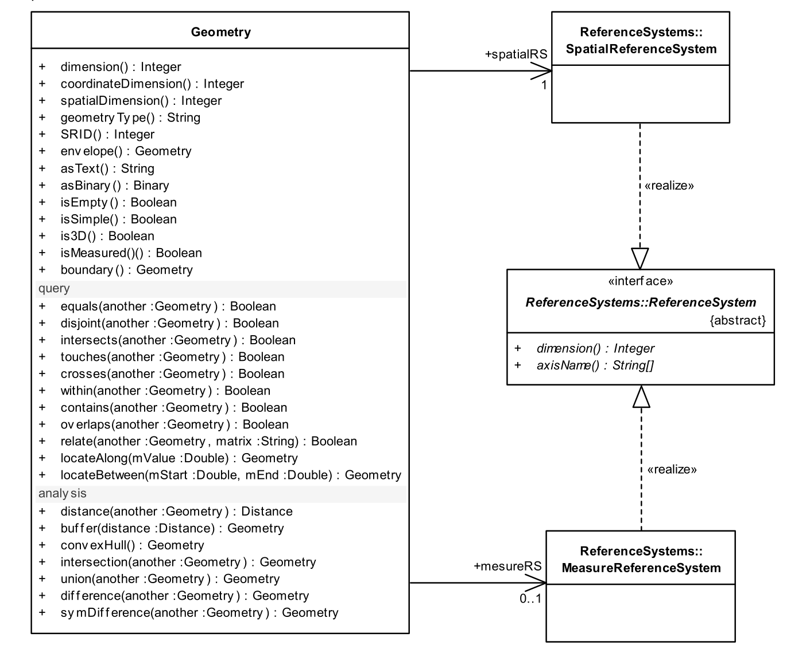

============
矢量数据
============

矢量数据模型
============

主要整理自 `wiki <https://en.wikipedia.org/wiki/Data_model_(GIS)>`_ 

.. important:: 
    
    Markdown 版本中拓扑数据模型有误, spaghetti 模型本身是不带拓扑的。

矢量逻辑模型通过几何形状及其属性的一组值来表示每个地理位置或现象。每个几何形状使用坐标几何表示，通过从一组可用的几何基元（如点、线和多边形）中选择的结构化坐标集（x,y，z）在地理坐标系中表示。

尽管各种 GIS 软件中使用了数十种矢量文件格式，但大多数都遵循开放地理空间联盟（OGC）的简单要素访问（SFA）规范。该规范是在 1990 年代通过寻找现有矢量模型之间的共同点而开发的，现已被确立为 ISO 19125，成为矢量数据模型的参考标准。所以务必要认真学一下这个标准，翻译的这个版本进行了部分简化，建议去啃一下原文，原文有两部分，第一部分介绍数据模型结构，第二部分介绍查询操作。至少要过一遍第一部分的所有概念，如果不想看原文可以看一下总结的 :ref:`sfa`  部分：

- `Simple Feature Access – Part 1: Common Architecture <https://www.ogc.org/standard/sfa/>`_ 
- `Simple Feature Access – Part 2: SQL  Option <https://www.ogc.org/standard/sfs/>`_ 

简单要素模型主要定义有几个：

-  几何对象：包括点、线、面、文本
-  对象操作：包括获取外接矩形，获取几何类型，获取维度等
-  WKB、WKT几何对象描述
-  WKT空间参考描述
-  空间关系判断：九交模型
-  几何运算：求差、求并、求交、求对称差、求缓冲区等

存储在矢量数据集中的几何形状所代表的现象，其维度可能与现实世界现象本身的维度相同，也可能不同。根据表示的尺度和目的，通常会用比实际性质更低的维度来表示一个特征。例如，一个城市（二维区域）可能被表示为一个点，或者一条道路（三维结构）可能被表示为一条线。这种概括对于诸如交通网络分析等应用来说是有用的。

基于几何形状和属性的这一基本策略，矢量数据模型采用多种结构将这些元素整合成一个单一的数据集（通常称为图层），该数据集通常包含一组相关的特征（例如，道路）。这些方法可以分为两种：

* 早期没有专门的空间数据库，当时的矢量数据中几何要素和属性要素分开存储的，通过行号或者id号进行关联（现在经常看见的 oid 就是那时候留下的习惯），这种称为地理关系数据模型，早期ArcInfo Coverage Shapefile 等格式即基于此模型。
* 空间数据库：空间数据库不是将几何数据分开存储，而是定义了一种几何数据类型，允许将形状存储在属性所在的同一表的列中，从而为每个图层创建一个统一的数据集。大多数 RDBMS 软件（包括商业和开源）都具有空间扩展功能，以支持几何数据的存储和查询（通常是 OGC 的 Simple Features-SQL 标准）。一些非数据库数据格式，例如GeoJSON，也将每个对象的几何和属性数据集成到单一结构中。

如果按拓扑分类的话，简单分为三类：

* 无拓扑简单数据，spaghetti （意面） 模型，没有拓扑信息，之所以这样称呼，是因为一碗意大利面条中的单根面条可能会重叠而不连接。在这种模型中，每个要素几何体在数据集中都是独立编码的，无论它们是否可能在拓扑上相关。例如，两个相邻区域之间的共享边界将在每个多边形形状中重复。尽管与拓扑数据相比，数据量增加且存在潜在错误，但自 2000 年以来，这种模型在 GIS 中占据主导地位，主要是由于其概念上的简单性。
* 拓扑数据模型：美国人口普查局的GBF/DIME格式可能是第一个拓扑数据模型；另一个早期的例子是 1970 年代在哈佛计算机图形与空间分析实验室开发的 POLYVRT，最终演变为 Esri 的 ARC/INFO Coverage 格式。 在这种结构中，线在所有交点处被断开；这些节点可以存储关于哪些线在此连接的信息。多边形不是单独存储的，而是被定义为一组闭合的线。每条线包含其左右两侧多边形的信息，从而显式存储拓扑邻接关系。这种结构旨在支持复合线-多边形结构（例如人口普查区块）、地址地理编码和交通网络分析。 它还带来了提高存储效率和减少错误的好处，因为每对相邻多边形的共享边界只需数字化一次。然而，这是一个相当复杂的数据结构。几乎所有的拓扑数据模型也是地理相关的。Topojson，S57等数据格式都属于此类别。
* 混合数据模型：将拓扑关系信息存储为构建在意大利面条数据集之上的独立层。Esri 地理数据库中的网络数据集就是这么操作的，实际项目中基本也是这么操作的，因为常规数据基本都是意面模型，要兼容又需要拓扑的话，直接加一层拓扑结构，然后对拓扑结构进行检查是工程上比较方便的算法。

常见数据的介绍
--------------

Esri 公司是GIS的龙头行业,有很多事实标准是基于他们的数据格式的，所以先介绍几种常见的ESRI数据格式:

- Shapefile
- GeoDatabase（实际包括多种）

接下来介绍其他常见格式：

- PostGIS
- Geojson
- GPKG
- DXF/DWG

最后将提及一下 WFS ，这是一种基于HTTP的协议，用于从服务器获取数据。

这些数据基本上都是基于 :ref:`sfa`  标准的，所以这里只介绍一些基础情况和优缺点，具体结构和参照标准。

没有介绍拓扑数据因为几乎每家拓扑结构都不同，而且大部分都是基于标准结构以上增加拓扑规则，构建一个混合拓扑结构，拓扑结构算附属设施，即直接编辑，每次编辑后会更新拓扑结构。原始的拓扑数据模型由于难以编辑，难以解读几乎已经完全被淘汰了，除非是只读数据几乎用不到。

Shapefile
~~~~~~~~~~~~~~~~~~~~~~

shapefile是比较常见的数据格式了，有很多文件：

必须的文件:

-  .shp — 图形格式，用于保存元素的几何实体。
-  .shx — 图形索引格式。几何体位置索引，记录每一个几何体在shp文件之中的位置，能够加快向前或向后搜索一个几何体的效率。
-  .dbf — 属性数据格式，以dBase III+ 的数据表格式存储每个几何形状的属性数据。

其他可选的文件：

-  .prj — 保存地理坐标系统与投影信息，是一个存储 WKT 投影描述符的文本文件。
-  .sbn and .sbx — 几何体的空间索引
-  .fbn and .fbx — 只读的Shapefiles的几何体的空间索引
-  .ain and .aih — 列表中活动字段的属性索引。
-  .ixs — 可读写Shapefile文件的地理编码索引
-  .mxs — 可读写Shapefile文件的地理编码索引(ODB格式)
-  .atx — .dbf文件的属性索引，其文件名格式为 `shapefile.columnname.atx` (ArcGIS 8及之后的版本)
-  .shp.xml — 以XML格式保存元数据。
-  .cpg — 用于描述.dbf文件的代码页，指明其使用的字符编码 。

Shapefile的限制较多，如果有其他格式请尽量用新格式代替，有如下限制：

-  .shp文件不能超过 2GB （GDAL中实现不超过4GB），这里是仅指.shp文件，dbf 文件的大小 GDAL 中不做限制，有软件有限制。
-  字段名最长为10个字符（4个汉字）
-  无法在日期中存时间
-  属性的最大记录长度为 4000 字节（即所有属性加起来不得超过2000字）。记录长度是用于定义全部字段的字节数，而非用于存储实际值的字节数。
-  最大字段数为 255。若超出此上限，当转换为 shapefile 时会转换前 255 个字段。
-  字段宽度是固定的，文本型不超过254个字符

GeoDatabase
~~~~~~~~~~~~~~~~~~~

GeoDatabase 其实包括好几种格式，而且一直在发展变化。

地理数据库的起源可以追溯到 20 世纪 90 年代中期，当时第一批空间数据库刚刚出现。早期整合关系数据库与 GIS 的一种方法是使用服务器中间件，这是一种第三方程序，它以自定义格式将空间数据存储在数据库表中，并动态地将其转换为客户端软件能够理解的逻辑模型。1996 年，Esri收购了一款早期的中间件产品，名为 Spatial DataBase Engine，并将其重新命名为ArcSDE。最初，ArcSDE 存储和提供的是与shapefiles非常相似的简单矢量数据集，但随着 Esri 的Shapefile格式成为矢量空间数据的事实标准，其局限性限制了其在企业应用中的使用，因此需要一个更强大的数据模型。与此同时，Arc/INFO 的 coverage 格式在 20 年后逐渐过时，无法满足 GIS 用户日益增长的期望。另一个激励因素是，尽管几家关系数据库供应商正在推出自己的空间扩展（Esri 偏好的Microsoft SQL Server除外），但它们的结构和接口各不相同，Esri 希望其用户无论数据在内部如何存储，都能以相同的明显结构查看所有空间数据。 

1999 年底，Esri 推出了 Geodatabase 模型，作为其新版ArcGIS软件（为保持与 Arc/INFO 的连续性，品牌版本为 8.0）的原生格式。 最初，它可以在服务器上通过 ArcSDE 实现为多用户地理数据库，或在本地实现为个人地理数据库。  2003 年（ArcGIS 8.3 版本中）增加了对拓扑规则、线性参考和测量数据的支持。2005 年（ArcGIS 9.1 版本中）将网络数据添加到了地理数据库中，而 2006 年（ArcGIS 9.2 版本中）则加入了矢量地形（ TIN, LIDAR）。同样在 9.2 版本发布时，ArcSDE 被整合进ArcGIS Server，多用户数据库格式更名为企业级地理数据库。

由于个人地理数据库格式的缺陷（特别是 Microsoft Access 中的文件大小限制），Esri 开发了一种更强大的自定义文件格式，并于 2006 年（ArcGIS 9.2）发布为文件地理数据库。同时，Esri 还发布了一款名为工作组地理数据库的产品，该产品包含免费的 Microsoft SQL Server Express，适用于较小的多用户应用程序，但该产品现已停止使用。最终，用于读写地理数据库空间数据库结构的中间件组件被集成到 ArcGIS 桌面中，从而消除了在服务器端运行 ArcSDE 的需求。最新的补充是 2020 年推出的移动地理数据库格式（ArcGIS Pro 2.7），该格式使用 SQLite 作为后端，将整个地理数据库存储为单个文件。这取代了不再受支持的个人地理数据库。

简单来说，GeoDatabase 有如下产品：

* Personal Geodatabase => Access 数据库，虽然已经过期，但是还在大量使用
* File Geodatabase => 一个以.gdb 为扩展名的文件夹
  
  - a########.gdbtable 一个由包含几何和/或属性列的行组成的表（系统表、数据表、要素类、栅格）
  - a########.gdbtablx：数据表中每行字节偏移量的查找列表
  - a########.gdbindexes：数据表的所有索引列表
  - a########.name.atx：数据表的一个属性索引，按所选属性列的排序顺序列出各行。单个数据表可以有多个索引。
  - a########.spx：用于要素类表的空间索引，以加快形状访问速度，使用网格空间索引。
  - a########.cdf：上述文件之一的压缩版本
  - a00000001.* - a00000008.*: 系统表，如企业级地理数据库中的表（GDB_SystemCatalog、GDB_SpatialRefs、GDB_DBTune 等）。
* Mobile Geodatabase =>最新选项的结构与企业级地理数据库相同，但以单个文件形式存储，采用SQLite格式，注意，尽管都使用Sqlite，但是Mobile Geodatabase 与 Geopackage 模型大相径庭。
* Enterprise Geodatabase (原Multiuser Geodatabase) =>企业级地理数据库将地理数据存储在服务器上的第三方关系数据库管理系统中。这使得地理数据库能够在各种分布式 GIS架构中实现，包括通过使用。支持的 RDBMS 软件包括：Microsoft SQL Server、Oracle、IBM Db2、PostgreSQL和SAP HANA。

PostGIS
~~~~~~~~~~~~~~~~~~~

PostGIS 是 PostgreSQL 关系数据库的扩展，增加了存储、索引和查询地理空间数据的功能。其特点包括：

* 空间数据存储：可存储点、线、面、多几何体等二维和三维空间数据。
* 空间索引：能快速基于位置搜索和检索空间数据（基于 R 树和 GiST 索引）。
* 空间函数：提供丰富函数，用于过滤、分析空间数据，如测量距离和面积、几何体相交、缓冲区分析等。
* 几何处理：有工具可处理和操作几何数据，如简化、转换和概括。
* 栅格数据支持：支持存储和处理栅格数据，如高程数据和气象数据。
* 地理编码与逆地理编码：具备地理编码和逆地理编码功能。
* 集成：可通过 QGIS、GeoServer、MapServer、ArcGIS、Tableau 等第三方工具访问和使用 PostGIS。

说 PostGIS 就顺带说一下 PostgreSQL，
PostgreSQL 本身有一定的空间数据支持能力：

基本的几何数据类型
^^^^^^^^^^^^^^^^^^^^^^^^^^^^

PostgreSQL 支持一些基本的几何数据类型，包括点（Point）、线段（Line Segment）、多边形（Polygon）和圆（Circle）。这些类型允许用户储存和处理简单的空间数据。

几何类型的函数
^^^^^^^^^^^^^^^^^

除了数据类型，PostgreSQL 还提供了一些用于处理几何数据的基本函数。这些函数可以计算点之间的距离，判断一个点是否在某个多边形内，以及计算线段的长度等基本操作。

索引支持
^^^^^^^^^^^^^^^^^

虽然 PostgreSQL 没有专门针对空间数据的索引类型，但它支持使用 B 树索引来处理一些基本的几何数据。这种索引可以在某些情况下提升基于简单几何类型查询的性能。

基础空间查询
^^^^^^^^^^^^^^^^^

用户可以利用 PostgreSQL 进行简单的空间查询，例如查找特定区域内的点或几何形状，以及判断两个几何形状是否相交等。

结合其他功能
^^^^^^^^^^^^^^^^^

PostgreSQL 的其他强大功能（比如 JSON 支持、表连接和事务处理）可以与基本的空间数据操作结合，允许在丰富的数据模型中处理空间数据。

Geojson
~~~~~~~~~~~~~~~~~~~

GeoJSON 是一种基于 JSON 的地理空间数据交换格式，用于编码地理数据结构。它支持多种几何类型，包括点（Point）、线（LineString）、面（Polygon）、多点（MultiPoint）、多线（MultiLineString）、多面（MultiPolygon）和几何集合（GeometryCollection）。GeoJSON 对象可以表示几何信息、要素或者要素集合，每个要素包含一个几何对象和属性对象。

优点：

* 易于理解和使用：基于 JSON 的结构使其清晰易读，便于开发人员快速开发。
* 支持多种地理数据类型：包括点、线、多边形等。
* Web 友好： 适合用于 Web 地图服务（如 RESTful API），能够直接在前端地图库中渲染

缺点：

* 数据大小：GeoJSON 文件可能会比其他格式（如 shapefile 或 TopoJSON）大，特别是在处理大量复杂地理数据时。
* 不支持空间索引：这可能影响空间查询的性能。缺乏高级地理特性：不支持一些高级地理特性，如网络、TINs 等。
* 扩展性有限：json的缺点其都有，没有注释，不方便增加类型，等。

Geopackage
~~~~~~~~~~~~~~~~~~~

GeoPackage 是一种开放标准的地理空间数据存储格式，基于 SQLite 数据库实现。它由 Open Geospatial Consortium (OGC) 制定，旨在提供一种轻量级、自包含且跨平台的地理数据存储解决方案。GeoPackage 可以存储矢量数据、栅格数据、属性数据以及元数据，适用于移动设备、桌面应用和 Web 服务。

主要特点

- **基于 SQLite**：使用 SQLite 数据库作为存储引擎，具有高效、轻量级和跨平台的特性。
- **多种数据类型支持**：
  - **矢量数据**：支持点、线、面等几何对象。
  - **栅格数据**：支持遥感影像、地形图等栅格数据。
  - **属性数据**：支持与几何对象关联的属性信息。
  - **元数据**：支持存储数据的描述信息。
- **自包含**：所有数据（包括几何、属性、索引和元数据）存储在一个文件中，便于传输和共享。
- **标准化**：符合 OGC 标准，与其他 GIS 工具和库兼容。

优点
----
1. **高效性**：
   - 基于 SQLite，具有高效的查询和存储性能。
   - 支持空间索引（如 R-tree），加速空间查询。
2. **轻量级**：
   - 单个文件存储所有数据，便于管理和传输。
   - 适合移动设备和嵌入式系统。
3. **跨平台**：
   - 支持多种操作系统（Windows、Linux、macOS）和 GIS 软件（如 QGIS、ArcGIS）。
4. **多功能性**：
   - 支持矢量、栅格、属性和元数据的存储，适用于多种应用场景。
5. **开放标准**：
   - 由 OGC 制定，具有广泛的行业支持和兼容性。

缺点
----
1. **文件大小限制**：
   - 单个文件大小受 SQLite 的限制（通常为 140 TB，但实际应用中可能受硬件和软件限制）。
2. **复杂性**：
   - 对于初学者，理解和操作 GeoPackage 的内部结构可能较为复杂。
3. **性能瓶颈**：
   - 在处理超大规模数据集时，性能可能不如专门的数据库管理系统（如 PostGIS）。
4. **工具支持有限**：
   - 虽然主流 GIS 工具支持 GeoPackage，但在某些特定功能上可能不如 Shapefile 或 PostGIS 灵活。

DXF/DWG
~~~~~~~~~~~~~~~~~~~

DXF（Drawing Exchange Format）是一种由 Autodesk 公司开发的 CAD 数据文件格式，广泛用于在不同 CAD 软件之间交换图形数据。DXF 文件是文本或二进制格式，包含二维或三维的几何图形信息，如点、线、圆、多边形等。

DXF（Drawing Exchange Format）是 CAD 数据交换格式，但是经常用于GIS。

它支持文本和二进制格式，能够存储二维或三维几何图形信息，如点、线、圆和多边形等。

DXF 文件由多个段（SECTION）组成，如 HEADER 段、TABLES 段、BLOCKS 段和 ENTITIES 段。每个段通过组码和组值对存储数据，组码指示数据类型，组值为具体内容。这种结构使得 DXF 文件能够包含丰富的图形和属性信息。

DXF 格式的优点是开放性和兼容性，几乎所有 CAD 软件都支持读取和写入 DXF 文件。然而，它的缺点也很明显，文件体积较大，解析速度较慢，且文本文件可读性差，手动编辑容易出错。

在 GIS 中，DXF 常用于 CAD 数据的导入和导出。它的优点在于能够保留精确的几何信息，适合高精度应用。但 DXF 文件通常缺乏地理坐标系统信息，导入 GIS 时需要额外处理坐标转换。此外，DXF 文件的属性信息较少，处理大型数据时效率较低。总体而言，DXF 在 GIS 中的应用需要权衡其精度和数据处理效率。

WFS
~~~~~~~~~~~~~~~~~~~

详细可参考 :ref:`wfs` ,这里简单介绍下WFS

WFS（Web Feature Service）是一种基于网络的地理信息服务标准，由开放地理空间联盟（OGC）制定。它允许用户通过互联网访问和操作地理空间数据，支持对矢量数据的查询、编辑和传输。WFS 的核心功能是提供对地理要素（Feature）的访问，例如点、线、面等矢量数据。WFS 支持多种操作，包括获取服务能力描述、描述数据层结构、查询地理要素以及对数据进行编辑操作。

WFS 的优点是标准化和兼容性强，能够与多种 GIS 软件和平台无缝集成。它支持动态数据交互，适合需要实时查询和编辑的应用场景。此外，WFS 支持多种数据格式，如 GML 和 JSON，满足不同用户的需求。然而，WFS 也存在一些缺点。处理大规模数据时，性能可能较差，响应速度较慢。配置和使用 WFS 服务需要一定的技术背景，对于非专业用户来说可能较为复杂。默认的 GML 格式虽然通用，但在某些场景下可能不够高效或易用。

总体而言，WFS 在 GIS 中广泛应用于数据共享和协作，适合中小规模数据的交互。对于大规模数据集，可能需要优化或结合其他服务使用。

结语
~~~~~~~~~~~~~

还有很多矢量格式，这里就不一一介绍了，常用的差不多都列出来了，还有 FlatGeobuf 等不成熟的矢量格式，建议除非项目需要否则不要碰，因为有坑可能没法填，shp那么多坑但是都是已知的，而且基本是事实标准了，数据库基本都是 PG 库，新项目选型时别瞎折腾。成熟结构有什么问题也好找，我们项目用 mongodb 踩坑就花了好久。

.. _sfa:

简单要素模型 SFA
========================

大部分引用自原文： `简单要素模型 <https://www.osgeo.cn/gis-booklet/ogc-standard-02.html>`_  ，建议直接看链接，这里主要是简单总结。

概述
------------------------

OGC 的 SFA（Simple Feature Access）标准第一部分定义了一个简单的地理空间数据模型和操作接口，主要用于描述和操作二维几何对象。该标准的核心是定义了几何对象的类型（如点、线、面等）及其空间关系（如相交、包含、距离计算等）。

SFA 标准的第一部分主要包括以下内容：

- **几何对象类型**：定义了基本的几何类型，如点（Point）、线（LineString）、多边形（Polygon）以及它们的集合（MultiPoint、MultiLineString、MultiPolygon）。
- **空间参考系统**：支持几何对象与空间参考系统（SRS）关联，确保几何数据具有明确的地理坐标信息。
- **空间操作**：提供了一系列空间操作函数，例如计算几何对象的面积、长度、缓冲区分析以及空间关系判断（如相交、包含、重叠等）。
- **数据格式**：定义了几何对象的文本和二进制表示形式，常用的文本格式是 WKT（Well-Known Text），二进制格式是 WKB（Well-Known Binary）。

SFA 标准的优点是简单易用，适用于大多数 GIS 应用场景。它为不同系统之间的几何数据交换提供了统一的标准，增强了数据的互操作性。

几何对象模型
------------------------

.. figure:: assets/image-sfs.png
   :align: center
   :alt: 几何对象模型

SFA 中定义的几何对象模型如上图，定义了一个层次化的结构，用于表示二维空间中的几何图形。该模型以几何类型为基础，支持从简单到复杂的几何对象描述。以下是几何对象模型的核心内容：

几何对象的基类是 **Geometry**，它是一个抽象类，所有具体的几何类型都继承自它。几何对象模型主要包括以下几种类型：

1. **点（Point）**：表示空间中的一个单一位置，由一对坐标（x, y）定义。点是几何对象中最简单的类型。

2. **线（LineString）**：由一系列有序的点连接而成，表示一条线。它可以是直线或折线，至少需要两个点来定义。

3. **多边形（Polygon）**：由一个外部边界和零个或多个内部边界（孔洞）组成。外部边界和内部边界都是闭合的线（LineString），且内部边界必须完全包含在外部边界内。

4. **多点（MultiPoint）**：由多个点组成的集合，这些点之间没有连接关系。

5. **多线（MultiLineString）**：由多条线组成的集合，每条线是独立的，彼此之间没有连接关系。

6. **多面（MultiPolygon）**：由多个多边形组成的集合，每个多边形是独立的，可以包含外部边界和内部边界。

7. **几何集合（GeometryCollection）**：可以包含任意类型的几何对象（点、线、面等），是一种混合类型的集合。

几何对象模型还定义了空间参考系统（SRS），用于将几何对象与地理坐标系统关联起来，确保几何数据具有明确的空间位置信息。此外，模型支持几何对象的文本表示（WKT，Well-Known Text）和二进制表示（WKB，Well-Known Binary），便于数据的存储和交换。

这种层次化的几何对象模型简单且灵活，能够满足大多数二维空间数据的表示需求，同时也为空间分析和操作提供了基础。

几何对象操作部分定义了一系列用于处理和分析几何对象的接口。这些接口主要包括以下几类：

1. **空间关系判断** ：提供判断几何对象之间空间关系的函数，例如 `Equals` （判断是否相等）、 `Disjoint` （判断是否不相交）、 `Intersects` （判断是否相交）、 `Touches` （判断是否接触）、 `Crosses` （判断是否交叉）、 `Within` （判断是否被包含）、 `Contains` （判断是否包含）和 `Overlaps` （判断是否重叠）。

2. **空间分析操作** ：包括计算几何对象的属性或生成新的几何对象，例如 `Distance` （计算两个几何对象之间的距离）、 `Buffer` （生成缓冲区）、 `ConvexHull` （生成凸包）、 `Intersection` （计算交集）、 `Union` （计算并集）、 `Difference` （计算差集）和 `SymDifference` （计算对称差集）。

3. **几何属性计算** ：提供计算几何对象基本属性的函数，例如 `Area` （计算面积）、 `Length` （计算长度）和 `Centroid` （计算几何中心）。

4. **几何对象操作** ：包括对几何对象进行修改或转换的函数，例如 `Simplify` （简化几何对象）、 `Boundary` （获取几何对象的边界）和 `Envelope` （获取几何对象的最小外接矩形）。

这些接口为几何对象的空间分析和操作提供了标准化支持，适用于 GIS 和空间数据库等领域的应用。通过这些接口，用户可以高效地处理和分析复杂的空间数据。
   
.. attention:: 

   注意，SFA中没有定义曲线类型,但是大部分软件对其进行了扩展。

WKT 描述的几何对象
------------------------

.. list-table:: WKT 几何对象描述
   :widths: 20 40
   :header-rows: 1

   * - 几何类型
     - WKT 格式示例
   * - 点 (Point)
     - ``POINT (30 10)``
   * - 点Z (PointZ)
     - ``POINT Z (10 20 30)``
   * - 点ZM (PointZM)
     - ``POINT ZM (10 20 30 40)``
   * - 线 (LineString)
     - ``LINESTRING (30 10, 10 30, 40 40)``
   * - 多边形 (Polygon)
     - ``POLYGON ((30 10, 40 40, 20 40, 10 20, 30 10))``
   * - 多点 (MultiPoint)
     - ``MULTIPOINT ((10 40), (40 30), (20 20), (30 10))``
   * - 多线 (MultiLineString)
     - ``MULTILINESTRING ((10 10, 20 20, 10 40), (40 40, 30 30, 40 20, 30 10))``
   * - 多面 (MultiPolygon)
     - ``MULTIPOLYGON (((30 20, 45 40, 10 40, 30 20)), ((15 5, 40 10, 10 20, 5 10, 15 5)))``
   * - 几何集合 (GeometryCollection)
     - ``GEOMETRYCOLLECTION (POINT (40 10), LINESTRING (10 10, 20 20, 10 40))``
   * - 多面体表面 (PolyhedralSurface)
     - ``POLYHEDRALSURFACE Z (((0 0 0, 0 0 1, 0 1 1, 0 1 0, 0 0 0)), ((0 0 0, 0 1 0, 1 1 0, 1 0 0, 0 0 0)))``
   * - 三角不规则网络 (TIN)
     - ``TIN Z (((0 0 0, 0 0 1, 0 1 0, 0 0 0)), ((0 0 0, 0 1 0, 1 1 0, 0 0 0)))``

wkb描述的几何对象
------------------------

OGC 的 SFA（Simple Feature Access）标准中，WKB（Well-Known Binary）是一种用于描述几何对象的二进制格式。以下是 WKB 描述几何对象的简要说明

.. list-table:: WKB 几何对象描述
   :widths: 20 40
   :header-rows: 1

   * - 几何类型
     - WKB 格式说明
   * - 点 (Point)
     - 字节顺序（1字节） + 类型标识（4字节，值为1） + X坐标（8字节） + Y坐标（8字节）
   * - 点Z (PointZ)
     - 字节顺序（1字节） + 类型标识（4字节，值为1001） + X坐标（8字节） + Y坐标（8字节） + Z坐标（8字节）
   * - 点ZM (PointZM)
     - 字节顺序（1字节） + 类型标识（4字节，值为3001） + X坐标（8字节） + Y坐标（8字节） + Z坐标（8字节） + M坐标（8字节）
   * - 线 (LineString)
     - 字节顺序（1字节） + 类型标识（4字节，值为2） + 点数（4字节） + 点列表（每个点包含X和Y坐标，各8字节）
   * - 多边形 (Polygon)
     - 字节顺序（1字节） + 类型标识（4字节，值为3） + 环数（4字节） + 每个环的点列表（每个点包含X和Y坐标，各8字节）
   * - 多点 (MultiPoint)
     - 字节顺序（1字节） + 类型标识（4字节，值为4） + 点数（4字节） + 每个点的WKB表示
   * - 多线 (MultiLineString)
     - 字节顺序（1字节） + 类型标识（4字节，值为5） + 线数（4字节） + 每条线的WKB表示
   * - 多面 (MultiPolygon)
     - 字节顺序（1字节） + 类型标识（4字节，值为6） + 多边形数（4字节） + 每个多边形的WKB表示
   * - 几何集合 (GeometryCollection)
     - 字节顺序（1字节） + 类型标识（4字节，值为7） + 几何对象数（4字节） + 每个几何对象的WKB表示
   * - 多面体表面 (PolyhedralSurface)
     - 字节顺序（1字节） + 类型标识（4字节，值为15） + 多边形数（4字节） + 每个多边形的WKB表示
   * - 三角不规则网络 (TIN)
     - 字节顺序（1字节） + 类型标识（4字节，值为16） + 三角形数（4字节） + 每个三角形的WKB表示

说明

1. **字节顺序**：1字节，表示数据的字节序（0表示大端，1表示小端）。
2. **类型标识**：4字节，表示几何对象的类型（如点、线、多边形等）。
3. **坐标值**：根据几何类型，可能包含X、Y、Z和M坐标，每个坐标值占8字节。
4. **WKB 格式**：适用于高效存储和传输几何对象，常用于空间数据库和GIS系统。

wkt-描述的空间参考
------------------------

在 OGC 的 SFA（Simple Feature Access）标准中，WKT（Well-Known Text）不仅可以描述几何对象，还可以描述空间参考系统（SRS）。

---

### WKT 描述空间参考系统的基本结构
WKT 描述空间参考系统的格式如下：

.. code-block:: text

   GEOGCS["<地理坐标系名称>",
     DATUM["<基准面名称>",
       SPHEROID["<椭球体名称>", <长半轴>, <扁率>]
     ],
     PRIMEM["<本初子午线>", <经度>],
     UNIT["<单位名称>", <转换因子>],
     AXIS["<轴名称>", <方向>],
     AUTHORITY["<权威机构>", "<代码>"]
   ]

或

.. code-block:: text

   PROJCS["<投影坐标系名称>",
     GEOGCS["<地理坐标系名称>",
       DATUM["<基准面名称>",
         SPHEROID["<椭球体名称>", <长半轴>, <扁率>]
       ],
       PRIMEM["<本初子午线>", <经度>],
       UNIT["<单位名称>", <转换因子>]
     ],
     PROJECTION["<投影方法名称>"],
     PARAMETER["<参数名称>", <参数值>],
     UNIT["<单位名称>", <转换因子>],
     AXIS["<轴名称>", <方向>],
     AUTHORITY["<权威机构>", "<代码>"]
   ]

---

### 示例 1：地理坐标系（GEOGCS）
以下是一个描述 WGS84 地理坐标系的 WKT 示例：

.. code-block:: text

   GEOGCS["WGS 84",
     DATUM["WGS_1984",
       SPHEROID["WGS 84", 6378137, 298.257223563]
     ],
     PRIMEM["Greenwich", 0],
     UNIT["Degree", 0.0174532925199433],
     AUTHORITY["EPSG", "4326"]
   ]

- **GEOGCS**：表示地理坐标系。
- **DATUM**：定义基准面，包括椭球体信息。
- **SPHEROID**：定义椭球体名称、长半轴和扁率。
- **PRIMEM**：定义本初子午线（通常为格林尼治）。
- **UNIT**：定义坐标单位（如度）。
- **AUTHORITY**：定义权威机构和代码（如 EPSG:4326）。

---

### 示例 2：投影坐标系（PROJCS）
以下是一个描述 UTM 投影坐标系的 WKT 示例：

.. code-block:: text

   PROJCS["WGS 84 / UTM zone 50N",
     GEOGCS["WGS 84",
       DATUM["WGS_1984",
         SPHEROID["WGS 84", 6378137, 298.257223563]
       ],
       PRIMEM["Greenwich", 0],
       UNIT["Degree", 0.0174532925199433]
     ],
     PROJECTION["Transverse_Mercator"],
     PARAMETER["Latitude_of_origin", 0],
     PARAMETER["Central_Meridian", 117],
     PARAMETER["Scale_Factor", 0.9996],
     PARAMETER["False_Easting", 500000],
     PARAMETER["False_Northing", 0],
     UNIT["Meter", 1],
     AUTHORITY["EPSG", "32650"]
   ]

- **PROJCS**：表示投影坐标系。
- **PROJECTION**：定义投影方法（如横轴墨卡托）。
- **PARAMETER**：定义投影参数（如中央经线、比例因子等）。
- **UNIT**：定义投影坐标的单位（如米）。
- **AUTHORITY**：定义权威机构和代码（如 EPSG:32650）。

总结

- WKT 描述的空间参考系统包括 **地理坐标系（GEOGCS）** 和 **投影坐标系（PROJCS）**。
- 通过 WKT 可以清晰地定义基准面、椭球体、投影方法、单位等信息。
- WKT 格式广泛应用于 GIS 系统和空间数据库中，用于描述和交换空间参考系统信息。

SQL 预定义 
------------------------

在 OGC 的 SFA（Simple Feature Access）标准中，SQL 预定义 Schema 定义了几何数据在关系数据库中的存储结构和表设计。

SQL 预定义 Schema 的核心表结构

.. list-table:: SQL 预定义 Schema 表结构
   :widths: 20 30 20
   :header-rows: 1

   * - 表名
     - 字段名
     - 描述
   * - **GEOMETRY_COLUMNS**
     - F_TABLE_SCHEMA
     - 表所属的模式名称
   * - 
     - F_TABLE_NAME
     - 包含几何列的表名称
   * - 
     - F_GEOMETRY_COLUMN
     - 几何列的名称
   * - 
     - COORD_DIMENSION
     - 几何对象的坐标维度（2D 或 3D）
   * - 
     - SRID
     - 空间参考系统标识符
   * - 
     - TYPE
     - 几何对象的类型（如 POINT、LINESTRING 等）
   * - **SPATIAL_REF_SYS**
     - SRID
     - 空间参考系统标识符
   * - 
     - AUTH_NAME
     - 空间参考系统的权威机构名称（如 EPSG）
   * - 
     - AUTH_SRID
     - 权威机构定义的空间参考系统标识符
   * - 
     - SRTEXT
     - 空间参考系统的 WKT 描述
   * - 
     - PROJ4TEXT
     - 空间参考系统的 PROJ.4 描述

---

说明

1. **GEOMETRY_COLUMNS 表**：
   - 用于存储数据库中所有包含几何列的表的信息。
   - 包括表名、几何列名、坐标维度、空间参考系统标识符（SRID）和几何类型。

2. **SPATIAL_REF_SYS 表**：
   - 用于存储空间参考系统的定义。
   - 包括 SRID、权威机构名称、权威机构定义的 SRID、WKT 描述和 PROJ.4 描述。

---

以下是一个查询几何列信息的示例：

.. code-block:: sql

   SELECT F_TABLE_SCHEMA, F_TABLE_NAME, F_GEOMETRY_COLUMN, SRID, TYPE
   FROM GEOMETRY_COLUMNS;

以下是一个查询空间参考系统信息的示例：

.. code-block:: sql

   SELECT SRID, AUTH_NAME, AUTH_SRID, SRTEXT
   FROM SPATIAL_REF_SYS
   WHERE SRID = 4326;

---

总结

- SQL 预定义 Schema 提供了一种标准化的方式，用于在关系数据库中存储和管理几何数据及其空间参考系统。
- **GEOMETRY_COLUMNS** 表记录了几何列的基本信息。
- **SPATIAL_REF_SYS** 表记录了空间参考系统的详细信息。
- 这些表结构广泛应用于支持空间数据的数据库系统（如 PostGIS、MySQL Spatial 等）。

SQL 几何对象存储
------------------------

 OGC 标准中几何信息存储在一个 Geometry 表中， 这个表可以用常规字段或 WKB 两种方式存储几何对象，Geometry 表通过 GID 字段关联到 Feature 表的几何字段。 事实上，OGC 标准中还有一种定义，Feature 表的几何字段也可以是 SQL UDT（自定义类型）， 也就是不需要额外的 Geometry 表来存储几何信息，而直接存储在 Feature 表的几何字段中。 大多数数据库都是采用这种自定义类型的方式存储几何信息，比如 ArcSDE 中的 ST_Geometry 类型、 PostGIS 中的 Geometry 和 ST_Geometry 类型。

---

SQL 几何对象存储的核心表结构

.. list-table:: SQL 几何对象存储表结构
   :widths: 20 30 20
   :header-rows: 1

   * - 表名
     - 字段名
     - 描述
   * - **GEOMETRY_TABLE**
     - ID
     - 几何对象的唯一标识符
   * - 
     - GEOM
     - 几何对象数据（如 POINT、LINESTRING 等）
   * - 
     - SRID
     - 空间参考系统标识符

---

自定义类型可以采用 SFS 标准中定义的几何类型，也可以采用SQL/MM  的定义， 比如 PostGIS 对这两种定义都进行了支持，下图是 SFS 和 SQL/MM 几何类型定义的一个对应关系：

**SQL/MM**
    ISO《SQL Multimedia and Application Packages》标准，其中的《Part3:Spatial》定义了和空间数据有关的内容。

SFA 和 SQL/MM 类型对应关系

.. list-table:: SFA 和 SQL/MM 类型对应关系
   :widths: 20 20 20 20
   :header-rows: 1

   * - SFA 类型
     - SQL/MM 类型
     - SFA 描述
     - SQL/MM 描述
   * - **Point**
     - ST_Point
     - 点几何类型
     - 点几何类型
   * - **LineString**
     - ST_LineString
     - 线几何类型
     - 线几何类型
   * - **Polygon**
     - ST_Polygon
     - 多边形几何类型
     - 多边形几何类型
   * - **MultiPoint**
     - ST_MultiPoint
     - 多点几何类型
     - 多点几何类型
   * - **MultiLineString**
     - ST_MultiLineString
     - 多线几何类型
     - 多线几何类型
   * - **MultiPolygon**
     - ST_MultiPolygon
     - 多面几何类型
     - 多面几何类型
   * - **GeometryCollection**
     - ST_GeometryCollection
     - 几何集合类型
     - 几何集合类型
   * - 
     - ST_CircularString
     - 
     - 圆弧几何类型
   * - 
     - ST_CompoundCurve
     - 
     - 复合曲线几何类型
   * - 
     - ST_CurvePolygon
     - 
     - 曲线多边形几何类型
   * - 
     - ST_MultiCurve
     - 
     - 多曲线几何类型
   * - 
     - ST_MultiSurface
     - 
     - 多曲面几何类型
   * - 
     - ST_PolyhedralSurface
     - 
     - 多面体表面几何类型
   * - 
     - ST_TIN
     - 
     - 三角不规则网络几何类型

- SFA 和 SQL/MM 类型在基本几何对象上完全兼容。
- SQL/MM 扩展了 SFA 标准，支持更复杂的几何对象，适用于更高级的空间数据分析和建模。
- 这些类型广泛应用于支持空间数据的数据库系统（如 PostGIS、Oracle Spatial 等）。

SQL 空间操作
------------------------

在 OGC 的 SFA（Simple Feature Access）标准中，SQL 空间操作定义了对几何对象进行空间分析和操作的函数。以下是 SQL 空间操作的简要说明

---

### SQL 空间操作概览

.. list-table:: SQL 空间操作概览
   :widths: 20 30 20
   :header-rows: 1

   * - 操作类型
     - 函数名称
     - 描述
   * - **空间关系**
     - ST_Equals
     - 判断两个几何对象是否相等
   * - 
     - ST_Disjoint
     - 判断两个几何对象是否不相交
   * - 
     - ST_Intersects
     - 判断两个几何对象是否相交
   * - 
     - ST_Touches
     - 判断两个几何对象是否接触
   * - 
     - ST_Crosses
     - 判断两个几何对象是否交叉
   * - 
     - ST_Within
     - 判断一个几何对象是否在另一个几何对象内部
   * - 
     - ST_Contains
     - 判断一个几何对象是否包含另一个几何对象
   * - 
     - ST_Overlaps
     - 判断两个几何对象是否重叠
   * - **空间分析**
     - ST_Distance
     - 计算两个几何对象之间的距离
   * - 
     - ST_Buffer
     - 生成几何对象的缓冲区
   * - 
     - ST_ConvexHull
     - 生成几何对象的凸包
   * - 
     - ST_Intersection
     - 计算两个几何对象的交集
   * - 
     - ST_Union
     - 计算两个几何对象的并集
   * - 
     - ST_Difference
     - 计算两个几何对象的差集
   * - 
     - ST_SymDifference
     - 计算两个几何对象的对称差集
   * - **几何属性**
     - ST_Area
     - 计算几何对象的面积
   * - 
     - ST_Length
     - 计算几何对象的长度
   * - 
     - ST_Centroid
     - 计算几何对象的中心点

---

### 点（Point）支持的操作

.. list-table:: 点支持的操作
   :widths: 20 30 20
   :header-rows: 1

   * - 操作类型
     - 函数名称
     - 描述
   * - **空间关系**
     - ST_Equals
     - 判断两个点是否相等
   * - 
     - ST_Distance
     - 计算两个点之间的距离
   * - **几何属性**
     - ST_X
     - 获取点的 X 坐标
   * - 
     - ST_Y
     - 获取点的 Y 坐标
   * - 
     - ST_Z
     - 获取点的 Z 坐标（如果存在）

---

### 线（LineString）支持的操作

.. list-table:: 线支持的操作
   :widths: 20 30 20
   :header-rows: 1

   * - 操作类型
     - 函数名称
     - 描述
   * - **空间关系**
     - ST_Intersects
     - 判断线是否与其他几何对象相交
   * - 
     - ST_Length
     - 计算线的长度
   * - **几何属性**
     - ST_StartPoint
     - 获取线的起点
   * - 
     - ST_EndPoint
     - 获取线的终点
   * - 
     - ST_NumPoints
     - 获取线的点数

---

### 面（Polygon）支持的操作

.. list-table:: 面支持的操作
   :widths: 20 30 20
   :header-rows: 1

   * - 操作类型
     - 函数名称
     - 描述
   * - **空间关系**
     - ST_Contains
     - 判断面是否包含其他几何对象
   * - 
     - ST_Area
     - 计算面的面积
   * - **几何属性**
     - ST_ExteriorRing
     - 获取面的外环
   * - 
     - ST_NumInteriorRings
     - 获取面的内环数量

---

### 曲线（Curve）支持的操作

.. list-table:: 曲线支持的操作
   :widths: 20 30 20
   :header-rows: 1

   * - 操作类型
     - 函数名称
     - 描述
   * - **空间关系**
     - ST_IsClosed
     - 判断曲线是否闭合
   * - 
     - ST_IsRing
     - 判断曲线是否为环
   * - **几何属性**
     - ST_CurveToLine
     - 将曲线转换为线段

---

### GeometryCollection 支持的操作

.. list-table:: GeometryCollection 支持的操作
   :widths: 20 30 20
   :header-rows: 1

   * - 操作类型
     - 函数名称
     - 描述
   * - **空间关系**
     - ST_Equals
     - 判断两个几何集合是否相等
   * - 
     - ST_Intersects
     - 判断几何集合是否与其他几何对象相交
   * - **几何属性**
     - ST_NumGeometries
     - 获取几何集合中的几何对象数量
   * - 
     - ST_GeometryN
     - 获取几何集合中的第 N 个几何对象

---

### MultiCurve 支持的操作

.. list-table:: MultiCurve 支持的操作
   :widths: 20 30 20
   :header-rows: 1

   * - 操作类型
     - 函数名称
     - 描述
   * - **空间关系**
     - ST_Equals
     - 判断两个多曲线是否相等
   * - 
     - ST_Intersects
     - 判断多曲线是否与其他几何对象相交
   * - **几何属性**
     - ST_IsClosed
     - 判断多曲线是否闭合
   * - 
     - ST_Length
     - 计算多曲线的总长度
   * - 
     - ST_NumCurves
     - 获取多曲线中的曲线数量
   * - 
     - ST_CurveN
     - 获取多曲线中的第 N 条曲线

---

### MultiSurface 支持的操作

.. list-table:: MultiSurface 支持的操作
   :widths: 20 30 20
   :header-rows: 1

   * - 操作类型
     - 函数名称
     - 描述
   * - **空间关系**
     - ST_Equals
     - 判断两个多曲面是否相等
   * - 
     - ST_Intersects
     - 判断多曲面是否与其他几何对象相交
   * - **几何属性**
     - ST_Area
     - 计算多曲面的总面积
   * - 
     - ST_NumSurfaces
     - 获取多曲面中的曲面数量
   * - 
     - ST_SurfaceN
     - 获取多曲面中的第 N 个曲面

---

### 总结
- SQL 空间操作提供了丰富的函数，支持对几何对象进行空间关系判断、空间分析和几何属性计算。
- 不同类型的几何对象（如点、线、面、曲线等）支持的操作有所不同，但基本操作（如空间关系判断）适用于所有几何对象。
- 这些操作广泛应用于支持空间数据的数据库系统（如 PostGIS、Oracle Spatial 等）。