.. highlight:: rst
.. _mapMaker:
################################
简化的奇幻地图设计指南
################################

前言
==============

本文翻译自 `Simplified Fantasy Map Guide (Detailed) <https://homebrewery.naturalcrit.com/share/Sk906jsV7>`_ 。

简化的奇幻地图设计指南（详细版）
================================

本指南旨在汇编一些地质学概念，帮助世界建设者建立“相对现实”的世界。本指南假设正在构建的世界类似地球（逆时针旋转，有大约25度的轴倾角，并且有一个大约24小时的自转周期）。它将从构造板块开始，继续根据简化的风向和山脉选择可能的生物群落位置，并最终选择人们定居的可能位置。所使用的生物群落将来自《龙与地下城》5版：北极、沿海、沙漠、草原、丘陵、山地、沼泽（泛指湿地）、森林和城市。

步骤
----

1. 创建地图投影
2. 在投影上绘制板块构造
3. 为每个板块选择一个移动方向，并标记出汇聚和发散带
4. 添加大陆（随意设计，尽量保持大约70%的地表为海洋）
5. 添加岛屿
6. 添加风向
7. 适当地添加生物群落

.. _1-等距圆柱投影:

1. 等距圆柱投影
---------------

创建一个长方形地图投影，其长度是高度的两倍（2:1
比例）。在这个长方形上创建一个 12x6
的网格。中间的水平线是该行星的赤道（热带辐合区，见风向部分）。赤道附近的水平线是纬度
30 度的标记（副热带高压脊，见风向部分）。再旁边的水平线是纬度 60
度的标记（极锋，见风向部分）。

| |image|
| *等距圆柱投影地图.*

   .. rubric:: 地图用途
      :name: 地图用途

   这张地图不适合世界上的人们用来导航。

确保地图上没有任何大陆延伸到顶部或底部之外。同时，要确保地图左侧和右侧的大陆能够相互对应。这样做可以确保将这个投影图包裹成球体时，地球仪的外观看起来更加协调美观。

.. _2-构造板块:

2. 构造板块
-----------

大陆板块是以陆地为主的板块。海洋板块是主要位于水下的板块。对于类地行星来说，最大的板块应该是海洋性的。7-8个主要板块。10块小板。在任何给定点上不应有多于3个板块相互作用（“|”/“T”/“Y”形状可以，但“X”形状不行）。

| ​\ |image1|\ ​
| *9个板块构造。左侧和右侧的橙色是同一个板块。.*

| |image2|
| *板块构造的移动方向（任意选择）以及它们在边界处施加的力。*

.. _3a-收敛板边界:

3.a. 收敛板边界
~~~~~~~~~~~~~~~

板块相互靠近.

| ​\ |image3|\ ​
| *用棕色标记的会聚板块边界.*

海陆板块边界
^^^^^^^^^^^^

海洋板块被推入大陆板块之下。这在大陆边缘的边界处形成了山脉，而在海洋边缘的边界处形成了海岭。地震、山脉和火山是这些地区的常见现象。

海洋-海洋板块边界：
^^^^^^^^^^^^^^^^^^^

与海陆汇聚边界类似，这里的山脉形成了岛弧。

大陆-大陆板块边界：
^^^^^^^^^^^^^^^^^^^

两个板块都不下沉，因此形成了非常高的山脉。这里会发生很多地震。

.. _3b-发散板块边界:

3.b. 发散板块边界
~~~~~~~~~~~~~~~~~

板块相互远离

| ​\ |image4|\ ​
| *以蓝色标记分散板块边界.*

海洋-大陆板块边界：
^^^^^^^^^^^^^^^^^^^

这种边界类型会迅速转变为海洋-海洋分散边界（参见第4.B节 海洋-海洋）。

.. _海洋-海洋板块边界-1:

海洋-海洋板块边界：
^^^^^^^^^^^^^^^^^^^

两个水下板块相互拉开，地幔推动这种分离。这就形成了一个中央海脊（水下山脉），其顶部有一个裂谷。地震和火山都很常见。

.. _大陆-大陆板块边界-1:

大陆-大陆板块边界
^^^^^^^^^^^^^^^^^

类似于海洋-海洋板块边界，但所有的活动都在水面之上。

.. _3c-转换板边界:

3.c. 转换板边界
~~~~~~~~~~~~~~~

| 板块相互摩擦。
| 转换边界经常发生地震.

.. _4-大陆:

4. 大陆
-------

大陆可以在一定程度上随意绘制，因为任何陆地都可以被解释为地壳的较厚部分。不过，总的来说，只有小岛屿才能越过洋中脊，会聚的板块边界应该有陆地。

| ​\ |image5|\ ​
| *大陆绘制得相对随意，确保地图的大部分是海洋，并且一些汇聚板块区域既在陆地上也在水下。.*

.. _5-热点:

5. 热点
-------

热点可以在板块的任何地方发生，导致海洋板块上出现岛链或大陆板块上出现火山口湖。群岛的一端应该是一个火山，而远离的岛屿应该更小且更受侵蚀。

| ​\ |image6|\ ​
| *在海洋中的汇聚板块边界处绘制岛屿。其他地方也可以随意绘制额外的岛屿。.*

| ​\ |image7|\ ​
| *在添加生物群落之前的所有陆地。*

.. _6-气流:

6. 气流
-------

基本上，所有的风都是从东向西吹的，但纬度在30度到60度之间的风除外，那里的风吹的方向相反.

科里奥利效应
~~~~~~~~~~~~

由于行星的旋转，北半球的风向在南半球是镜像的。

| ​\ |image8|\ ​
| *赤道、热带和极地盛行风*

洋流
^^^^

洋流通常沿着盛行风的方向流动。远离赤道的洋流是热的(暖流)，而流向赤道的洋流则是冷的。洋流通常绕赤道向西流动。当赤道海流遇到大陆时，它们会转向最近的极点。洋流通常会沿着海岸流动，最终形成一个称为大洋环流的圆圈。暖流为北部沿海定居点提供温暖。

| ​\ |image9|
| 气流和洋流

| ​\ |image10|
| *洋流图*

::

哈德来环流
~~~~~~~~~~

从赤道到30度纬度，北半球的盛行风（“信风”）从东向西吹（南半球则相反）。

热带辐合区
^^^^^^^^^^

由于对流（太阳在赤道加热），在两个哈德来环流相遇的地方（在赤道）形成了低压区（暖空气上升）。低压区的风并没有停滞。这里的气候湿润多雨。

热带气旋
^^^^^^^^

飓风在海洋上，纬度5度到20度之间形成，并随着盛行风的方向登陆。飓风的强风可以剥离植被，这可能导致农业或当地动物的巨大损失。飓风还将咸水带入内陆，这可能形成咸水沼泽。遇到山脉的飓风可能会产生强烈的地形降水（见山脉），这可能导致河流泛滥。

费雷尔环流
~~~~~~~~~~

在北半球，盛行风（“西风”）在30度到60度纬度之间从西向东吹（南半球则相反）。

副热带高压脊
^^^^^^^^^^^^

在费雷尔环流与哈德来环流相遇的地方（赤道以北和以南的30度纬度处），形成了一个高压区（冷空气下沉）。高压区的风通常是静止的。这里的气候晴朗且大多干燥。雾天很常见。

龙卷风
^^^^^^

龙卷风在纬度30度至50度之间的陆地上形成。

极地环流
~~~~~~~~

在北半球，从60度纬度到极地，盛行风（“极地东风”）从东向西吹（南半球则相反）。

极锋
^^^^

在极地环流与费雷尔环流相遇的地方（赤道以北和以南的60度纬度处），由于气流的汇聚，形成了一个低压区（暖空气上升）。低压区的风不是静止的。这里的气候湿润多雨。

.. _7-生物群落:

7. 生物群落
-----------

这里列出的生物群落与《龙与地下城》5版中使用的生物群落相同：极地、草原、山地、丘陵、沿海、沙漠、沼泽（泛指湿地）、森林和城市。本指南还将列出这些一般生物群落的几个亚生物群落，尽管在某些情况下，地点可能从一个生物群落变为另一个生物群落，或者两个亚生物群落可能指的是同一件事（热带森林也可以是淡水沼泽，烧毁的森林可能变成草原，侵蚀可以使山地变成丘陵）。

热带地区存在于赤道以北和以南的30度纬度之间。极地区存在于赤道以北或以南大于60度的纬度。温带地区位于赤道以北和以南的30度到60度纬度之间。同一区域内的陆地更有可能共享类似的作物/文明，而不是不同区域的陆地。

.. _a-极地:

A. 极地
~~~~~~~

任何位于60度纬度至最近极点之间的地区都可以被认为是极地地区。这种生物群落包括苔原和针叶林带，其最南端有针叶林（见森林）。

| ​\ |image11|\ ​
| *极点与60度纬度之间的区域用白色表示，代表极地生物群落*

苔原
^^^^

苔原是位于赤道以北或以南60度以上的地区，这里的土壤永久性冻结（“冻土”）。这是一个贫瘠的景观，只有苔藓和一些小灌木能够生长。在夏季，雪和冰融化，苔原变成湿地（根据本指南中使用的生物群落分类系统，技术上它变成了淡水沼泽）。

针叶林带
^^^^^^^^

针叶林带是位于苔原和温带地区之间的稀疏但并非荒芜的区域。在其最南端是针叶林。

::

.. _b-草原:

B. 草原
~~~~~~~

草原主要是以草本植物为主要植被的干燥地区。草原应该是最丰富的生物群落，约占可用土地的四分之一。草原通常形成在沙漠和森林之间，因为它们需要足够的水分来支持草本植物的生长，但又没有足够的水分来支持树木。草原是砍伐森林后的自然发展结果，非常适合耕作和放牧牲畜。

为了简化这个过程，可以将所有非海洋或北极地区的部分都设为草原。随着其他生物群落的出现，逐步用它们替换草原的部分地区。

| ​\ |image12|\ ​
| *草原用棕黄色表示，海洋用蓝色表示。.*

草地
^^^^

草地是一个开阔、阳光充足的区域，通常以干草或花卉为主。用于放牧的草地被称为牧场。草地通常需要人为干预，以防止它们转变为其他类型的草原。

草原/荒原/大草原/高原草地
^^^^^^^^^^^^^^^^^^^^^^^^^

一个平坦的区域，可能是半沙漠地带，覆盖着草本植物，并可能包含灌木。雷暴经常引起火灾，这些火灾阻止了树木的生长。

稀树草原
^^^^^^^^

稀树草原是沙漠和森林之间的过渡地带。树木间隔很远，不足以形成树荫。缺乏树荫使得草本植物和灌木能够接收到阳光。

.. _c-山地:

C. 山地
~~~~~~~

褶皱山脉在大陆上的汇聚板块边界处形成（见板块构造部分）。水下的山脉通常形成岛屿。新形成的山脉因侵蚀作用而呈锯齿状，而较老的山脉则因侵蚀作用变得圆润。

| ​\ |image13|\ ​
| *在陆地上汇聚板块边界处绘制的山脉*

高度
^^^^

山脉应具有最高的海拔，并且随着地形接近海洋，海拔应逐渐接近海平面。生长在山脉上的森林在一定海拔高度会遇到树线。在北半球，北坡的树线比南坡的低，而在南半球则相反（见针叶林）。

| ​\ |image14|\ ​
| *棕色代表海拔在海平面到500英尺之间。深绿色代表海拔500英尺。浅绿色代表海拔1000英尺。黄色代表海拔1500英尺。红色代表海拔2000英尺及以上。*

地形降水
^^^^^^^^

地形降水是指山脉迫使云层降雨的现象。

云层被盛行风推动（见气流部分：信风、西风、极地东风）。如果风将云层推向山脉，海拔的急剧上升可以使云层中的水分凝结并降雨。这种雨发生在山脉的迎风面，即受到盛行风影响的山的一面。

::

河流
^^^^

河流起始于排水盆地（由雨水或融化的冰川填充），沿着土地最陡峭的坡度流向海洋，或者如果水流遇到四周的上升坡度，则流向湖泊。湖泊可能有一个河流流出，也可能没有河流从其中流出。没有河流流出的湖泊通常会因为蒸发而干涸，变得非常咸，或者发展成沼泽。

河流可以相互汇合（较小的河流被称为“支流”），但河流很少分叉（称为“分流”）。河流分叉最常见于河流三角洲，这是河流与较慢的水流相遇的地方，例如海洋或湖泊。分流通常可以形成淡水或半咸水沼泽。

| ​\ |image15|\ ​
| *河流与海洋同色的蔚蓝。湖泊则位于河流交汇处，靠近山脚下，或是随机分布。*

.. _d-丘陵:

D. 丘陵
~~~~~~~

丘陵形成的位置与山脉相似。山脉的底部可能伴有丘陵，或者在两个板块（从地质时间尺度上来说是近期）开始汇聚的地方也可能形成丘陵。当山脉停止增长并经受长期侵蚀后，也会形成丘陵。人们常在丘陵上建立聚落，因为这样的位置可以避免洪水侵袭，且更容易防御外来侵扰者。

| ​\ |image16|\ ​
| *丘陵通常布置在大约500英尺的高度，或者沿着河流分布以加强地形的起伏。.*

桌状山
^^^^^^

一种具有陡峭、近乎垂直的侧面和平坦顶部的山丘。
桌状山是在汇聚板块边界（见板块构造）形成的山脉经过侵蚀作用而形成的。小型而薄的桌状山被称为小方山。
桌状山在干旱和多山地区较为常见。

.. _e-海岸线:

E. 海岸线
~~~~~~~~~

海岸线形成于陆地与海洋或足够大的湖泊相遇的地带。

| ​\ |image17|\ ​
| *黄色标记的海岸线应置于河流入海口处，以及任何海拔低于500英尺的地带。.*

悬崖
^^^^

悬崖是陡峭的岩石壁，可能在低潮时在底部形成海滩。

平坦地带
^^^^^^^^

拥有沙滩，沙子被风吹向内陆，形成小型沙丘的海滩区域。

.. _f-沙漠:

F. 沙漠
~~~~~~~

沙漠是指降水量极少的地区。这一生物群系不包括极地沙漠，主要关注的是炎热干燥的沙漠。

| ​\ |image18|\ ​
| *沙漠分布的依据：纬度、大气环流以及河流的影响*

.. _副热带高压脊-1:

副热带高压脊
^^^^^^^^^^^^

由于停滞的风，许多沙漠沿着副热带高压脊（北纬和南纬30度左右）形成。此外，由于赤道辐合带的湿润风，沙漠很少在赤道附近形成。只有当超级大陆存在巨大的雨影区时，沙漠才会在赤道附近形成。

雨影效应
^^^^^^^^

地形降水（参见“山脉”）阻止雨水到达山的背风面（即不下雨的那一面）。因此，在盛行风的方向上，山脉的背风侧可能会形成沙漠。

焚风
''''

那些到达山的背风面（不下雨的那一面）的干燥、热空气被称为焚风。焚风吸收了所有的水分。

.. _g-湿地:

G. 湿地
~~~~~~~

湿地是平坦、湿润的区域，拥有水生植物（主要是睡莲），例如：水莲、浮萍、莲和常见的水葫芦。湿地需要水源，并且排水不良。湿地有三种类型：沼泽（以树木为主），荡地（以草为主），以及泥炭地（含有泥炭）。

| ​\ |image19|\ ​
| *沼泽地在紫色区域。淡水沼泽位于最大大陆的中心，那里有河流流入湖泊。微咸水沼泽位于南部和中部大陆，那里有河流流入海洋。咸水沼泽位于东北大陆的南海岸，那里没有河流。*

沼泽
^^^^

沼泽有三种类型：淡水沼泽、咸水沼泽和咸淡水沼泽（含有淡水和咸水）。所有沼泽都以树木为主。

淡水沼泽
''''''''

淡水沼泽通常形成在河流和湖泊附近，当大雨导致水位上升，溢出到平坦区域时。淡水沼泽也可以在河流汇入湖泊的地方形成。这些沼泽中的一些也可以被归类为丛林（参见热带雨林）。

盐水沼泽
''''''''

盐水沼泽形成在热带海岸线附近，当海水在高潮时淹没平坦区域。

微咸水沼泽
''''''''''

微咸水沼泽本质上是河口森林，那里河流流入海洋。

泥炭地
^^^^^^

泥炭地包括沼泽和泥炭沼泽，它们是含有泥炭的湿地。泥炭是部分分解的植被积累物。沼泽主要使用雨水作为水源，而泥炭沼泽主要使用地下水。

荡地
^^^^

湿地基本上就是被洪水淹没的草原。它们主要位于湖泊和溪流的边缘。湿地中可以找到芦苇。

.. _h-森林:

H. 森林
~~~~~~~

森林是树木占主导地位的地区，并且积水较少（否则就会是沼泽）。森林可以在不太冷的地方形成（例如山顶或大约60度纬度以上的地方），并且有水源（基本上“不是沙漠”），但不会被定期淹没（基本上“不是沼泽”）。

| ​\ |image20|\ ​
| *森林，用绿色表示，放置得相对随意，只要草原将森林与沙漠分隔开。*

热带
^^^^

位于赤道两侧10度范围内的森林通常会接收到大量的降雨。这些森林中的一些也可以被归类为丛林（参见淡水沼泽）。热带森林还可以延伸至赤道以北和以南30度的范围内。

温带
^^^^

这些森林存在于赤道以北或以南30至60度之间。落叶树在秋季会落叶，包括橡树、枫树、山毛榉和榆树。针叶树在冬季不会落叶，包括雪松、红杉和紫杉。

北方针叶林
^^^^^^^^^^

位于赤道以北或以南60至65度之间的森林接近北极树线（参见北极）。高山树线存在于海拔非常高的山脉上，情况与之类似。这些树木，如落叶松、云杉、冷杉和松树，主要是针叶树种，它们产生针状叶、圆锥形种子，并且拥有适合造纸的软木材。

.. _i-城市:

I. 城市
~~~~~~~

许多文明都围绕着水体发展，无论是沿海还是沿河。以下对定居点的定义是根据《龙与地下城》第五版（Dungeons & Dragons 5th Edition，简称DnD5e）的规则。本指南将只在地图上放置大城市，因为村庄几乎无处不在，而城镇存在于主要的交通十字路口。

城市
^^^^

人口在6,000到25,000之间的大城市，主要会位于河谷地区。

城镇
^^^^

人口在1,000到6,000之间的城镇，主要会位于道路与水路相交的地方。

村庄
^^^^

人口少于1,000人的村庄可以位于任何地方，但不在河流或海岸附近的村庄会有一口井。

| ​\ |image21|\ ​
| *城市，用红色圆圈标记，被放置在水边。*

| ​\ |image22|\ ​
| *完成的地图,包含纬度和经度*

| ​\ |image23|\ ​
| *带有纬度、经度和洋流的完成地图。这张地图可以用来规划航线，因为船只需要顺着洋流航行。.*

Sources
-------

Artifexian. "Fantasy Maps & Plate Tectonics." Online video clip.
*YouTube*. YouTube, 19 Mar. 2018. Web. 26 Jul. 2018.

Artifexian. "Atmospheric Circulation: Wind, Weather, and Mordor." Online
video clip. *YouTube*. YouTube, 4 Jun. 2018. Web. 26 Jul. 2018.

West, Kara (Editor). "Swamp." *National Geographic*. National
Geographic, 21 Jan. 2011. Web. 26 Jul. 2018.

Wikipedia contributors. "Arctic." Wikipedia, The Free Encyclopedia.
Wikipedia, The Free Encyclopedia, 23 Jul. 2017. Web. 26 Jul. 2018.

Wikipedia contributors. "Coast." Wikipedia, The Free Encyclopedia.
Wikipedia, The Free Encyclopedia, 2 Jul. 2018. Web. 31 Jul. 2018.

Wikipedia contributors. "Distributary." Wikipedia, The Free
Encyclopedia. Wikipedia, The Free Encyclopedia, 23 Jul. 2018. Web. 26
Jul. 2018.

Wikipedia contributors. "Drainage basin." Wikipedia, The Free
Encyclopedia. Wikipedia, The Free Encyclopedia, 26 Jul. 2018. Web. 30
Jul. 2018.

Wikipedia contributors. "Foehn Wind." Wikipedia, The Free Encyclopedia.
Wikipedia, The Free Encyclopedia, 9 Jun. 2017. Web. 26 Jul. 2018.

Wikipedia contributors. "Hill." Wikipedia, The Free Encyclopedia.
Wikipedia, The Free Encyclopedia, 26 Jul. 2018. Web. 31 Jul. 2018.

Wikipedia contributors. "Meadow." Wikipedia, The Free Encyclopedia.
Wikipedia, The Free Encyclopedia, 9 Jul. 2018. Web. 30 Jul. 2018.

Wikipedia contributors. "Mesa." Wikipedia, The Free Encyclopedia.
Wikipedia, The Free Encyclopedia, 2 Jul. 2018. Web. 31 Jul. 2018.

Wikipedia contributors. "Ocean current." Wikipedia, The Free
Encyclopedia. Wikipedia, The Free Encyclopedia, 3 Jun. 2018. Web. 30
Jul. 2018.

Wikipedia contributors. "Orographic lift." Wikipedia, The Free
Encyclopedia. Wikipedia, The Free Encyclopedia, 14 Dec. 2017. Web. 26
Jul. 2018.

Wikipedia contributors. "Pinophyta." Wikipedia, The Free Encyclopedia.
Wikipedia, The Free Encyclopedia, 28 Jul. 2018. Web. 30 Jul. 2018.

Wikipedia contributors. "Rainforest." Wikipedia, The Free Encyclopedia.
Wikipedia, The Free Encyclopedia, 22 Jun. 2018. Web. 30 Jul. 2018.

Wikipedia contributors. "River valley civilization." Wikipedia, The Free
Encyclopedia. Wikipedia, The Free Encyclopedia, 22 Jul. 2018. Web. 29
Jul. 2018.

Wikipedia contributors. "Savanna." Wikipedia, The Free Encyclopedia.
Wikipedia, The Free Encyclopedia, 15 May. 2018. Web. 31 Jul. 2018.

Wikipedia contributors. "Steppe." Wikipedia, The Free Encyclopedia.
Wikipedia, The Free Encyclopedia, 31 May. 2018. Web. 30 Jul. 2018.

Wikipedia contributors. "Subtropical ridge." Wikipedia, The Free
Encyclopedia. Wikipedia, The Free Encyclopedia, 18 Jun. 2018. Web. 29
Jul. 2018.

Wikipedia contributors. "Swamp." Wikipedia, The Free Encyclopedia.
Wikipedia, The Free Encyclopedia, 27 Jul. 2018. Web. 31 Jul. 2018.

Wikipedia contributors. "Taiga." Wikipedia, The Free Encyclopedia.
Wikipedia, The Free Encyclopedia, 30 Jul. 2018. Web. 30 Jul. 2018.

Wikipedia contributors. "Temperate coniferous forest." Wikipedia, The
Free Encyclopedia. Wikipedia, The Free Encyclopedia, 28 Jul. 2018. Web.
31 Jul. 2018.

Wikipedia contributors. "Temperate deciduous forest." Wikipedia, The
Free Encyclopedia. Wikipedia, The Free Encyclopedia, 22 Jun. 2018. Web.
31 Jul. 2018.

Wikipedia contributors. "Tundra." Wikipedia, The Free Encyclopedia.
Wikipedia, The Free Encyclopedia, 28 Jul. 2018. Web. 30 Jul. 2018.

Wikipedia contributors. "Water well." Wikipedia, The Free Encyclopedia.
Wikipedia, The Free Encyclopedia, 8 Jun. 2018. Web. 29 Jul. 2018.

Wikipedia contributors. "Wetland." Wikipedia, The Free Encyclopedia.
Wikipedia, The Free Encyclopedia, 29 Jul. 2018. Web. 31 Jul. 2018.

Unknown. "Grasslands." *National Geographic*. National Geographic, 12
Oct. 2009. Web. 26 Jul. 2018.

Made with The Homebrewery.

This guide and all images made by /u/ColbyDnD in Corel Painter
Essentials 6 with a Wacom Intuos tablet.

Version 1
---------

https://homebrewery.naturalcrit.com/share/H1W1oVKvNm

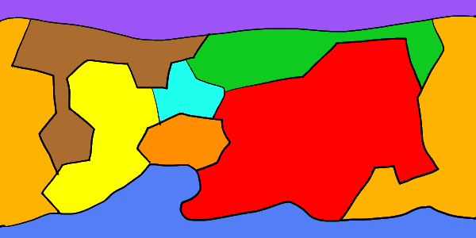
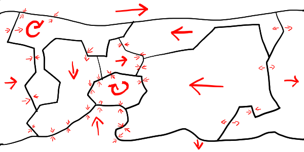
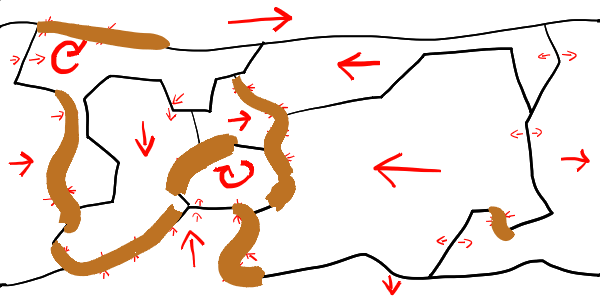
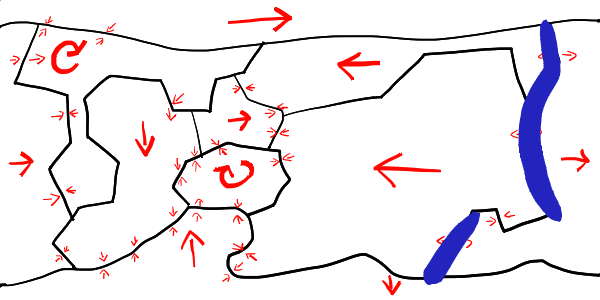
.. |image5| image:: assets/image-20240619160756-rjwfml3.png

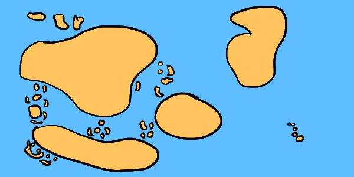
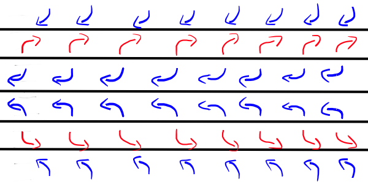
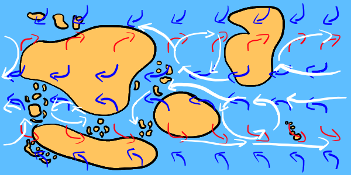
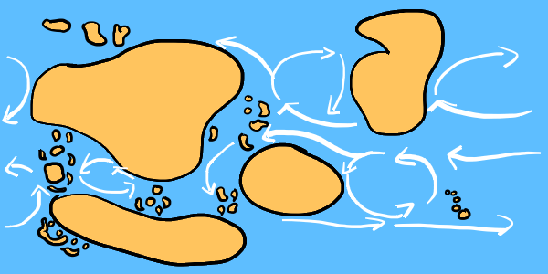

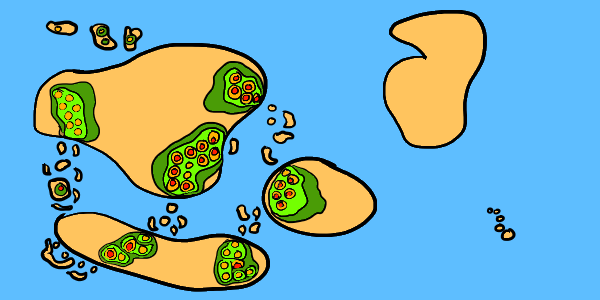
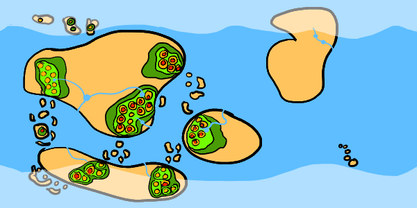
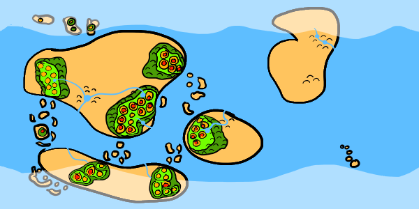
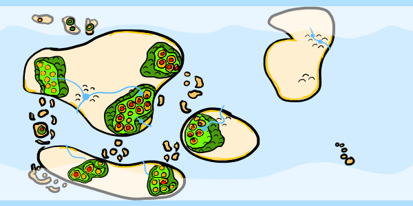
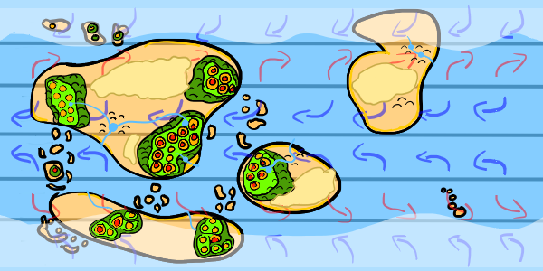
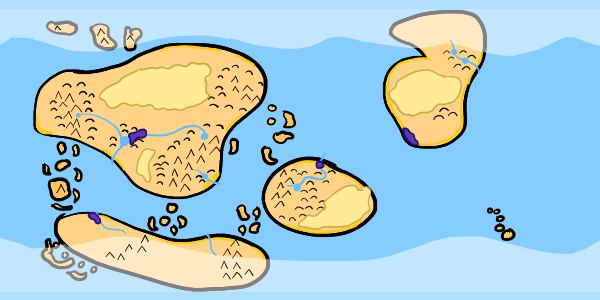
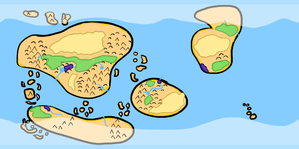
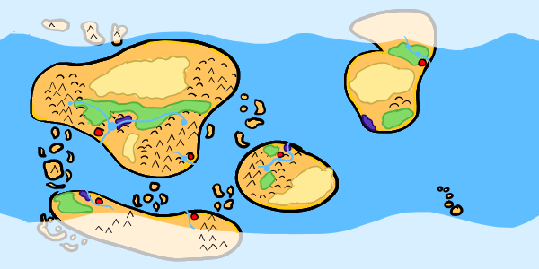

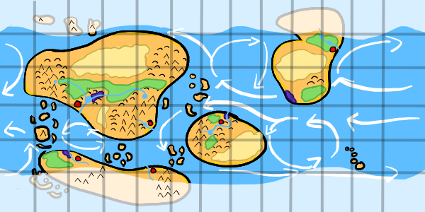
