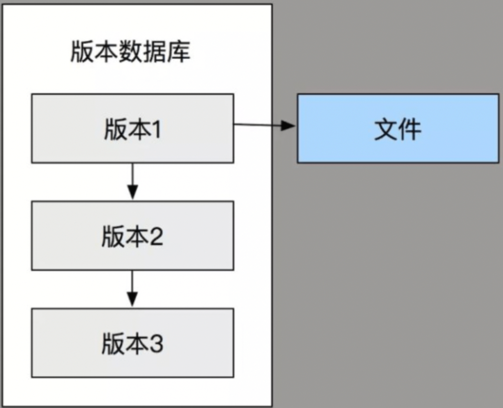
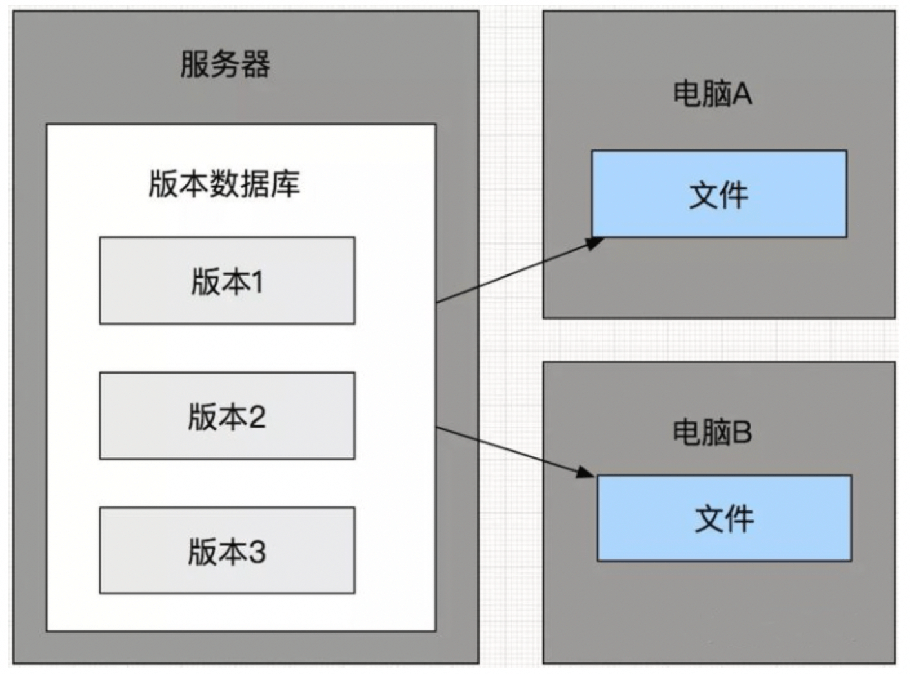
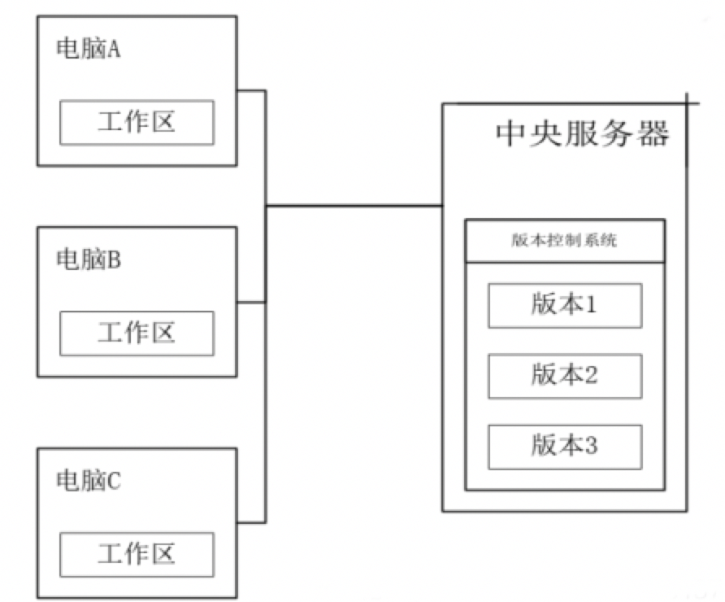

============
版本控制工具
============

前言
============

你们写论文的时候肯定有一大堆复制的<xxx毕业论文.doc>，实习的时候估计好多人的代码也是有一堆xxx.cpp xxx_副本.cpp xxx_副本1.cpp之类的，这实际上也算是一种版本控制，就是比较原始。不过版本管理是有正经工具的，下面介绍下：

版本管理是什么
================

版本管理（Version control），是维护工程蓝图的标准作法，能追踪工程蓝图从诞生一直到定案的过程。此外，版本控制也是一种软件工程技巧，借此能在软件开发的过程中，确保由不同人所编辑的同一程序文件都得到同步透过文档控制，能记录任何工程项目内各个模块的改动历程，并为每次改动编上序号。

一种简单的版本控制形式如下：赋给图的初版一个版本等级“A”。当做了第一次改变后，版本等级改为 “B”，以此类推。

版本控制能提供项目的设计者，将设计恢复到之前任一状态的选择权。

简言之，你的修改只要提到到版本控制系统，基本都可以找回，版本控制系统就像一台时光机器，可以让你回到任何一个时间点

这里顺带提下，版本控制系统提供的 3 个能力：可逆、并行、注解。也就是可以回到任何一个软件版本、大家可以进行协作开发、可以详细记录代码的变更情况。也就是程序员如果跑路的话，删代码是没用的。

版本管理有哪些
================

版本控制系统在当今的软件开发中，被认为是理所当然的配备工具之一，根据类别可以分成：

-  本地版本控制系统
-  集中式版本控制系统
-  分布式版本控制系统

本地版本控制系统
~~~~~~~~~~~~~~~~
结构如下图所示：

   
   *本地版本控制系统*
   
优点：

-  简单，很多系统中都有内置
-  适合管理文本，如系统配置

缺点：

-  其不支持远程操作，因此并不适合多人版本开发

集中式版本控制系统
~~~~~~~~~~~~~~~~~~

结构如下图所示：

   
   *集中式版本控制系统*

优点：

-  适合多人团队协作开发
-  代码集中化管理

缺点：

-  单点故障
-  必须联网，无法单机工作

代表工具有 ``SVN``​、 ``CVS`` ​，很多公司现在还是在用 SVN ，因为方便权限管理。

分布式版本控制系统
~~~~~~~~~~~~~~~~~~

结构如下图所示：

   
   *分布式版本控制系统*

优点：

-  适合多人团队协作开发
-  代码集中化管理
-  可以离线工作
-  每个计算机都是一个完整仓库

分布式版本管理系统每个计算机都有一个完整的仓库，可本地提交，可以做到离线工作，则不用像集中管理那样因为断网情况而无法工作

代表工具为  ``Git``  ​、  ``Mercurial``

常用版本管理工具
====================

公司一般就是 SVN ， GIT ，比较常用。

SNV 推荐学习: `TortoiseSVN 使用教程 <https://www.runoob.com/svn/tortoisesvn-intro.html>`_  ,菜鸟教程里有部分 svn 命令行的教程，一般情况下用不着，也可以看看。用起来很简单，全界面化的东西，而且比较稳定。

GIT 推荐学习 `廖雪峰的Git教程 <ttps://liaoxuefeng.com/books/git/introduction/index.html>`_ ，GIT 命令基本还是必须学习的东西，一般情况虽然用界面也行，最好是理解下 GIT 的思想，然后再用。

Mercurial 参见下一节的介绍 ，自己用的话其实我更推荐这个，特别是 Windows 下，速度快，不需要安装额外的环境，方便搭建。

TortoiseHG笔记
=========================

`参考连接 <https://blog.csdn.net/forever_008/article/details/104203895>`_ 
 

TortoiseHg 简介
---------------------

TortoiseHg是分布式的源码管理工具 Mercurial 的界面（GUI）客户端，现在还是比较小众,但是可以跟 git 等版本管理工具互通，可以无需服务器，在本地使用。下载地址为： `TortoiseHG <https://www.mercurial-scm.org/downloads>`_ 

.. warning:: 
   不要在 `bitbucket <https://tortoisehg.bitbucket.io>`_ 去下载，慢，而且版本不是最新。

安装很简单，直接下一步下一步就可以了。

简单使用
--------------

创建仓库
~~~~~~~~~~~~~~

在该文件所在目录，右键，选择【TortoiseHg】-----【CreateRepository Here】-----点击【创建】

首次提交
~~~~~~~~~~~~~~
创建完仓库后，需要首先选中最新版本，接着选择需要跟踪文件，然后编写必要的修改说明，最后点击提交按钮。请注意提交操作仅仅提交到本地仓库，若要使远程仓库产生变化需要进行下一步推送操作。

修改后提交
~~~~~~~~~~~~~~
在文件夹中右键，选择【Hg Commit】，在弹出框中选择修改过的文件，再次编写必要的修改说明后，点击提交按钮即可。

本地的操作基本就这么多，如果需要的话可以自己去看参考链接，学习更详细的使用方式。