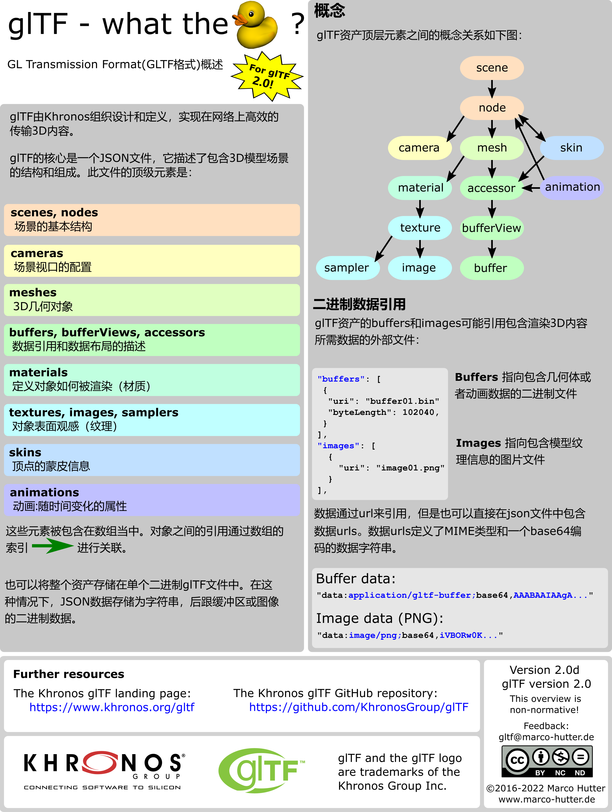
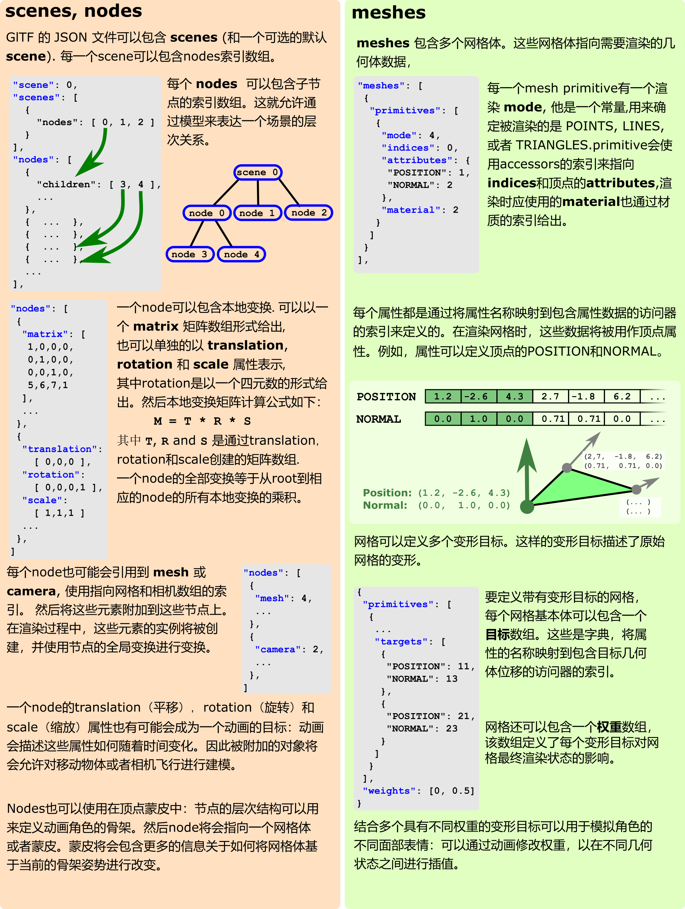
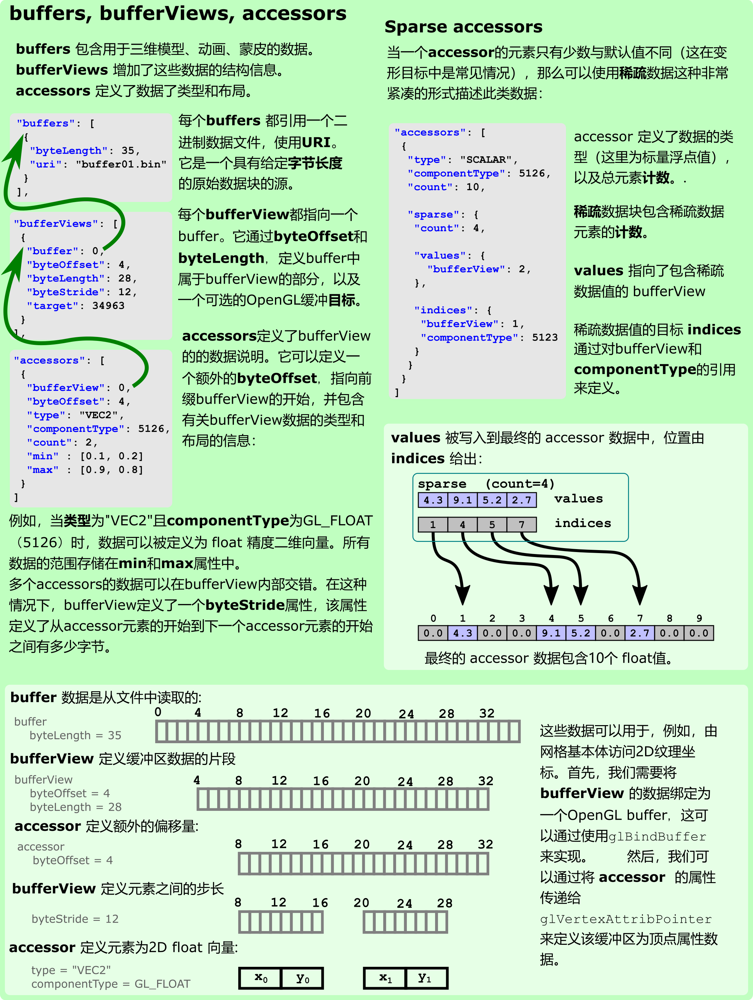
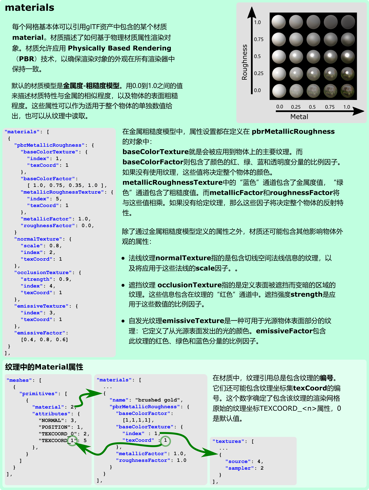
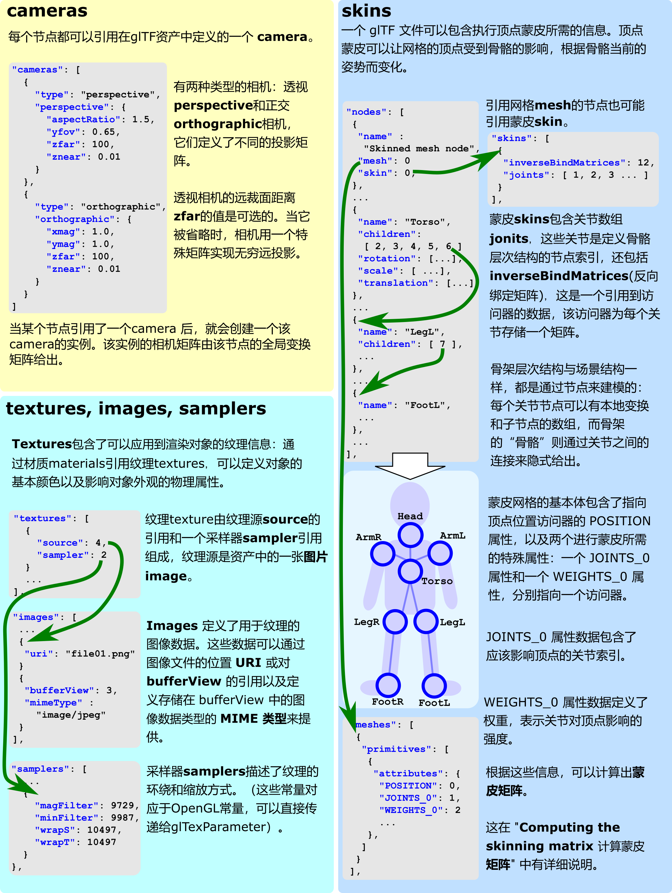
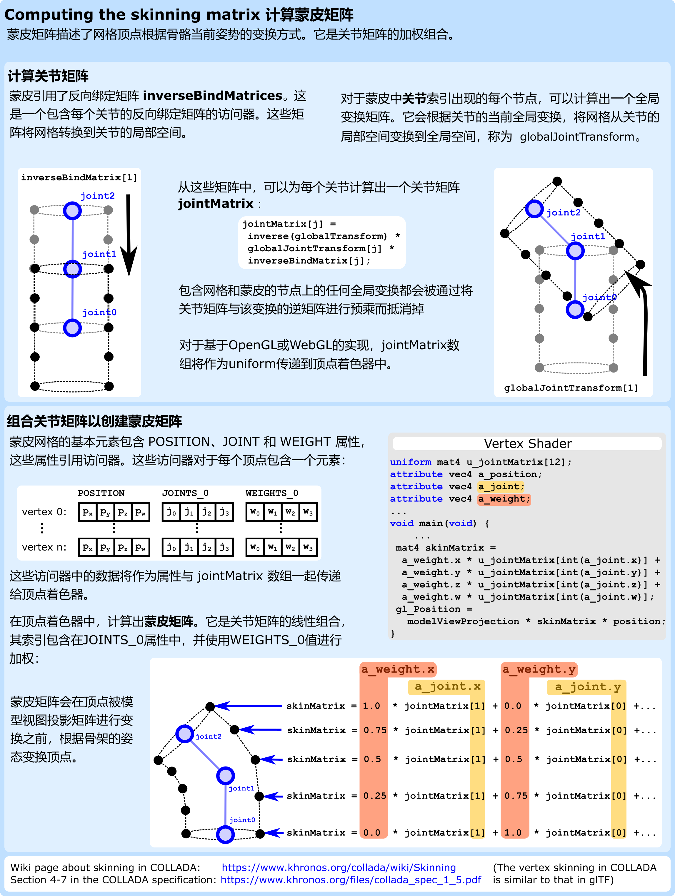
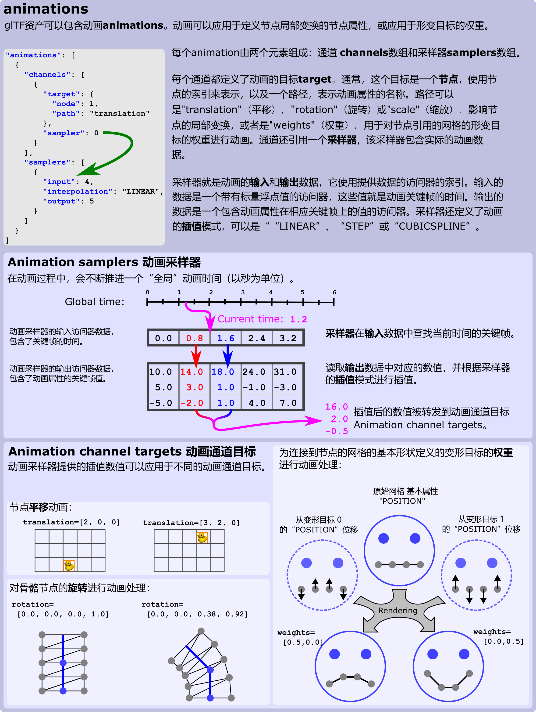
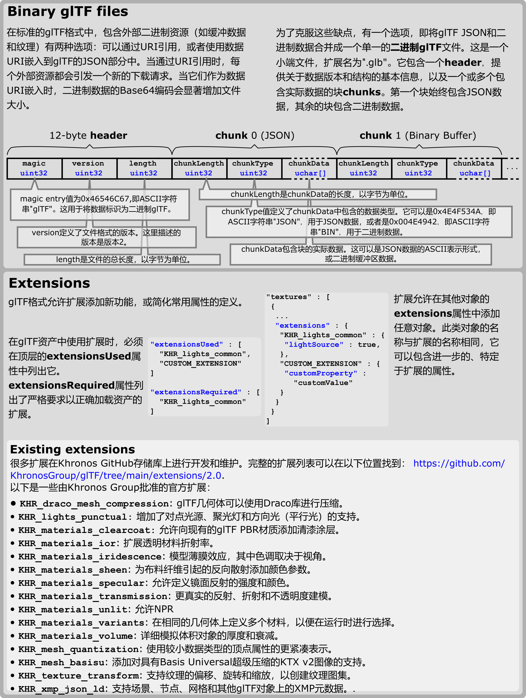

=============
GLTF Overview
=============

:Date: 2024-09-18T09:21:32Z

GLTF Overview
=============

​\ |gltfOverview2.0_Layer_1|\ ​

​\ |gltfOverview2.0_Layer_2|\ ​

​\ |gltfOverview2.0_Layer_3|\ ​

​\ |gltfOverview2.0_Layer_4|\ ​

​\ |gltfOverview2.0_Layer_5|\ ​

​\ |gltfOverview2.0_Layer_6|\ ​

​\ |gltfOverview2.0_Layer_7|\ ​

​\ |gltfOverview2.0_Layer_8|\ ​

参考
----

`glTF™ 2.0 Specification
(khronos.org) <https://registry.khronos.org/glTF/specs/2.0/glTF-2.0.html>`__

`Reference Guides - The Khronos Group
Inc <https://www.khronos.org/developers/reference-cards/>`__

`khronos.org/files/gltf20-reference-guide.pdf <https://www.khronos.org/files/gltf20-reference-guide.pdf>`__

`gltfOverview中文翻译-腾讯云开发者社区-腾讯云
(tencent.com) <https://cloud.tencent.com/developer/article/1809922>`__

