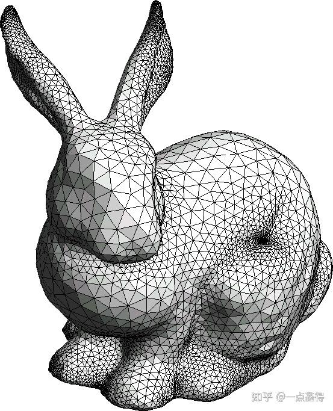
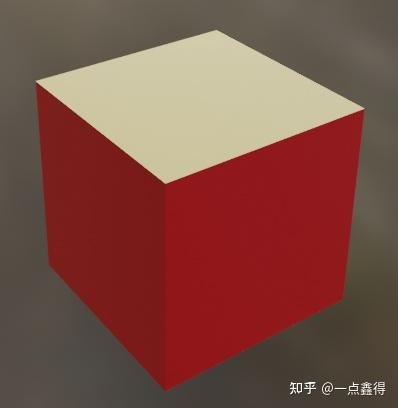
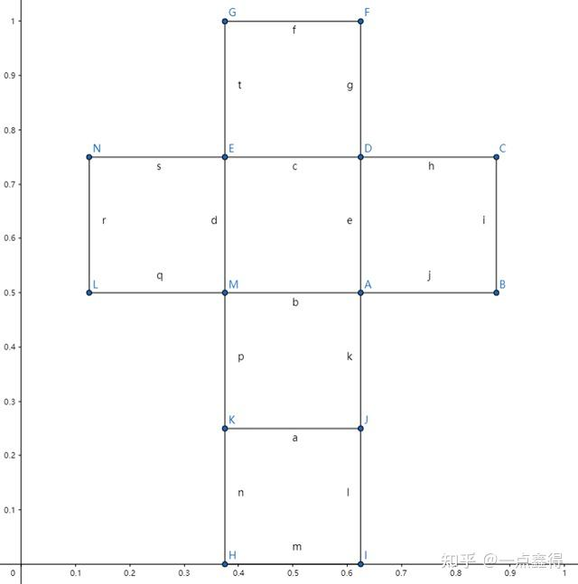

=========================
一文看懂 3D 模型 obj 文件
=========================

:Date: 2024-09-18T14:52:49Z

一文看懂 3D 模型 obj 文件
=========================

   原文地址 https://zhuanlan.zhihu.com/p/516546645

你是否好奇那些 3D 游戏中复杂的角色、建筑、场景是怎么实现的，美工使用 3D
建模软件设计好角色模型之后，程序又是怎么让它们动起来的哪？

在计算机中，3D
角色等模型最终都是存储成文件，这些文件必然携带了角色形状、材质等属性，程序就是通过读取并解析这些文件，通过代码控制它们动起来，创造了一个又一个精彩的游戏世界。另外，看似复杂无比的模型都是通过大量三角形来逼近的，表示单个三角形就简单很多了，而
3D 模型文件的内容也就是立足于三角形。

​\ |image1|\ ​

`obj
文件 <https://zhida.zhihu.com/search?q=obj%E6%96%87%E4%BB%B6&zhida_source=entity&is_preview=1>`__\ 是
Alias|Wavefront 公司为 3D 建模和动画软件 "Advanced Visualizer"
开发的一种标准 3D 模型文件格式，大部分 3D 软件都支持导入、导出 obj
格式的模型文件。

立方体模型
----------

接下来，我们使用
`blender <https://zhida.zhihu.com/search?q=blender&zhida_source=entity&is_preview=1>`__
这款开源的 3D
建模软件创建一个简单的立方体模型，设置立方体的顶面颜色为橘黄色，其他面全部为红色，j
将其导出为 obj 文件，使用任意文本编辑器打开来一步步看看里面都有什么。

说明：导出共生成了两个文件，一个为. obj 后缀模型文件，一个为. mtl
后缀的材质文件。

​\ |image2|\ ​

看懂 obj 模型文件
-----------------

完整的 obj 文件内容如下

::

   # Blender v3.1.2 OBJ File: ''
   # www.blender.org
   mtllib mycube.mtl
   o Cube
   v 1.000000 1.000000 -1.000000
   v 1.000000 -1.000000 -1.000000
   v 1.000000 1.000000 1.000000
   v 1.000000 -1.000000 1.000000
   v -1.000000 1.000000 -1.000000
   v -1.000000 -1.000000 -1.000000
   v -1.000000 1.000000 1.000000
   v -1.000000 -1.000000 1.000000
   vt 0.625000 0.500000
   vt 0.875000 0.500000
   vt 0.875000 0.750000
   vt 0.625000 0.750000
   vt 0.375000 0.750000
   vt 0.625000 1.000000
   vt 0.375000 1.000000
   vt 0.375000 0.000000
   vt 0.625000 0.000000
   vt 0.625000 0.250000
   vt 0.375000 0.250000
   vt 0.125000 0.500000
   vt 0.375000 0.500000
   vt 0.125000 0.750000
   vn 0.0000 1.0000 0.0000
   vn 0.0000 0.0000 1.0000
   vn -1.0000 0.0000 0.0000
   vn 0.0000 -1.0000 0.0000
   vn 1.0000 0.0000 0.0000
   vn 0.0000 0.0000 -1.0000
   usemtl Material
   s off
   f 1/1/1 5/2/1 7/3/1 3/4/1
   usemtl Material.001
   f 4/5/2 3/4/2 7/6/2 8/7/2
   f 8/8/3 7/9/3 5/10/3 6/11/3
   f 6/12/4 2/13/4 4/5/4 8/14/4
   f 2/13/5 1/1/5 3/4/5 4/5/5
   f 6/11/6 5/10/6 1/1/6 2/13/6

-  #开头的表示注释。
-  mtllib mycube.mtl 表示引用了一个外部的材质文件，材质文件名为
   mycube.mtl，后面会介绍材质文件的内容。
-  o Cube 指定了模型名称为 Cube。
-  v 开头的共有 8 行，表示立方体的 8
   个\ `顶点坐标 <https://zhida.zhihu.com/search?q=%E9%A1%B6%E7%82%B9%E5%9D%90%E6%A0%87&zhida_source=entity&is_preview=1>`__
   (x,y,z)。
-  vt 开头的共有 14 行，表示 uv 贴图坐标
   (x,y)，看到这些奇怪的数字可能让你一头雾水，当我们把这 14
   行数字表示的坐标点逐一绘制出来，并将相邻的点连接起来就得到了下面的图形。这样就豁然开朗了，它就像是一张包装纸，刚好可以包裹住一个立方体盒子的
   6 个面。

​\ |image3|\ ​

-  vn 开头的共有 6 行，它表示立方体 6
   个面对应的法向量，\ `法向量 <https://zhida.zhihu.com/search?q=%E6%B3%95%E5%90%91%E9%87%8F&zhida_source=entity&is_preview=1>`__\ 在这里起到识别某个面是正面还是反面的作用。
-  usemtl Material 表示使用 mycube.mtl 文件中 Material
   定义的材质，接下来的通过索引指定的面将使用该材质。
-  s off 表示关闭光滑组（Smoothing group）。
-  f 开头的表示由顶点、uv 纹理坐标、法向量索引确定的表面，如 5/2/1 表示
   v 开头的第 5 个顶点、这个点对应 vt 贴图的第 2
   个坐标（就是包装纸的某个点应该和立方体盒子的哪个点对齐）、这个点对应
   vn 开头的第 1 个法向量；一个立方体表面共有 4 个点，因此需要有 4
   组索引数据来确定一个面。使用 Material
   材质的面只有一个，就是建模时设置为橘黄色的面。
-  usemtl Material.001 表示使用 mycube.mtl 文件中 Material.001
   表示的材质，接下来的通过索引指定的面将使用该材质。
-  之后 5 行以 f 开头的面是建模时设置为红色的面，格式同橘黄色的面。

看懂 mtl 材质文件
-----------------

现在，来看看 mycube.mtl 材质文件都包含什么内容，完整内容如下：

::

   # Blender MTL File: 'None'
   # Material Count: 2

   newmtl Material
   Ns 359.999993
   Ka 1.000000 1.000000 1.000000
   Kd 0.800000 0.582192 0.154415
   Ks 0.500000 0.500000 0.500000
   Ke 0.000000 0.000000 0.000000
   Ni 1.450000
   d 1.000000
   illum 2

   newmtl Material.001
   Ns 250.000000
   Ka 1.000000 1.000000 1.000000
   Kd 0.800000 0.002207 0.009875
   Ks 0.500000 0.500000 0.500000
   Ke 0.000000 0.000000 0.000000
   Ni 1.450000
   d 1.000000
   illum 2

-  #开头表示注释。
-  newmtl Material 定义材质 Material，接下来的内容都是该材质的属性。
-  Ns 表示高光色的权重。
-  Ka 表示环境光，三个数字分别对应 R、G、B 值。
-  Kd 表示漫反射光，三个数字分别对应 R、G、B 值。
-  Ks 表示高光，三个数字分别对应 R、G、B 值。
-  Ke 表示发射光，三个数字分别对应 R、G、B 值。
-  Ni 表示光学密度。
-  d 表示透明度，0 是完全透明，1 是完全不透明。
-  illum 2 表示指定的光照模型（参考：Phong 光照模型），illum
   后面的数字范围为 0~10，具体含义如下：

::

   0 Color on and Ambient off  
   1 Color on and Ambient on  
   2 Highlight on  
   3 Reflection on and Ray trace on  
   4 Transparency: Glass on  
     Reflection: Ray trace on  
   5 Reflection: Fresnel on and Ray trace on  
   6 Transparency: Refraction on  
     Reflection: Fresnel off and Ray trace on  
   7 Transparency: Refraction on  
     Reflection: Fresnel on and Ray trace on  
   8 Reflection on and Ray trace off  
   9 Transparency: Glass on  
     Reflection: Ray trace off  
   10 Casts shadows onto invisible surfaces

-  newmtl Material.001 表示指定材质
   Material.001，之后的内容都是关于该材质的属性，具体含义和 Material
   完全相同，不再详述。

`参考文献 <https://zhida.zhihu.com/search?q=%E5%8F%82%E8%80%83%E6%96%87%E7%8C%AE&zhida_source=entity&is_preview=1>`__
---------------------------------------------------------------------------------------------------------------------

[1]. 《WebGL 指南》第 10 章高级技术 >
加载\ `三维模型 <https://zhida.zhihu.com/search?q=%E4%B8%89%E7%BB%B4%E6%A8%A1%E5%9E%8B&zhida_source=entity&is_preview=1>`__\ ，401
页。

