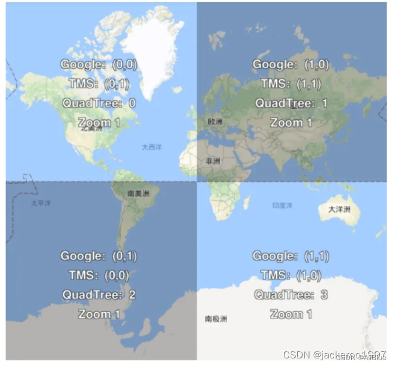

========
切片方案
========

:Date: 2024-09-19T09:22:38Z

切片方案
========

   原文地址 https://blog.csdn.net/AllBluefm/article/details/135916295

参考地址：\ `地图瓦片切片方案汇总_天地图切片方案 - CSDN
博客 <https://blog.csdn.net/qq_37987033/article/details/127638206?ops_request_misc=%257B%2522request%255Fid%2522%253A%2522170651665916800215040633%2522%252C%2522scm%2522%253A%252220140713.130102334..%2522%257D&request_id=170651665916800215040633&biz_id=0&utm_medium=distribute.pc_search_result.none-task-blog-2~all~baidu_landing_v2~default-1-127638206-null-null.142%5Ev99%5Epc_search_result_base1&utm_term=xyz%20%E5%88%87%E7%89%87%E6%96%B9%E6%A1%88&spm=1018.2226.3001.4187>`__

加了一些我自己的理解，如有不对的地方，欢迎大佬指正。

**1、几种主流切片方案。**

-  web 墨卡托投影：谷歌 xyz、tms、quadTree、百度 xyz。
-  经纬度投影：天地图经纬度投影（天地图有 2 种投影方式：经纬度投影用_c
   表示；球面墨卡托投影用_w 表示，采用谷歌 xyz 标准）。
-  在 cesium 种支持这这两种切片方案：\ `cesium wmts 切片方案
   TilingScheme-CSDN
   博客 <https://blog.csdn.net/AllBluefm/article/details/134644664?ops_request_misc=%257B%2522request%255Fid%2522%253A%2522170652080216800186586936%2522%252C%2522scm%2522%253A%252220140713.130102334.pc%255Fblog.%2522%257D&request_id=170652080216800186586936&biz_id=0&utm_medium=distribute.pc_search_result.none-task-blog-2~blog~first_rank_ecpm_v1~rank_v31_ecpm-1-134644664-null-null.nonecase&utm_term=%E5%88%87%E7%89%87&spm=1018.2226.3001.4450>`__
-  `常见地图瓦片源地址_地图瓦片地址 - CSDN
   博客 <https://blog.csdn.net/AllBluefm/article/details/134803270?ops_request_misc=%257B%2522request%255Fid%2522%253A%2522170652091516800222842215%2522%252C%2522scm%2522%253A%252220140713.130102334.pc%255Fblog.%2522%257D&request_id=170652091516800222842215&biz_id=0&utm_medium=distribute.pc_search_result.none-task-blog-2~blog~first_rank_ecpm_v1~rank_v31_ecpm-1-134803270-null-null.nonecase&utm_term=%E5%9C%B0%E5%9D%80&spm=1018.2226.3001.4450>`__

**2、web 墨卡托投影切片**

-  谷歌 xyz

..

   特点：z 表示缩放层级，xy 原点在左上角，x 从左向右，y 从上向下

   读取方式：地图以 x\\y\\z 的方式存储读取

   举例：\ `高德地图 <https://so.csdn.net/so/search?q=%E9%AB%98%E5%BE%B7%E5%9C%B0%E5%9B%BE&spm=1001.2101.3001.7020>`__\ 、谷歌地图、OpenStreeMap

-  tms

..

   特点：z 表示缩放层级，xy 原点在左下角，x 从左向右，y 从下向上

   读取方式：地图以 x\\y\\z 的方式存储读取

   举例：腾讯地图

-  QuadTree

..

   特点：z
   的定义和谷歌相同，同一级别的瓦片用一个\ `整数表示 <https://so.csdn.net/so/search?q=%E6%95%B4%E6%95%B0%E8%A1%A8%E7%A4%BA&spm=1001.2101.3001.7020>`__\ ，该整数服从四叉树编码规则

   读取方式：将 x\\y 转成为二进制的方式存储读取

   举例：Bing 地图

**谷歌 XYZ、TMS、QuadTree 在缩放层级为 2 瓦片编号如图：**

​\ |image1|\ ​

-  百度 xyz

..

   特点：z 从 1 开始，在最高级就把瓦片分成 4 块；xy 原点在经度为 0
   纬度为 0 的位置，x 从左向右，y 从上向下

   举例：百度地图

**3、经纬度投影切片**

-  天地图经纬度投影

..

   特点：地图以左上角为原点，x 从左向右，y 从上向下

   地图切片不是一个 n*n 的正方形，在缩放层级为 z 时，行数 row=2^z-1,
   列数 col=2^z

