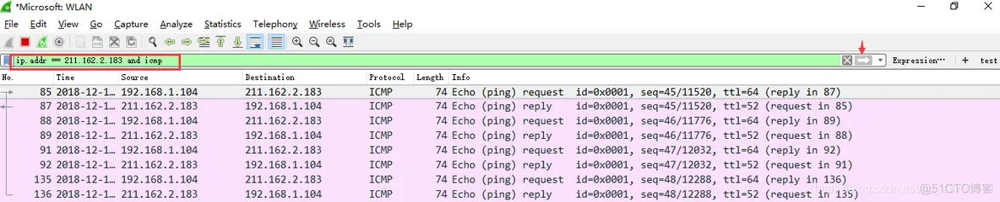

====================================================================================
wireshark 简明教程，新手专用，挑实在的讲，不搞花里胡哨_51CTO 博客_wireshark 详细教程
====================================================================================

:Date: 2024-09-14T09:39:33Z

wireshark 简明教程，新手专用，挑实在的讲，不搞花里胡哨_51CTO 博客_wireshark 详细教程
====================================================================================

   原文地址 https://blog.51cto.com/u_15197573/3161294

‍

文章目录
--------

-  

-  下载与安装

-  选择接口（网卡）

-  wireshark 抓包界面介绍

-  Wireshark 过滤器

-  

::

   * 1）捕获过滤器
   * 显示过滤器
   * 过滤器语法
   *  

     * 1）协议过滤
     * 2）IP 过滤
     * 3）端口过滤
     * 4）逻辑运算符 && 与、|| 或、！非
     * 一些实例
     * 5）Http 模式过滤
     * 6）数据包内容过滤

-  实例：wireshark 分析 TCP 包
-  其他
-  

::

   * 使用图表
   * 页面小 tips

下载与安装
----------

如果一切正常，那安装就很快，去 wireshark 官网下载一个。

如果安装过程中出现了问题，不妨看一下我昨晚写的问题解决教程：问题解决：wireshark
之 npcap 无法安装、winpcap 无法安装问题解决

因为我是用两台电脑的，所以，嗯。

第二台安装的时候就是一步到位很快的。

--------------

我也是新手上来的，在学的过程中看到很多教程，要么千篇一律，要么罗里吧嗦的千篇一律。我只想会用，不想看什么英语是什么意思，什么按键是什么意思，我看得懂英语好吗？！！

甚至还有什么，七八万字的教程，我的天哪。搞得这么复杂干嘛？人气？流量？

--------------

选择接口（网卡）
----------------

打开 wireshark 之后，正常情况下会有好多个接口：

​\ |image1|\ ​

还有的版本，就需要一波操作才能打开这个界面了：

​\ |image2|\ ​

点击。

或者还有个办法，就双击 Traffic 那个线。

不同的版本可能表面上不一样，不要被事物的表面现象所迷惑，我们现在讲的是思维。

它可能默认会给你全勾上，没事儿，不用管它，你只要确认你想监听的那个接口被选中，高亮，注意，是高亮，不是打勾，勾肯定是勾上了，看上面的图，蓝色高亮，然后开始。

| 不然你可能会发现什么都抓不出来。
| 当然，上面这个图也什么都抓不出来，因为根本没有网络波动，不难猜那条
  Traffic 下面的横线代表的是网络波动，就像心电图一样。

好，不管它，选好之后打开。

--------------

wireshark 抓包界面介绍
----------------------

​\ |image3|\ ​

说明：数据包列表区中不同的协议使用了不同的颜色区分。协议颜色标识定位在菜单栏
View --> Coloring Rules，反正我是没那兴趣去改来改去的。

--------------

Wireshark 过滤器
----------------

开始之后，会看到一堆有一堆的包开始刷刷刷的，快得很：

​\ |image4|\ ​

那我们怎么找我们想要的呢？过滤嘛。

| 为避免其他无用的数据包影响分析，可以通过在过滤栏设置过滤条件进行数据包列表过滤，获取结果如下。
| 说明：ip.addr == 192.168.76.26 and icmp 表示只显示 ICPM 协议且源主机
  IP 或者目的主机 IP 为 192.168.76.26 的数据包。

​\ |image5|\ ​

.. _1捕获过滤器:

1）捕获过滤器
~~~~~~~~~~~~~

捕获过滤器的菜单栏路径为 Capture --> Capture
Filters。用于在抓取数据包前设置。

​\ |image6|\ ​

当然，还不了解抓包语法的情况下，这只是先说一声儿这里有个设置罢了。

--------------

显示过滤器
~~~~~~~~~~

显示过滤器是用于在抓取数据包后设置过滤条件进行过滤数据包。通常是在抓取数据包时设置条件相对宽泛，抓取的数据包内容较多时使用显示过滤器设置条件顾虑以方便分析。

​\ |image7|\ ​

--------------

过滤器语法
~~~~~~~~~~

不同版本可能语法会有点不一样，但是差别不大，可以自行摸索出来，所以我就放一份儿。

.. _1协议过滤:

1）协议过滤
^^^^^^^^^^^

比较简单，直接在抓包过滤框中直接输入协议名即可。

（注意：协议名称需要输入小写）

::

     TCP，只显示TCP协议的数据包列表

     HTTP，只查看HTTP协议的数据包列表

     ICMP，只显示ICMP协议的数据包列表 

以及其他协议，可以在抓包窗口中看到其他协议的协议名。至于想要深入了解这些协议，请移步：《TCP/IP
卷一》，书可以自己找，也可以私信我拿，或者下面评论。

.. _2ip-过滤:

2）IP 过滤
^^^^^^^^^^

请带上 ip.

::

    host 192.168.1.104

     src host 192.168.1.104

     dst host 192.168.1.104

ip.
完之后会有很多选项，上面这些只是常用的，而且具体怎么写，看软件的提示。

.. _3端口过滤:

3）端口过滤
^^^^^^^^^^^

请带上 tcp. 或者 udp.

::

     port 80

     src port 80

     dst port 80

同样的，点完会有很多选项出来，请服从软件提示。

.. _4逻辑运算符--与-或非:

4）逻辑运算符 && 与、|\| 或、！非
^^^^^^^^^^^^^^^^^^^^^^^^^^^^^^^^^

::

     src host 192.168.1.104 && dst port 80 抓取主机地址为192.168.1.80、目的端口为80的数据包

     host 192.168.1.104 || host 192.168.1.102 抓取主机为192.168.1.104或者192.168.1.102的数据包

     ！broadcast 不抓取广播数据包

--------------

一些实例
^^^^^^^^

::

    tcp，只显示TCP协议的数据包列表

     http，只查看HTTP协议的数据包列表

     icmp，只显示ICMP协议的数据包列表

::

     ip.src ==192.168.104.10 显示源地址为192.168.104.10的数据包列表

      ip.dst==192.168.104.10, 显示目标地址为192.168.104.10的数据包列表

      ip.addr == 192.168.104.10 显示源IP地址或目标IP地址为192.168.104.10的数据包列表

::

     tcp.port ==80,  显示源主机或者目的主机端口为80的数据包列表。

     tcp.srcport == 80,  只显示TCP协议的源主机端口为80的数据包列表。

     tcp.dstport == 80，只显示TCP协议的目的主机端口为80的数据包列表。

--------------

.. _5http-模式过滤:

5）Http 模式过滤
^^^^^^^^^^^^^^^^

http.request.method==“GET”, 只显示 HTTP GET 方法的。

注意，这里 GET 要大写。

.. _6数据包内容过滤:

6）数据包内容过滤
^^^^^^^^^^^^^^^^^

比方说：

​\ |image8|\ ​

--------------

实例：wireshark 分析 TCP 包
---------------------------

| 1、启动 wireshark 抓包工具
| 2、浏览器访问一个网站，比方说：\ `www.baidu.com <http://www.baidu.com>`__
| 3、打开终端，ping 这个网址，找到它的 IP 地址

​\ |image9|\ ​

接着，进入抓包工具，过滤出这个网址的包

​\ |image10|\ ​

可以看到啊，这里握手了有分手，分手了又握手，看来是短连接。

--------------

至于握手分手细节，想了解的话：详解 TCP 三次握手与四次挥手

--------------

其他
----

使用图表
~~~~~~~~

| 图形分析是数据分析中必不可少的一部分。也是 wireshark
  的一大亮点。wireshark
  有不同的图形展现功能，以帮助你了解捕获的数据包。下面我们对经常使用的
  IO 图，双向时间图做下介绍。
| IO 图

wireshark 的 IO
图让你可以对网络上的吞吐量绘图。让你了解网络数据传输过程中的峰值和波动情况。通过
“Statistics” 菜单中的 “IO Graphs” 选项可以打开这个 IO 图对话框。如下图：

​\ |image11|\ ​

参数都可以调的。

--------------

页面小 tips
~~~~~~~~~~~

左边的实线连起来的表示同一次会话发生的各个阶段。

​\ |image12|\ ​

HTTP 请求选中后，能够看到对应的请求和响应。

​\ |image13|\ ​

Wireshark 会帮我们将多次请求合并。

​\ |image14|\ ​

在选中的项目上右键选择 Follow->HTTP Stream
可以将这次请求的所有相关的请求列出，帮助我们快速过滤。

and so on.

期待后期再探索吧！！！

.. |image5| image:: assets/1726277972781-20240914093932-zaqz17a.webp

