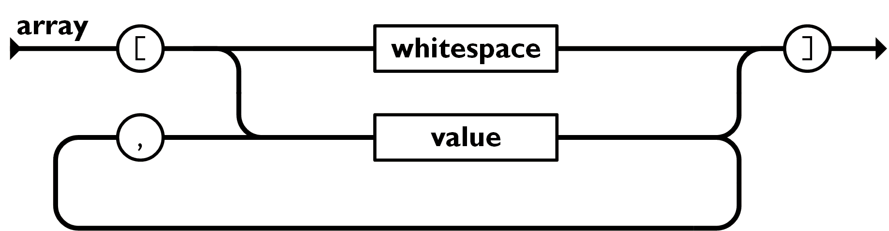

=========
JSON 语法
=========

:Date: 2024-09-10T14:17:02Z

JSON 语法
=========

   原文地址 https://www.runoob.com/json/json-syntax.html

`JSON 简介 <https://www.runoob.com/json/json-intro.html>`__ `JSON vs
XML <https://www.runoob.com/json/json-vs-xml.html>`__

JSON 语法是 JavaScript 语法的子集。

JSON 语法规则
-------------

JSON 语法是 JavaScript 对象表示语法的子集。

-  数据在\ ``名称/值``\ ​对中
-  数据由逗号 ``,``\ ​ 分隔
-  使用斜杆 ``\``\ ​ 来转义字符
-  大括号 ``{}``\ ​ 保存对象
-  中括号 ``[]``\ ​ 保存数组，数组可以包含多个对象

**JSON 的两种结构：**

**1、对象：** 大括号 ``{}``\ ​ 保存的对象是一个无序的\ **名称 /
值**\ 对集合。一个对象以左括号 ``{``\ ​ 开始， 右括号 ``}``\ ​ 结束。每个
"键" 后跟一个冒号 ``:``\ ​，\ **名称 / 值**\ 对使用逗号 ``,``\ ​ 分隔。

​\ |image1|\ ​

**2、数组：** 中括号 ``[]``\ ​
保存的数组是值（value）的有序集合。一个数组以左中括号 ``[``\ ​ 开始，
右中括号 ``]``\ ​ 结束，值之间使用逗号 ``,``\ ​ 分隔。

​\ |image2|\ ​

值（value）可以是双引号括起来的字符串（string）、数值
(number)、true、false、
null、对象（object）或者数组（array），它们是可以嵌套。

​\ |image3|\ ​

.. _json-名称--值对:

JSON 名称 / 值对
----------------

JSON 数据的书写格式是：

::

   key : value

名称 / 值对包括字段名称（在双引号中），后面写一个冒号，然后是值：

::

   "name" : "菜鸟教程"

这很容易理解，等价于这条 JavaScript 语句：

::

   name = "菜鸟教程"

JSON 值
-------

JSON 值可以是：

-  数字（整数或浮点数）
-  字符串（在双引号中）
-  逻辑值（true 或 false）
-  数组（在中括号中）
-  对象（在大括号中）
-  null

JSON 数字
---------

JSON 数字可以是整型或者浮点型：

::

   { "age":30 }

JSON 对象
---------

JSON 对象在大括号 ``{}``\ ​ 中书写：

::

   {key1 : value1, key2 : value2, ... keyN : valueN }

对象可以包含多个名称 / 值对：

::

   { "name":"菜鸟教程" , "url":"www.runoob.com" }

这一点也容易理解，与这条 JavaScript 语句等价：

::

   name = "菜鸟教程"
   url = "www.runoob.com"

JSON 数组
---------

JSON 数组在中括号 ``[]``\ ​ 中书写：

数组可包含多个对象：

::

   [
       { key1 : value1-1 , key2:value1-2 }, 
       { key1 : value2-1 , key2:value2-2 }, 
       { key1 : value3-1 , key2:value3-2 }, 
       ...
       { key1 : valueN-1 , key2:valueN-2 }, 
   ]

::

   {
       "sites": [
           { "name":"菜鸟教程" , "url":"www.runoob.com" }, 
           { "name":"google" , "url":"www.google.com" }, 
           { "name":"微博" , "url":"www.weibo.com" }
       ]
   }

在上面的例子中，对象 **sites**
是包含三个对象的数组。每个对象代表一条关于某个网站（name、url）的记录。

JSON 布尔值
-----------

JSON 布尔值可以是 true 或者 false：

::

   { "flag":true }

JSON null
---------

JSON 可以设置 null 值：

::

   { "runoob":null }

JSON 使用 JavaScript 语法
-------------------------

因为 JSON 使用 JavaScript 语法，所以无需额外的软件就能处理 JavaScript
中的 JSON。

通过 JavaScript，您可以创建一个对象数组，并像这样进行赋值：

::

   var sites = [
       { "name":"runoob" , "url":"www.runoob.com" }, 
       { "name":"google" , "url":"www.google.com" }, 
       { "name":"微博" , "url":"www.weibo.com" }
   ];

可以像这样访问 JavaScript 对象数组中的第一项（索引从 0 开始）：

::

   sites[0].name;

返回的内容是：

::

   runoob

::

   sites[0].name="菜鸟教程";

在下面的章节，您将学到如何把 JSON 文本转换为 JavaScript 对象。

JSON 文件
---------

-  JSON 文件的文件类型是 ``.json``\ ​
-  JSON 文本的 MIME 类型是 ``application/json``\ ​

.. |image1| image:: assets/1725949022598-20240910141702-yv5fqn6.png

.. |image3| image:: assets/1725949022646-20240910141702-egtpr6f.png
