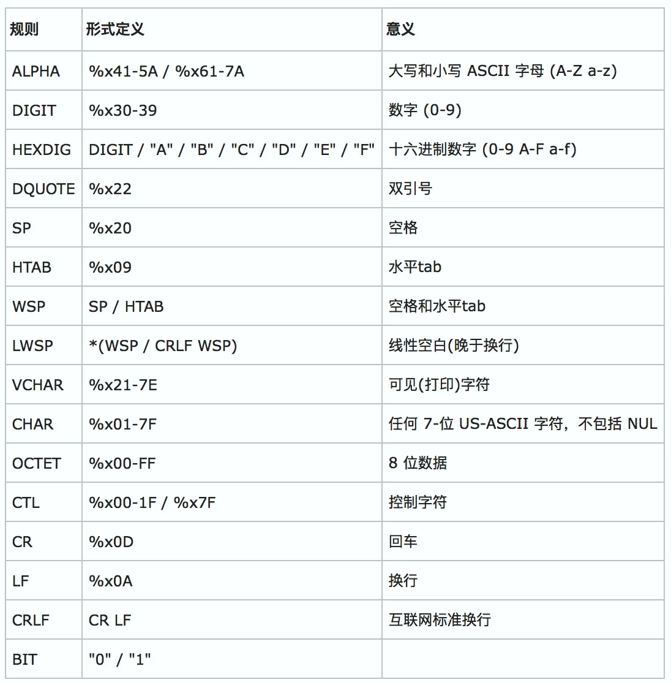

=======================================
语法格式描述规范 BNF、EBNF、ABNF - 简书
=======================================

:Date: 2024-09-10T16:46:50Z

语法格式描述规范 BNF、EBNF、ABNF - 简书
=======================================

   原文地址 https://www.jianshu.com/p/15efcb0c06c8

..

   由于经常研究东西，所以经常涉及语法的定义；以前我都是按照我自己定义的一套语法格式描述规则来进行严谨地描述语法格式，但是我自己设计的这套语法格式描述规则并不通用，所以决定改为通用的语法格式描述规则
   --EBNF(扩展的巴科斯范式) 或 ABNF(增强型巴科斯范式)，本文就详细讲讲
   BNF、EBNF、ABNF 这三者之间的关系与区别;

-  `1. 简介 <#1-%E7%AE%80%E4%BB%8B>`__

-  `2. 巴科斯范式
   BNF <#2-%E5%B7%B4%E7%A7%91%E6%96%AF%E8%8C%83%E5%BC%8Fbnf>`__

-  `3. 扩展的巴科斯范式
   EBNF <#3-%E6%89%A9%E5%B1%95%E7%9A%84%E5%B7%B4%E7%A7%91%E6%96%AF%E8%8C%83%E5%BC%8Febnf>`__

   -  `3.1. EBNF 符号表 <#31-ebnf%E7%AC%A6%E5%8F%B7%E8%A1%A8>`__
   -  `3.2. EBNF
      语法的定义 <#32-ebnf%E8%AF%AD%E6%B3%95%E7%9A%84%E5%AE%9A%E4%B9%89>`__

-  `4. 增强型巴科斯范式
   ABNF <#4-%E5%A2%9E%E5%BC%BA%E5%9E%8B%E5%B7%B4%E7%A7%91%E6%96%AF%E8%8C%83%E5%BC%8Fabnf>`__

   -  `4.1. 推导规则 <#41-%E6%8E%A8%E5%AF%BC%E8%A7%84%E5%88%99>`__
   -  `4.2. 操作符 <#42-%E6%93%8D%E4%BD%9C%E7%AC%A6>`__
   -  `4.3. 串联 <#43-%E4%B8%B2%E8%81%94>`__
   -  `4.4. 选择 <#44-%E9%80%89%E6%8B%A9>`__
   -  `4.5. 递增选择 <#45-%E9%80%92%E5%A2%9E%E9%80%89%E6%8B%A9>`__
   -  `4.6. 值范围 <#46-%E5%80%BC%E8%8C%83%E5%9B%B4>`__
   -  `4.7. 序列分组 <#47-%E5%BA%8F%E5%88%97%E5%88%86%E7%BB%84>`__
   -  `4.8. 可变重复 <#48-%E5%8F%AF%E5%8F%98%E9%87%8D%E5%A4%8D>`__
   -  `4.9. 特定重复 <#49-%E7%89%B9%E5%AE%9A%E9%87%8D%E5%A4%8D>`__
   -  `4.10. 可选序列 <#410-%E5%8F%AF%E9%80%89%E5%BA%8F%E5%88%97>`__
   -  `4.11. 注释 <#411-%E6%B3%A8%E9%87%8A>`__
   -  `4.12.
      操作符优先级 <#412-%E6%93%8D%E4%BD%9C%E7%AC%A6%E4%BC%98%E5%85%88%E7%BA%A7>`__
   -  `4.13. 核心规则 <#413-%E6%A0%B8%E5%BF%83%E8%A7%84%E5%88%99>`__

-  `5. 郭斌勇版巴科斯范式
   EBNF-GBY <#5-%E9%83%AD%E6%96%8C%E5%8B%87%E7%89%88%E5%B7%B4%E7%A7%91%E6%96%AF%E8%8C%83%E5%BC%8Febnf-gby>`__

   -  `5.1. 修改 <#51-%E4%BF%AE%E6%94%B9>`__
   -  `5.2. 增加 <#52-%E5%A2%9E%E5%8A%A0>`__

.. _1-简介:

1. 简介
=======

-  ​\ ``BNF``\ ​
   是最原始，最简单的方法，主要用于理论背景的学术论文中，以与人类进行交流。（与在编译器
   / 解析器中使用相反）。BNF 没有确切的规范。
-  ​\ ``EBNF``\ ​ 是 ``Extended BNF``\ ​ （扩展的
   BNF）的缩写。没有一个标准的
   EBNF，因为每个作者或程序都定义了自己的稍有不同的 EBNF 变体。
-  ​\ ``ABNF``\ ​ 是 ``augmented BNF``\ ​（增强型 BNF）的缩写，ABNF 的语法
   与 BNF 完全不同，但是更加标准化，利于解析器的翻译，但不利于阅读；

​\ ``BNF``\ ​、\ ``EBNF``\ ​、\ ``ABNF``\ ​
这三者的表达能力是等效的；它们只是语法上的差异。

-  举例 1：在传统的 BNF 中，左式 和 右式 的
   分隔符（即：定义符）通常是\ ``::=``\ ​，而在书籍中通常是 ``→``\ ​，在
   EBNF 和 ABNF 中是 ``=``\ ​；
-  举例 2：在传统的 BNF
   中，非终结符用尖括号括起来，例如，\ ``<EXPR>``\ ​终结符不用加任何额外的符号，用普通字符表示即可。而在
   ABNF 中，非终结符用普通字符表示，终结符需要用双引号括起来，例如 "+"
   ；
-  举例 3：在 BNF 和 EBNF 中，替代符号（选项符号）是 ``|``\ ​，在 ABNF
   中，替代符号是 ``/``\ ​；
-  举例 4：EBNF 和 ABNF 还具有快捷语法语法，比如指定 0 个 或 多个
   重复项。要将其用 BNF 表示，则需要引入更多规则。

通常，BNF 更适合教学、解释和理论讨论。EBNF 和 ABNF 经常用于语法定义 和
解析器解析，其中 ABNF 更加利于解析器解析；

.. _2-巴科斯范式-bnf:

2. 巴科斯范式 BNF
=================

巴科斯范式的英文缩写为 BNF，它是以美国人巴科斯 (Backus) 和丹麦人诺尔
(Naur)
的名字命名的一种形式化的语法表示方法，用来描述语法的一种形式体系，是一种典型的元语言。又称巴科斯
- 诺尔形式(Backus-Naur
form)。它不仅能严格地表示语法规则，而且所描述的语法是与上下文无关的。它具有语法简单，表示明确，便于语法分析和编译的特点。

**BNF 表示语法规则的方式为：**

-  非终结符用尖括号括起。
-  每条规则的左部是一个非终结符，右部是由非终结符和终结符组成的一个符号串，中间一般以\ ``::=``\ ​分开。
-  具有相同左部的规则可以共用一个左部，各右部之间以直竖 “|” 隔开。

**BNF 中常用的元字符及其表示的意义如下：**

-  ​\ ``::=``\ ​ ：是 “被定义为”
   的意思；示例：\ ``字符串 ::= 用引号包围的字符序列``\ ​，表示
   ``字符串``\ ​ 就是 ``用引号包围的字符序列``\ ​
-  ​\ ``"..."``\ ​：终结符，即引号中的字符序列本身，并非指代其它字。而终结符双引号
   ``"``\ ​ 用 ``double_quote``\ ​
   用来表示；示例：\ ``函数调用 ::= 名字 "()"``\ ​ 表示 ``函数的调用``\ ​
   是 由 ``名字``\ ​ 加上左右括号字符 ``()``\ ​ 组成；
-  ​\ ``double_quote``\ ​ ：代表终结符 双引号 ``"``\ ​；
   示例：\ ``字符串 ::= double_quote ... double_quote``\ ​，表示
   ``字符串``\ ​ 是由被字符 ``"``\ ​ 包围的字符序列组成；
-  在双引号外的字代表着语法部分；示例：\ ``基本类型 ::= 字符串 | 数字 | 布尔``\ ​，表示
   ``字符串``\ ​ 或 ``数字``\ ​ 或 ``布尔``\ ​ 都是 ``基本类型``\ ​，但
   ``字符串``\ ​、\ ``数字``\ ​、\ ``布尔``\ ​ 具体是什么，由其它
   规则定义；
-  ​\ ``<...>``\ ​：必选项；示例：\ ``名字 ::= [姓] <名>``\ ​ 表示
   ``名字``\ ​ 中的 ``名``\ ​ 是必须要有的，但 ``姓``\ ​
   是可有可无的，即：\ ``姓 名``\ ​ 是 ``名字``\ ​，\ ``名``\ ​ 也是
   ``名字``\ ​；
-  ​\ ``[...]``\ ​：可选，可有可无；示例：\ ``名字 ::= [姓] <名>``\ ​ 表示
   ``名字``\ ​ 中的 ``名``\ ​ 是必须要有的，但 ``姓``\ ​
   是可有可无的，即：\ ``姓 名``\ ​ 是 ``名字``\ ​，\ ``名``\ ​ 也是
   ``名字``\ ​；
-  ​\ ``{...}``\ ​：重复，0 或
   任意次重复；示例：\ ``AB ::= "a" {"b"}``\ ​，表示 ``AB``\ ​ 是由 一个
   ``a``\ ​ 后面跟上任意数量（包括 0 个）个 ``b``\ ​ 组成，如
   ``a``\ ​、\ ``a b``\ ​、\ ``a bb``\ ​、\ ``a bbb``\ ​
-  ​\ ``(...)``\ ​：分组，用来控制表达式的优先级；示例：\ ``AX ::= "a" ("m"|"n")``\ ​，表示
   ``AX``\ ​ 是由 一个 ``a``\ ​ 后面跟上 ``m``\ ​ 或 ``n``\ ​ 组成；
-  ​\ ``|``\ ​：替换，即 ``或``\ ​
   的意思；示例：\ ``布尔 ::= "true" | "false"``\ ​，表示 ``true``\ ​ 或
   ``false``\ ​ 都是 ``布尔``\ ​；
-  ​\ ``...``\ ​：表示各种列举或省略的代码片断；示例：\ ``a...z``\ ​ 表示
   从 ``a``\ ​ 到 ``z``\ ​ 的字符，\ ``"..."``\ ​ 表示 由 双引号 ``"``\ ​
   包围起来的任意字符；
-  斜体字: 参数，在其它地方有解释；

.. _3-扩展的巴科斯范式-ebnf:

3. 扩展的巴科斯范式 EBNF
========================

EBNF，\ ``EBNF``\ ​ 是 ``Extended BNF``\ ​
的缩写，意思是扩展的巴科斯范式。用来描述计算机语言语法的符号集。现在，几乎每一位新编程语言书籍的作者都使用巴科斯范式来定义编程语言的语法规则。

扩展巴科斯 - 瑙尔范式 (EBNF)
是表达作为描述计算机编程语言和形式语言的正规方式的上下文无关文法的元语法符号表示法。它是基本巴科斯范式
(BNF) 元语法符号表示法的一种扩展。

它最初由尼古拉斯 · 沃斯开发，最常用的 EBNF 变体由标准，特别是 ISO-14977
所定义。

.. _31-ebnf-符号表:

3.1. EBNF 符号表
----------------

下面是 ``推荐标准ISO/IEC 14977``\ ​ 所定义的符号及其含义

-  ​\ ``=``\ ​：定义；示例：\ ``字符串 = 用引号包围的字符序列``\ ​，表示
   ``字符串``\ ​ 就是 ``用引号包围的字符序列``\ ​
-  ​\ ``,``\ ​：串接；示例：\ ``郭斌勇 = 'guo' , 'binyong'``\ ​ 表示
   ``郭斌勇``\ ​ 是 由 ``guo``\ ​ 和 ``binyong``\ ​ 串接而成的
   ``guobinyong``\ ​ 而不是 ``guo binyong``\ ​;
-  ​\ ``;``\ ​：终止，表示一个定义语句结束了，在没有歧义的情况下可省略；示例：\ ``变量名字 = 标识符 ; 类型名字 = 标识符``\ ​
-  ​\ ``|``\ ​：替换，即 ``或``\ ​
   的意思；示例：\ ``布尔 = 'true' | 'false'``\ ​，表示 ``true``\ ​ 或
   ``false``\ ​ 都是 ``布尔``\ ​；
-  ​\ ``[...]``\ ​：可选，可有可无；示例：\ ``名字 = [姓] 名``\ ​ 表示
   ``名字``\ ​ 中的 ``姓``\ ​ 是可有可无的，即：\ ``姓 名``\ ​ 是
   ``名字``\ ​，\ ``名``\ ​ 也是 ``名字``\ ​；
-  ​\ ``{...}``\ ​：重复，0 或
   任意次重复；示例：\ ``AB = 'a' {'b'}``\ ​，表示 ``AB``\ ​ 是由 一个
   ``a``\ ​ 后面跟上任意数量（包括 0 个）个 ``b``\ ​ 组成，如
   ``a``\ ​、\ ``a b``\ ​、\ ``a bb``\ ​、\ ``a bbb``\ ​
-  ​\ ``(...)``\ ​：分组，用来控制表达式的优先级；示例：\ ``AX = 'a' ('m'|'n')``\ ​，表示
   ``AX``\ ​ 是由 一个 ``a``\ ​ 后面跟上 ``m``\ ​ 或 ``n``\ ​ 组成；
-  ​\ ``'...'``\ ​：终结符，即引号中的字符序列本身，并非指代其它字；示例：\ ``函数调用 = 名字 '()'``\ ​
   表示 ``函数的调用``\ ​ 是 由 ``名字``\ ​ 加上左右括号字符 ``()``\ ​
   组成；
-  ​\ ``"..."``\ ​：终结符，同 ``'...'``\ ​；
-  ​\ ``(*...*)``\ ​：注释，说明性文本，不表示任何语法；
-  ​\ ``?...?``\ ​：特殊序列
-  ​\ ``-``\ ​：排除，除去；

.. _32-ebnf-语法的定义:

3.2. EBNF 语法的定义
--------------------

用 EBNF 范式 来描述 EBNF 的语法

::

   生成式 = 生成式名 '=' [ 表达式 ] [';'] ;
   表达式 = 选择项 { '|' 选择项 } ;
   选择项 = 条目 { 条目 } ;
   条目   = 生成式名 | 标记 [ '…' 标记 ] | 分组 | 可选项 | 重复项 ;
   分组   = '(' 表达式 ')' ;
   可选项 = '[' 表达式 ']' ;
   重复项 = '{' 表达式 '}' ;

生成式由表达式构造，表达式通过术语及以下操作符构造，自上而下优先级递增（低
=> 高）：

::

   |   选择
   ()  分组
   []  可选（0 或 1 次）
   {}  重复（0 到 n 次）

小写生成式名用于标识词法标记。非终结符使用驼峰记法。 位于引号
``'...'``\ ​ 内的即为终结符。

形式 ``a … b``\ ​ 表示把从 ``a``\ ​ 到 ``b``\ ​ 的字符集作为选择项。
横向省略号 ``…``\ ​ 也在本文档中非正式地表示各种列举或简略的代码片断。

.. _4-增强型巴科斯范式-abnf:

4. 增强型巴科斯范式 ABNF
========================

RFC2234 定义了增加型巴科斯范式 (ABNF)。近年来在 Internet 的定义中 ABNF
被广泛使用。ABNF 做了更多的改进。增强型巴科斯 - 瑙尔范式(ABNF)
基于了巴科斯 - 瑙尔范式
(BNF)，但由它自己的语法和推导规则构成。这种元语言的发起原则是描述作为通信协议(双向规范)
的语言的形式系统。它建档于 RFC 4234 中通常充当 IETF 通信协议的定义语言。

.. _41-推导规则:

4.1. 推导规则
-------------

ABNF 规定是一组推导规则，写为：

::

   规则 = 定义 ; 注释 CR LF

**说明：**

-  这里的规则是大小写敏感的非终结符，定义是由定义这个规则的符号序列、一个文档注释组成，并结束于回车换行。
-  规则名字是大小写不敏感的: , , 和
   都提及同一个规则。规则名字由开始于一个字母的字母、数字和连字符组成。不要求用尖括号
   (“<”, “>”) (如 BNF 那样)
   包围规则名字。但是它们可以用来界定规则名字，比如在冗文中识别出规则名字的时候。ABNF
   使用 7 - 位 ASCII 编码，在 8 - 位域中把高位置零。
-  终结符由一个或多个数值字符指定。数值字符可以指定为跟随着基数 (b =
   二进制, d = 十进制, x = 十六进制)
   的一个百分号“%”，随后是这个数值，或数值的串联(用“.”
   来指示)。例如回车可以指定为十进制的 %d13 或十六进制的
   %x0D。回车换行可以指定为 %d13.10。
-  文字正文通过使用包围在引号 (")
   中字符串来指定。这些字符串是大小写不敏感的，使用的字符集是
   US-ASCII。所以字符串 “abc” 将匹配“abc”, “Abc”, “aBc”, “abC”, “ABc”,
   “AbC”, “aBC” 和 “ABC”。对于大小写敏感匹配，必须定义明确的字符: 要匹配
   “aBc” 定义将是 %d97 %d66 %d99。

.. _42-操作符:

4.2. 操作符
-----------

空白被用来分隔定义的各个元素: 要使空格被识别为分割符则必须明确的包含它。

.. _43-串联:

4.3. 串联
---------

::

   规则1 规则2

规则可以通过列出一序列的规则名字来定义。

| **示例：**
| 要匹配字符串 “aba” 可以使用下列规则:

::

   fu = %x61; a
   bar = %x62; b
   mumble = fu bar fu

.. _44-选择:

4.4. 选择
---------

::

   规则1 / 规则2

规则可以通过用反斜杠 (“/”) 分隔的多选一规则来定义。

| **示例：**
| 要接受规则 或规则 可构造如下规则：

::

   fubar = fu / bar

.. _45-递增选择:

4.5. 递增选择
-------------

::

   规则1 =/ 规则2

可以通过使用在规则名字和定义之间的 “=/” 来向一个规则增加补充选择。

| **示例：**
| 规则

::

   ruleset = alt1 / alt2 / alt3 / alt4 / alt5

等价于

::

   ruleset = alt1 / alt2
   ruleset =/ alt3
   ruleset =/ alt4 / alt5

.. _46-值范围:

4.6. 值范围
-----------

::

   %c##-##

数值范围可以通过使用连字符 (“-”) 来指定。

| **示例：**
| 规则

::

   OCTAL = "0" / "1" / "2" / "3" / "4" / "5" / "6" / "7"

等价于

::

   OCTAL = %x30-37

.. _47-序列分组:

4.7. 序列分组
-------------

::

   (规则1 规则2)

元素可以放置在圆括号中来组合定义中的规则。

| **示例：**
| 要匹配 “elem fubar snafu” 或“elem tarfu snafu”可以构造下列规则：

::

   group = elem (fubar / tarfu) snafu

要匹配 “elem fubar” 或“tarfu snafu”可以构造下列规则：

::

   group = elem fubar / tarfu snafu
   group = (elem fubar) / (tarfu snafu)

.. _48-可变重复:

4.8. 可变重复
-------------

::

   n*m规则

| 要指示一个元素的重复可以使用形式 ``<a>*<b>元素``\ ​。可选的 ``<a>``\ ​
  给出要包括的元素的最小数目，缺省为 0。可选的 ``<b>``\ ​
  给出要包括的元素的最大数目，缺省为无穷。
| 对零或多个元素使用 ``*元素``\ ​，对一或多个元素使用
  ``1*元素``\ ​，对二或三个元素使用 ``2*3元素``\ ​。

.. _49-特定重复:

4.9. 特定重复
-------------

::

   n规则

| 要指示明确数目的元素可使用形式 ``<a>元素``\ ​，它等价于
  ``<a>*<a>元素``\ ​。
| 使用 2DIGIT 得到两个数字，使用 3DIGIT 得到三个数字。(DIGIT
  在下面的核心规则中定义)。

.. _410-可选序列:

4.10. 可选序列
--------------

::

   [规则]

| **示例：**
| 要指示可选元素下列构造是等价的：

::

   [fubar snafu]
   *1(fubar snafu)
   0*1(fubar snafu)

.. _411-注释:

4.11. 注释
----------

::

   ; 注释

分号 (“;”) 开始一个注释并持续到此行的结束。

.. _412-操作符优先级:

4.12. 操作符优先级
------------------

上述操作符有从最紧绑定 (binding) 到最松绑定的给定优先级:

1. 字符串，名字形成 (formation)
2. 注释
3. 值范围
4. 重复
5. 分组，可选
6. 串联
7. 选择

与串联一起使用选择操作符可以造成混淆，建议使用分组来做明确串联分组。

.. _413-核心规则:

4.13. 核心规则
--------------

核心规则定义于 ABNF 标准中；

​\ |image1|\ ​

核心规则. png

.. _5-郭斌勇版巴科斯范式-ebnf-gby:

5. 郭斌勇版巴科斯范式 EBNF-GBY
==============================

   对于会正则表达工式的人来说，可能不喜欢喜欢 EBNF
   的重复规则，而更喜欢正则表达工的重复规则（正如我的喜好一样），为了实现类正则的巴科斯范式，我便定义了郭斌勇版巴科斯范式
   EBNF-GBY；

郭斌勇版巴科斯范式 EBNF-GBY 是基本 ABNF 修改和扩展的，相对于
EBNF，有如下区别：

.. _51-修改:

5.1. 修改
---------

弃用 ABNF 中的重复规则 和 EBNF
中的可重复项表示\ ``{ }``\ ​，改用如下正则表达式的重复规则，如下：

::

   规则{min,max}

表示\ ``规则``\ ​重复次数大于或等于\ ``min``\ ​次，小于或等于\ ``max``\ ​次；

| min 表示最小的重复次数，默认值为\ ``0``\ ​；
| max 表示最大的重复次数，默认值为\ ``无穷大``\ ​；
| 当\ ``min``\ ​或者\ ``max``\ ​被省略时，min 或者 max 取相应默认值；

::

   规则{n}

等价于：

::

   规则{n,n}

表示\ ``规则``\ ​重复 n 次；

.. _52-增加:

5.2. 增加
---------

相对 ABNF，增加以下元字符：

::

   ? : 表示前面的规则重复零次或一次；等价于`{0,1}`；
   + : 表示前面的规则重复一次或多次(大于等于1次）；等价于`{1,}`;
   * : 表示前面的规则重复任意次；等价于`{0,}`；

