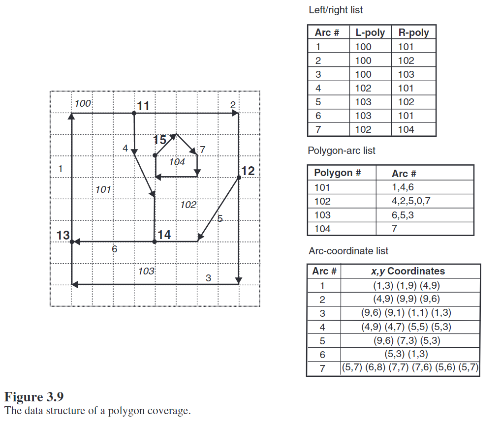
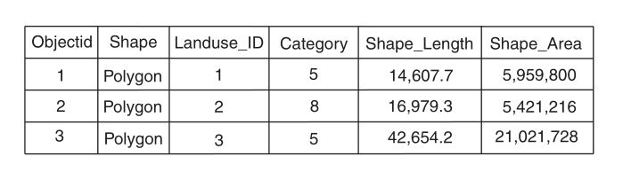

============
矢量数据模型
============

:Date: 2024-09-14T08:32:27Z

矢量数据模型
============

前置知识点：矢量数据，拓扑数据。

拓扑数据模型：
--------------

书上应该讲过，大致总结如下：

-  spaghetti
   model：意大利面条式，这名字有点怪，不过课本上讲拓扑应该都按这个来讲的，基本的存储如下图，看图应该就记起来了。arcgis早期的coverage格式，海图中S57格式都用这个，Topojson也基本是类似的结构。后来不用是因为这种格式很难进行分析处理，Topojson，海图都主要是为了展示，因而还在用，而且这么存数据量其实比正常的点线面会小一些，有传输优势。
   ​\ |image|\ ​
-  新版本的基本都是基于面向对象模型加规则了，如果做过实际项目的话，就应该知道拓扑检查那一大堆的条条框框。基本就是基于正常的数据，加上拓扑规则，然后进行处理，这样方便进行空间分析和进一步的处理。

面向对象数据模型：
------------------

简单来说，就是几何对象作为属性存到要素里，就叫面向对象数据模型，大部分我们接触到的都是这类数据。比如最常用到的Shapefile，PG库中的数据，mapgis，geoway等各家自己的矢量都算。类似下图：

​\ |image1|\ ​

大部分公司的软件对这类数据的操作都遵循((20240914103613-exyguhi 'SFS
简单要素模型标准'))
，不论原来数据时怎么存的，到处理的时候，基本统一都是按照SFS标准进行处理的，这个课本上一般没有说。

所以务必要认真学一下这个标准，翻译的这个版本进行了部分简化，建议去啃一下原文，原文有两部分，至少要过一遍第一部分的所有概念

-  `Simple Feature Access – Part 1: Common
   Architecture <https://www.ogc.org/standard/sfa/>`__
-  `Simple Feature Access – Part 2: SQL
   Option <https://www.ogc.org/standard/sfs/>`__

简单要素模型主要定义有几个：

-  几何对象
-  对象操作
-  WKB、WKT几何对象描述
-  WKT空间参考描述
-  空间关系判断
-  几何运算

大部分软件不是完整支持，但是基本的点线面，多点多线多面，几何对象操作，wkb存储，空间关系判断等都是按标准走的，也就是大部分软件，包括ArcGIS，QGIS都是按照此标准来读写、处理矢量的。

常见数据的介绍
--------------

Shapefile：
~~~~~~~~~~~

shapefile是比较常见的数据格式了，有很多文件：

必须的文件:

-  .shp — 图形格式，用于保存元素的几何实体。
-  .shx —
   图形索引格式。几何体位置索引，记录每一个几何体在shp文件之中的位置，能够加快向前或向后搜索一个几何体的效率。
-  .dbf — 属性数据格式，以dBase III+
   的数据表格式存储每个几何形状的属性数据。

其他可选的文件：

-  .prj —
   投帧式，用于保存地理坐标系统与投影信息，是一个存储\ `well-known
   text <https://zh.wikipedia.org/w/index.php?title=Well-known_text&action=edit&redlink=1>`__\ 投影描述符的文本文件。
-  .sbn and .sbx — 几何体的空间索引
-  .fbn and .fbx — 只读的Shapefiles的几何体的空间索引
-  .ain and .aih — 列表中活动字段的属性索引。
-  .ixs — 可读写Shapefile文件的地理编码索引
-  .mxs — 可读写Shapefile文件的地理编码索引(ODB格式)
-  .atx —
   .dbf文件的属性索引，其文件名格式为\ *shapefile*.\ *columnname*.atx
   (ArcGIS 8及之后的版本)
-  .shp.xml — 以XML格式保存元数据。
-  .cpg —
   用于描述.dbf文件的\ `代码页 <https://zh.wikipedia.org/wiki/%E4%BB%A3%E7%A0%81%E9%A1%B5>`__\ ，指明其使用的\ `字符编码 <https://zh.wikipedia.org/wiki/%E5%AD%97%E7%AC%A6%E7%BC%96%E7%A0%81>`__\ 。

在每个.shp,
.shx与.dbf文件之中，图形在每个文件的排序是一致的。也就是说，.shp的第一条记录与.shx及.dbf之中的第一条记录相对应，如此类推。此外，在.shp与.shx之中，有许多字段的\ `字节序 <https://zh.wikipedia.org/wiki/%E5%AD%97%E8%8A%82%E5%BA%8F>`__\ 是不一样的。因此用户在编写读取这些文件格式的程序时，必须十分小心地处理不同文件的不同字节序。

Shapefile通常以X与Y的方式来处理地理坐标，一般X对应经度，Y对应纬度，用户必须注意X，Y的顺序。

Shapefile数据限制
^^^^^^^^^^^^^^^^^

`ArcMap文档 <https://desktop.arcgis.com/zh-cn/arcmap/latest/manage-data/shapefiles/geoprocessing-considerations-for-shapefile-output.htm#GUID-B845DF9F-78C9-439F-9674-2BFEEFF8D58E>`__\ 中有Shapefile输出的注意事项，我知道你们懒得看，总结一下：

-  不能超过2GB

-  字段名最长为10个字符（4个汉字）

-  无法在日期中存时间

-  属性的最大记录长度为 4000
   字节。记录长度是用于定义全部字段的字节数，而非用于存储实际值的字节数。

-  最大字段数为 255。若超出此上限，当转换为 shapefile 时会转换前 255
   个字段。

-  字段宽度是固定的，如下表所示，所以文本型不超过254个字符

-  

   ================== ============== ========================
   地理数据库数据类型 dBASE 字段类型 dBASE 字段宽度（字符数）
   ================== ============== ========================
   Object ID          数值           9
   短整型             数值           4
   长整型             数值           9
   浮点型             浮点型         13
   双精度型           浮点型         13
   文本型             字符           254
   日期型             日期型         8
   ================== ============== ========================

**PersonalGeodatabase**
~~~~~~~~~~~~~~~~~~~~~~~

就是MDB，这玩意挺坑的，用的实际是MicroSoft
Access数据库，可以直接用Access打开，现在建议都是用\ **FileGeoDatabase而不是这个，因为这个比Shapefile还要坑。**

+----------------------------------+----------------------------------+
| 属性                             | 最大                             |
+==================================+==================================+
| Access 数据库（.accdb 或         | 2 GB                             |
| .mdb）的                         | 减去系统对象所                   |
| 总大小，包括所有数据库对象和数据 | 需的空间。注意:可通过链接到其他  |
|                                  | Access                           |
|                                  | 数据库中的表来解决此大小限制。   |
|                                  | 可链接到多个数据库文             |
|                                  | 件中的表，每个数据库文件大小可达 |
|                                  | 2GB。提示:有关减少数据           |
|                                  | 库大小的详细信息，请参阅\ `使用  |
|                                  | “压缩和修复”                     |
|                                  | 帮                               |
|                                  | 助防止并更正数据库文件问题 <htt  |
|                                  | ps://support.microsoft.com/zh-cn |
|                                  | /topic/%E9%80%9A%E8%BF%87%E4%BD% |
|                                  | BF%E7%94%A8-%E5%8E%8B%E7%BC%A9%E |
|                                  | 5%92%8C%E4%BF%AE%E5%A4%8D%E6%95% |
|                                  | B0%E6%8D%AE%E5%BA%93-%E5%B8%AE%E |
|                                  | 5%8A%A9%E9%98%B2%E6%AD%A2%E5%92% |
|                                  | 8C%E6%9B%B4%E6%AD%A3%E6%95%B0%E6 |
|                                  | %8D%AE%E5%BA%93%E6%96%87%E4%BB%B |
|                                  | 6%E9%97%AE%E9%A2%98-6ee60f16-aed |
|                                  | 0-40ac-bf22-85fa9f4005b2>`__\ 。 |
+----------------------------------+----------------------------------+
| 数据库中对象的总数               | 32,768                           |
+----------------------------------+----------------------------------+
| 模块数量（包括将 HasModule       | 1,000                            |
| 属性设置为 True 的窗体和报表）   |                                  |
+----------------------------------+----------------------------------+
| 对象名中的字符数                 | 64                               |
+----------------------------------+----------------------------------+
| 密码中的字符数                   | 14                               |
+----------------------------------+----------------------------------+
| 用户名或组名中的字符数           | 20                               |
+----------------------------------+----------------------------------+
| 并发用户数                       | 255                              |
+----------------------------------+----------------------------------+

‍

**FileGeoDatabase**
~~~~~~~~~~~~~~~~~~~

除了注意一下字段的编码，其他问题不大

文件地理数据库的大小和名称限制如下：

文件地理数据库的大小 - 无限制

表或要素类大小 - 1 TB（默认值）、4 GB 或 256 TB（带关键字）

要素类和表的数量 - 2,147,483,647

要素类或表中的字段数 - 65,534

要素类或表中的行数 - 2,147,483,647

地理数据库名称长度 - 操作系统所允许的文件夹名的字符数

要素数据集名称长度 - 160 个字符

要素类或表名的长度 - 160 个字符

字段名称长度 - 64 个字符

文本字段的宽度 - 2,147,483,647 个字符

PostGIS
~~~~~~~

没啥限制，好用，文档也全，各种操作文档里很详细，推荐过的PostGIS in
Action可以看看。不过注意，\ `pg库查询要素数量很慢 <https://wiki.postgresql.org/wiki/Slow_Counting>`__\ ，这是一个已知问题，非常慢，建议是自己写sql查，虽然不准，但是快。

Geojson
~~~~~~~

Geojson因为没有索引，查询很慢，所以大数据量（超过10兆，或者超过200条）就不要上geojson。其实除了webGIS里客户端临时采编的数据可以用，哪里最好都别用这玩意，效率问题太大了（KML，GML之类基于文本的数据类型同理，非必要不使用）。正常情况老老实实上数据库。

GPKG
~~~~

GPKG中实际是一个sqlite库，可以直接用sqlitespy之类的工具打开查看，非海量数据（千万级以下）其实挺好用的。日常使用或者自己造数据可以用Gpkg存，一个是单文件，二来sqlite稳定性和兼容性都比shpfile要好得多。

DXF/DGW
~~~~~~~

这两都得转格式，FME或者其他软件转，直接用不太行，不好做分析和后处理。我们不是搞土木的，需要地理数据，而非cad数据。

FlatGeobuf
~~~~~~~~~~

其实这种数据用的很少，这个问题在于它不支持空Geometry，而实际使用时碰到空Geometry的情况还不少，虽然它自己说要取代shapefile，但实际应用中因为这个几乎没人用，尽量别用吧。

WFS
~~~

wfs实际也是纯数据,而且可以通过接口对数据进行修改,详细可以看看wfs协议内容。不过实际上使用较少，它并不是看的，而是实际数据！

‍

