====================
SFS 简单要素模型标准
====================

:Date: 2024-09-14T10:36:13Z

SFS 简单要素模型标准
====================

本文由 `简悦 SimpRead <http://ksria.com/simpread/>`__ 转码， 原文地址
`www.osgeo.cn <http://www.osgeo.cn>`__

SFS（OpenGIS® Simple Features Interface Standard）的当前版本是 1.2.0。

.. _221-概述-:

2.2.1. 概述 `¶ <#id1>`__
------------------------

SFS（OpenGIS® Simple Features Interface Standard）的当前版本是 1.2.0。
事实上 SFS 中包括两部分内容，第一部分是描述简单要素的通用模型（ `Part1:
Common architecture <http://www.opengeospatial.org/standards/sfa>`__
）、 另一部分是描述前一部分模型在 SQL 中的实现（ `Part 2: SQL
option <http://www.opengeospatial.org/standards/sfs>`__ ） 2(#id3) 。
我们平时所熟知的 WKT、WKB 等就在第一部分中叙述，而在空间 SQL
语句中常见的 AsText 、 Intersects 操作等则在第二部分中有定义。

下面就 SFS
中比较重要的内容进行详细的说明，包括第一部分中的几何对象模型、WKT
描述的几何对象、 WKB 描述的几何对象、WKT 描述的空间参考和第二部分中的
SQL 预定义 schema、SQL 几何类型、SQL 空间操作。

.. _222-几何对象模型-:

2.2.2. 几何对象模型 `¶ <#id4>`__
--------------------------------

​\ |image1|\ ​

图 1 SFS 中定义的几何对象模型

图 1 显示的是 SFS
中几何对象的关系结构，简单要素中的几何对象主要就是定义了点、线、面和多点、多线、多面。另外，几何对象还涉及一系列的操作，如图
2 所示。

​\ |image2|\ ​

图 2 Geometry 的操作

.. _223-wkt-描述的几何对象-:

2.2.3. WKT 描述的几何对象 `¶ <#wkt>`__
--------------------------------------

WKT（Well-known Text）可以通过文本来描述几何对象。
下面的例子可以比较快速、直观地说明什么是 WKT：

+--------------------+-----------------------+-----------------------+
| 几何类型           | WKT 例子              | 说明                  |
+====================+=======================+=======================+
| Point              | Point (10 10)         | 点                    |
+--------------------+-----------------------+-----------------------+
| LineString         | LineString ( 10 10,   | 有 3 个节点的线       |
|                    | 20 20, 30 40)         |                       |
+--------------------+-----------------------+-----------------------+
| Polygon            | Polygon ((10 10, 10   | 叧有 1 个外环的多边形 |
|                    | 20, 20 20, 20 15, 10  |                       |
|                    | 10))                  |                       |
+--------------------+-----------------------+-----------------------+
| MultiPoint         | MultiPoint ((10 10),  | 多点                  |
|                    | (20 20) )             |                       |
+--------------------+-----------------------+-----------------------+
| MultiLineString    | MultiLineString ((10  | 多线                  |
|                    | 10, 20 20), (15 15,   |                       |
|                    | 30 15) )              |                       |
+--------------------+-----------------------+-----------------------+
| MultiPolygon       | MultiPolygon ( ((10   | 多面                  |
|                    | 10, 10 20, 20 20, 20  |                       |
|                    | 15, 10 10)), ((60 60, |                       |
|                    | 70 70, 80 60, 60 60   |                       |
|                    | )) )                  |                       |
+--------------------+-----------------------+-----------------------+
| GeometryCollection | GeometryCollection    | 几何集合              |
|                    | (POINT (10 10), POINT |                       |
|                    | (30 30), LINESTRING   |                       |
|                    | (15 15, 20 20) )      |                       |
+--------------------+-----------------------+-----------------------+
| PolyhedralSurface  | PolyhedralSurface Z ( | 多个表面构成的立方体  |
|                    | ((0 0 0, 0 0 1, 0 1   |                       |
|                    | 1, 0 1 0, 0 0 0)),    |                       |
|                    | ((0 0 0, 0 1 0, 1 1   |                       |
|                    | 0, 1 0 0, 0 0 0)),    |                       |
|                    | ((0 0 0, 1 0 0, 1 0   |                       |
|                    | 1, 0 0 1, 0 0 0)),    |                       |
|                    | ((1 1 0, 1 1 1, 1 0   |                       |
|                    | 1, 1 0 0, 1 1 0)),    |                       |
|                    | ((0 1 0, 0 1 1, 1 1   |                       |
|                    | 1, 1 1 0, 0 1 0)),    |                       |
|                    | ((0 0 1, 1 0 1, 1 1   |                       |
|                    | 1, 0 1 1. 0 0 1)) )   |                       |
+--------------------+-----------------------+-----------------------+
| Tin                | Tin Z ( ((0 0 0, 0 0  | 4 个三角形构成的 TIN  |
|                    | 1, 0 1 0, 0 0 0)),    | 网格                  |
|                    | ((0 0 0, 0 1 0, 1 0   |                       |
|                    | 0, 0 0 0)), ((0 0 0,  |                       |
|                    | 1 0 0, 0 0 1, 0 0     |                       |
|                    | 0)), ((1 0 0, 0 1 0,  |                       |
|                    | 0 0 1, 1 0 0)), )     |                       |
+--------------------+-----------------------+-----------------------+
| Point              | Point Z (10 10 5)     | 三维点                |
+--------------------+-----------------------+-----------------------+
| Point              | Point ZM (10 10 5 40) | 带 M 值的三维点       |
+--------------------+-----------------------+-----------------------+
| Point              | Point M (10 10 40)    | 带 M 值的二维点       |
+--------------------+-----------------------+-----------------------+

表 2 WKT 描述几何对象示例

.. _224-wkb-描述的几何对象-:

2.2.4. WKB 描述的几何对象 `¶ <#wkb>`__
--------------------------------------

WKB（Well-known Binary）通过序列化的字节对象来描述几何对象。 在 WKB
中主要涉及两种数值类型：一种是 uint32 ， 占 4
个字节，用以存储节点数、几何对象类型等信息； 另一种是 double ，占 8
个字节，用以存储节点坐标值。 其中的几何对象类型对应的整数可以参考下表：

​\ |image3|\ ​

图 3 WKB 中几何类型对应的整数值

除此之外，WKB 在第一位还存储了一个额外的字节用来标识字节序 3(#id6) （
0=Big-Indian ， 1=Little-Indian ）。 因此，对于一个点（不带 M
值的二维点）来说，它的 WKB 描述应该类似下面的结构，总共占据 21 个字节：

​\ |image4|\ ​

图 4 WKB 描述点的字节结构

对于有 2 个节点的线来说，WKB 描述应该 包括 41 个字节：

​\ |image5|\ ​

图 5 WKB 描述线的字节结构

对于仅有 1 个外环，由 3 个节点构成的多边形来说，WKB 描述则应该 包括 77
个字节：

​\ |image6|\ ​

图 6 WKB 描述多边形的字节结构

.. _225-wkt-描述的空间参考-:

2.2.5. WKT 描述的空间参考 `¶ <#id7>`__
--------------------------------------

WKT
除了可以描述几何对象，也可以描述空间参考。通过两个例子可以很直观地看到如何通过文本来描述空间参考。

对于一个地理坐标系，比如最常见的 WGS84 坐标系统，WKT 描述是这样的：

GEOGCS

[

"GCS_WGS_1984",

DATUM["D_WGS_1984",SPHEROID["WGS_1984",6378137.0,298.257223563]],

PRIMEM["Greenwich",0.0],

UNIT["Degree",0.0174532925199433],

AUTHORITY["EPSG",4326]

]

“GEOGCS” 表明其后紧随的 “ [] ” 中描述的是一个地理坐标系统。
该坐标系统名称为 GCS_WGS_1984 ； 采用的大地基准面为 D_WGS_1984 ，
该基准面近似椭球体的长轴为 6378137.0 米、扁率为 298.257223563；
以格林威治 0 度经线为起始经线；地图单位为度，该单位的转换因子 4(#id10)
为 0.0174532925199433（π/180）； 最后，该坐标系统在 EPSG 5(#id11)
中的编码为 4326 。

对于一个投影坐标系，比如 WGS84 Web Mercator（Auxiliary Sphere）
坐标系统， WKT 描述是这样的：

PROJCS

[

"WGS_1984_Web_Mercator_Auxiliary_Sphere",

GEOGCS

[

"GCS_WGS_1984",

DATUM["D_WGS_1984",SPHEROID["WGS_1984",6378137.0,298.257223563]],

PRIMEM["Greenwich",0.0],

UNIT["Degree",0.0174532925199433]

],

PROJECTION["Mercator_Auxiliary_Sphere"],

PARAMETER["False_Easting",0.0],

PARAMETER["False_Northing",0.0],

PARAMETER["Central_Meridian",0.0],

PARAMETER["Standard_Parallel_1",0.0],

PARAMETER["Auxiliary_Sphere_Type",0.0],

UNIT["Meter",1.0],

AUTHORITY["EPSG",3857]

]

类似的，“PROJCS”
代表这是一个投影坐标系。投影坐标系中必然会包括一个地理坐标系，
这里的地理坐标系就是 GCS_WGS_1984 ，这个地理坐标系的定义和上面的类似。

下面紧跟着的是投影的相关参数， Mercator_Auxiliary_Sphere
是采用投影的名称， 这个投影坐标系以 0 度经线为中央经线进行投影；
坐标系的单位为米（显然，转换因子就为 1.0）， 而该坐标系的 EPSG 编码为
3857 。

.. _226-sql-预定义-schema:

2.2.6. SQL 预定义 schema\ `¶ <#sql-schema>`__
---------------------------------------------

在空间数据库中，需要一些表来存储和管理几何字段、空间参考等信息，因此 OGC
首先规定了在数据库中需要的 Schema 对象 6(#id13) ：

​\ |image7|\ ​

图 7 OGC 空间数据库中需要预定义的 schema

可见，数据库中必须要有一个记录几何字段信息的 GEOMETRY_COLUMNS
表和一个记录空间参考信息的 SPATIAL_REF_SYS 表。 从支持 OGC
标准的空间数据库中，我们都可以找到这两张表。
当然，有些空间数据库直接使用 GEOMETRY_COLUMNS``和 \``SPATIAL_REF_SYS
作为这两张表的名称， 比如 PostGIS ； 有些则采用其它名字，比如 Oracle
Spatial 采用 OGIS_GEOMETRY_COLUMNS 和 OGIS_SPATIAL_REFERENCE_SYSTEMS 、
ArcSDE for Oracle 则采用 GEOMETRY_COLUMNS 和
SPATIAL_REFERENCES，不一而同。

.. _227-sql-几何对象存储-:

2.2.7. SQL 几何对象存储 `¶ <#sql>`__
------------------------------------

图 7 中显示在 OGC 标准中几何信息存储在一个 Geometry 表中，
这个表可以用常规字段或 WKB 两种方式存储几何对象，Geometry 表通过 GID
字段关联到 Feature 表的几何字段。 事实上，OGC
标准中还有一种定义，Feature 表的几何字段也可以是 SQL UDT（自定义类型），
也就是不需要额外的 Geometry 表来存储几何信息，而直接存储在 Feature
表的几何字段中。
大多数数据库都是采用这种自定义类型的方式存储几何信息，比如 ArcSDE 中的
ST_Geometry 类型、 PostGIS 中的 Geometry 和 ST_Geometry 类型。

自定义类型可以采用 SFS 标准中定义的几何类型，也可以采用 SQL/MM 7(#id15)
的定义， 比如 PostGIS 对这两种定义都进行了支持，下图是 SFS 和 SQL/MM
几何类型定义的一个对应关系：

​\ |image8|\ ​

图 8 SFS 和 SQL/MM 几何类型的对应关系

用户既可以遵循 SFS 的定义，使用类似 “Geometry”、“Point”
这样的命名；也可以遵循 SQL/MM 定义，采用 ST\_ 作为前缀进行命名，如
ST_Geometry 、 ST_Point 。

SQL 几何类型的继承关系可参考图 9， 可以发现 SQL 中实现的几何对象模型和图
1 所示的通用几何对象模型非常类似。

​\ |image9|\ ​

图 9 SQL 几何对象模型

.. _228-sql-空间操作-:

2.2.8. SQL 空间操作 `¶ <#id16>`__
---------------------------------

以 SQL/MM 定义为例，在 SFS 中规定了以下的操作。

.. _1-所有几何对象支持-:

1. 所有几何对象支持 `¶ <#id17>`__
~~~~~~~~~~~~~~~~~~~~~~~~~~~~~~~~~

============ ===================
几何对象构造 说明
============ ===================
ST_WKTToSQL  从 WKT 构造几何对象
ST_WKBToSQL  从 WKB 构造几何对象
============ ===================

=============== ===============
几何信息获取    说明
=============== ===============
ST_AsText       获取 WKT 描述
ST_AsBinary     获取 WKB 描述
ST_Dimension    获取维数
ST_GeometryType 获取几何类型
ST_SRID         获取空间参考 ID
ST_IsEmpty      是否为空
ST_IsSimple     是否是简单对象
ST_Boundary     获取边界
ST_Envelope     获取矩形范围
=============== ===============

+---------------+-----------------------------------------------------+
| 空间关系判断  | 说明                                                |
+===============+=====================================================+
| ST_Equals     | ​\ |image24|\ ​                                       |
+---------------+-----------------------------------------------------+
| ST_Disjoint   | ​\ |image25|\ ​                                       |
+---------------+-----------------------------------------------------+
| ST_Intersects | 任意部分有相交，等价于判断空间关系的 DE-9IM         |
|               | 字符串表达是否是以                                  |
|               | 下之一：T*******\*\*T******\*\***T****\*\****T***\* |
+---------------+-----------------------------------------------------+
| ST_Touches    | ​\ |image26|\ ​                                       |
+---------------+-----------------------------------------------------+
| ST_Crosses    | ​\ |image27|\ ​                                       |
+---------------+-----------------------------------------------------+
| ST_Within     | ​\ |image28|\ ​                                       |
+---------------+-----------------------------------------------------+
| ST_Contains   | ​\ |image29|\ ​                                       |
+---------------+-----------------------------------------------------+
| ST_Overlaps   | ​\ |image30|\ ​                                       |
+---------------+-----------------------------------------------------+
| ST_Relate     | 判断是否满足 DE-9IM 字符串表达关系                  |
+---------------+-----------------------------------------------------+

=========== ====================
距离计算    说明
=========== ====================
ST_Distance 几何对象间的最短距离
=========== ====================

================ =============
几何运算         说明
================ =============
ST_Intersection  ​\ |image31|\ ​
ST_Difference    ​\ |image32|\ ​
ST_Union         ​\ |image33|\ ​
ST_SymDifference ​\ |image34|\ ​
ST_Buffer        ​\ |image35|\ ​
ST_ConvexHull    ​\ |image36|\ ​
================ =============

.. _2-point-对象支持-:

2. Point 对象支持 `¶ <#point>`__
~~~~~~~~~~~~~~~~~~~~~~~~~~~~~~~~

======== =========
SQL 操作 说明
======== =========
ST_X     获取 X 值
ST_Y     获取 Y 值
ST_Z     获取 Z 值
ST_M     获取 M 值
======== =========

.. _3-curve-对象支持-:

3. Curve 对象支持 `¶ <#curve>`__
~~~~~~~~~~~~~~~~~~~~~~~~~~~~~~~~

============= ==========
SQL 操作      说明
============= ==========
ST_StartPoint 获取起始点
ST_EndPoint   获取终点
ST_IsRing     是否是环
ST_Length     获取长度
============= ==========

.. _4-linestring-对象支持-:

4. LineString 对象支持 `¶ <#linestring>`__
~~~~~~~~~~~~~~~~~~~~~~~~~~~~~~~~~~~~~~~~~~

============ ===============
SQL 操作     说明
============ ===============
ST_NumPoints 节点数
ST_PointN    获取第 n 个节点
============ ===============

.. _5-surface-对象支持-:

5. Surface 对象支持 `¶ <#surface>`__
~~~~~~~~~~~~~~~~~~~~~~~~~~~~~~~~~~~~

================= ============
SQL 操作          说明
================= ============
ST_Centroid       获取中心点
ST_PointOnSurface 获取面上一点
ST_Area           获取面积
================= ============

.. _6-polygon-对象支持-:

6. Polygon 对象支持 `¶ <#polygon>`__
~~~~~~~~~~~~~~~~~~~~~~~~~~~~~~~~~~~~

================== ===============
SQL 操作           说明
================== ===============
ST_ExteriorRing    获取外环
ST_NumInteriorRing 获取内环数
ST_InteriorRingN   获取第 n 个内环
================== ===============

.. _7-geomcollection-对象支持-:

7. GeomCollection 对象支持 `¶ <#geomcollection>`__
~~~~~~~~~~~~~~~~~~~~~~~~~~~~~~~~~~~~~~~~~~~~~~~~~~

================ ===================
SQL 操作         说明
================ ===================
ST_NumGeometries 获取几何对象数
ST_GeometryN     获取第 n 个几何对象
================ ===================

.. _8-multicurve-对象支持-:

8. MultiCurve 对象支持 `¶ <#multicurve>`__
~~~~~~~~~~~~~~~~~~~~~~~~~~~~~~~~~~~~~~~~~~

=========== ========
SQL 操作    说明
=========== ========
ST_IsClosed 是否闭合
ST_Length   获取长度
=========== ========

.. _9-multisurface-对象支持-:

9. MultiSurface 对象支持 `¶ <#multisurface>`__
~~~~~~~~~~~~~~~~~~~~~~~~~~~~~~~~~~~~~~~~~~~~~~

================= ============
SQL 操作          说明
================= ============
ST_Centroid       获取中心点
ST_PointOnSurface 获取面上一点
ST_Area           获取面积
================= ============

.. _229-arcgis-对-sfs-的支持-:

2.2.9. ArcGIS 对 SFS 的支持 `¶ <#arcgis-sfs>`__
-----------------------------------------------

ArcGIS 10 之前的全系列产品都支持 SFS 标准，版本为 1.1。下面通过几个
ArcSDE（Oracle）的空间 SQL 操作看一下：

select st_astext(st_geometry('POINT(116 39)',0)) from dual;

select shape from TEST where
st_envintersects(shape,40251885,4019516,40255159,4021607)=1;

select shape from TEST where st_intersects(shape,
st_geometry('POLYGON((0 0,180 -90,180 90,0 0))',2))=1;

select st_relate (g1, g2, 'T*F**FFF*') equals, st_relate (g1, g3,
'T*F**FFF*') not_equals from RELATE_TEST;

select sum (st_area (st_difference (lot, footprint))) from FOOTPRINTS
bf, LOTS where bf.building_id = lots.lot_id;

.. |image1| image:: assets/network-asset-gbs_DYQ0KDnmqK7Y_KaAXOYuoaPlt8_C6PWR_NQqqNw-20240920142028-c0n5r5r.jpeg
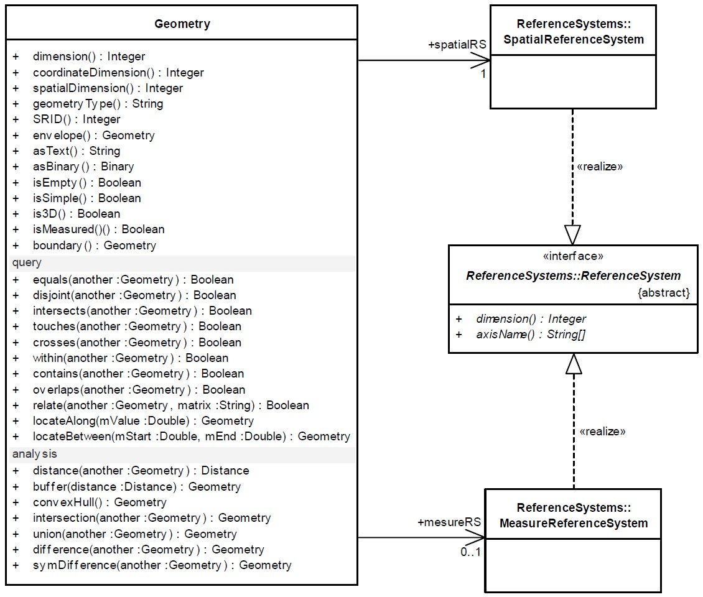
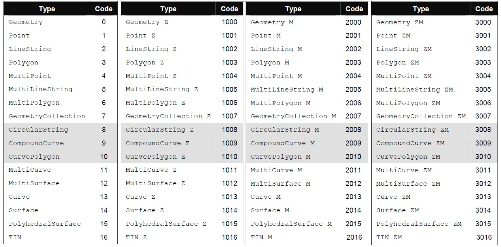

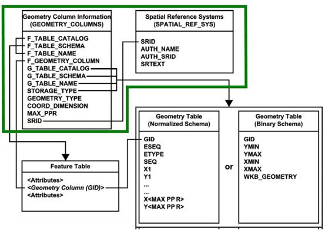
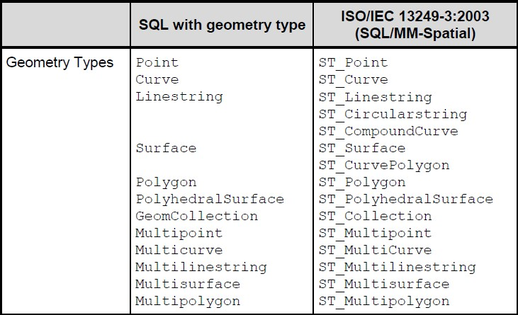
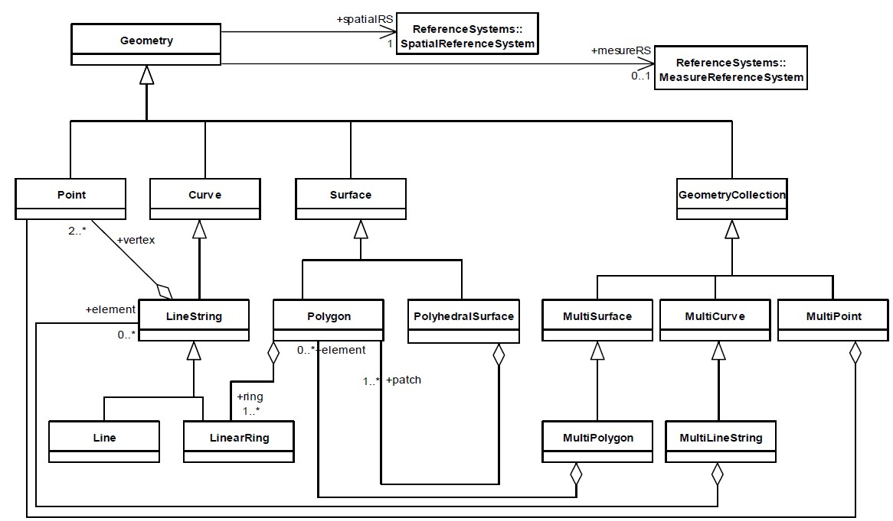
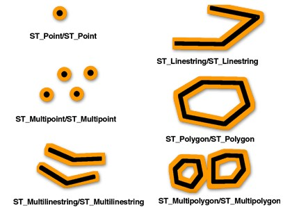
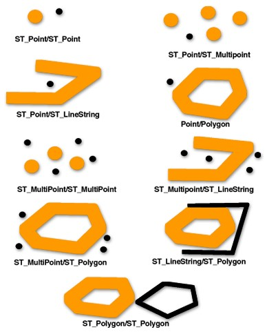
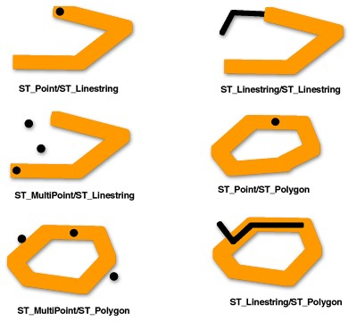
.. |image13| image:: assets/network-asset-AuoWH2QKCg45KpeF4s6duSTcFo_qG-CHLA62sEpJDYY-20240920142029-ue54g5m.jpeg
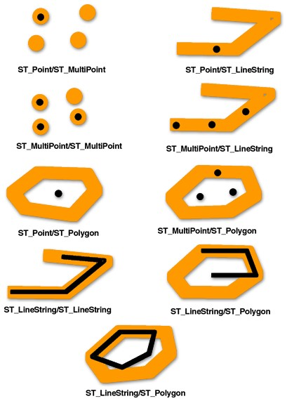
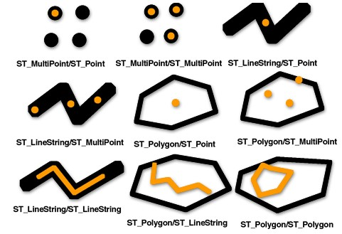
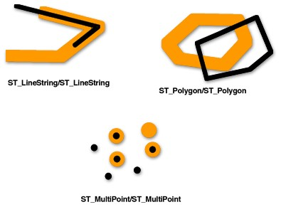

.. |image20| image:: assets/network-asset-AuoWH2QKCg45KpeF4s6duSTcFo_qG-CHLA62sEpJDYY-20240920142029-ue54g5m.jpeg

.. |image27| image:: assets/network-asset-AuoWH2QKCg45KpeF4s6duSTcFo_qG-CHLA62sEpJDYY-20240920142029-ue54g5m.jpeg

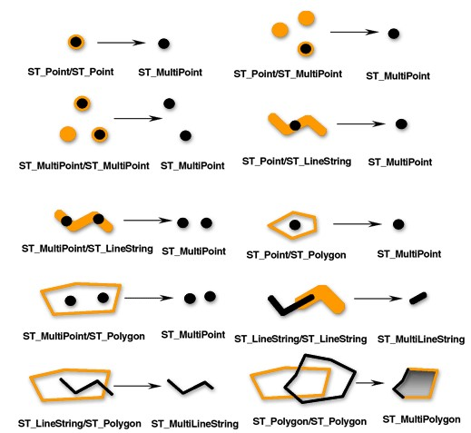
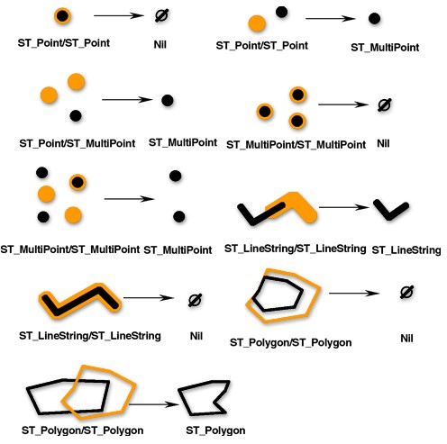
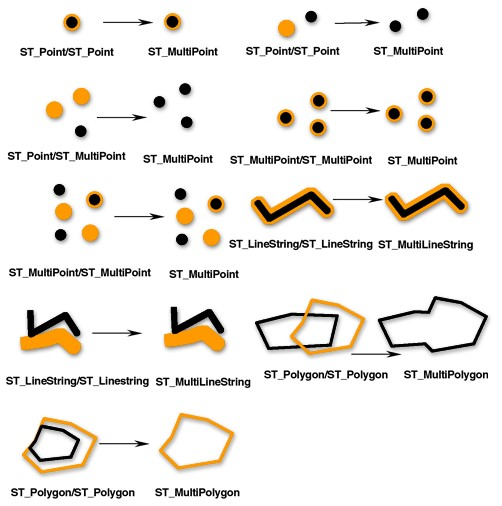
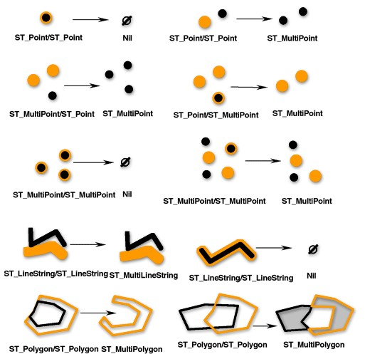
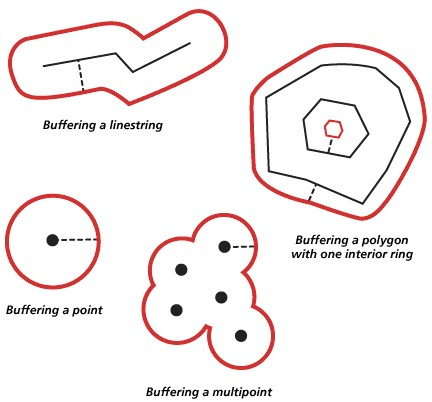
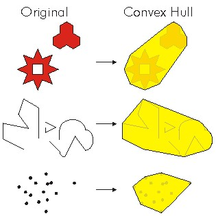
